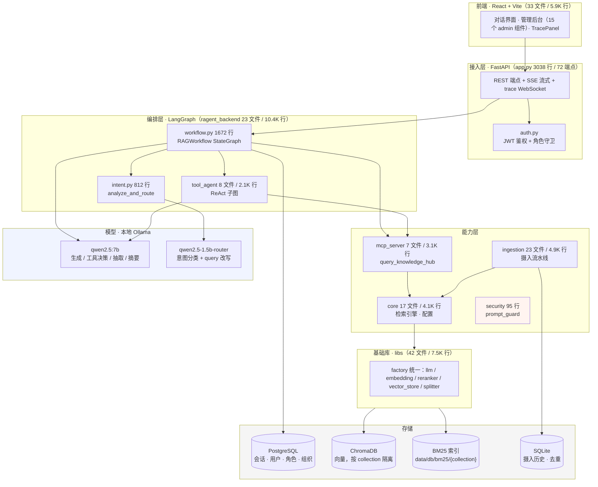
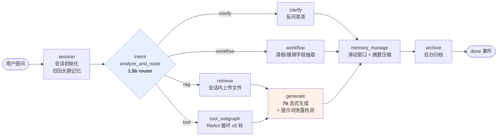
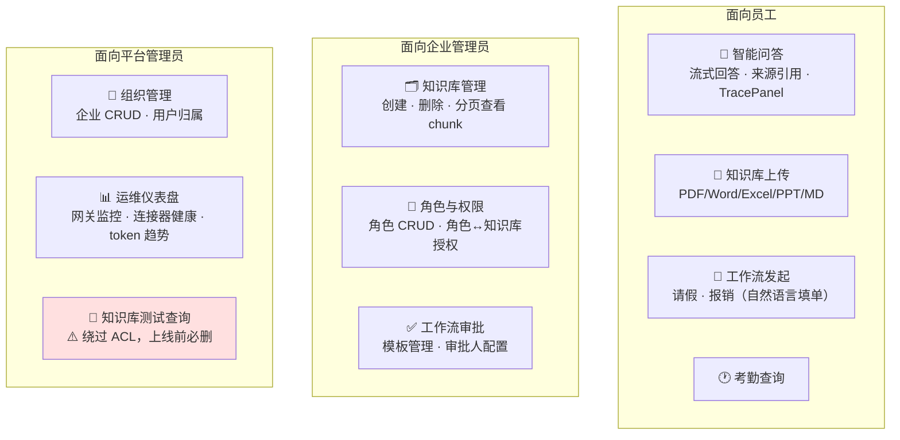
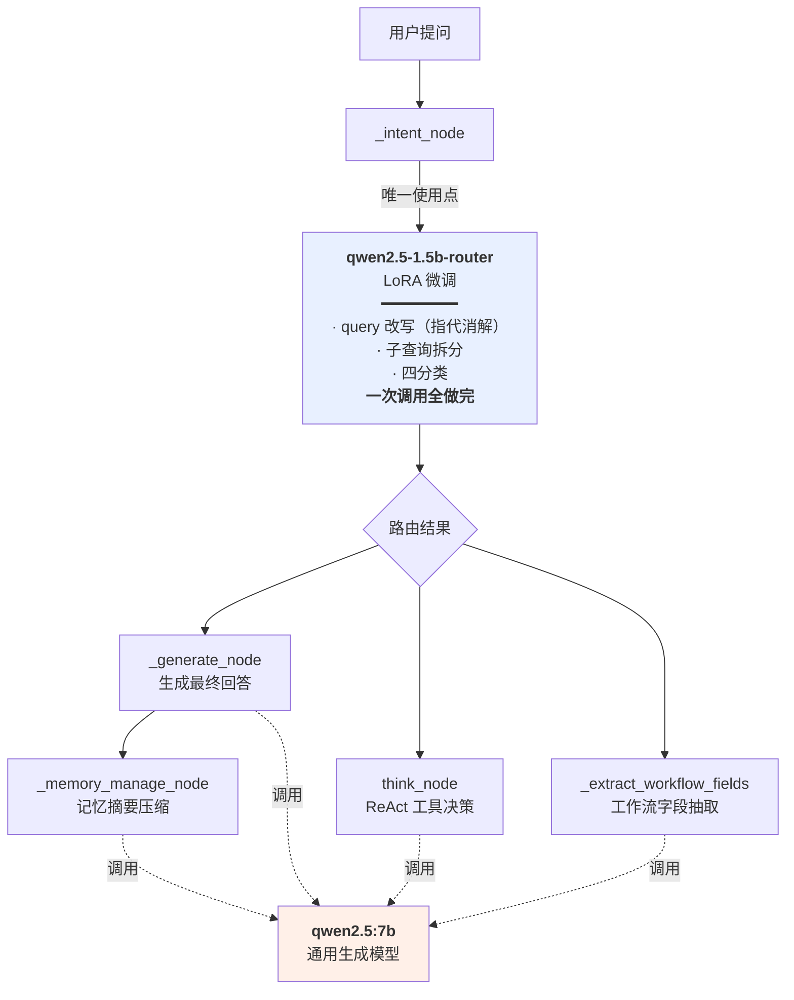
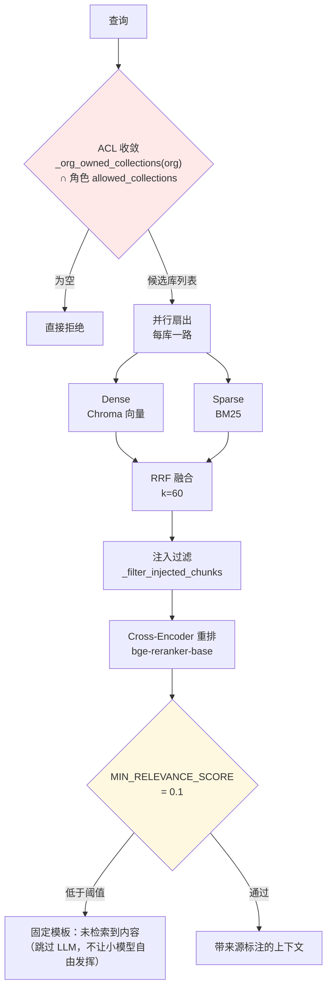
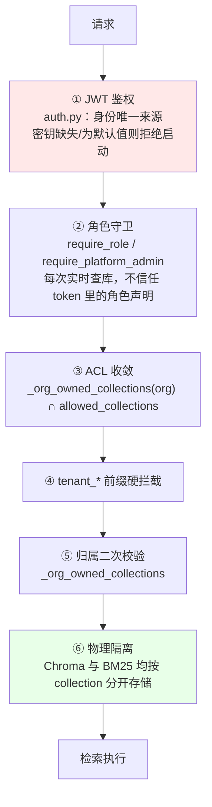

# 项目共识与架构导航

> **本文件是项目的唯一事实来源。** `docs/` 下的设计文档可能已过期，冲突时以本文件为准。
> 建立于 2026-08-24（起因见 `docs/collaboration_retrospective.md`），架构章节固化于 2026-08-25。
>
> **怎么用这份文档**：会话开始只需读下面的「30 秒必读」；需要细节时用目录跳转。
> 改架构前必须回来更新 §2–§5 对应小节。

---

## 📌 30 秒必读

**这是什么**：企业级 RAG 问答 Agent，**多租户 SaaS**，客户是 10000+ 员工的大企业。

**当前阶段**：⚠️ **停止新增功能，先补设计**（2026-08-24 起）。
不要主动提议或开始新功能；允许做的是补设计、补测试、修 P0/P1、清死代码。

**三条最高优先级未闭环**（详见 [§6](#6-已知未闭环)）：
1. 🔴 文档更新后旧版本片段永久残留 → **产生错误答案**（已实测确认）
2. 🔴 BM25 索引 JSON 全量加载 → 真实数据量下秒级至分钟级 + OOM
3. 🔴 模型服务并发形态 → 目标规模下缺口约 10x

**四条最容易踩的规则**（完整规则见 [§9](#9-硬性规则)）：
- 用户说「修改一个BUG」但实为**设计变更**时 → 必须先指出，不要直接开工
- 任何测试/审计报告 → 必须写「**本次未覆盖的范围**」
- 结论分三档 → **已验证通过 / 已跑通 / 已实现但未验证**，不许混用
- 脚本一律落 `tests/` 或 `scripts/` → **禁止写临时目录后丢弃**

---

## 目录

| # | 章节 | 内容 |
|---|---|---|
| 1 | [项目定位](#1-项目定位) | 交付给谁 / 怎么用 / 什么算做完 / 功能边界 |
| 2 | [系统架构](#2-系统架构) | [分层图](#21-分层架构) · [问答全流程](#22-一次问答的完整流程) · [功能模块](#23-功能模块) · [代码模块](#24-代码模块清单) · [内置工具](#25-内置工具6-个) |
| 3 | [核心链路](#3-核心链路) | [**双模型系统**](#31-双模型系统) · [检索链路](#32-检索链路) · [工具调用](#33-工具调用react-子图) · [摄入流水线](#34-摄入流水线8-阶段) |
| 4 | [权限与多租户](#4-权限与多租户) | [权限模型](#41-权限模型) · [隔离层次图](#42-隔离层次) · [已验证的保证](#43--已验证成立的隔离保证) |
| 5 | [性能现状与目标](#5-性能现状与目标) | [SLO](#51-最小-slo2026-08-25-确认接受) · [**性能测试**](#52-性能测试方法与结果) · [容量测算](#53-容量测算单客户口径) |
| 6 | [已知未闭环](#6-已知未闭环) | P0 / P1 清单 |
| 7 | [已修复](#7-已修复防止重新引入) | 防止重新引入 |
| 8 | [已作废的设计](#8-已作废的设计) | 不要复活 |
| 9 | [硬性规则](#9-硬性规则) | 需求 · 测试 · 交付 · 文档 · 工程 · 会话 |
| 10 | [相关文档](#10-相关文档) | 索引 |

---

## 1. 项目定位

*(2026-08-25 确定)*

| | 答案 |
|---|---|
| **交付给谁** | **10000 名员工以上的大企业**，企业自有庞大知识库 |
| **形态** | **多租户 SaaS** —— 客户是多家万人企业，企业间必须隔离 |
| **目标客户数** | 早期 **1–3 家** |
| **他们怎么用** | 日常工作流、查资料、提高运维水平 |
| **什么算做完** | 满足**基本的、普适的**功能需求和性能需求 |
| **知识库规模** | 单客户**几个 G 的 PDF / Word**，**每天由各部门员工手动上传更新** |
| **硬件** | 真实交付环境硬件更好；当前阶段本地测"匹配硬件的性能"即可 |

### 明确不做的

多模态 · 移动端专门适配 · 实时协同 · agentic RAG 复杂编排 · self-consistency / HyDE ·
自建 reranker 服务 / 语义缓存 · **跨企业知识联邦**（与多租户隔离目标冲突）

> **新增功能前先核对这份清单。** 完整理由见 `docs/scale_slo_and_priorities.md` §7。

### ⚠️ 一条影响所有既有结论的前提变更

`docs/review_2026-08-24/` 三份评审的严重程度基线是按**"小团队内部系统、低并发"**判定的。
万人多租户规模使该前提失效——**审计报告的 P0/P1/P2 分级不要直接沿用**，
以 `docs/scale_slo_and_priorities.md` 的重估为准（12 条 P0）。

---

## 2. 系统架构

### 2.1 分层架构



### 2.2 一次问答的完整流程



> **关键点**：`done` 事件必须等整张图跑完才发出，而 `memory_manage` 触发压缩时要用 7b
> 做一次摘要——**用户已看完全部回答，还要干等约 8 秒**。
> 异步化方案见 `docs/orchestration_design.md` B 部分（**未实施**）。

### 2.3 功能模块



| 模块 | 状态 | 关键位置 |
|---|---|---|
| 智能问答（RAG + 工具 + 工作流四分支） | ✅ 可用 | `workflow.py` |
| 知识库上传与摄入 | ⚠️ 可用但**更新即残留旧版本**（[§6](#6-已知未闭环)） | `ingestion/pipeline.py` |
| 工作流（请假/报销） | ✅ 可用 | `workflow_store.py` 784 行 |
| 考勤查询（含租户联邦路由） | ✅ 可用 | `builtin_tools.py:108` |
| 角色与知识库权限 | ✅ 可用 | `role_store.py` |
| 组织/企业管理 | ✅ 可用 | `org_store.py` |
| 运维仪表盘 | ⚠️ **仅监控展示**，自动运维内核未实现 | `OperationsDashboard.jsx` |
| 长期记忆（LTM） | ✅ 可用 | `ltm_store.py` |
| 提示注入防护 | ⚠️ **骨架**（95 行），未接入主链路 | `security/prompt_guard.py` |

### 2.4 代码模块清单

| 模块 | 规模 | 职责 | 最大文件 |
|---|---|---|---|
| `src/ragent_backend/` | 23 文件 / **10,396 行** | FastAPI 应用 · LangGraph 编排 · 各类 Store | `app.py` 3038 · `workflow.py` 1672 |
| `src/libs/` | 42 文件 / 7,461 行 | 基础能力（factory 模式 + 多 provider） | — |
| `src/ingestion/` | 23 文件 / 4,881 行 | 摄入流水线（8 阶段） | `pipeline.py` |
| `src/core/` | 17 文件 / 4,089 行 | 检索引擎 · 配置层 | `hybrid_search.py` 813 |
| `src/observability/` | 20 文件 / 3,946 行 | 评估 · 追踪 | — |
| `src/mcp_server/` | 7 文件 / 3,121 行 | 知识库检索工具 | `query_knowledge_hub.py` 1528 |
| `src/tool_agent/` | 8 文件 / 2,138 行 | ReAct 子图 · 工具注册表 | `subgraph.py` |
| `src/security/` | 2 文件 / 95 行 | 提示注入规则检测（骨架） | `prompt_guard.py` |
| `frontend/src/` | 33 文件 / 5,875 行 | React 前端 | `App.jsx` 1334 |
| `tests/` | 79 文件 / 27,179 行 | ⚠️ **几乎全在老 RAG 库层**，见 §6 | — |

### 2.5 内置工具（6 个）

`query_knowledge_hub` · `list_collections` · `get_document_summary` ·
`query_attendance` · `check_workflow_status` · `resubmit_workflow`

---

## 3. 核心链路

### 3.1 双模型系统

系统同时跑两个本地模型，**按"任务是否需要综合推理/自由生成"分工**，不是按大小分。



| | `qwen2.5-1.5b-router` | `qwen2.5:7b` |
|---|---|---|
| **来源** | LoRA 微调（窄任务蒸馏） | 通用开源模型 |
| **使用点** | **只有 `_intent_node` 一处** | 生成 / ReAct 决策 / 字段抽取 / 记忆摘要 |
| **任务性质** | 输出结构固定（严格 JSON schema），四选一 | 开放任务，需综合判断与自由生成 |
| **实测耗时** | **约 3.2s** | 同一合并任务约 8.7s |
| **准确率** | **不输 7b**，部分边界案例反而更准 | — |
| **回退** | `RAGENT_INTENT_MODEL` 可覆盖；模型不存在时**自动回退 7b** | — |

**为什么这个任务适合小模型**：输出是严格 JSON schema（`intent_type` / `confidence` /
`target_tool`…），不需要自由发挥，属于"窄任务 + 固定输出结构"，正是微调小模型的适用区间。

> ⚠️ **该结论只对这一个合并任务成立。** ReAct 决策（`think_node`）和工作流字段抽取
> **没有验证过**，继续用 7b，不受 `RAGENT_INTENT_MODEL` 影响。
>
> ⚠️ **业界视角的提醒**：业界基准把"微调专用小模型（如果 embedding 分类器够用）"
> 列在**"大厂特有、小团队不必跟"**——理由是"训练是最便宜的一步，维护是最贵的一步"
> （registry、回归集、漂移监控、基座升级兼容性都是长期负债）。
> 本项目是 4 分类、边界清晰，落在"embedding 分类器可能够用"的区间。
> **已做完的不必推翻，但不要再往上加维护负担。**

### 3.2 检索链路



**阈值说明**：`MIN_RELEVANCE_SCORE = 0.1` 打在 **cross-encoder 重排分**上，**不是 RRF 融合分**。
依据是实测（`query_knowledge_hub.py:56-65`）：不相关问题的噪音稳定在 0.03 以下、
真相关的稳定在 0.13 以上，两簇间有明显断层。**reranker 降级 fallback 时不适用这个阈值。**

### 3.3 工具调用（ReAct 子图）

`think_node → tool_node → summarize_node`，`max_iterations=5`。
每步起止都推送 trace。工具执行有审计回调（`_audit_log`）。

### 3.4 摄入流水线（8 阶段）


> ⚠️ **①和⑤都是"跳过"语义，没有"替换"语义** —— `doc_id` 就是文件 SHA256，
> 内容一变即被当作全新文档，**旧版本片段永远不会被删除**。见 [§6](#6-已知未闭环) 第 1 条。

---

## 4. 权限与多租户

### 4.1 权限模型

*(2026-08-23 定稿)*

- 角色（`roles`，携带 `org_id`）**直接携带知识库权限**，`role_collections` 关联 collection
- **一个用户一个角色**
- **不存在 `kb_group`** —— 2026-08-22 曾拆分出去，08-23 合并回 roles
  （`scripts/migrate_kb_groups_to_roles.py`）。`role_store.py:41,192` 注释里仍提到该词，仅为历史说明

### 4.2 隔离层次



### 4.3 ✅ 已验证成立的隔离保证

*(2026-08-25 核查)*

| 检查项 | 结果 |
|---|---|
| BM25 索引是否全局共享 | **否** —— 按库物理隔离，`data/db/bm25/{collection}`（`query_knowledge_hub.py:397`） |
| Chroma 是否共享集合 | **否** —— 按 collection 分开 |
| 候选库范围 | 先 `_org_owned_collections(org)` 限定在本企业名下，再与角色 ACL 取交集（`:599-603`），为空直接拒绝 |

业界基准提出的「全局 BM25 索引 + 仅 dense 侧过滤 → RRF 融合后混入跨租户结果」
**不适用于本实现**。本项目用的是**物理隔离 + ACL 前置收敛**，是更强的模型。

> **后续任何"合并索引以提升性能"的优化提议，都必须先过这一关。**

### 4.4 知识库存储

全部走平台本地 Chroma。**委托模式（`http_api` 连接器）已于 2026-08-23 停用**，
代码路径仍残留（`tenant_connector_store.py:39`、`app.py:1502,1816`、
`query_knowledge_hub.py:444,458`），属待清理死代码，**没有数据走它**。

**注意**：考勤联邦与知识库联邦不同 —— `tenant_identity_store` **仍接在**
`builtin_tools.py:108` 的 `query_attendance` 上，**仍在使用中**。

---

## 5. 性能现状与目标

### 5.1 最小 SLO（2026-08-25 确认接受）

| 类别 | 指标 | 目标 | 当前 |
|---|---|---|---|
| **正确性** | 跨组织/越权泄露 | **0（无错误预算）** | 隔离已验证 |
| | 身份不可伪造 | 0 已知路径 | ✅ 已修 |
| | 并发请求内容不串 | 0 | ✅ 已修 |
| **质量** | 忠实度 / 拒答率 / 不编造跨主题关联 | ≥95% | ⚠️ **全部无法度量** |
| **性能** | **首字延迟 TTFT** | **≤ 3s** | **5.1 – 20.1s（4–7x）** |
| | 完整回答 P95 | ≤ 15s | **46.8s（3.1x）** |
| | 完整回答 P50 | ≤ 8s | **24.2s（3.0x）** |
| | 峰值承载 | ≥ 1.5 QPS | **约 0.067（22x）** |

> **TTFT 是最重要的一条**：流式场景下用户感知的是"多久开始出字"。
> 实测中 TTFT 经常占总耗时的大头（闲聊场景 20.1s / 22.1s）——
> **用户在看到任何文字之前要等 12–20 秒**，而前端此期间只有一个笼统的"思考中"。
>
> **质量类全部无法度量**：golden set 仅 12 条，且关键词断言结构上抓不到"编造"。
> 这是后续所有优化的前置。

### 5.2 性能测试：方法与结果

**测试方法**（`docs/latency_report.md`，2026-08-23）
- **样本统计**：真实对话消息的端到端耗时分布
- **受控探测**：用聊天接口自带的 trace 时间戳（`session`→`intent`→`generate`→`archive`），
  按场景各测一次，拆出分阶段耗时

> ⚠️ 探测脚本 `latency_probe.py` **已丢失**，这批数字目前**不可复现**。
> 重测前需先按 §9.5 把脚本重建进仓库。

**分场景实测**

| 场景 | 总耗时 | **TTFT** | 意图分类 | 检索+生成 | 输出长度 |
|---|---|---|---|---|---|
| 闲聊（"你好，你是谁"） | 22.1s | **20.1s** | **13.8s** | 8.3s | 73 字 |
| 检索命中 | 20.4s | 16.0s | 6.6s | 13.7s | 158 字 |
| 检索未命中 | 12.9s | 12.9s | 6.4s | 6.6s | 56 字 |
| 发起工作流 | **5.1s** | 5.1s | 1.7s | 3.4s | 10 字 |
| 长回答 | 39.0s | 17.8s | 6.1s | **32.9s** | 682 字 |
| 6 库并行检索 | 17.9s | 13.5s | 5.7s | 12.2s | 183 字 |

**四个结论**

1. **存在与输出长度无关的固定开销**——最快一档也要 8.4s 起步（意图分类 + 检索）
2. **生成阶段耗时几乎完全由输出长度决定**：56字→6.6s，158字→13.7s，682字→32.9s
3. **当前数据量下检索不是瓶颈**——6 库并行（17.9s）与单库（20.4s）基本持平。
   ⚠️ **但这是在测试数据量（每库约 20 块）下测的**；[§6](#6-已知未闭环) 第 2 条推算，
   真实数据量下 BM25 索引全量加载会变成主要瓶颈。**两者不矛盾，是不同数据量下的两个结论。**
4. **工作流路径明显更快**（5.1s）——不走生成式回答，佐证 LLM 生成是耗时主因

**已做的优化**：意图节点换 1.5b router（约省 5s，见 [§3.1](#31-双模型系统)）·
生成上限 `GENERATE_MAX_TOKENS=1200` · Ollama 保活。
**未做**：`docs/optimization_tracking.md` 的"优化后"一栏**仍留空**，
即上述优化的实际收益从未被量化验证。

### 5.3 容量测算（单客户口径）

假设：日活 30% · 每人每日 4 次 · 峰值小时占 20% · 突发系数 2.0

```
日提问量 12,000  →  峰值小时 2,400  →  峰值 1.33 QPS
```

**并发在飞请求数 = 峰值 QPS × 停留时间**（Little's Law）：

| 延迟 | 并发在飞 |
|---|---|
| 当前 P50 24.2s | **32.3** |
| 若达成 10s | 13.3 |
| 若达成 5s | 6.7 |

> **推论：并发压力是延迟的函数。压延迟本身就是在降容量需求——两件事是一件事。**

**多租户按客户数倍乘**：1–3 家客户 = 1.3–4.0 QPS，所需模型并发度约 20–60。
这个量级**单台 GPU 服务器 + vLLM 即可满足**，不需要多机集群。

### 5.4 硬件解决不了的那部分

| 类别 | 换硬件能解决吗 |
|---|---|
| 模型服务吞吐 | ✅ **能** —— GPU + vLLM |
| 每查询重建检索组件 / 全链路无缓存 | ❌ **不能** —— 浪费按负载等比放大 |
| 管理端 N+1 | ❌ 不能 —— 上万次串行往返 |
| 连接池分散（累计上限约 68） | ❌ 不能 |
| 无结构化日志 / request id | ❌ 不能 |

---

## 6. 已知未闭环

**完整清单与优先级**见 `docs/scale_slo_and_priorities.md`（12 条 P0）。以下为最高优先级：

### 🔴 P0

1. **文档更新后旧版本片段永久残留** —— **已实测确认**
   （2026-08-25，`scripts/verify_stale_chunk_retention.py`：改一句话重传，库中两版各 1 条）。
   `doc_id` 即文件 SHA256，内容一变即视为新文档；片段去重是跳过语义；全仓无版本替换逻辑。
   **每天更新的场景下矛盾材料复利累积，模型无法判断哪个是当前版本 → 产生错误答案。**
   见 `docs/scale_slo_and_priorities.md` §1.5

2. **BM25 索引 JSON 存储 + 每查询全量加载**（`query_knowledge_hub.py:397`）。
   真实数据量（几个 G 文档 → 143K–716K 块）下索引达 GB 级，每查询每库各 `json.load` 一次
   → 秒级至分钟级 + OOM。**待实测**，方法见 §6.2 of scale 文档

3. **模型服务并发形态** —— `OLLAMA_NUM_PARALLEL` 默认 1，目标规模缺口约 10x

4. **安全四条** —— 绕过 ACL 的测试端点（`app.py:1120,1141,1155`，**上线前必删**）·
   CORS 全放开 + 允许携带凭证 · 租户凭证明文存库 · trace WebSocket 无鉴权

5. **知识库文档投毒 → 间接提示注入**，可跨话题传染，ACL 拦不住
   （`docs/security_prompt_injection_test_report.md` 案例2）

### 🟠 P1

- `ragent_backend` + `tool_agent` 共 **12,200 行零测试覆盖**，`conftest.py` 无 DB/LLM fixture
- 后端 **48 处 `print()`、0 处 logger**，无结构化日志、无 request id
- 检索链路每查询重建全套组件、全链路无缓存
- 管理端普遍 N+1（`/admin/users` 约 300 次串行查询）
- `create_app()` 3038 行 / 72 端点，无路由分层、无依赖注入
- 无 Dockerfile / CI / 依赖锁定

---

## 7. 已修复（防止重新引入）

- ✅ **2026-08-24　P0：并发请求跨用户串流**
  token/trace 队列原为 `RAGWorkflow` 实例属性，而全进程共用一个实例 → 并发请求互相覆盖，
  一个用户的回答会混进另一个用户的 SSE 流。
  改为 `contextvars` 按请求隔离（`workflow.py` 顶部 `_CURRENT_TOKEN_QUEUE`），
  实例属性改为**只读 property**。
  **约束**：`_CURRENT_*.set(...)` 必须在 `asyncio.create_task(...)` 之前；
  `finally` 清理必须用 `set(None)` 而非 `reset(token)`（异步生成器跨上下文 reset 会抛 ValueError）。
  回归保护：`tests/unit/test_workflow_stream_isolation.py`（9 条真并发）。
  判别力已用旧实现验证：`scripts/verify_stream_isolation_regression.py`。
  **不要把 per-request 状态写回 `self`**，有测试专门拦。

- ✅ **2026-08-24　P0：JWT 密钥硬编码**
  原为 `os.getenv("RAGENT_JWT_SECRET", "dev-only-insecure-secret-change-me")`，
  而全仓从未设置该变量 → 部署必然用公开默认值，任何人可伪造任意身份。
  改为 `resolve_jwt_secret()`：非 `RAGENT_DEBUG=true` 时密钥缺失或等于默认值一律拒绝启动；
  `create_app()` 第一行 fail-fast。回归保护：`tests/unit/test_auth_jwt_secret.py`（11 条）。

---

## 8. 已作废的设计

| 文档 | 状态 |
|---|---|
| `role.md` | 已实施但模型已演进两轮，**不要按它改代码**，当前模型见 §4.1 |
| `knowledge-base-tenant-federation.md` | 架构已于 2026-08-23 拆除 |
| `readme.md` / `TECHNICAL_OVERVIEW.md` / `PROJECT_ARCHITECTURE_SUMMARY.md` | 落后 8–12 天，**无状态标记，比没有更危险** |
| `docs/TODO.md` | 停在 08-13，"未完成"条目多已解决 |
| `kb_group` 三张表 | 已迁移回 roles |
| `work-flow.md` / `work-flow-web.md` / `work-flow-v2.md` | 均已实施；三份讲同一件事（856 行），**待合并** |
| `auto-operations.md` | **部分实施** —— 监控壳子有了，自动运维内核没有 |

---

## 9. 硬性规则

### 9.1 需求与设计

- 用户用「修改一个BUG」描述**实为设计变更**的事时，必须指出：
  「这不是 bug，这是 \<文档/位置\> 的既有设计，改它意味着 \<影响面\>，确认吗？」
  —— 参考 2026-08-22 14:55 未指出的教训：36 小时架构往返 + 两个互为逆操作的迁移脚本
- **改动数据模型 / 权限模型前**，先更新本文件 §4 并等用户确认
- 命中任一条就**停下来做设计评审**：① 要写 migration 脚本 ② 同一需求第 3 次被报"还是不行"
  ③ 方案里出现"会动到 X 个文件 / 涉及表结构"

### 9.2 测试与审计

- 用户说"测试"时**先确认是黑盒跑还是白盒审计**；不确定就问。
  黑盒找逻辑/行为/性能问题；白盒找共享状态、密钥管理、并发、资源泄漏这类**不产生异常输出**的缺陷
- **任何测试/审计报告必须包含「本次未覆盖的范围」**，缺这一节视为未完成
- 安全测试**默认覆盖**：认证伪造 / 越权 / 并发 / 密钥与配置管理，即使用户只点名其中一类
- **并发缺陷必须用并发方式验证**，串行跑 N 条不算
- **注释里声称的不变量要么验证、要么标为未证实假设，不得当作依据**
  —— 参考 `workflow.py` 那条"并发互不串"的错误注释导致 P0 长期未被发现
- 凡涉及权限的改动**必须同时提交测试**
- 写完测试再问一句：**它在旧实现下会失败吗？** 不会 → 是废测试

### 9.3 交付与汇报

- 每次交付回答三句：**验收怎么做**（谁用什么账号，点哪里，看到什么算通过）/
  **回归怎么保**（哪个测试文件能自动复现）/ **什么没做**（未覆盖的边界）
- 结论**分三档不许混用**：已验证通过（有可复现测试）/ 已跑通（手工执行过）/ 已实现但未验证

### 9.4 文档

**唯一事实来源只有本文件。** 其他文档只负责"记录当时为什么这么决定"。

- 「**为什么这么改**」→ 写进 **commit message**，写完冻结，零维护
- 「**现在系统长什么样**」→ 只写进**本文件**，别处不许有副本
- 「**还没实现的重要方案**」→ 独立设计文档，**必须有死期**，实施完改标或删除
- 报告类保留但**标死日期**，不假装描述当前状态
- 所有文档头部必须有**状态 + 日期**；没有状态标记的视同不可信
- 一份设计被取代时**尽快删除**，只标注不删除仍有成本（grep 会命中）

> 由来：2026-08-25 盘点 33 份文档 / 608 KB，根目录 6 份设计文档**有 4 份状态标记是错的**。
> **标着"已实现"的废弃架构文档，比没有文档更危险。**

### 9.5 工程

- 测试/探测脚本落 `tests/` 或 `scripts/`，**禁止写临时目录后丢弃**
  —— 参考 `jailbreak_test.py` / `latency_probe.py` 丢失，两份报告的数字至今无法复现
- 标「临时 / 上线前删除」的代码，下次提交时**要么删掉、要么加运行时开关**
- **每完成一个可描述的功能就提交，单次 ≤ 15 文件**，消息写根因不写现象
- **提交时显式列文件名，不要用 `git add -A` / `git add .`** —— 多会话并发时会误提交他人在途工作

### 9.6 会话

- 每次会话**开始先读本文件**，不要靠 grep 重建认知
- **同一时刻只允许一个会话有写权限**（问原理/学习类会话可并行）
- 用户说单字"继续"且额度将尽时，**列出剩余步骤，什么都别改**
- **结束前固定动作**：更新本文件 §2–§6 → 按功能拆分提交

---

## 10. 相关文档

| 文档 | 内容 | 维护状态 |
|---|---|---|
| `docs/scale_slo_and_priorities.md` | 容量测算 · 最小 SLO · 27+3 条发现重新分级（12 条 P0） | 活文档 |
| `docs/orchestration_design.md` | 编排层设计：并行防护 + 记忆异步化 | **草案，未实施** |
| `docs/collaboration_retrospective.md` | 协作复盘与开发流程指南（**每周自查只需读 §1**） | 活文档 |
| `docs/review_2026-08-24/review_codebase_findings.md` | 代码审计，带行号证据 | 时点快照 |
| `docs/review_2026-08-24/review_process_retro.md` | 过程复盘量化分析 | 时点快照 |
| `docs/review_2026-08-24/review_industry_baseline.md` | 业界对标：必备 / 规模上来才需要 / 不必跟 | 时点快照 |
| `docs/security_prompt_injection_test_report.md` | 提示注入测试结果 | 时点快照（**脚本已丢，不可复现**） |
| `docs/prompt_injection_remediation_plan.md` | 对应修复方案 | 未实施 |
| `docs/latency_report.md` | 耗时基线 P50 24.2s / P95 46.8s | 时点快照 |
| `docs/optimization_tracking.md` | 优化前后对比 | "优化后"一栏仍空 |
| `docs/kb_permission_design.md` | 权限设计（截至 08-23） | 时点快照 |
| `docs/qa_test_questions.md` | 问答测试题库，取材自实际库内容 | 可用 |
