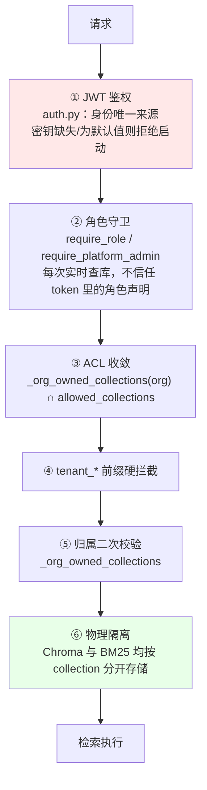

# 项目共识与架构导航

> **本文件是项目的唯一事实来源。** `docs/` 下的设计文档可能已过期，冲突时以本文件为准。
> 建立于 2026-08-24（起因见 `docs/collaboration_retrospective.md`），架构章节固化于 2026-08-25。
>
> **怎么用这份文档**：会话开始读本文即可（约 4K token）。
> 架构图、核心链路、性能数据在 **`docs/architecture.md`**——需要时才查，不必每次读。
> **这两份同属"当前状态"正本，内容不重复；改架构时两份都要更新。**

---

## 📌 30 秒必读

**这是什么**：企业级 RAG 问答 Agent，**多租户 SaaS**，客户是 10000+ 员工的大企业。

**当前阶段**：⚠️ **停止新增功能，先补设计**（2026-08-24 起）。
不要主动提议或开始新功能；允许做的是补设计、补测试、修 P0/P1、清死代码。

**三条最高优先级未闭环**（详见 [§4](#4-已知未闭环)）：
1. 🔴 文档更新后旧版本片段永久残留 → **产生错误答案**（已实测确认）
2. 🔴 BM25 索引 JSON 全量加载 → 真实数据量下秒级至分钟级 + OOM
3. 🔴 模型服务并发形态 → 目标规模下缺口约 10x

**四条最容易踩的规则**（完整规则见 [§7](#7-硬性规则)）：
- 用户说「修改一个BUG」但实为**设计变更**时 → 必须先指出，不要直接开工
- 任何测试/审计报告 → 必须写「**本次未覆盖的范围**」
- 结论分三档 → **已验证通过 / 已跑通 / 已实现但未验证**，不许混用
- 脚本一律落 `tests/` 或 `scripts/` → **禁止写临时目录后丢弃**

---

## 目录

**本文（每次会话都读）**

| # | 章节 | 内容 |
|---|---|---|
| 1 | [项目定位](#1-项目定位) | 交付给谁 / 怎么用 / 什么算做完 / 功能边界 |
| 2 | [架构速览](#2-架构速览) | 一屏看懂全貌，细节见 `docs/architecture.md` |
| 3 | [权限与多租户](#3-权限与多租户) | 权限模型 · 隔离层次 · 已验证的保证 |
| 4 | [已知未闭环](#4-已知未闭环) | P0 / P1 清单 |
| 5 | [已修复](#5-已修复防止重新引入) | 防止重新引入（含代码级约束） |
| 6 | [已作废的设计](#6-已作废的设计) | 不要复活 |
| 7 | [硬性规则](#7-硬性规则) | 需求 · 测试 · 交付 · 文档 · 工程 · 会话 |
| 8 | [相关文档](#8-相关文档) | 索引 |

**`docs/architecture.md`（需要时才查）**

| 章节 | 内容 |
|---|---|
| 系统架构 | 分层图 · 问答全流程图 · 功能模块 · 代码模块 · 内置工具 |
| 核心链路 | **双模型系统** · 检索链路 · 工具调用 · 摄入流水线 |
| 性能现状与目标 | SLO · **性能测试方法与结果** · 容量测算 |

---

## 1. 项目定位

*(2026-08-25 确定)*

| | 答案 |
|---|---|
| **交付给谁** | **10000 名员工以上的大企业**，企业自有庞大知识库 |
| **形态** | **多租户 SaaS** —— 客户是多家万人企业，企业间必须隔离 |
| **目标客户数** | 早期 **1–3 家** |
| **他们怎么用** | 日常工作流、查资料、提高运维水平 |
| **什么算做完** | 满足**基本的、普适的**功能需求和性能需求 |
| **知识库规模** | 单客户**几个 G 的 PDF / Word**，**每天由各部门员工手动上传更新** |
| **硬件** | 真实交付环境硬件更好；当前阶段本地测"匹配硬件的性能"即可 |

### 明确不做的

多模态 · 移动端专门适配 · 实时协同 · agentic RAG 复杂编排 · self-consistency / HyDE ·
自建 reranker 服务 / 语义缓存 · **跨企业知识联邦**（与多租户隔离目标冲突）

> **新增功能前先核对这份清单。** 完整理由见 `docs/scale_slo_and_priorities.md` §7。

### ⚠️ 一条影响所有既有结论的前提变更

`docs/review_2026-08-24/` 三份评审的严重程度基线是按**"小团队内部系统、低并发"**判定的。
万人多租户规模使该前提失效——**审计报告的 P0/P1/P2 分级不要直接沿用**，
以 `docs/scale_slo_and_priorities.md` 的重估为准（12 条 P0）。

---

## 2. 架构速览

**技术栈**：FastAPI + LangGraph · React + Vite · PostgreSQL（会话/用户/角色/组织）·
ChromaDB（向量，按 collection 物理隔离）· BM25（`data/db/bm25/{collection}`）· 本地 Ollama

**问答流程**：
`session → intent → (retrieve | tool_subgraph | workflow | clarify) → generate → memory_manage → archive`

**双模型分工**：
- `qwen2.5-1.5b-router`（LoRA 微调）—— **只用在 `_intent_node`**：query 改写 + 子查询拆分 + 四分类，一次调用完成，**实测 1.5–2.2s**
- `qwen2.5:7b` —— 生成回答 / ReAct 工具决策 / 工作流字段抽取 / 记忆摘要

**检索**：Chroma dense + BM25 sparse → RRF(k=60) → bge-reranker-base 重排 → `MIN_RELEVANCE_SCORE=0.1`
（阈值打在 **cross-encoder 重排分**上，不是 RRF 融合分；reranker 降级时不适用）

**耗时**（2026-08-25 实测，`scripts/benchmark_latency.py`，每场景 3 次中位数；
详见 `docs/architecture.md` §3.2）：

| | TTFT | 总耗时 |
|---|---|---|
| 短回答（闲聊/未命中/工作流） | 1.7–2.1s | 1.7–2.1s |
| 检索命中（单库 / 6 库并行） | 3.6s / 3.9s | 3.6s / 4.0s |
| 长回答（354 字） | 9.2s | 14.4s |

阶段构成：intent **1.5–2.2s**（现在最大的固定开销）· 检索 0.14–0.39s ·
generate 1.85s（65 字）/ 12.0s（354 字）· session/memory/archive ≈ 0。
后端**启动**要 ~20s（`lifespan` 里同步预热 reranker/embedding/LLM），换来冷热差 ≤ 0.5s。

⚠️ 短回答场景 TTFT ≈ 总耗时：`_generate_node` 要攒够
`_PROMPT_LEAK_CHECK_WINDOW = 200` 字符做提示词泄露检测才放行第一批 token
（`workflow.py:105`），回答不足 200 字就等于非流式。

**规模**：后端 10.4K 行 / 72 端点 · 前端 5.9K 行 · 测试 27.2K 行（⚠️ 几乎全在老 RAG 库层）

> 📖 **架构图、链路细节、性能数据 → `docs/architecture.md`**

---

## 3. 权限与多租户

### 3.1 权限模型

*(2026-08-23 定稿)*

- 角色（`roles`，携带 `org_id`）**直接携带知识库权限**，`role_collections` 关联 collection
- **一个用户一个角色**
- **不存在 `kb_group`** —— 2026-08-22 曾拆分出去，08-23 合并回 roles
  （`scripts/migrate_kb_groups_to_roles.py`）。`role_store.py:41,192` 注释里仍提到该词，仅为历史说明

### 3.2 隔离层次

### 3.3 ✅ 已验证成立的隔离保证

*(2026-08-25 核查)*

| 检查项 | 结果 |
|---|---|
| BM25 索引是否全局共享 | **否** —— 按库物理隔离，`data/db/bm25/{collection}`（`query_knowledge_hub.py:397`） |
| Chroma 是否共享集合 | **否** —— 按 collection 分开 |
| 候选库范围 | 先 `_org_owned_collections(org)` 限定在本企业名下，再与角色 ACL 取交集（`:599-603`），为空直接拒绝 |

业界基准提出的「全局 BM25 索引 + 仅 dense 侧过滤 → RRF 融合后混入跨租户结果」
**不适用于本实现**。本项目用的是**物理隔离 + ACL 前置收敛**，是更强的模型。

> **后续任何"合并索引以提升性能"的优化提议，都必须先过这一关。**

### 3.4 知识库存储

全部走平台本地 Chroma。**委托模式（`http_api` 连接器）已于 2026-08-23 停用**，
代码路径仍残留（`tenant_connector_store.py:39`、`app.py:1502,1816`、
`query_knowledge_hub.py:444,458`），属待清理死代码，**没有数据走它**。

**注意**：考勤联邦与知识库联邦不同 —— `tenant_identity_store` **仍接在**
`builtin_tools.py:108` 的 `query_attendance` 上，**仍在使用中**。

---

## 4. 已知未闭环

**完整清单与优先级**见 `docs/scale_slo_and_priorities.md`（12 条 P0）。以下为最高优先级：

### 🔴 P0

1. **文档更新后旧版本片段永久残留** —— **已实测确认**
   （2026-08-25，`scripts/verify_stale_chunk_retention.py`：改一句话重传，库中两版各 1 条）。
   `doc_id` 即文件 SHA256，内容一变即视为新文档；片段去重是跳过语义；全仓无版本替换逻辑。
   **每天更新的场景下矛盾材料复利累积，模型无法判断哪个是当前版本 → 产生错误答案。**
   见 `docs/scale_slo_and_priorities.md` §1.5

2. **BM25 索引 JSON 存储 + 每查询全量加载**（`query_knowledge_hub.py:397`）。
   真实数据量（几个 G 文档 → 143K–716K 块）下索引达 GB 级，每查询每库各 `json.load` 一次
   → 秒级至分钟级 + OOM。**待实测**，方法见 §6.2 of scale 文档
   > ⚠️ **2026-08-25 的耗时实测没有触及这一条**：那次测出的"检索 0.14–0.39s、
   > 6 库并行与单库持平"是在**每库约 20 块**的测试数据下得到的，
   > 与本条推算的前提（143K–716K 块）完全不是一个量级。
   > **不要拿"实测检索很快"来降低本条的优先级。**

3. **模型服务并发形态** —— `OLLAMA_NUM_PARALLEL` 默认 1，目标规模缺口约 10x
   > 那个"10x"是从旧 P50 24.2s 反推的估算。**延迟已经大幅下降（见 §2），
   > 但并发至今一次都没实测过**（2026-08-25 的基准是串行单用户），
   > 缺口倍数因此**既没被验证、也没被推翻**，本条维持 P0。

4. **安全四条** —— 绕过 ACL 的测试端点（`app.py:1120,1141,1155`，**上线前必删**）·
   CORS 全放开 + 允许携带凭证 · 租户凭证明文存库 · trace WebSocket 无鉴权

5. **知识库文档投毒 → 间接提示注入**，可跨话题传染，ACL 拦不住
   （`docs/security_prompt_injection_test_report.md` 案例2）

6. **委托模式链路的注入防护零覆盖**（2026-08-25 新发现）——
   平台本地库有三道防护（摄入拒收 / 检索剔除 / 生成短路），
   但 `delegated_compute.py` 摄入侧无检测、`query_knowledge_hub.py` 的
   `_execute_remote` 检索侧无过滤。**委托给企业自建的库一道都没有。**

7. **`BM25Indexer.remove_document` 是死代码**（2026-08-25 实测确认）——
   它用 `chunk_id.startswith(doc_id)` 匹配，但实际 chunk_id 形如
   `65046ad1_0000_2a3ac7ab`（`sha256(源路径)[:8]`），传入的 doc_id 是文件内容
   SHA256，**22 字符的串永远不可能以 64 字符的串开头，恒返回 False**。
   `add_documents` 里"重新摄入时清理旧 postings"的幂等机制用的是同一个函数，
   **本该防止 BM25 残留的保险从未生效**。单测用 MagicMock + 自造 id，测不出来。
   —— 这是上面第 1 条能否修复的**唯一硬阻塞**。

### 🟠 P1

- 🔴 **闲聊路由误判率 81%**（2026-08-25 专项实测，21 条闲聊 × 2 次 = 42 次运行，
  `scripts/verify_smalltalk_routing.py`；详见 `docs/review_2026-08-25/smalltalk_routing_regression.md`）。
  用户实际拿到正常回答的只有 **19%**，失败分两种：
  **57% 被固定澄清话术短路**、**24% 撞知识库拒绝话术**（后者才是最初发现的那种）。
  **对照组（该查知识库/考勤的业务问题）4 组配置全部零误判**——所以性能基准和
  那 23 条业务用例都没能发现它。
  三条根因**互相独立，必须分开修**：
  1. **`intent.py:577` 的 `len(rewritten_query.strip()) < 4` 阈值** ——
     ≤3 字的句子 100% 被判 clarify，占全部误判约 40%。**与模型无关，重训也修不掉。**
  2. **1.5b router 自己判错** —— 抓到的原始输出：
     `{"intent_type":"tool","target_tool":"query_knowledge_hub","reasoning":"询问用户姓名，应查企业知识库"}`。
     **训练数据 91 条样本里闲聊样本为 0**（已核实），`tool` 占 68%，
     学到的先验就是"拿不准就判 tool"。
  3. **`_INTENT_CLASSIFY_RULES`（`intent.py:428-439`）四个桶里没有"闲聊/直接回答"这一类** ——
     模型只能在四个都不合适的选项里挑。
  **是不是换 1.5b 引入的**：症状是新的，病根不是。
  "告诉用户知识库里没有你是谁"确实是 1.5b 带来的（7b 两条链路下均为 0%），
  但 08-23 基线（7b·两次调用）仍有 **43% 闲聊误判**，只是错法是澄清话术。
  **不是从对变错，是错法变得更有害。** 且当时那 73 字正常回答是歪打正着——
  7b 输出 `intent_type=clarify` 但 `need_clarify=False`（自相矛盾），
  落进兜底分支且 `target_tool` 为空才没踩到闸门。
  **修复顺序**：先调长度阈值（砍掉四成，纯规则可单测）→ 再定第五类 `chitchat` 体系
  → 最后按新体系补样本重训。**重训前必须先把训练数据与生成脚本从临时目录落进仓库**
  （目前只在 scratchpad，本项目已因 `latency_probe.py` 丢失吃过一次亏）。
  ⚠️ **不要用"拆掉空命中短路"来修** —— 只覆盖 24%，且那道短路是刻意的安全设计
  （防 LLM 零依据编造公司制度），拆掉等于拿"业务问答可能幻觉编制度"换"闲聊能寒暄"。
- **TTFT 卡在提示词泄露检测窗口上**：`_generate_node` 要先攒够
  `_PROMPT_LEAK_CHECK_WINDOW = 200` 字符才放行第一批 token（`workflow.py:105`），
  回答不足 200 字时"流式"等于非流式（实测 TTFT 与总耗时差 < 20ms）。
  安全与 TTFT 的真实取舍，**要把 TTFT 压进 3s SLO 绕不开这一环**。
- `ragent_backend` + `tool_agent` 共 **12,200 行零测试覆盖**，`conftest.py` 无 DB/LLM fixture
- 后端 **48 处 `print()`、0 处 logger**，无结构化日志、无 request id
- 检索链路每查询重建全套组件、全链路无缓存
- 管理端普遍 N+1（`/admin/users` 约 300 次串行查询）
- `create_app()` 3038 行 / 72 端点，无路由分层、无依赖注入
- 无 Dockerfile / CI / 依赖锁定

---

## 5. 已修复（防止重新引入）

- ✅ **2026-08-24　P0：并发请求跨用户串流**
  token/trace 队列原为 `RAGWorkflow` 实例属性，而全进程共用一个实例 → 并发请求互相覆盖，
  一个用户的回答会混进另一个用户的 SSE 流。
  改为 `contextvars` 按请求隔离（`workflow.py` 顶部 `_CURRENT_TOKEN_QUEUE`），
  实例属性改为**只读 property**。
  **约束**：`_CURRENT_*.set(...)` 必须在 `asyncio.create_task(...)` 之前；
  `finally` 清理必须用 `set(None)` 而非 `reset(token)`（异步生成器跨上下文 reset 会抛 ValueError）。
  回归保护：`tests/unit/test_workflow_stream_isolation.py`（9 条真并发）。
  判别力已用旧实现验证：`scripts/verify_stream_isolation_regression.py`。
  **不要把 per-request 状态写回 `self`**，有测试专门拦。

- ✅ **2026-08-24　P0：JWT 密钥硬编码**
  原为 `os.getenv("RAGENT_JWT_SECRET", "dev-only-insecure-secret-change-me")`，
  而全仓从未设置该变量 → 部署必然用公开默认值，任何人可伪造任意身份。
  改为 `resolve_jwt_secret()`：非 `RAGENT_DEBUG=true` 时密钥缺失或等于默认值一律拒绝启动；
  `create_app()` 第一行 fail-fast。回归保护：`tests/unit/test_auth_jwt_secret.py`（11 条）。

---

## 6. 已作废的设计

**全部已移入 [`docs/archive/`](docs/archive/)**（2026-08-25），并附归档说明。
**不要按它们改代码**——当前状态见本文 §2/§3 与 `docs/architecture.md`。

| 文档 | 状态 |
|---|---|
| `archive/role.md` | 已实施，但权限模型此后又演进两轮 |
| `archive/work-flow*.md`（3 份） | 均已实施；讲同一件事但**未合并**——都已冻结，合并收益低于成本 |
| `archive/auto-operations.md` | **部分实施**：监控壳子有了，自动运维内核没有 |
| `archive/attendance-tenant-federation.md` | **核心路由仍在使用**，注意与知识库联邦不同 |
| `archive/knowledge-base-tenant-federation.md` | 架构已于 08-23 拆除，代码路径残留待清理 |
| `archive/TODO.md` | 停在 08-13，已被代码审计与规模重估取代 |
| `kb_group` 三张表 | 已迁移回 roles |

**已删除**（内容被 `CLAUDE.md` + `docs/architecture.md` 完全取代，且无状态标记、
落后 8–12 天，属"比没有更危险"）：`PROJECT_ARCHITECTURE_SUMMARY.md`、`TECHNICAL_OVERVIEW.md`。
需要时从 git history 取回。

---

## 7. 硬性规则

### 7.1 需求与设计

- 用户用「修改一个BUG」描述**实为设计变更**的事时，必须指出：
  「这不是 bug，这是 \<文档/位置\> 的既有设计，改它意味着 \<影响面\>，确认吗？」
  —— 参考 2026-08-22 14:55 未指出的教训：36 小时架构往返 + 两个互为逆操作的迁移脚本
- **改动数据模型 / 权限模型前**，先更新本文件 §3 并等用户确认
- 命中任一条就**停下来做设计评审**：① 要写 migration 脚本 ② 同一需求第 3 次被报"还是不行"
  ③ 方案里出现"会动到 X 个文件 / 涉及表结构"

### 7.2 测试与审计

- 用户说"测试"时**先确认是黑盒跑还是白盒审计**；不确定就问。
  黑盒找逻辑/行为/性能问题；白盒找共享状态、密钥管理、并发、资源泄漏这类**不产生异常输出**的缺陷
- **任何测试/审计报告必须包含「本次未覆盖的范围」**，缺这一节视为未完成
- 安全测试**默认覆盖**：认证伪造 / 越权 / 并发 / 密钥与配置管理，即使用户只点名其中一类
- **并发缺陷必须用并发方式验证**，串行跑 N 条不算
- **注释里声称的不变量要么验证、要么标为未证实假设，不得当作依据**
  —— 参考 `workflow.py` 那条"并发互不串"的错误注释导致 P0 长期未被发现
- 凡涉及权限的改动**必须同时提交测试**
- 写完测试再问一句：**它在旧实现下会失败吗？** 不会 → 是废测试

### 7.3 交付与汇报

- 每次交付回答三句：**验收怎么做**（谁用什么账号，点哪里，看到什么算通过）/
  **回归怎么保**（哪个测试文件能自动复现）/ **什么没做**（未覆盖的边界）
- 结论**分三档不许混用**：已验证通过（有可复现测试）/ 已跑通（手工执行过）/ 已实现但未验证

### 7.4 文档

**唯一事实来源只有本文件。** 其他文档只负责"记录当时为什么这么决定"。

- 「**为什么这么改**」→ 写进 **commit message**，写完冻结，零维护
- 「**现在系统长什么样**」→ 只写进**本文件**，别处不许有副本
- 「**还没实现的重要方案**」→ 独立设计文档，**必须有死期**，实施完改标或删除
- 报告类保留但**标死日期**，不假装描述当前状态
- 所有文档头部必须有**状态 + 日期**；没有状态标记的视同不可信
- 一份设计被取代时**尽快删除**，只标注不删除仍有成本（grep 会命中）

> 由来：2026-08-25 盘点 33 份文档 / 608 KB，根目录 6 份设计文档**有 4 份状态标记是错的**。
> **标着"已实现"的废弃架构文档，比没有文档更危险。**

### 7.5 工程

- 测试/探测脚本落 `tests/` 或 `scripts/`，**禁止写临时目录后丢弃**
  —— 参考 `jailbreak_test.py` / `latency_probe.py` 丢失，两份报告的数字至今无法复现。
  耗时那半边已经补上：`scripts/benchmark_latency.py`（2026-08-25）；
  `jailbreak_test.py` 那半边**仍然是丢的**，安全报告的数字依旧不可复现。
- **被测代码带未提交改动时，报告里必须写清代码状态**（commit hash + 脏文件清单 +
  "这批数字对应含未提交改动的工作区"），否则数字将来无法从 git 复现
  —— `benchmark_latency.py` 的 `code_state` 字段就是干这个的
- 标「临时 / 上线前删除」的代码，下次提交时**要么删掉、要么加运行时开关**
- **每完成一个可描述的功能就提交，单次 ≤ 15 文件**，消息写根因不写现象
- **提交时显式列文件名，不要用 `git add -A` / `git add .`** —— 多会话并发时会误提交他人在途工作

### 7.6 会话

- 每次会话**开始先读本文件**，不要靠 grep 重建认知
- **同一时刻只允许一个会话有写权限**（问原理/学习类会话可并行）
- 用户说单字"继续"且额度将尽时，**列出剩余步骤，什么都别改**
- **结束前固定动作**：更新本文件与 `docs/architecture.md` → 按功能拆分提交

---

## 8. 相关文档

| 文档 | 内容 | 维护状态 |
|---|---|---|
| **`docs/architecture.md`** | **架构图 · 核心链路 · 双模型 · 性能测试**（与本文同属当前状态正本） | **活文档** |
| `docs/scale_slo_and_priorities.md` | 容量测算 · 最小 SLO · 27+3 条发现重新分级（12 条 P0） | 活文档 |
| `docs/orchestration_design.md` | 编排层设计：并行防护 + 记忆异步化 | **草案，未实施** |
| `docs/collaboration_retrospective.md` | 协作复盘与开发流程指南（**每周自查只需读 §1**） | 活文档 |
| `docs/review_2026-08-24/review_codebase_findings.md` | 代码审计，带行号证据 | 时点快照 |
| `docs/review_2026-08-24/review_process_retro.md` | 过程复盘量化分析 | 时点快照 |
| `docs/review_2026-08-24/review_industry_baseline.md` | 业界对标：必备 / 规模上来才需要 / 不必跟 | 时点快照 |
| `docs/security_prompt_injection_test_report.md` | 提示注入测试结果 | 时点快照（**脚本已丢，不可复现**） |
| `docs/prompt_injection_remediation_plan.md` | 对应修复方案 | 未实施 |
| `docs/latency_report.md` | **优化前**耗时基线 P50 24.2s / P95 46.8s（2026-08-23） | 时点快照（**脚本已丢，不可复现**；现行数字见 `architecture.md` §3.2） |
| `scripts/benchmark_latency.py` | **现行耗时基准脚本**，6 场景 × 3 次，输出 JSON 到 `scripts/benchmark_results/` | **可复现，活脚本** |
| `docs/optimization_tracking.md` | 优化前后对比 | 活文档 |
| `docs/kb_permission_design.md` | 权限设计（截至 08-23） | 时点快照 |
| `docs/qa_test_questions.md` | 问答测试题库，取材自实际库内容 | 可用 |
| `docs/archive/` | 历史设计文档（已实施或已废弃） | **冻结，不维护** |
| `readme.md` | 仓库入口，指向本文 | 活文档 |
