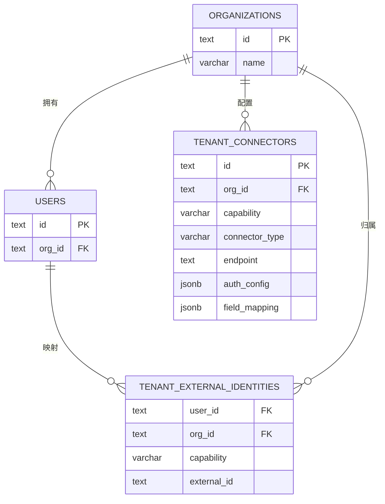
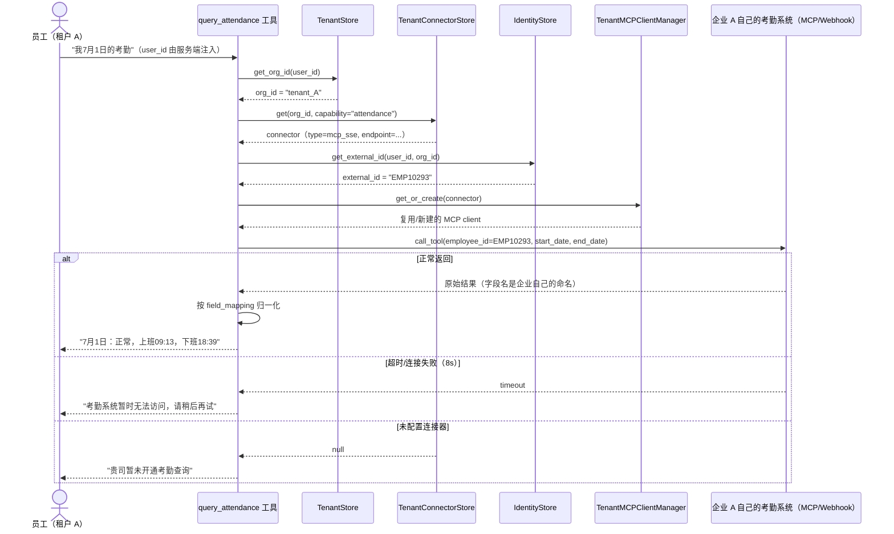
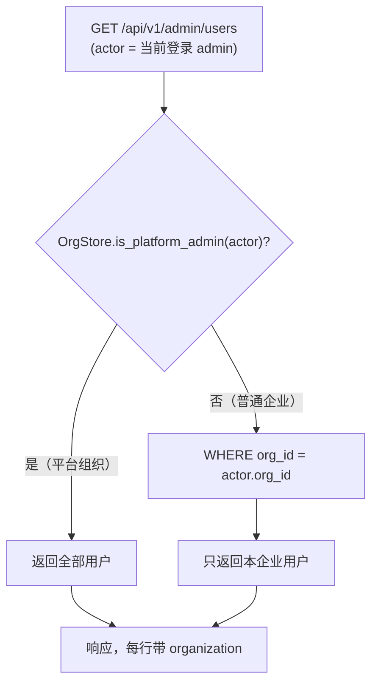

# 考勤数据多租户联邦查询（方案四）技术方案

> **状态：核心路由仍在使用中（2026-08-25 核实：`tenant_identity_store` 仍接在
> `builtin_tools.py:108` 的 `query_attendance` 上）。注意与知识库联邦不同——
> 那套已于 08-23 拆除，这套没有。**
> 原状态行：核心路由已实现（`src/ragent_backend/tenant_identity_store.py`、
> `src/tool_agent/builtin_tools.py::_register_query_attendance`、
> `services/tenant_attendance_demo/`）——落地的是第 1.3 节决策 3 里"更轻的 HTTP
> webhook 兜底路径"（`connector_type=http_webhook`），第 2 节设想的 `mcp_sse`
> 委托方式（按租户懒加载/回收连接的通用 MCP client 管理器）未实现，见该文档
> 第 2 节旁注。
> 关联现状代码：`src/ragent_backend/attendance_store.py`、`src/tool_agent/builtin_tools.py`
> （`query_attendance` 工具）、`src/tool_agent/mcp_client.py`、`src/ragent_backend/user_store.py`、
> `config/settings.yaml`（`mcp:` 段）、`frontend/src/components/shell/TopNav.jsx`、
> `frontend/src/components/admin/UserRoleAssignment.jsx`（第 8 节新增关联）

## 1. 背景与目标

### 1.1 场景

这个 Agent 要卖给多家企业共用同一套部署（不是每家一套私有部署）。但考勤数据是每家企业自己的
HR/考勤系统里的活数据——字段不一样（有的叫 `check_in_at`，有的叫 `clock_in_ts`）、数据库类型
不一样（Postgres/MySQL/钉钉云 API/自研系统都有可能）、而且往往涉及数据合规要求：企业不愿意把
自己的考勤原始数据复制一份放到我们这边存着。

### 1.2 现状与差距

现在的实现是单租户假设：`query_attendance` 工具直连一个写死的 `AttendanceStore`，查询固定
schema 的 `attendance_records` 表（在我们自己的 Postgres 里）。`users` 表没有任何"这个用户属于
哪家企业"的概念——一个部署 = 一家企业，这个假设在整个系统里（`role_store.py`/`workflow_store.py`
同样如此）都是成立的，考勤只是第一个碰到这个问题的模块。

项目里已经有 MCP client 基础设施（`src/tool_agent/mcp_client.py`，`config/settings.yaml` 里
`mcp:` 段配置了一个 `simple` server），但目前是**启动时静态连接一批写死的 server**，不是"按请求
里的用户身份动态决定要连谁"。方案四要用的正是这套机制，只是要从"静态"改成"动态路由"。

### 1.3 设计决策

1. **不新建统一 schema，也不做 ETL 同步**——员工问考勤时，实时委托到该员工所属企业自己的系统去
   查，查完就地转译成自然语言返回，请求结束后这条数据不在我们这边留任何痕迹。这是方案四和"方案二
   适配器模式"最本质的区别：适配器模式还是要在我们数据库里存一份 `tenant_id` 标记的数据，方案四
   连这个都不存。
2. **复用 MCP 协议做企业侧的对接契约**，不是我们的私有 API 规范——企业只要能起一个暴露标准 MCP
   工具接口的服务（可以是他们自己写的，也可以是我们后续提供一个"考勤连接器 SDK"帮他们快速包一层），
   我们这边不需要为每家企业写专属适配代码。这比"我们主动去学每家企业的 DB schema"更现实：企业更
   愿意自己包一层暴露标准接口，而不是把数据库账号直接给一个第三方 SaaS。
3. **技术上不苛求的企业，保留一条更轻的 HTTP webhook 兜底路径**——不是所有企业 IT 都有能力起一个
   MCP server；允许注册一个简单的、我们约定好请求/响应格式的 HTTP 端点作为备选连接器类型，跟
   `intent.py` 里"LLM 判断 + 规则兜底"两条路并存、互不阻塞的工程哲学一致。
4. **员工身份需要单独映射**——我们系统里的 `user_id` 和企业自己考勤系统里的员工工号大概率是两套
   ID，不能假设它们相等，需要一张显式的映射表。
5. **现有 `attendance_store.py` 不废弃，降级为"内置示例连接器"**——没有真实考勤系统对接、或者用于
   演示/测试的租户，可以选择"内置 Postgres"作为连接器类型，指向的就是现在这套实现。这样这次已经写好
   的代码不是白做，只是从"唯一实现"变成"众多连接器类型之一"。

---

## 2. 技术选型

| 层 | 选型 | 理由 |
|---|---|---|
| 租户对接协议 | MCP（优先 SSE/HTTP transport）+ HTTP webhook（兜底） | 复用项目已有的 MCP client 基础设施；stdio transport 只适合同机子进程，企业远程系统必须用网络 transport |
| 租户/连接器元数据存储 | 沿用 PostgreSQL + `CREATE TABLE IF NOT EXISTS`，跟 `role_store.py` 同风格 | 这些是我们自己系统的配置数据（"企业 A 的连接器指向哪"），不是企业的考勤数据本身，落库没有合规问题 |
| 凭证存储 | 加密列（对接密钥管理），不是现在 `.env` 那种明文环境变量 | 每个租户一份独立凭证，安全边界跟现有单租户的假设不一样，必须单独设计 |
| 连接管理 | 新增按租户懒加载、带超时回收的 MCP client 管理器 | 现有 `mcp_client.py` 是启动时连接一小撮写死的 server，不能扩展到"可能有几百个租户，每个都要能按需连接" |
| 字段归一化 | 连接器配置里带一份"远端字段名 → 我方规范字段名"的映射 | 不同企业字段命名不同，归一化逻辑要配置化，不能写死在代码里 |

**实现落地时的取舍（跟上表设想的差异，显式记录）**：
- 只实现了 `http_webhook` 一条委托路径，`mcp_sse` 未实现——一个通用的、按租户
  懒加载/超时回收连接的 MCP client 管理器是独立的一大块基础设施，两个 demo
  租户的验证场景下投入产出比不划算，见 `tenant_connector_store.py` 里
  `CONNECTOR_TYPE_HTTP_WEBHOOK` 常量旁的注释。
- 凭证（`auth_config.token`）现在跟 `knowledge-base-tenant-federation.md` 的
  委托 token 一样，明文存在 `tenant_connectors.auth_config` JSONB 列里，没有做
  这里设想的加密列——数据库访问权限本身受限，暂时够用，但生产环境接入真实
  企业凭证前应该补上。

---

## 3. 数据模型

新增 3 张表，`attendance_records` 表保留（作为 `connector_type=internal_postgres` 时的后端）。

```sql
-- 组织/租户（考勤只是第一个需要按租户路由的能力，未来别的租户专属数据源可以复用同一套模型）
CREATE TABLE IF NOT EXISTS organizations (
    id            TEXT PRIMARY KEY,
    name          VARCHAR(128) NOT NULL,
    created_at    DOUBLE PRECISION NOT NULL
);

-- users 表新增列（迁移期允许为空，见第 6 节）
ALTER TABLE users ADD COLUMN IF NOT EXISTS org_id TEXT REFERENCES organizations(id);

-- 租户的外部系统连接器注册表
CREATE TABLE IF NOT EXISTS tenant_connectors (
    id                TEXT PRIMARY KEY,
    org_id            TEXT NOT NULL REFERENCES organizations(id) ON DELETE CASCADE,
    capability        VARCHAR(32) NOT NULL,   -- 'attendance'，未来可扩展 'expense' 等
    connector_type    VARCHAR(32) NOT NULL,   -- mcp_sse / http_webhook / internal_postgres（演示兜底）
    endpoint          TEXT,                   -- MCP server URL 或 webhook URL
    auth_config       JSONB NOT NULL DEFAULT '{}',   -- 加密存储的 token/密钥
    remote_tool_name  VARCHAR(64),            -- 远端暴露的工具名，不一定叫 query_attendance
    field_mapping     JSONB NOT NULL DEFAULT '{}',   -- 远端字段名 -> 我方规范字段名
    is_active         BOOLEAN NOT NULL DEFAULT TRUE,
    created_at        DOUBLE PRECISION NOT NULL,
    UNIQUE (org_id, capability)
);

-- 员工在"我方系统"和"企业自己系统"里的身份映射
CREATE TABLE IF NOT EXISTS tenant_external_identities (
    user_id      TEXT NOT NULL REFERENCES users(id) ON DELETE CASCADE,
    org_id       TEXT NOT NULL REFERENCES organizations(id) ON DELETE CASCADE,
    capability   VARCHAR(32) NOT NULL,
    external_id  TEXT NOT NULL,   -- 企业自己系统里的工号/员工 ID
    PRIMARY KEY (user_id, capability)
);
```

### 3.1 ER 图



---

## 4. 核心逻辑

### 4.1 `query_attendance` 工具改造

现在的实现（`src/tool_agent/builtin_tools.py::_register_query_attendance`）直接调用
`AttendanceStore.list_records(user_id, ...)`。改造后变成一个"解析 → 委托 → 归一化"的路由层，
`AttendanceStore` 不再是唯一实现，而是 `connector_type=internal_postgres` 时被调用的其中一种：

```python
async def handler(date=None, start_date=None, end_date=None, user_id=None) -> Any:
    org_id = await tenant_store.get_org_id(user_id)
    connector = await tenant_connector_store.get(org_id, capability="attendance")
    if connector is None:
        return "贵司暂未开通考勤查询。"

    external_id = await identity_store.get_external_id(user_id, org_id, "attendance")
    if external_id is None:
        return "你的账号还没有关联考勤系统里的工号，请联系管理员配置。"

    client = await tenant_mcp_manager.get_or_create(connector)  # 懒加载 + 复用
    raw = await client.call_tool(
        connector.remote_tool_name or "query_attendance",
        {"employee_id": external_id, "start_date": start_date, "end_date": end_date},
        timeout=8.0,
    )
    return normalize_attendance_result(raw, connector.field_mapping)
```

### 4.2 按租户动态路由的 MCP client 管理器

新增 `TenantMCPClientManager`，跟现有 `mcp_client.py` 的关键区别：

| | 现有 `mcp_client.py` | 新增的租户管理器 |
|---|---|---|
| 何时建连接 | 应用启动时，一次性连完 `settings.yaml` 里写死的几个 server | 请求到来时按 `org_id` 懒加载 |
| 连接数量级 | 个位数，长期持有 | 可能几百个租户，需要空闲超时回收，不能都常驻 |
| 失败处理 | 启动日志打印警告，不影响其它 server（已验证：现在 `simple` 连不上不影响应用启动） | 单次查询超时/失败只影响这一次工具调用，走 4.3 节的降级路径，不能拖垮其它租户的请求 |

### 4.3 时序图（含降级路径）



**关键点**：这条链路上，考勤数据只在这一次请求的内存里流转，不写任何一次 `INSERT` 到我们的数据库，
请求结束数据就不在我们这边留存了——这是"不落地"承诺的具体体现，不是一句口号。

---

## 5. 前端设计

新增一个"数据源接入"管理页（沿用 `role.md` 里 `RoleManagement.jsx` 的模式：`Table` 列出、`Modal`
表单编辑），只有对应企业的 `super_admin` 能看到自己企业的这一条配置：

- 选连接器类型（MCP / Webhook / 内置示例）
- 填 endpoint + 凭证（凭证只能写入不能回显，跟改密码的交互模式一样）
- "测试连接"按钮：调用后端一个临时诊断接口，实际发一次请求验证连通性，不写入配置
- 字段映射：一个简单的 key-value 编辑器，远端字段名 → 我方规范字段名
- 员工工号映射：支持管理员批量导入一份"我方用户名 ↔ 企业工号"的对照表（CSV）

---

## 6. 迁移计划（两阶段，不影响现有单租户使用）

**阶段一：引入租户模型，现状零回归**

1. 建三张新表；现有唯一的"组织"（当前部署本身）种子写入一条 `organizations` 记录，所有现有用户
   的 `org_id` 都指向它。
2. 给这个种子组织的 `tenant_connectors` 写入一条 `connector_type=internal_postgres` 的记录，指向
   现在的 `attendance_records` 表——`query_attendance` 工具改造后，对现有用户的行为完全不变，只是
   多绕了一层"查租户配置"。
3. `identity_store` 对这个种子组织的映射策略是"外部 ID = 我方 user_id"（因为现在就是这么用的），
   不需要额外导入。

**阶段二：真实企业接入**

4. 新企业签约时，建组织 → 建用户并设 `org_id` → 配置真实的 `mcp_sse`/`http_webhook` 连接器 →
   导入员工工号映射。
5. 如果该企业之前有走过 `internal_postgres` 路径产生的测试数据，确认切换后清掉，兑现"不落地"的
   承诺。

---

## 7. 风险与开放问题

- **时延**：委托到企业自己系统的调用在聊天响应的同步链路上，企业系统慢会拖慢这次回答。已经在
  handler 里设了 8s 超时降级，但如果大量租户的系统都慢，需要考虑要不要把这类工具调用从"同步等
  待"改成"先给个'正在查询'的中间态，查完再补一条消息"的异步模式——这是比较大的改动，先记录，
  这次不做。
- **"不落地"和"缓存"的边界**：完全不缓存的话，同一个人连续问两次今天的考勤都要打两次远程请求。
  设计上明确：**进程内、请求级别的极短 TTL 缓存（比如同一对话 60 秒内免重复查询）可以接受，写入
  持久化存储不可以**——这两者不是一回事，方案要在实现时把这条边界写清楚，不能因为"反正都是缓存"
  就模糊掉。
- **凭证安全**：`auth_config` 存的是能访问企业内部系统的密钥，明文存 JSONB 列不可接受，需要接入
  密钥管理（KMS 或至少应用层加密），这块现有项目完全没有先例，是个新的基础设施依赖。
- **MCP transport 支持范围**：现有 `mcp_client.py` 目前只跑通过 stdio；改造成需要支持 SSE/HTTP
  transport，需要先确认底层 MCP SDK 版本对这些 transport 的支持程度，可能需要升级依赖。
- **企业侧接入成本**：要求企业自己起一个 MCP server 对技术能力弱的中小企业不现实；HTTP webhook
  兜底能覆盖多少比例的客户，需要跟销售/客户成功团队确认目标客群的真实技术水平，这会影响"两条路
  并存"里到底该把精力往哪边倾斜。

---

## 8. 员工归属企业：个人信息展示 + 管理侧全量设计

### 8.1 背景

第 3 节已经设计了 `organizations` / `users.org_id`，但那是给 `query_attendance` 内部路由用的——
员工自己看不到、管理员也管不了。现在要把"归属哪家企业"这件事摆到界面上：员工自己的个人信息卡要
显示所属企业；管理后台的用户列表要能看出/管理"这个用户是哪家企业的"。

第二点一旦做，绕不开一个现在就存在、只是还没显现出来的问题：`GET /api/v1/admin/users` 现在是
**全平台一张表**，任何一个 `admin`/`super_admin` 都能看到、编辑、删除所有企业的用户，跟
`role_store.py`/`workflow_store.py` 一样完全没有按企业隔离。给列表加一列"所属企业"只是让这个问题
从"藏着"变成"看得见但没解决"——A 企业的管理员点开列表，看到一堆"所属企业：B 公司"的行还能删，
这比没有这一列更糟。所以这次要做的不只是加个展示字段，是把展示字段撑得住的那圈权限收紧也设计出来。

### 8.2 设计决策

1. **复用第 3 节的 `organizations`/`users.org_id`，不重新建模**——个人信息展示和管理侧隔离用的是
   同一份组织归属数据，跟 `query_attendance` 路由用的是一份数据、两处消费。
2. **`org_id` 不放进 JWT，每次请求现查库**——跟现有 `require_role` 的实时性原则（`auth.py` 里
   "token 24 小时不过期，角色改了要立刻生效，所以不信 token 里的旧值"）保持一致：管理员把某个
   员工从 A 公司改派到 B 公司，不用等对方重新登录就该生效。
3. **引入"平台组织"标记，不新增角色轴**——用 `organizations.is_platform` 一个布尔位区分"我们自己
   运营这套系统的组织"（能看/管所有企业）和"普通客户企业"（只能看/管自己），不新增第二套角色体系，
   复用现有的 `require_role(ROLE_SUPER_ADMIN)` 判断"能不能进后台"，是否平台组织只影响"进去之后
   看到的数据范围"，两件事分开判断。
4. **这次范围只到"用户-企业归属"，角色和工作流模板暂不隔离**——`roles`/`role_collections`/
   `workflow_templates` 现在也是全平台共享，理论上也该按企业隔离（A 企业的"IT部"角色和 B 企业的
   "IT部"应该是两个互不相干的东西），但这是比"用户归属展示"大得多的工程量，本次不做，第 8.7 节
   单独记录为后续任务。

### 8.3 数据模型变更

只加一列，复用第 3 节已有的表：

```sql
ALTER TABLE organizations ADD COLUMN IF NOT EXISTS is_platform BOOLEAN NOT NULL DEFAULT FALSE;
```

第 6 节迁移时写入的种子组织这一行，`is_platform` 设 `TRUE`——现有部署里所有用户所在的就是这个
组织，迁移后行为和今天完全一样（人人都能看到/管理所有用户），符合"零回归"要求。

### 8.4 后端改造

#### 8.4.1 `schemas.py`

```python
class OrganizationSummary(BaseModel):
    org_id: str
    name: str

class MeResponse(BaseModel):
    user_id: str
    username: str
    roles: List[RoleSummary]
    allowed_collections: List[str]
    organization: Optional[OrganizationSummary] = None   # 新增
    created_at: float

class AdminUserResponse(BaseModel):
    user_id: str
    username: str
    roles: List[RoleSummary]
    allowed_collections: List[str]
    organization: Optional[OrganizationSummary] = None   # 新增
    created_at: float

class AdminCreateUserRequest(BaseModel):
    username: str
    password: str
    role_ids: List[str] = Field(default_factory=list)
    org_id: Optional[str] = None   # 新增；企业内 admin 建号时后端强制覆盖成自己的 org_id
```

#### 8.4.2 新增 `org_store.py`（风格同 `role_store.py`）

```python
class OrgStore:
    async def list_organizations(self) -> List[Organization]: ...
    async def get_organization(self, org_id: str) -> Optional[Organization]: ...
    async def create_organization(self, name: str) -> Organization: ...
    async def get_org_for_user(self, user_id: str) -> Optional[Organization]: ...
    async def is_platform_admin(self, user_id: str) -> bool:
        # 查该用户所在组织的 is_platform 字段；组织不存在或未分配组织一律按 False 处理
        ...
    async def set_user_organization(self, user_id: str, org_id: str) -> None: ...
```

#### 8.4.3 既有接口改造清单

| 接口 | 改动 |
|---|---|
| `GET /api/v1/auth/me` | 返回体加 `organization` 字段（JOIN `users.org_id` → `organizations`） |
| `GET /api/v1/admin/users` | 非平台 admin 只返回 `org_id = 自己的 org_id` 的用户；每行带 `organization` |
| `POST /api/v1/admin/users` | 非平台 admin 建号时忽略请求体里的 `org_id`，强制用自己的；平台 admin 可以指定任意 `org_id` |
| `DELETE /api/v1/admin/users/{id}` | 目标用户 `org_id` 不等于当前 admin 的 `org_id`（且当前 admin 非平台）→ 403 |
| `PUT /api/v1/admin/users/{id}/roles` | 同上，跨企业操作 403 |

这几条改动的判断逻辑集中在一个新的依赖 `require_same_org_or_platform(target_user_id)`，跟
`require_role` 一样是 FastAPI 依赖工厂，不在每个路由里手写重复的 if——`app.py` 现有的路由风格
本来就是"业务判断封装成依赖，路由函数只管调用"，这里延续同样的写法。

#### 8.4.4 新增接口

| Method | Path | 说明 |
|---|---|---|
| `GET` | `/api/v1/admin/organizations` | 列出组织；非平台 admin 只能看到自己那一条 |
| `POST` | `/api/v1/admin/organizations` | 建组织，仅平台 admin（`require_platform_admin` 依赖） |
| `PUT` | `/api/v1/admin/users/{id}/organization` | 改派用户所属企业，仅平台 admin；"整体替换"风格，跟现有 `.../roles`、`.../collections` 接口一致 |

### 8.5 前端改造

#### 8.5.1 个人信息卡（`TopNav.jsx`）—— 所有用户都看得到

在头像/用户名下面加一行只读的"所属企业"，紧挨着现有的"加入于 {日期}"：

```jsx
{meProfile?.organization && (
  <div className="profile-org">
    <Building2 size={12} /> {meProfile.organization.name}
  </div>
)}
```

`organization` 为空（demo 账号/迁移过渡期未分配）时这一行直接不渲染，不展示"未分配"这种空态噪音
——员工自己看到"没有公司"不会覆盖任何决策，不值得占地方。

#### 8.5.2 管理后台 · 用户与角色分配（`UserRoleAssignment.jsx`）

- 表格新增"所属企业"列：平台 admin 看到的是每行各自的企业名；企业内 admin 看到的因为后端已经
  过滤过，所有行都是自己公司，这一列只是确认展示，不需要特殊处理。
- 只有平台 admin 才会在这一列看到可交互的"改派"入口（复用"角色"列同款单元格内 `Select` 的
  交互方式），企业内 admin 看到的是纯文本。前端靠 `meProfile.organization.is_platform` 判断显示
  哪种。
- "新建用户"弹窗：平台 admin 多一个"所属企业"下拉（`options` 来自 `listOrganizations()`）；
  企业内 admin 不展示这个字段——不是隐藏了还能绕过去，是后端本来就会忽略这个字段强制填自己的
  `org_id`，前端不展示只是不让人以为选了没用。

#### 8.5.3 新增"组织管理" Tab（`AdminPanel.jsx`，仅平台 admin 可见）

```jsx
{
  key: 'organizations',
  label: '组织管理',
  children: <OrganizationManagement />,
}
```

`items` 数组在渲染前按 `meProfile?.organization?.is_platform` 过滤掉这一项，企业内 admin 的
管理后台里根本不会出现这个 tab（不是权限拒绝页，是压根不给看到入口，跟现在"管理后台"整个模块
只有 `isAdmin` 才在顶导航露出的做法一致）。内容是最简单的列表 + 新建表单（组织名），先只做
组织本身的增/查——给每个组织配置考勤连接器（第 5 节已经设计过的"数据源接入"页）是下一步，
不在这次范围内重复设计。

#### 8.5.4 `api/admin.js` 新增

```js
export function listOrganizations() {
  return axios.get(`${BASE}/organizations`).then((res) => res.data)
}

export function createOrganization(name) {
  return axios.post(`${BASE}/organizations`, { name }).then((res) => res.data)
}

export function setUserOrganization(userId, orgId) {
  return axios.put(`${BASE}/users/${userId}/organization`, { org_id: orgId }).then((res) => res.data)
}
```

### 8.6 关键机制：管理后台按组织过滤用户列表



同一个接口、同一份代码，行为随 `actor` 所属组织分叉——不是前端藏了几列了事，过滤发生在查询层，
企业内 admin 从接口层面就拿不到别的企业的数据，不是"界面上不显示但接口能查到"那种伪隔离。

### 8.7 风险与开放问题

- **角色/知识库权限还没有按企业隔离**：`roles`/`role_collections` 目前是全平台共享——"IT部"这个
  角色理论上应该是"A 企业的 IT部"和"B 企业的 IT部"两个互不相干的东西，现在还是同一行数据，两家
  企业的管理员理论上都能看到、甚至编辑对方的角色定义。这是本次没做但迟早要补的一块，量级不小
  （`role_store.py`/`role.md` 里的整套设计都要重新过一遍按组织维度加过滤），先记录。
- **工作流模板同理**：`workflow_templates.approver_role_id` 指向的角色目前也是全平台共享，"审批人
  = 持有某角色的人"这套机制在多企业场景下如果角色本身没隔离，审批权限也是混的。
- **`is_platform` 误标风险**：人工把这个布尔位点错在一个真实客户企业的组织上，等于把管理所有其他
  企业用户的权限给了那家客户，后果比一般的权限 bug 严重得多。种子脚本和后台"新建组织"表单都需要
  做二次确认/审计日志，不能是一个能被误触的普通勾选框。
- **迁移期行为**：现有唯一部署的用户全部指向种子组织，`is_platform=TRUE`，人人都能管所有用户，
  跟今天的实际行为完全一致；隔离效果只有在真正引入第二个（`is_platform=FALSE` 的）组织之后才会
  体现出来，阶段一迁移不改变任何现有用户能看到什么。
