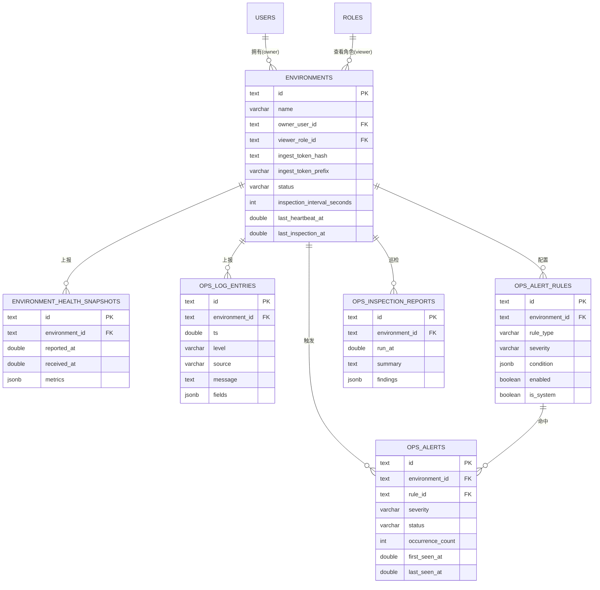
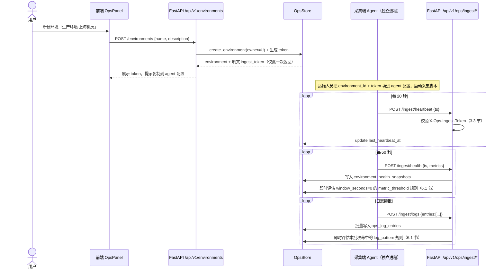
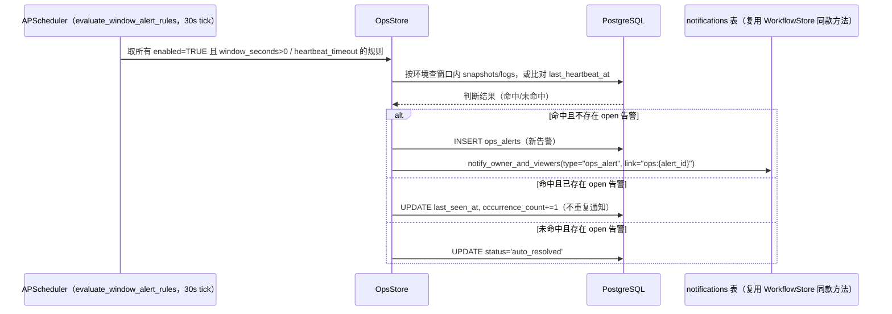
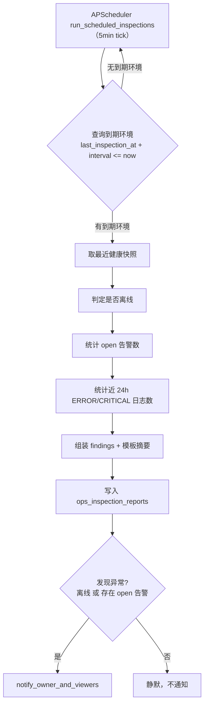

# 智能运维（Auto Operations）技术方案

> 状态：设计方案（未实现）
> 关联现状代码：`src/ragent_backend/{workflow_store,role_store,user_store,auth,app}.py`；
> `src/tool_agent/{builtin_tools,adapters,tool_registry}.py`；
> `frontend/src/components/ops/OpsPlaceholder.jsx`、`frontend/src/components/shell/TopNav.jsx`（`MODULES` 数组 `key: 'ops'`）、`frontend/src/App.jsx`（`view === 'ops'`）；
> `TECHNICAL_OVERVIEW.md` §11.2（已知限制，Celery/Redis 被标注为未来需求）

## 1. 背景与目标

### 1.1 场景与现状

用户希望把系统从"知识库问答 + 工作流审批"延伸到第三个能力面：接管企业内部对云上/本地生产环境的日常运维观察——健康监控、异常告警、日志查看分析、安全防御（只读检测）、自动化巡检。

现状：前端已经有导航占位（`TopNav.jsx` 的 `MODULES` 数组里 `{ key: 'ops', label: '智能运维', icon: Activity, soon: true }`，`App.jsx` 在 `view === 'ops'` 时渲染 `OpsPlaceholder.jsx`），后端零实现——没有 `environments`/健康/日志/告警/巡检相关的任何表或端点，`pyproject.toml` 里也没有 APScheduler。本方案要把这块从占位补成真实设计。

系统里已经有两个可以直接复用的成熟基础设施，本方案不重新发明：
- **通用授权模型**：`roles`/`user_roles`（`role_store.py`）——某个业务对象"谁能看/谁能管"用一个可选的角色 id 表达，运行期查角色集合是否包含即可。
- **通用通知投递**：`notifications` 表 + `WorkflowStore.create_notification/notify_requester/notify_approvers`（`workflow_store.py`，已经实现并接入 `app.py`，不是"设计未实现"状态——见 2.3 节确认）。

### 1.2 目标

1. 用户能"注册/连接"一个云或本地生产环境（不关心是哪家云、哪种基础设施）。
2. 一个轻量采集端（agent/collector，独立脚本，部署在被监控环境里）周期性地把心跳、健康指标、日志推送给本系统，本系统从不反向去连被监控环境。
3. 系统能基于推上来的数据做阈值/模式类的异常检测，触发告警，通过站内信通知环境负责人和被授权查看者；**只检测、只通知，绝不做任何自动处置**。
4. 支持自动化周期巡检：定时汇总某个环境的健康/告警/日志状况，生成一份巡检报告。
5. 数据具备保留期/清理策略，不会在纯 PostgreSQL（无 TSDB、无日志仓库）上无限增长。
6. 让 RAG 对话 Agent 能读这些数据回答"线上环境现在怎么样""帮我看看最近的告警"之类的问题——这是把这套能力放进"Agent 产品"而不是纯仪表盘产品的核心价值点。

### 1.3 设计决策（已与用户确认）

1. **环境接入方式：厂商无关标准接口，不集成任何具体云厂商 SDK**（不引入 boto3/阿里云 SDK/kubernetes client 等）——系统只认一份自定义的 HTTP 推送协议，不关心背后是阿里云、AWS 、还是自建机房，避免为每接入一家云就要维护一套 SDK 依赖和凭据体系。
2. **数据采集模型：纯 PUSH**——被监控环境里部署一个轻量采集进程，主动把心跳/指标/日志推给本系统；本系统永远不主动拉取/轮询被监控环境，也就不需要保存任何能连到用户基础设施的凭据（AK/SK、kubeconfig……）——这是"厂商无关"能够成立的技术前提，也从根上避免了本系统成为一个高价值攻击目标（它手里没有能操作用户云资源的密钥）。
3. **安全防御范围：只读检测 + 告警，绝不自动处置**（不自动封 IP、不自动重启、不自动做任何变更）——只做模式/异常检测，发现问题交给人判断和处理，呼应 `work-flow.md` 里"材料是否齐全，交给审批人判断，系统不做结构化建模"的同一设计哲学：AI/系统能可靠做的是"发现证据并摆出来"，"这个判断要不要采信、要不要动手"这种有实际后果的决策交给人。
4. **调度：引入 APScheduler 做进程内定时任务**（规则的时间窗口/心跳类判断、自动化巡检、数据保留期清理），明确不引入 Celery/Redis——`TECHNICAL_OVERVIEW.md` §11.2 已经把 Celery/Redis 标注为"未来如需彻底解耦任务队列"的方向，但那是给 ingestion pipeline 这种重计算场景准备的，不是本方案的范围；本方案的定时任务都是轻量的"扫一下库、按条件触发"，跟现有单进程部署模型（`python -m src.ragent_backend.app` 手动起，没有 docker/compose，`readme.md` 里的 compose 只是愿景文档，未落地）完全匹配，不需要额外的消息队列基础设施。

---

## 2. 技术选型

**结论：新增 1 个依赖（`apscheduler`），其余完全复用现有技术栈和代码风格。**

| 层 | 选型 | 理由 |
|---|---|---|
| 持久化 | 沿用 PostgreSQL + `asyncpg` 原生 SQL，`CREATE TABLE IF NOT EXISTS` 自迁移 | 与 `workflow_store.py`/`role_store.py`/`user_store.py` 完全一致的写法，新增 `ops_store.py`，`RAGENT_POSTGRES_URL` 走同样的裸 `os.getenv(...)` 读取方式（不接入 `src/core/settings.py` 的 pydantic `Settings`——那套只覆盖 LLM/embedding/向量库 YAML 配置，两套配置系统不混用，已在现状代码里确认这个边界）。 |
| 定时任务 | **新增依赖 `apscheduler`**（`AsyncIOScheduler`，v3.x），进程内运行，随 FastAPI `lifespan` 启动/关闭 | 见第 3.2 节；`MemoryJobStore`（默认，不持久化任务定义到库），任务本身在代码里用固定的 interval/cron 触发器注册，每次进程重启都会原样重建，不需要一张"任务表"。 |
| 授权分组 | 复用 `role_store.py` 的角色系统，环境新增单个可选字段 `viewer_role_id` | 与 `workflow_templates.approver_role_id` 同一模式：运行期查"当前用户角色集合是否包含这个角色 id"，不新增权限体系。 |
| 通知投递 | **复用已实现的 `notifications` 表 + `WorkflowStore` 里的 `create_notification`/`notify_*` 模式**，本方案新增 `type="ops_alert"`, `link="ops:{alert_id}"` | 见第 2.3 节确认——这套机制不是"设计未实现"，是已落地代码，直接复用同一张表、同一套 `GET /api/v1/notifications*` 端点，不重新设计通知系统。 |
| 机器凭据 | 环境级 **ingest token**，`bcrypt` 单向哈希存储，只校验不解密 | 见第 3.3 节的完整论证；复用 `user_store.py` 已经在用的 `bcrypt` 依赖，不新增加密库。 |
| Agent 侧鉴权 | 自定义请求头 `X-Ops-Ingest-Token`，**不走** `Depends(get_current_user)` 的 JWT 流程 | 采集端是机器，没有用户名密码登录态，JWT bearer 语义（"这是某个人的会话"）不适用；新增独立的 FastAPI 依赖 `verify_ingest_token`，与 `get_current_user`/`require_role` 平级但完全独立的校验路径。 |
| 告警规则表达 | JSONB 存储的简单阈值/模式比较（`metric_threshold` / `heartbeat_timeout` / `log_pattern` 三种 `rule_type`），**不引入脚本引擎/规则引擎**（不用 Python `eval`、不用 Drools 之类的规则引擎、不用 CEL） | 见第 3.4 节；系统里从来没有"用户可控代码在服务端执行"的先例，规则必须是数据而不是代码，且要足够简单让管理员/环境负责人能读懂自己配的规则在检测什么。 |
| 后端框架 | 沿用 FastAPI + JWT，端点风格照抄 `app.py` 里 `# ==================== 分组标题 ====================` 注释分组、闭包写在 `create_app()` 内的既有写法 | 新增 `/api/v1/environments*`（用户侧）、`/api/v1/ops/ingest/*`（agent 侧）、`/api/v1/admin/environments*`（管理概览）三组端点。 |
| 前端框架 | 沿用 React 18 + antd 5 + axios，不引入路由库、不引入图表库之外的新依赖 | `OpsPanel.jsx` 替换 `OpsPlaceholder.jsx`，结构对齐 `WorkflowPanel.jsx`；简单趋势图用 antd 自带的迷你图表能力或轻量 sparkline，不为此引入 ECharts 等重型依赖（如实现时发现确实需要更丰富的图表，作为独立评估项，不在本方案默认范围）。 |
| 采集端（agent） | **独立于本仓库运行时进程的轻量脚本**（建议纯标准库 + `requests`/`psutil`，不依赖本项目任何内部模块） | 部署在被监控环境里，跟后端进程不是同一个部署单元；本方案只定义它必须遵守的推送协议（第 5 节），脚本本身作为配套独立交付物，不在这次实现范围（第 8 节列出落点但不实现）。 |

**明确不引入的依赖**：`boto3`/阿里云 SDK/`kubernetes` client（决策 1）、`celery`/`redis`（决策 4）、任何加密库如 `cryptography`（第 3.3 节论证不需要）、任何规则引擎/脚本引擎（第 3.4 节）、任何 TSDB（InfluxDB/Prometheus 等，第 4.4 节论证纯 Postgres + 保留期策略即可覆盖 v1 需求）。

### 2.3 关于"notifications 是否已实现"的确认

**结论：已实现，不是纸面设计**——`workflow_store.py` 里 `notifications` 表的 `_ensure_schema`、`create_notification`/`list_notifications`/`unread_count`/`mark_read`/`mark_all_read`/`notify_requester`/`notify_approvers` 全部有完整实现；`app.py` 里 `GET /api/v1/notifications`、`GET /api/v1/notifications/unread-count`、`POST /api/v1/notifications/{id}/read`、`POST /api/v1/notifications/mark-all-read` 四个端点都已挂载；前端 `NotificationBell.jsx` 也已经在消费。**本方案对通知系统零改动，只新增一种 `type`（`ops_alert`）和一种 `link` 前缀（`ops:{alert_id}`），复用现成的表、现成的端点、现成的前端组件。**

---

## 3. 核心技术判断

### 3.1 为什么是"推"不是"拉"，为什么不对接具体云厂商 SDK

如果做成"拉"（后端周期性调云厂商 API 查询实例状态/日志），意味着：(a) 系统必须为每一家要支持的云单独集成一套 SDK 和鉴权方式，云厂商种类越多维护成本线性增长；(b) 系统必须存储能够操作/读取用户云资源的凭据（AK/SK、service account、kubeconfig……），这些凭据一旦泄露的影响面远超本系统自身数据，把"运维工具"变成了一个高价值攻击目标；(c) 拉取式监控天然有延迟且强依赖对方 API 的可用性和限流策略。

"推"模型把这三个问题一次性解决：采集端部署在用户自己的环境里，用什么凭据连自己的云是用户自己的事，本系统完全不掺和；系统只需要维护一份自定义的、跟云无关的推送协议（心跳/指标/日志三种简单 POST），新增一种被监控环境类型（哪怕是纯本地机房，没有任何"云"的概念）不需要后端改一行代码。代价是：采集端本身是一个需要独立分发、独立部署、独立升级的软件（第 8 节、第 9 节风险会展开），但这个代价比"后端手握用户云凭据"这个安全暴露面更可控。

### 3.2 为什么是 APScheduler，不是 Celery/Redis，也不是 OS 级 cron

三个候选方案的取舍：

- **Celery/Redis**：`TECHNICAL_OVERVIEW.md` §11.2 已经把它标注为"如需彻底解耦"的方向，但那是给 ingestion pipeline 这种"任务重、需要跨进程/跨机器分发"的场景准备的。本方案的定时任务（扫一遍规则、扫一遍到期巡检、清理过期数据）都是轻量、幂等、单进程内几秒钟能跑完的操作，引入一整套消息队列基础设施（Redis 部署、Celery worker 进程、broker 配置）的复杂度和收益不成正比，而且当前部署模型（`python -m src.ragent_backend.app` 手动单进程起、没有 docker/compose 落地）也没有现成的地方去跑一个独立的 Celery worker。
- **OS 级 cron 调本仓库的一个脚本**：需要在部署机器上额外配置 crontab，跟"手动启动一个 Python 进程"这种极简部署模型脱节——现在连 systemd unit 都没有，指望用户去配 crontab 不现实；而且 cron 触发的独立脚本要各自重新建数据库连接池，不如常驻进程里复用现有的连接池、现有的 `WorkflowStore`/`RoleStore` 等实例。
- **APScheduler（选定）**：`AsyncIOScheduler` 直接跑在 FastAPI 所在的同一个 asyncio event loop 里，随应用 `lifespan` 启动/关闭，复用应用已经建好的所有存储实例，不需要额外的部署单元、不需要额外的基础设施依赖，跟现有"一切都在这一个进程里"的架构假设完全一致。

**任务粒度上的一个具体设计决策**：不为每个 `environment` 各自注册一个 APScheduler job（否则环境数量增长会导致 job 数量线性膨胀，新增/删除环境还要动态 `add_job`/`remove_job`，引入额外的状态管理复杂度）。而是全局固定注册 3 个"tick"任务（见第 6 节细节），每次 tick 内部用一条 SQL 查出"这一轮到底该处理哪些环境"（比如巡检任务查 `last_inspection_at + inspection_interval_seconds <= now()` 的环境），"谁到期了"这个判断下沉到 SQL WHERE 条件里，不是调度框架的职责。这跟工作流系统里"状态机的合法转移判断放在 `WorkflowStore.transition` 里而不是散落在路由层"是同一个原则：调度框架只负责"定时叫醒"，业务判断留在存储层。

`MemoryJobStore`（APScheduler 默认，不持久化到数据库）已经够用：v1 没有"用户可以自定义一次性调度时间"这种需求（巡检间隔是环境级的一个整数字段，存在 `environments.inspection_interval_seconds` 里，由存储层的 tick 逻辑读取，不需要 APScheduler 本身持久化 job 定义）；进程重启后 3 个固定 job 会在代码里原样重新注册，不会丢失任何"用户配置"（因为真正的配置在 Postgres 里，不在 APScheduler 的 job store 里）。

### 3.3 为什么 ingest token 用 bcrypt 单向哈希，而不是可逆加密

这个 token 的唯一用途是"验证采集端出示的凭据是否匹配某个环境"，本系统永远不需要反过来把它解密出来主动使用——这跟云厂商 AK/SK 那种"系统要用它去调用第三方 API，因此必须能拿到明文"的场景本质不同。跟 `users.password_hash`（`user_store.py`，bcrypt 存储、`bcrypt.checkpw` 校验、永不解密）是完全同构的场景：登录密码也只需要验证，从不需要系统反过来"记起"用户的密码去做别的事。

**ingest token 沿用 `user_store.py` 已经在用的 `bcrypt` 方案**，不引入 `cryptography`/`Fernet` 之类的可逆加密库——已确认全仓库当前零加密/密钥管理代码（grep 过 `encrypt`/`cryptography`/`keyring`/`Fernet` 均无命中），如果真的需要可逆加密（比如未来某个功能需要系统代表用户去调用第三方 API、必须能拿到明文凭据），那才是一个需要引入新依赖（如 `cryptography`）的全新能力，和这次的 token 场景无关，不要混为一谈。

**一个需要显式记录的性能权衡**：bcrypt 的工作因子是刻意设计成"慢"的（对抗离线暴力破解），单次 `checkpw` 通常在数十到上百毫秒量级。这个成本对"用户登录"（人类操作，一天几次）完全无感，但 ingest 端点是机器高频调用（心跳建议 15-30 秒一次、健康指标 60 秒一次），如果环境数量规模上去，bcrypt 校验的 CPU 开销会比登录场景明显。v1 先直接复用 bcrypt（复用现有依赖、复用现有心智模型，简单优先），但显式标注：**如果后续 ingest QPS 成为瓶颈，可以在不引入新依赖的前提下换成 `hmac.compare_digest(hmac.new(server_secret, token, "sha256").digest(), stored_digest)`**（Python 标准库 `hmac`/`hashlib`，同样是单向、同样只能验证不能解密，但计算成本是 bcrypt 的几个数量级以下）——这是一个已经想清楚、但 v1 不必现在就做的优化路径，记入第 9 节风险。

为了让 token 校验不必对全表做 bcrypt 扫描（bcrypt 哈希不能按值做 SQL 索引查找），token 的明文格式设计为 `opsenv_{environment_id}_{random_secret}`——服务端先按 `_` 分隔取出 `environment_id` 做 O(1) 主键查询定位到具体环境行，再用该行存的 `ingest_token_hash` 对**完整 token 字符串**做 `bcrypt.checkpw`。`environment_id` 出现在 token 里不算泄露敏感信息（它本来就会出现在几乎所有 API 响应和 URL 里），只是用来做路由，真正的秘密性来自 `random_secret` 部分（建议 32 字节 `secrets.token_urlsafe`）。

### 3.4 为什么告警规则是 JSONB 阈值/模式比较，不是脚本引擎

系统里没有任何"用户可控代码在服务端执行"的先例（`workflow_templates.required_fields` 也是纯数据 JSONB，不是可执行逻辑），贸然为告警规则引入一个脚本引擎（哪怕是"安全"的 CEL/Lua 沙箱）会：(a) 引入新的攻击面——规则由环境负责人自己配置，如果规则内容可以是任意表达式，等于给了普通用户一个在服务端执行代码的入口；(b) 让规则本身变得不透明——"这条规则到底在检测什么"需要读代码/表达式才能确认，而阈值比较（"cpu_percent >= 90 持续 5 分钟"）一眼就能看懂，管理员和被通知的人都能理解触发原因，这对一个"只负责摆证据给人看"的系统（决策 3）尤其重要：如果连触发条件本身都晦涩，"交给人判断"这句话就没有意义。

因此规则只有三种 `rule_type`（`metric_threshold`/`heartbeat_timeout`/`log_pattern`，见第 4 节），每种的 `condition` 都是一个字段含义固定的 JSON 对象，不支持任意布尔表达式组合、不支持跨规则依赖。这跟 `work-flow.md` §4.1 "`required_fields` 每个字段就是一个静态的 `required: true/false`，没有条件依赖……等真的出现需求时再评估，不预先设计"是同一种克制。

### 3.5 为什么没有任何自动化处置动作

决策 3 已经明确这条边界，这里补充技术层面的理由：一旦系统被允许"自动做点什么"（哪怕只是重启一个服务），就必须要处理一整套新问题——处置动作本身失败了怎么办、处置动作的副作用怎么审计、处置权限怎么和"只是想看看告警"的查看权限区分开、误报触发处置造成的破坏怎么兜底。这些问题工作流系统里用"人工审批"绕开了（审批人自己判断材料真伪，系统不代替判断），运维系统这里用"系统只通知、动手的人是收到通知后自己登录到环境里操作"绕开同一类问题——**系统的产出物永远是"一条说清楚了触发了什么条件的告警记录"，不是"一次已经生效的变更"**。这也是安全防御在决策里被限定为"只读检测"而不是"安全防御系统"的原因：本方案不试图成为 IDS/WAF 之类会主动拦截流量的产品，只是把异常模式识别出来交给人。

---

## 4. 数据模型

新增 6 张表：`environments`（环境注册表）、`environment_health_snapshots`（健康快照）、`ops_log_entries`（日志条目）、`ops_alert_rules`（告警规则）、`ops_alerts`（告警记录）、`ops_inspection_reports`（巡检报告）。全部走 `asyncpg` + `_ensure_schema()` 的 `CREATE TABLE IF NOT EXISTS` 自迁移模式，新增 `src/ragent_backend/ops_store.py`（结构对齐 `workflow_store.py`）。

```sql
-- 环境注册表：用户"连接"的一个被监控环境
CREATE TABLE IF NOT EXISTS environments (
    id                            TEXT PRIMARY KEY,
    name                          VARCHAR(64) NOT NULL,                 -- 展示名，如 "生产环境-上海机房"
    description                   TEXT NOT NULL DEFAULT '',
    owner_user_id                 TEXT NOT NULL REFERENCES users(id) ON DELETE CASCADE,
    viewer_role_id                TEXT REFERENCES roles(id) ON DELETE SET NULL,  -- NULL=默认仅 owner 可见
    ingest_token_hash             TEXT NOT NULL,                        -- bcrypt 哈希，永不可逆（3.3 节）
    ingest_token_prefix           VARCHAR(24) NOT NULL,                 -- 展示用前缀，非敏感，如 "opsenv_3f9a2c1b"
    status                        VARCHAR(20) NOT NULL DEFAULT 'active',-- active / disabled
    inspection_interval_seconds   INTEGER NOT NULL DEFAULT 86400,       -- 巡检周期，默认 1 天
    offline_threshold_seconds     INTEGER NOT NULL DEFAULT 180,         -- 超过多久没心跳判定离线
    last_heartbeat_at             DOUBLE PRECISION,                     -- NULL=从未连接过
    last_inspection_at            DOUBLE PRECISION,
    created_at                    DOUBLE PRECISION NOT NULL,
    updated_at                    DOUBLE PRECISION NOT NULL
);
CREATE INDEX IF NOT EXISTS idx_environments_owner ON environments(owner_user_id);

-- 健康快照：agent 周期推送的一次完整指标上报
CREATE TABLE IF NOT EXISTS environment_health_snapshots (
    id              TEXT PRIMARY KEY,
    environment_id  TEXT NOT NULL REFERENCES environments(id) ON DELETE CASCADE,
    reported_at     DOUBLE PRECISION NOT NULL,   -- agent 侧采集时间戳
    received_at     DOUBLE PRECISION NOT NULL,   -- 服务端收到时间
    metrics         JSONB NOT NULL,              -- {"cpu_percent":72.3,"mem_percent":68.1,...}，见 5.2 节
    agent_version   VARCHAR(32),
    created_at      DOUBLE PRECISION NOT NULL
);
CREATE INDEX IF NOT EXISTS idx_env_health_env_time ON environment_health_snapshots(environment_id, received_at DESC);

-- 日志条目：agent 批量推送的日志行
CREATE TABLE IF NOT EXISTS ops_log_entries (
    id              TEXT PRIMARY KEY,
    environment_id  TEXT NOT NULL REFERENCES environments(id) ON DELETE CASCADE,
    ts              DOUBLE PRECISION NOT NULL,          -- 日志自身产生时间
    level           VARCHAR(16) NOT NULL DEFAULT 'INFO', -- DEBUG/INFO/WARN/ERROR/CRITICAL
    source          VARCHAR(128) NOT NULL DEFAULT '',    -- 服务/进程名，agent 自报，不校验
    message         TEXT NOT NULL,
    fields          JSONB NOT NULL DEFAULT '{}',         -- 自由结构化附加字段，不强 schema
    received_at     DOUBLE PRECISION NOT NULL
);
CREATE INDEX IF NOT EXISTS idx_ops_logs_env_time  ON ops_log_entries(environment_id, ts DESC);
CREATE INDEX IF NOT EXISTS idx_ops_logs_env_level ON ops_log_entries(environment_id, level);

-- 告警规则：JSONB 存储的简单阈值/模式比较（3.4 节）
CREATE TABLE IF NOT EXISTS ops_alert_rules (
    id              TEXT PRIMARY KEY,
    environment_id  TEXT NOT NULL REFERENCES environments(id) ON DELETE CASCADE,
    rule_type       VARCHAR(32) NOT NULL,        -- metric_threshold / heartbeat_timeout / log_pattern
    name            VARCHAR(128) NOT NULL,
    severity        VARCHAR(16) NOT NULL DEFAULT 'warning', -- info / warning / critical
    condition       JSONB NOT NULL,              -- 形状见 4.1 节
    enabled         BOOLEAN NOT NULL DEFAULT TRUE,
    is_system       BOOLEAN NOT NULL DEFAULT FALSE, -- 新建环境时自动种子的默认规则；可禁用，不可删除
    created_at      DOUBLE PRECISION NOT NULL
);
CREATE INDEX IF NOT EXISTS idx_ops_rules_env ON ops_alert_rules(environment_id);

-- 告警记录
CREATE TABLE IF NOT EXISTS ops_alerts (
    id                    TEXT PRIMARY KEY,
    environment_id        TEXT NOT NULL REFERENCES environments(id) ON DELETE CASCADE,
    rule_id               TEXT REFERENCES ops_alert_rules(id) ON DELETE SET NULL,
    rule_type             VARCHAR(32) NOT NULL,
    severity              VARCHAR(16) NOT NULL,
    title                 VARCHAR(200) NOT NULL,
    detail                TEXT NOT NULL DEFAULT '',
    status                VARCHAR(20) NOT NULL DEFAULT 'open', -- open/acknowledged/resolved/auto_resolved
    occurrence_count      INTEGER NOT NULL DEFAULT 1,          -- 去重计数，见 6.2 节
    first_seen_at         DOUBLE PRECISION NOT NULL,
    last_seen_at          DOUBLE PRECISION NOT NULL,
    resolved_at           DOUBLE PRECISION,
    resolved_by_user_id   TEXT REFERENCES users(id) ON DELETE SET NULL,
    created_at            DOUBLE PRECISION NOT NULL
);
CREATE INDEX IF NOT EXISTS idx_ops_alerts_env_status ON ops_alerts(environment_id, status);

-- 巡检报告
CREATE TABLE IF NOT EXISTS ops_inspection_reports (
    id              TEXT PRIMARY KEY,
    environment_id  TEXT NOT NULL REFERENCES environments(id) ON DELETE CASCADE,
    run_at          DOUBLE PRECISION NOT NULL,
    trigger         VARCHAR(16) NOT NULL DEFAULT 'scheduled', -- scheduled / manual
    summary         TEXT NOT NULL,       -- 模板化人类可读摘要，见 6.3 节
    findings        JSONB NOT NULL,      -- 结构化：open_alerts_count/is_offline/error_log_count/...
    created_at      DOUBLE PRECISION NOT NULL
);
CREATE INDEX IF NOT EXISTS idx_ops_inspections_env_time ON ops_inspection_reports(environment_id, run_at DESC);
```

### 4.1 `ops_alert_rules.condition` 的三种形状

```json
// rule_type = "metric_threshold"：某个指标越过阈值（可选持续窗口）
{
  "metric_key": "cpu_percent",       // 对应 metrics JSONB 里的一个 key，任意字符串，不做枚举校验
  "operator": ">=",                  // >= / <= / > / < / ==
  "threshold": 90,
  "window_seconds": 300,             // 0 或缺省 = 单次上报即判定（即时检测，见 6.1 节）
  "consecutive_breaches": 3          // window_seconds>0 时才生效：窗口内至少几次上报越阈值才算真触发
}

// rule_type = "heartbeat_timeout"：多久没心跳判定离线（只能靠定时任务检测，见 3.2/6.1 节）
{
  "timeout_seconds": 180            // 缺省时退回读 environments.offline_threshold_seconds
}

// rule_type = "log_pattern"：一段时间窗口内命中某种日志模式的次数
{
  "level_in": ["ERROR", "CRITICAL"],
  "message_contains": ["OOM", "Segmentation fault", "connection refused"], // 命中任一即算一次
  "window_seconds": 300,
  "count_threshold": 5
}
```

三种规则都不支持跨字段布尔表达式组合，字段含义固定，管理员/环境负责人不需要理解任何语法即可读懂一条规则在检测什么（3.4 节）。

**新建环境时自动种子 3 条 `is_system=TRUE` 的默认规则**（对齐 `workflow_templates` 用系统种子模板的模式，但这里是"每次创建环境实例时插入"而不是"全局种子一次"，因为规则是环境级的，不是模板级的）：
- CPU 持续过高：`metric_threshold`，`cpu_percent >= 90`，`window_seconds=300`，`consecutive_breaches=3`，`severity=warning`
- 磁盘即将写满：`metric_threshold`，`disk_percent >= 90`，`window_seconds=0`（即时），`severity=critical`
- 心跳超时（环境离线）：`heartbeat_timeout`，`timeout_seconds=180`，`severity=critical`

环境负责人可以禁用（`enabled=FALSE`）这三条系统默认规则，但不能删除（`is_system` 保护，同 `workflow_templates`/`roles` 的既有保护模式），也可以在这个基础上新增任意数量的自定义规则。

### 4.2 ER 图



### 4.3 可见性默认值

**默认私有**：新建环境时 `viewer_role_id` 为 `NULL`，此时只有 `owner_user_id` 本人能看到这个环境的任何数据；`owner` 可以之后把 `viewer_role_id` 设成一个已存在的角色（不能在这里新建角色，角色管理仍然是 `role.md` 里管理员专属的能力），把只读查看权授予该角色下所有人。这与 `workflow_templates.approver_role_id` 默认 `NULL`（"暂无人可审批"，需要管理员后续配置）是同一种"默认最小暴露面，需要显式授权才能扩大"的处理方式。`super_admin` 始终能通过管理概览 API（第 7 节）看到全部环境，用于合规/排障目的，这不违反决策 3（查看不是处置）。

---

## 5. 采集端推送协议（Agent Push Protocol）

### 5.1 三种推送类型与频率建议

| 类型 | 端点 | 建议频率 | Payload 体量 |
|---|---|---|---|
| 心跳 | `POST /api/v1/ops/ingest/heartbeat` | 15–30 秒一次 | 几十字节，只用来更新 `last_heartbeat_at`，判断"在不在线" |
| 健康指标 | `POST /api/v1/ops/ingest/health` | 60 秒一次（可配置） | 一份 `metrics` JSON，几百字节到几 KB |
| 日志批次 | `POST /api/v1/ops/ingest/logs` | 达到 200 条或 10 秒（先到先发） | 批量，单批上限 500 条，超限拒绝（400） |

三者是独立的推送通道，互不阻塞——心跳掉线不影响之前已经推送的健康快照/日志的可查询性；健康指标推送失败（网络抖动）不影响下一次心跳按时到达。

### 5.2 请求体形状

```json
// 心跳
POST /api/v1/ops/ingest/heartbeat
Headers: X-Ops-Ingest-Token: opsenv_3f9a2c1b_<random_secret>
{
  "ts": 1755500000.0,
  "agent_version": "0.1.0"
}

// 健康指标
POST /api/v1/ops/ingest/health
{
  "ts": 1755500000.0,
  "metrics": {
    "cpu_percent": 42.3,
    "mem_percent": 68.1,
    "disk_percent": 55.0,
    "load_avg_1m": 1.2,
    "custom": { "queue_depth": 12, "process_count": 87 }
  }
}
// metrics 里的 key 完全自由（厂商无关，不同环境有不同的自定义指标），系统不做
// schema 校验，只要求顶层是个 JSON object；alert rule 的 metric_key 直接按字符串
// 匹配这里的 key（顶层或 custom.* 均可，实现时约定一个简单的点号路径规则）。

// 日志批次
POST /api/v1/ops/ingest/logs
{
  "entries": [
    {"ts": 1755500000.123, "level": "ERROR", "source": "nginx",
     "message": "upstream timed out", "fields": {"status": 504}},
    {"ts": 1755500001.5, "level": "INFO", "source": "app",
     "message": "request handled", "fields": {}}
  ]
}
```

三个端点统一返回 `{"accepted": true}`；token 无效/环境不存在返回 401；`environments.status = 'disabled'` 返回 403（管理员/owner 可以临时禁用一个环境的上报而不删除历史数据）；`logs` 单批超过 500 条返回 400。

### 5.3 基础限流

单进程内维护一个按 `environment_id` 分桶的滑动窗口计数器（内存字典，不新增依赖、不新增表——量级是"环境数 × 几个计数器"，单进程内存完全够用），对三个 ingest 端点分别设一个宽松上限（如心跳 1 次/5 秒、健康指标 1 次/10 秒、日志 1 批/5 秒），超限返回 429。这不是精确的限流实现，只是防止一个配置错误或失控的 agent（比如日志采集死循环）在短时间内把 `ops_log_entries` 打爆——精确的分布式限流不在 v1 范围内（单进程部署下也用不上分布式限流）。

---

## 6. 核心逻辑

### 6.1 告警规则评估：即时检测 + 定时窗口检测两条路径

并不是所有规则都能在"推送到达的那一刻"判断出来：

- **能即时判断的**：`metric_threshold` 且 `window_seconds` 为 0/缺省的规则（单次上报的值本身已经越界，比如磁盘一次性报了 95%，没必要等到下一次调度 tick 才告警）；`log_pattern` 规则里，当一个日志批次本身就命中了 `count_threshold`（比如一批 300 条日志里有 8 条 ERROR，规则要求 5 条），也能在这次 ingest 请求处理内直接判断。这两种在对应的 `ingest/health`、`ingest/logs` 端点处理函数末尾同步调用一次"评估这个环境上这一类规则"。
- **只能靠定时任务判断的**：`heartbeat_timeout`（依据定义就是"该来的没来"，不可能由某次推送触发——没有推送这件事本身就是需要检测的信号，这是 3.2 节"为什么要 APScheduler"的直接技术原因）；`metric_threshold`/`log_pattern` 里 `window_seconds > 0` 的规则，需要回看一段时间内的多条历史记录（"持续 5 分钟 CPU 都 ≥ 90%"不可能只看这一次上报的值判断），必须由定时任务扫 `environment_health_snapshots`/`ops_log_entries` 表在时间窗口内的记录来判断。

APScheduler 全局 `evaluate_window_alert_rules` 任务（默认每 30 秒一次，`RAGENT_OPS_RULE_EVAL_INTERVAL_SECONDS` 可配置）负责后一类：遍历所有 `enabled=TRUE` 且 `window_seconds > 0`（或 `rule_type = 'heartbeat_timeout'`）的规则，对每条规则按环境查询对应时间窗口内的数据做判断。

### 6.2 告警去重：避免同一个持续条件反复开新告警

规则条件持续为真时（比如 CPU 一直高），不应该每次评估都开一条新的 `ops_alerts` 记录。评估逻辑统一走一个"upsert 式"触发：

```
若该 environment_id + rule_id 已存在一条 status='open' 的告警：
    → 只更新 last_seen_at、occurrence_count += 1，不新建记录、不重复通知
若不存在：
    → 新建一条 ops_alerts（status='open'，occurrence_count=1），
      触发一次站内信通知（6.4 节）
```

条件不再满足时（比如下一次评估 CPU 已经回落到阈值以下），把对应的 `open` 告警自动置为 `auto_resolved`（区别于人工点击"已解决"的 `resolved`，保留触发原因的区分度，方便复盘"这条告警是自己好的还是有人处理了"）。**这不违反决策 3**：自动改变的是"系统内部一条记录的状态"，不是对被监控环境做任何操作。

### 6.3 自动化巡检：定时"due-check"，产出模板化摘要

APScheduler 全局 `run_scheduled_inspections` 任务（默认每 5 分钟 tick 一次）每次执行：

```sql
SELECT * FROM environments
WHERE status = 'active'
  AND (last_inspection_at IS NULL
       OR last_inspection_at + inspection_interval_seconds <= EXTRACT(EPOCH FROM now()))
```

对每个到期环境执行一次巡检：
1. 取最近一条健康快照（没有则标记"从未上报"）。
2. 用 `now() - last_heartbeat_at` 与 `offline_threshold_seconds` 比较，判定是否离线。
3. 统计当前 `status='open'` 的告警数（按 severity 分组）。
4. 统计过去 24 小时内 `level IN ('ERROR','CRITICAL')` 的日志条数（走 `idx_ops_logs_env_level` 索引，限定时间范围避免全表扫）。
5. 组装 `findings` JSONB + **模板化**（非 LLM 生成）的中文摘要文本，写入 `ops_inspection_reports`，更新 `environments.last_inspection_at`。
6. **只有巡检发现异常（离线，或存在 open 告警）才触发一条通知**给 owner；一切正常的巡检不产生通知（避免"巡检正常"这种无信息量的消息刷屏站内信）。

用户可以在环境详情页手动点"立即巡检"（`POST /api/v1/environments/{id}/inspections/run`），走同一段逻辑，只是 `trigger='manual'` 且不受 `inspection_interval_seconds` 到期与否限制。

摘要文本 v1 用固定模板拼接（"环境 X 在过去 24 小时内产生 N 条 ERROR/CRITICAL 日志，当前有 M 条未处理告警（其中 K 条严重），最近一次心跳 T 秒前"），不接入 `llm` 做自然语言总结——保持后台任务的确定性、零 LLM 成本/延迟。用更友好的自然语言总结替换模板是一个明确的后续增强项（第 9 节）。

### 6.4 通知投递：完全复用 `notifications` 表

新告警产生、巡检发现异常时，调用一个新增的 `OpsStore.notify_owner_and_viewers(environment, title, body, link)`，内部逻辑与 `workflow_store.notify_approvers` 同构：

```python
async def notify_owner_and_viewers(self, environment, title, body, link, role_store):
    recipient_ids = {environment.owner_user_id}
    if environment.viewer_role_id:
        recipient_ids.update(await role_store.get_user_ids_by_role(environment.viewer_role_id))
    for user_id in recipient_ids:
        await self.create_notification(
            user_id=user_id, type_="ops_alert", title=title, body=body, link=link,
        )
```

`type="ops_alert"`，`link=f"ops:{alert_id}"`（新告警）或 `link=f"ops:inspection:{report_id}"`（巡检异常），与工作流的 `link=f"workflow:{instance_id}"` 是同一种"类型前缀 + id"约定，前端 `NotificationBell.jsx` 的 `onNavigate` 回调只需要新增一个 `ops:` 前缀分支，不用改这个组件的其它任何逻辑。

### 6.5 保留期与清理

APScheduler 全局 `prune_ops_data` 任务，默认每天固定时间跑一次（如 03:00，`CronTrigger`）：

```sql
DELETE FROM environment_health_snapshots
WHERE received_at < EXTRACT(EPOCH FROM now()) - :snapshot_retention_seconds;

DELETE FROM ops_log_entries
WHERE received_at < EXTRACT(EPOCH FROM now()) - :log_retention_seconds;

DELETE FROM ops_alerts
WHERE status IN ('resolved', 'auto_resolved')
  AND resolved_at < EXTRACT(EPOCH FROM now()) - :resolved_alert_retention_seconds;
```

默认值（均可用环境变量覆盖，风格对齐现有 `RAGENT_*` 系列配置项）：
- `RAGENT_OPS_SNAPSHOT_RETENTION_DAYS`（默认 7）——健康快照按 60 秒一次的频率，单环境 7 天约 1 万行，量级可控；超过 7 天的原始趋势数据默认不再需要（v1 不做小时级 rollup 聚合表，YAGNI，如果后续需要"看半年趋势"，再评估是否要加一张 `environment_health_hourly` 聚合表）。
- `RAGENT_OPS_LOG_RETENTION_DAYS`（默认 14）——日志是波动最大的数据源，14 天是一个折中默认值，第 9 节风险里明确标注这个默认值在生产日志量大的场景下可能仍然不够，需要按实际情况调整或接入专门日志系统。
- `RAGENT_OPS_RESOLVED_ALERT_RETENTION_DAYS`（默认 180）——已解决的告警作为审计轨迹保留更久；`open`/`acknowledged` 状态的告警永不被这个任务删除。

`ops_inspection_reports` 不设自动清理（巡检频率本来就低，量级不构成压力，作为长期历史记录保留）。

### 6.6 时序图

**① Agent 首次连接 + 周期推送**



**② 定时任务：窗口规则评估触发告警 + 通知**



**③ 自动化巡检**



---

## 7. API 设计

风格照抄 `app.py` 里 `# ==================== 分组标题 ====================` 分组、闭包写在 `create_app()` 内的既有写法。三组端点按访问主体明确区分：

### 7.1 用户侧管理 API（JWT，`Depends(get_current_user)`）

| Method | Path | 权限 | 说明 |
|---|---|---|---|
| `POST` | `/api/v1/environments` | 登录用户 | 创建环境，创建者自动成为 `owner`；响应体含**仅此一次**返回的明文 `ingest_token` |
| `GET` | `/api/v1/environments` | 登录用户 | 我能看到的环境列表（我是 owner，或我持有其 `viewer_role_id`） |
| `GET` | `/api/v1/environments/{id}` | owner 或 viewer 角色持有者 | 详情（含最近心跳时间、在线状态） |
| `PATCH` | `/api/v1/environments/{id}` | owner | 改 `name`/`description`/`viewer_role_id`/`inspection_interval_seconds`/`offline_threshold_seconds`/`status`；`owner_user_id` 不可通过此端点改 |
| `DELETE` | `/api/v1/environments/{id}` | owner 或 super_admin | 级联删除该环境下所有快照/日志/规则/告警/巡检报告 |
| `POST` | `/api/v1/environments/{id}/rotate-token` | owner | 生成新 token（旧 token 立即失效），响应体含新明文 token（仅此一次） |
| `GET` | `/api/v1/environments/{id}/health` | owner 或 viewer | 最近一条快照 + 最近 N 条（默认 60）快照做简单趋势展示 |
| `GET` | `/api/v1/environments/{id}/alerts` | owner 或 viewer | `?status=&severity=` 过滤 |
| `POST` | `/api/v1/environments/{id}/alerts/{alert_id}/acknowledge` | owner 或 viewer | 标记"已知晓"，`open → acknowledged`，不是终态 |
| `POST` | `/api/v1/environments/{id}/alerts/{alert_id}/resolve` | owner 或 viewer | 人工标记已处理，`→ resolved` |
| `GET` | `/api/v1/environments/{id}/logs` | owner 或 viewer | `?level=&keyword=&since=&until=&limit=`，`keyword` 走 `ILIKE`，非全文检索引擎 |
| `GET` | `/api/v1/environments/{id}/alert-rules` | owner 或 viewer | 列出该环境的所有规则（含 `is_system`） |
| `POST` | `/api/v1/environments/{id}/alert-rules` | owner | 新增自定义规则 |
| `PATCH` | `/api/v1/environments/{id}/alert-rules/{rule_id}` | owner | 改 `condition`/`severity`/`enabled`；`is_system=TRUE` 的规则只能改 `enabled`，其余字段拒绝 |
| `DELETE` | `/api/v1/environments/{id}/alert-rules/{rule_id}` | owner | `is_system=TRUE` 拒绝（同 `workflow_templates`/`roles` 的保护模式） |
| `POST` | `/api/v1/environments/{id}/inspections/run` | owner | 立即触发一次巡检（`trigger='manual'`） |
| `GET` | `/api/v1/environments/{id}/inspections` | owner 或 viewer | 巡检历史列表 |

`_require_environment_access(environment_id, current_user, mode="owner"|"owner_or_viewer")` 鉴权 helper，写法完全对齐 `app.py` 现有的 `_require_workflow_access(instance_id, current_user, mode=...)`：`owner` 模式检查 `owner_user_id == current_user.user_id`；`owner_or_viewer` 模式在此基础上，若 `viewer_role_id` 非空，再查当前用户角色集合是否包含它（复用 `RoleStore.get_user_roles`）。

### 7.2 Agent 侧上报 API（机器凭据，`X-Ops-Ingest-Token` header，**不经过** `Depends(get_current_user)`）

| Method | Path | 鉴权 | 说明 |
|---|---|---|---|
| `POST` | `/api/v1/ops/ingest/heartbeat` | `X-Ops-Ingest-Token` | 更新 `last_heartbeat_at`，body 见 5.2 节 |
| `POST` | `/api/v1/ops/ingest/health` | `X-Ops-Ingest-Token` | 写健康快照 + 即时规则评估 |
| `POST` | `/api/v1/ops/ingest/logs` | `X-Ops-Ingest-Token` | 批量写日志 + 即时规则评估，单批 ≤ 500 条 |

新增 `auth.py` 同级依赖 `verify_ingest_token`（不是 `require_role` 的变体，是完全独立的一套校验路径）：

```python
async def verify_ingest_token(
    x_ops_ingest_token: str = Header(..., alias="X-Ops-Ingest-Token"),
    ops_store: OpsStore = Depends(get_ops_store),
) -> Environment:
    """按 3.3 节协议：token 形如 opsenv_{environment_id}_{secret}，先按 environment_id
    做 O(1) 查询定位环境行，再对完整 token 做 bcrypt.checkpw。校验失败统一 401，
    不区分"环境不存在"和"secret 不对"（同 UserStore.authenticate 的既有做法，
    不向调用方泄露哪部分错了）。"""
```

三个 ingest 端点的签名是 `Depends(verify_ingest_token)`，不是 `Depends(get_current_user)`——这是这次方案里唯一一条完全不经过现有 JWT 体系的路径，在代码里（分组注释）和本文档里都要明确标注，避免后续维护者误以为所有 `/api/v1/*` 端点都能假设"已登录用户"这个前提。

### 7.3 管理概览 API（仅 `super_admin`）

| Method | Path | 说明 |
|---|---|---|
| `GET` | `/api/v1/admin/environments` | 列出系统内全部环境（不限 owner），供合规/排障巡查用；只读，不提供在此处编辑他人环境的端点——需要介入某个环境需要联系 owner 或走数据库直接操作，v1 不做"管理员代管"功能（同 `work-flow.md` §7 刻意不设计"直接 POST 创建工作流实例"端点的同一种克制） |

---

## 8. 组件与文件清单

| 文件 | 职责 |
|---|---|
| `src/ragent_backend/ops_store.py` | 新增：`environments`/健康快照/日志/规则/告警/巡检报告的存储层，`_ensure_schema` 自迁移，结构完全对齐 `workflow_store.py`；含 `notify_owner_and_viewers` |
| `src/ragent_backend/ops_scheduler.py` | 新增：封装 `AsyncIOScheduler`，3 个 job 函数（`evaluate_window_alert_rules`/`run_scheduled_inspections`/`prune_ops_data`），暴露 `start()`/`shutdown()` 供 `app.py` 的 `lifespan` 调用 |
| `src/ragent_backend/auth.py` | 新增 `verify_ingest_token` 依赖（与 `get_current_user`/`require_role` 平级，独立校验路径） |
| `src/ragent_backend/app.py` | 新增三组端点分组（`# ==================== 智能运维 API ====================` / `# ==================== 智能运维 Agent 上报 API ====================` / 管理概览一组）；`create_app()` 内新增 `ops_store = OpsStore()`、`lifespan` 里挂载调度器启动/关闭 |
| `src/ragent_backend/schemas.py` | 新增各端点的请求/响应 Pydantic 模型（`EnvironmentResponse`、`CreateEnvironmentRequest`、`UpdateEnvironmentRequest`、`AlertRuleResponse`、`OpsAlertResponse`、`InspectionReportResponse` 等），PATCH 类请求同现有约定用 `model_dump(exclude_unset=True)` |
| `src/tool_agent/builtin_tools.py` | 新增 `_register_get_environment_health`/`_register_query_ops_alerts`/`_register_query_ops_logs`/`_register_list_my_environments` 四个只读工具注册函数，`register_builtin_tools` 新增 `ops_store: Optional["OpsStore"] = None` 参数，不传则四个工具不注册（同 `workflow_store` 参数的既有处理方式） |
| `pyproject.toml` | 新增依赖 `apscheduler>=3.10,<4` |
| `frontend/src/components/ops/OpsPanel.jsx` | **替换** `OpsPlaceholder.jsx`，容器：模块标题 + antd Tabs（环境列表 / 告警 / 巡检），结构对齐 `WorkflowPanel.jsx`/`AdminPanel.jsx`（`module-title` + Tabs，不带独立返回按钮，导航交给 `TopNav`） |
| `frontend/src/components/ops/EnvironmentList.jsx` | 环境列表 + "连接新环境"入口 |
| `frontend/src/components/ops/ConnectEnvironmentModal.jsx` | 创建环境表单 + 一次性展示 `ingest_token`（复制到 agent 配置的提示文案） |
| `frontend/src/components/ops/EnvironmentDetail.jsx` | 详情：健康趋势、告警列表、日志查询、规则列表，Tab 化组织 |
| `frontend/src/components/ops/AlertRuleEditor.jsx` | 规则的新增/编辑表单（按 `rule_type` 切换字段） |
| `frontend/src/api/ops.js` | `/api/v1/environments*`、`/api/v1/admin/environments` 系列 axios 封装，对齐 `api/workflow.js` |
| `frontend/src/components/shell/TopNav.jsx` | `MODULES` 数组里 `ops` 项去掉 `soon: true` |
| `frontend/src/App.jsx` | `view === 'ops'` 分支由 `<OpsPlaceholder />` 换成 `<OpsPanel />` |
| `scripts/ops_agent/ops_agent.py`（独立交付物，本方案不实现） | 轻量采集脚本：周期采集本机指标（建议用 `psutil`）+ tail 日志文件，按 5 节协议 POST 推送；不依赖本仓库任何内部模块，作为可独立分发给被监控环境的单文件/小型包 |

---

## 9. 风险与开放问题

- **心跳超时阈值的准确性**：`offline_threshold_seconds` 默认 180 秒，网络抖动/瞬时丢包可能造成短暂误报"离线"，进而误触发告警和通知。v1 不做"连续 N 次心跳缺失才判定离线"的平滑处理（保持规则简单，3.4 节的克制），如果误报率高，后续可以给 `heartbeat_timeout` 规则加一个 `consecutive_misses` 字段，跟 `metric_threshold` 的 `consecutive_breaches` 是同一类扩展，不是架构性变更。
- **ingest token 的防泄露/防重放**：v1 完全依赖 HTTPS 传输层保护，token 本身是静态凭据，没有签名/时间戳/nonce 机制——一旦 token 在传输之外的地方泄露（比如被误提交进 agent 配置的版本库），在被 `rotate-token` 之前会一直有效。这跟现有 JWT bearer 模型面对人类用户的风险是同构的（token 到期前泄露即可被冒用），v1 接受同等级别的风险，`rotate-token` 端点是唯一的补救手段。更强的方案（如按请求做 HMAC 签名，类似简化版 SigV4）留作后续加固项，不在本方案默认范围（不引入新的加密依赖，3.3 节已论证暂不需要）。
- **默认可见性是否够细**：当前只有"owner 独占"和"viewer 角色整体可读所有数据（健康+日志+告警）"两档，没有"只给某个角色看健康状态、不给看日志"这种更细粒度的按数据类型授权。v1 先接受这个粒度（跟 `workflow_templates.approver_role_id` 单一角色字段的简化程度一致），如果后续出现"运维团队能看日志、但业务方只该看健康度"这类真实需求，再评估要不要拆成多个角色字段。
- **日志量/成本**：没有专门的日志仓库（ELK/Loki 之类），纯 Postgres 存储，靠"agent 侧批量攒批 + 服务端限流 + 14 天默认保留期"三重兜底控制增长，但这套组合拳在真正高日志量的生产环境（比如每秒数百行的服务）下大概率不够用——`ops_log_entries` 会迅速成为整个数据库里增长最快的表，索引维护成本、`pg_dump` 备份体积都会被拖累。本方案把这个能力定位为"轻量日志查看，不是日志分析平台"，如果用户的真实场景需要更大的日志量，应该引导接入专门的日志系统，本系统只做展示层集成（不在本方案范围）。
- **告警规则的作者体验**：v1 给了 owner 级别的自定义规则能力（新增/改/删自定义规则，改系统默认规则的 `enabled`），没有做"规则模板市场"或者跨环境批量应用规则这类更高级的能力——每个环境的规则要单独配置一遍，环境多了会重复劳动。是否需要一个类似 `workflow_templates` 的"规则模板层"（管理员定义模板，环境创建时按模板批量种子）取决于实际使用后的反馈，v1 先用"新建环境自动种子 3 条系统默认规则 + 环境级自定义"这个更简单的模型（YAGNI），不预先设计模板层。
- **bcrypt 在高频 ingest 场景下的性能**：3.3 节已详细论证，v1 直接用 bcrypt（复用现有依赖），如果环境规模上去后 CPU 开销明显，标准库 `hmac`+`sha256` 是一个不需要新依赖的备选降级路径，记录在案但不在本方案默认实现范围。
- **APScheduler 单进程假设与未来多 worker 场景冲突**：当前部署是单进程（`python -m src.ragent_backend.app`），3 个全局 tick 任务只会跑一份，没有重复执行问题。但如果未来因为性能需要改成 `uvicorn --workers N`（多进程），APScheduler 的 `MemoryJobStore` 没有跨进程协调能力，会导致每个 worker 进程都各自跑一遍同样的 tick 任务（比如同一条告警被评估 N 次、巡检报告插入 N 条重复记录）。这次方案不处理这个场景（现状本来就是单进程，且 `TECHNICAL_OVERVIEW.md` §11.2 已经把"需要更强的任务分发能力"标注为需要 Celery/Redis 才能妥善解决的问题），但必须在实现时留一个显式的注释/文档提醒，避免未来有人无意间把部署改成多 worker 而没人意识到这里会出问题。
- **告警去重的窗口边界**：6.2 节的"存在 open 告警就不重复通知"策略，意味着如果一个告警长期不被处理（比如资源持续紧张一整个月），期间只会收到"第一次触发"那一条通知，不会有周期性提醒。这是刻意的（避免通知轰炸），但也可能导致"重要告警被首次通知淹没在其它消息里之后就被遗忘"。v1 不做"未处理告警周期性重新提醒"的机制，如果需要，可以作为后续给 `notify_owner_and_viewers` 加一个"该 open 告警超过 X 小时未 ack 则重新通知一次"的独立小任务，不影响现有架构。
- **巡检摘要是模板化文本，不是 LLM 生成**：6.3 节已经论证了 v1 选择确定性模板的理由（成本、延迟、可靠性），但代价是摘要的可读性/自然度不如让 LLM 转述一遍。这是一个明确的、低风险的后续增强点：把 `findings` JSONB 喂给现有 `llm` 客户端生成一段更口语化的巡检小结，是一个纯 UI 体验优化，不涉及架构改动。
- **"安全防御"这个名字容易造成预期错配**：本方案的"安全防御"实际上只是"基于健康指标和日志模式的异常检测 + 告警"，跟真正的安全产品（IDS/IPS/WAF/EDR）在能力边界上有本质差距——它不能检测网络层攻击、不能做流量分析、不能识别未知威胁模式，只能识别用户自己配置的、已知的阈值/关键词模式。前端文案和用户预期管理上需要谨慎（比如不要用"安全防护已开启"这类可能让用户误以为系统在主动拦截攻击的措辞），这是一个产品层面的沟通风险，不是技术缺陷，但值得在实现前就对齐。
- **采集端（agent）的分发与信任问题不在本方案范围**：轻量采集脚本作为独立交付物，如何打包分发（pip 包？单文件脚本？容器镜像？）、如何做版本升级、脚本本身的代码签名/完整性校验，这些问题本方案不覆盖，留给实现阶段单独评估。用户需要自行为脚本的运行环境负责（比如脚本需要什么权限读日志文件），本系统只定义它遵守的推送协议边界。
