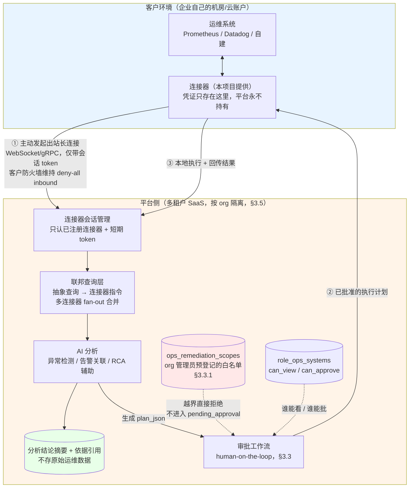
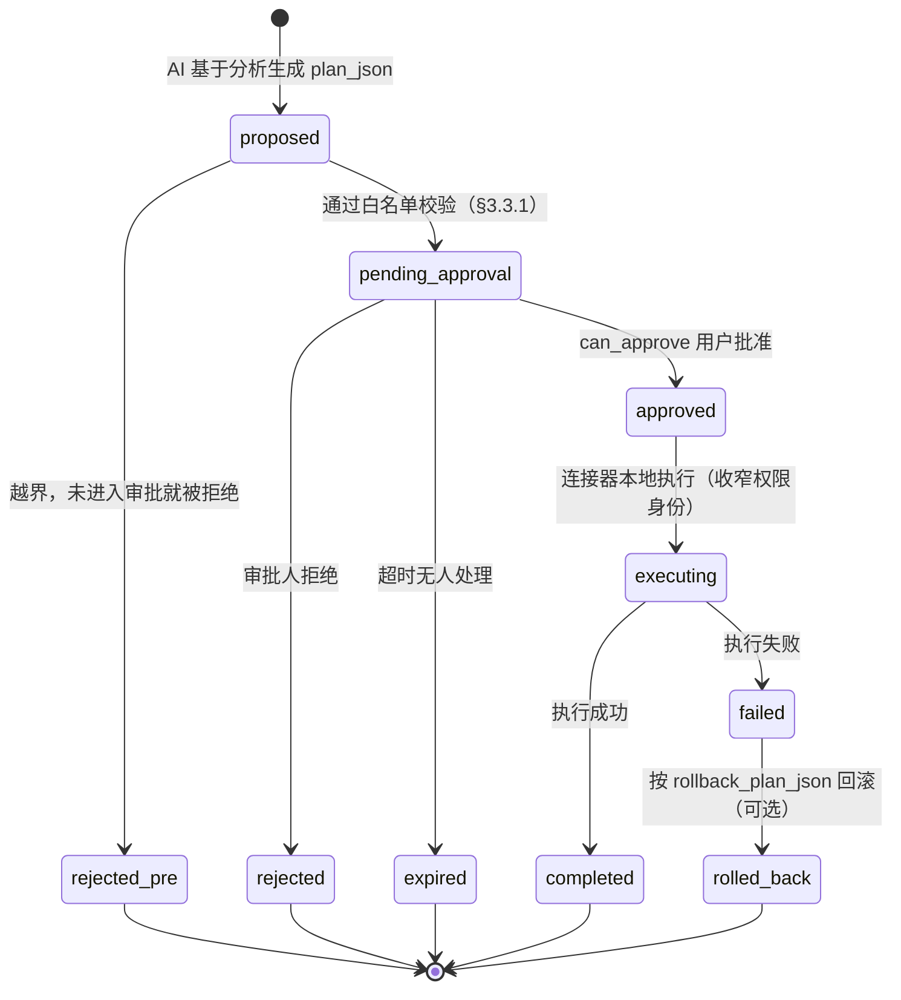

# 智能运维模块设计（AIOps Module）

> **状态：设计已确认（2026-08-26，用户批准）。已排期开工（2026-08-26 用户
> 明确要求，覆盖了本文件下面 ⑤ 那条"排期维持在 12 条 P0 之后"的原始决定——
> 那条决定本身没有作废，是这次被用户显式覆盖，如实记录不假装它从未存在）。
> **阶段一～四已实施**：数据模型 + 修复目标越界判定 + 审批状态机存储层
> （阶段一）、连接器/模块开关/修复范围白名单的管理面 API 端点（阶段二）、
> 提议/批准/拒绝的审批工作流端点、§3.3.1 越界拦截真正接线（阶段三）、
> BYOC 连接器协议（注册握手/心跳/refresh 轮换/重放检测/`ConnectorTransport`
> 实现，阶段四）+ §3.5 联邦查询层 + §3.6 工具注册（与另一会话并行开发，
> `claude/aiops-federation` 分支已合并）。三个运维工具已真正注册进 ReAct
> 工具子图（`create_app()` 实测工具数 6→9）。粗粒度门禁，已用真实
> Postgres + 真实 app 端到端验证（24 项，含真实 WebSocket），全量
> `tests/unit` 2314 条通过，见 `CLAUDE.md` §5。
> **LangGraph 接入已确认不需要新增结构（§10.2 已更正，2026-08-26）**：
> 三个运维工具走既有 `intent_type="tool"` + `tool_subgraph` 的
> `general_agent` 路由即可，原设计"新增 `intent_type="ops"` + `ops_subgraph`"
> 未实施、也不该实施，理由见 §10.2。同批顺带修复一个从未被跑通过的完全
> 阻塞 bug：运维工具 handler 一直期待 `tool_node` 注入 `org_id`，但那条
> 注入路径从未存在过，任何真实对话调用都会先撞"缺少调用方身份"，已改成
> 内部反查 `org_store.get_org_for_user(user_id)` 修复。
> `role_ops_systems` 细粒度权限、前端、真实 BYOC 连接器进程（客户环境
> 那一端）、审批超时扫描任务仍未实施。**当前阶段：零代码改动**这句话已经
> 不成立，改为"阶段一～四代码 + LangGraph 接入确认已落地并合并，其余阶段
> 未开工"。**
> 创建：2026-08-26　确认：2026-08-26　开工：2026-08-26
> **死期：2026-09-25**（若届时仍未排入实施队列，实施前必须重新核对行业现状与项目 P0 队列——
> 不是"确认过期"，设计已经定了，是"隔太久再启动要先确认时效性"这层含义）
> 触发：用户直接提出"新增智能运维模块，企业可接入自己的系统"需求，经调研后正式立项
> 调研依据：本次会话内对 2026 年 8 月 AIOps 功能模块/架构/多租户接入模式的网络调研（来源见 §9）
> 关键前提确认（2026-08-26，用户拍板，分两轮）：
> ① V1 范围含自动修复（执行动作）② 数据接入走 BYOC，平台不存储客户运维数据
> ③ 不复用已停用的委托模式（`http_api` 连接器），全新设计
> ④ 客户环境部署连接器的运维复杂度可接受 ⑤ **排期维持在 12 条 P0 之后**，不插队开发，
> 本文档现阶段只是设计确认，不代表立刻开工
> ⑥ V1 自动修复的执行指令白名单锁定为四类：重启服务/进程、扩容/缩容实例数量、
> 清理磁盘空间（日志/临时文件）、回滚到上一个部署版本——**这四类是 V1 唯一允许的动作类型，
> 不是示例**，用户额外提到"当前业界的常用功能"，处理为：这四类已覆盖调研中 AIOps
> runbook 自动化最常见的动作集合，**后续若要新增类型，需要走一次同样的设计确认，
> 不能在实施过程中悄悄扩展**（呼应 §8"明确不做的"那条边界）

---

## 零、三行决策

- **决策**：新增"智能运维模块"，允许企业客户接入自己的运维系统（监控/日志/告警平台），
  由 AI 做异常检测、告警关联降噪、根因分析（RCA）辅助，并在**人工审批后**执行修复动作；
  数据采用 BYOC（Bring Your Own Cloud）模式，平台不落库客户运维数据，
  分析与执行均通过部署在客户环境的连接器按需进行；不复用已停用的 `http_api` 委托模式。

- **理由**：
  ① 自动修复是这个模块相对"文档问答"的独特价值所在，但业界已有"无审批直接执行 → 多动作叠加 →
  级联故障"的真实事故，审批工作流因此是**不可分割的前置依赖**，不是后续迭代项；
  ② BYOC 从架构上直接消除"客户运维凭证/数据落在平台侧"这条攻击面，
  不是"加密存储"式的缓解，是"平台根本不持有"式的消除——这与本项目已经踩过的
  P1-9（租户连接器凭证明文存 Postgres）教训直接相关，此次要从架构上避免重蹈；
  ③ 委托模式的安全模型是为"只读连接企业自建知识库"设计的，
  新场景涉及"可能触发执行动作"这一质变的风险等级，带着历史包袱复用弊大于利。

- **作废 / 影响**：不取代任何现有设计（委托模式本就已废弃，不受影响）。
  影响面：需要新增审批工作流子系统、BYOC 连接器注册与心跳机制、
  权限模型新增"运维系统"维度（区分查看权限与审批权限）、
  `builtin_tools.py` 新增工具类别、`workflow.py` 可能新增审批等待节点、
  数据库新增至少 3 张表（见 §5），**涉及表结构变更，按 §7.1 规则必须走完整设计评审**。

---

## 一、背景：为什么现在做、做到什么程度

`CLAUDE.md` 当前阶段是"停止新增功能，先补设计"。这次是用户明确要求新增功能，
经确认后正式立项，**但"立项"在本文档体系里指"进入设计评审流程"，不等于"立刻插队开发"**——
是否要在现有 12 条 P0 清零之前就排期实施，需要用户在设计确认后**另行决定**，
本文档只交付到"设计 + 测试设计确认"这一步，不默认抢占排期。

调研结论（详见对话记录与 §9）：2026 年 AIOps 行业共识是四层能力递进
（告警关联降噪 → 根因分析 → 自动修复 → 预测性检测），根因分析正从单 LLM 转向多智能体分工，
自动修复普遍要求"human-on-the-loop"而非全自动，企业自带系统的多租户接入正在从
"探针上报到 SaaS 中心"转向 BYOC。

---

## 二、V1 范围（用户已确认）

| 能力 | V1 是否包含 | 说明 |
|---|---|---|
| 异常检测 | ✅ | 基于客户接入系统的指标/日志做基线偏离检测 |
| 告警关联/降噪 | ✅ | 多条告警合并为一个事件 |
| 根因分析（RCA）辅助 | ✅ | 生成可能根因与排查建议，**不代表最终结论**，仍需人工判断 |
| **自动修复（执行动作）** | ✅（用户已确认，**范围锁定四类**） | **前提是 §3.3 审批子系统先落地，硬性依赖，不可绕过**。仅限：重启服务/进程、扩容/缩容实例数量、清理磁盘空间（日志/临时文件）、回滚到上一个部署版本。四类之外一律不做，扩展需重新走设计确认 |
| 预测性容量检测 | ❌ | 明确排除，行业里也是相对次要的一层，先不做 |
| 客户环境无连接器时的兜底 | ❌ | V1 不做纯文本粘贴/上传式运维数据分析，只做连接器接入 |

---

## 三、架构设计

### 3.1 总体数据流

```
客户环境（企业自己的机房/云账户）
  ├─ 客户自己的监控/日志/告警系统（Prometheus/Datadog/自建...）
  └─ 【新增】轻量连接器进程（本项目提供，客户环境内部署）
         │  主动发起出站长连接（如 WebSocket/gRPC），凭证留在客户环境
         │  平台侧任何时候都不持有客户系统的原始凭证
         ▼
平台侧（本项目后端）
  ├─ 连接器会话管理（只认"已注册连接器 + 短期会话 token"，不认原始凭证）
  ├─ 分析请求：平台下发"要看哪些指标/日志"的只读查询指令 → 连接器在客户环境内执行查询 → 只把查询结果（不是原始凭证）回传
  ├─ AI 分析（异常检测/告警关联/RCA）：基于回传结果做推理，不落库原始运维数据，
  │  只落库"分析结论摘要 + 依据引用"（用于审计和可解释性，参考调研中"人工审批需要看数据血缘"这条要求）
  ├─ 【新增】审批工作流子系统（见 3.3）
  └─ 执行：平台下发"已批准的执行计划" → 连接器在客户环境本地执行 → 回传执行结果
```

**关键架构选择**：连接器是"客户环境主动出站连接平台"，不是"平台主动入站访问客户环境"。
这一点决定了平台侧永远不掌握原始凭证，是本设计对 BYOC 的具体落地方式，
比"调研文档里泛泛提到的 BYOC"更进一步——不只是"数据不落库"，是"凭证也不经过平台"。



### 3.2 BYOC 连接器模型

- 连接器是客户环境内的一个独立进程/容器，向平台注册时只交换"连接器身份 + 平台颁发的短期
  会话 token"，不上传任何客户系统的账号密码
- 连接器与客户自己的运维系统之间的凭证（如 Prometheus 的 basic auth、Datadog 的 API key）
  **只存在于客户环境内的连接器配置里，平台数据库不存储**
- 平台对连接器下发的是"查询意图"（如"过去 1 小时 CPU 使用率"），不是可执行的原始命令，
  降低连接器被劫持后平台可下发任意指令的风险面（具体指令白名单机制见 §7 待细化）
- 连接器离线/心跳超时的处理：分析请求应优雅降级为"数据不可用"，不能静默假装正常
  （这条直接对应本项目已经吃过的教训——`CLAUDE.md` 里注释声称的不变量最终被证伪，
  这次要求任何"连接器在线"的判断都必须来自实时心跳，不能缓存假设）

### 3.3 审批工作流（human-on-the-loop）—— V1 硬性前置依赖

状态机：`proposed → pending_approval → approved / rejected / expired → executing → completed / failed（→ rolled_back，可选）`



⚠️ **新增 `expired` 状态**（2026-08-26，参考 AWS Systems Manager Automation 的 `aws:approve`
超时机制补充）：`pending_approval` 不能无限期挂起——原设计漏了"没人审批会怎样"这条路径。
参考 AWS 的默认 7 天、可配置、上限 30 天的做法，本模块也应设可配置超时，超时后自动转
`expired`（而不是静默转 `approved` 或无限期挂起，两者都是事故源）。**具体超时时长留待实施阶段
配置**，本文档只锁定"必须有超时+必须显式进入 expired 状态"这条硬性要求。

### 3.3.1 目标粒度：硬编码 vs 可配置（2026-08-26 新增，参考 AWS Systems Manager Automation）

这不是"写死"和"可配置"的二选一，业界参照系统（AWS SSM Automation，成熟度高、案例充分）
用的是**分层模型**，本模块采用同样的分层：

| 层 | 是否可配置 | 具体做法 |
|---|---|---|
| **动作类型** | ❌ 硬编码，V1 锁定四类 | 重启服务/进程、扩容/缩容实例数量、清理磁盘空间、回滚部署版本。新增类型需重新走设计确认（见 §0⑥） |
| **目标参数** | ✅ 参数化，运行时由 AI 提议 | 如"重启哪个服务""扩容到多少实例"，这些是每次生成 `plan_json` 时的具体取值 |
| **目标取值范围** | ✅ 可配置，但由**企业管理员预先登记**，不是运行时任意值 | 类比 AWS 的 `allowedValues`/`allowedPattern`：AI 提议的目标必须落在管理员预先配置的白名单/边界内，否则**在进入 `pending_approval` 之前就应被拒绝**，不能指望审批人肉眼发现"AI 建议了一个不该碰的目标" |
| **执行身份权限** | ✅ 独立配置，但收窄 | 连接器在客户环境实际执行时，应使用**权限范围仅限于这四类动作**的专用凭证，不复用客户系统的管理员权限——这是审批通过之后的第二道闸，纵深防御 |

**每类动作对应的取值范围配置举例**（管理员为每个连接器 + 每种动作类型分别登记）：

| 动作类型 | 需要预先登记的约束 |
|---|---|
| 重启服务/进程 | 允许被重启的服务名单（枚举，不接受清单外的名字） |
| 扩容/缩容实例数量 | 上下界（如"不超过基线的 2 倍""不低于 1"），拒绝明显异常值（如"扩容到 10000"） |
| 清理磁盘空间 | 允许清理的路径模式（如仅限日志/临时目录），显式排除规则防止误删业务数据 |
| 回滚部署版本 | 允许回滚到的版本范围（如仅限最近 N 个已知良好版本），防止回滚到过老的不兼容版本 |

**谁能配置这份白名单**：这本身是高风险操作——配置错误的影响面比单次审批错误更大更持久
（一次审批错误影响一次执行，一份错误的白名单会持续影响此后所有次执行）。
建议**收紧为 org 管理员专属权限，不放进 §4 的 `role_ops_systems`（`can_view`/`can_approve`）
可选权限位**，避免与"日常审批权限"混淆。

审批视图必须展示（对应调研中 EU AI Act 驱动的审批要素清单，不能只是"批准/拒绝"两个按钮）：

| 字段 | 内容 |
|---|---|
| 意图 | 这个修复动作要解决什么问题 |
| 数据血缘 | AI 的判断基于哪些指标/日志/告警（引用到具体查询结果，不是原始全量数据） |
| 权限链 | 谁发起的分析、谁有权审批这个系统 |
| 影响半径 | 执行后会影响哪些服务/实例，是否可能有副作用。**⚠️ 2026-08-26 已确认：V1 没有接入服务拓扑/依赖关系数据，这个字段只能是 AI 基于有限信号（如近期告警关联模式）的定性推断，不是精确拓扑计算**。审批 UI 必须显式标注"AI 定性推断，非实时拓扑图，实际影响范围可能更大或更小"，**不允许把这一栏当成唯一决策依据**——真正的硬约束是下面 §3.3.1 的白名单范围。这条呼应 `CLAUDE.md` §4 已踩过的"跨主题数值幻觉"教训：没有真实数据支撑的结论，必须显式标注不确定性，不能让它看起来和白名单一样可信 |
| 回滚方案 | 执行失败或产生意外后果时如何撤销 |

**硬性不变量**：`executing` 状态只能从 `approved` 转移而来，且必须有
`approver_user_id + approved_at`；**这条不允许任何调试开关绕过**——
`CLAUDE.md` §4 已经有一条现成的教训（ACL 绕过的测试端点至今仍在生产代码里），
本模块从设计阶段就要求"没有绕过审批的后门"是可测试的不变量，不是文档里的一句承诺。

### 3.4 与现有 LangGraph workflow 的集成点

初步判断：智能运维应作为独立的 `intent_type`（类比现有 `rag`/`tool`/`workflow`/`clarify` 四分类，
或复用 `tool` 分支新增工具类别，待细化），涉及审批等待时**必须能挂起并在人工操作后恢复**，
这与现有单轮问答式的 workflow 图形态不同，**具体接入点需要在实施前单独设计**，
本文档只给出边界：不应该把审批等待做成"轮询数据库直到状态变化"这种简单实现，
否则会重蹈"检索链路每查询重建全套组件"的浪费模式。

### 3.5 查询架构：数据落在哪、怎么查（2026-08-26 新增，回应"到底是存本地还是存平台"这个问题）

**先澄清一个容易误解的二选一**：不是"数据存客户本地"或"数据存运营方统一数据库"两选一，
准确的说法是——**客户的原始运维数据（日志/指标/告警）始终留在客户自己的系统里，
平台侧只维护"查询定义"和"分析结论摘要"，不维护原始数据的副本**。这是 §3.2 BYOC 原则的具体化，
业界最直接的参照是 **Grafana**：Grafana 本身不存储数据，它是一个连接到外部数据源
（Prometheus/Loki/云厂商等，官方支持 170+ 种）的查询与可视化层，查询在用户打开面板时
实时执行（[Grafana 文档](https://grafana.com/docs/grafana/latest/datasources/)）。
本模块的定位与此一致：平台是"联邦查询层"，不是"数据仓库"。

**平台侧查询怎么设计**（联邦查询层，Federation Layer）：

1. 用户在平台 UI 上发起分析请求（如"过去 1 小时 order-service 的错误率"），
   这是一个**抽象查询**，不直接暴露底层是 Prometheus 还是 Datadog
2. 联邦查询层把抽象请求翻译成"目标连接器 + 具体查询意图"，通过已建立的出站会话下发给对应连接器
   （见 §3.2，平台不持有客户系统凭证，连接器本地翻译成 PromQL/Datadog API 调用等原生查询）
3. **多连接器 fan-out**：如果客户同时接了多个系统（如 Prometheus + 自建日志平台），
   联邦查询层要能并行查询多个连接器、合并结果后统一展示——参照 Grafana 跨集群联邦查询
   "查询表现得像单一数据源，背后是多个源分别执行后拼起来"的模式
   （[Grafana Enterprise 文档](https://grafana.com/docs/enterprise-metrics/latest/manage/cluster-query-federation/)）
4. **部分失败必须显式呈现**：一个连接器超时/离线，不能让整个分析请求失败或静默丢弃那部分数据——
   UI 上要明确标注"来自 XX 系统的数据不可用"，这与 §3.2 的"连接器离线时不能假装正常"是同一条原则的延伸

**网络安全姿态（新增论据，2026-08-26）**：§3.2 原来只强调连接器模式"平台不持有凭证"，
这次调研补了一条同样重要但此前没写的收益——**反向隧道架构下，客户环境的防火墙可以维持
"deny-all inbound"，不需要为了这个功能开放任何入站端口**，因为连接器只发起出站连接
（[2026 数据主权架构综述](https://wolyra.ai/data-residency-2026-architecture-audit/)）。
这是企业 IT 安全评审时会直接问到的一条，比"不存凭证"更容易在采购对话里讲清楚。

**用户视角**：用户不需要感知"数据其实在自己企业的系统里"这件事的复杂性——
交互体验应该和查询平台自己的数据一样简单（选服务、选时间范围、看结果），
联邦查询的路由、翻译、合并全部对用户透明，复杂度留在平台侧。

**缓存边界（必须现在画清楚，不能留到实施时再决定）**：
允许极短 TTL（如 30–60 秒）的内存级缓存，用于避免同一个大屏面板重复渲染时频繁重新拉取；
**不允许持久化存储、不允许跨会话保留、不允许写入数据库**。这条要现在写死，
不是因为不信任实施阶段，而是本项目已经有过反面教训——BM25 索引的"无缓存导致每次全量加载"
和"内存缓存策略"两难本可以在设计阶段说清楚，结果留到实施后期才发现要返工
（`docs/scale_slo_and_priorities.md` §1.4/§6.1）。这次提前画界，避免同样的返工。

### 3.6 工具注册

新增工具类别接入 `builtin_tools.py` 的既有模式（如 `query_ops_system`、
`propose_remediation`、`execute_approved_remediation`），**执行类工具必须在工具层强制检查
审批状态**，不能只依赖上游节点"应该已经检查过"这种隐式假设——这类隐式假设正是
`workflow.py` 那条被证伪的并发注释导致 P0 长期未被发现的同一类错误。

---

## 四、权限模型扩展（不改 `CLAUDE.md` §3，待实施后回填）

现有模型：角色（`roles`）携带 `role_collections`，一个用户一个角色。

拟议扩展：新增 `role_ops_systems` 关联表，类比 `role_collections`，但**拆成两个权限位**
而不是一个：

| 权限位 | 含义 |
|---|---|
| `can_view` | 能看到这个运维系统的分析结果 |
| `can_approve` | 能审批这个运维系统上的修复动作 |

**拆分理由**：知识库场景"能查看=能查看"是单一维度，但运维执行动作的风险等级更高，
业界"human-on-the-loop"的审批人通常应该比日常查看分析结果的人范围更窄——
这是运维场景与知识库场景的本质区别，权限模型不能直接照搬 `role_collections` 的单维度设计。

⚠️ 这条会实质改变 `CLAUDE.md` §3.1/§3.2 描述的权限模型，**按 §7.1 规则，
真正开始实施前必须先更新 §3 并等用户确认**，本文档现在只是提案。

### 4.1 平台管理员的角色（2026-08-26 新增，回应"超级管理员要不要管这个模块"）

企业内部的运维分析/审批全部归企业管理员（`org_admin`），但平台管理员（`super_admin`）
不是完全不参与，只是参与的东西不一样——查过代码后确认，本项目已经有一个可以直接照搬的
先例：`admin_gateway_connectors`（"网关监控"API，仅平台管理员可见）把所有企业的外部连接器
横向列出来，展示**存活状态、调用次数、失败次数**，但完全不碰连接器背后的实际数据内容。

| 平台管理员需要的 | 平台管理员不应该有的 |
|---|---|
| 全平台 `ops_system_connections` 健康监控（在线/离线、心跳新鲜度）——照搬网关监控的模式，用于 SaaS 自己的运维支持排查 | `remediation_actions` 的 `intent`/`plan_json`/`result` 内容 |
| **模块开通开关**（见下） | `ops_analysis_summaries` 分析结论 |
| | 配置 `ops_remediation_scopes`、审批任何修复动作 |

**新增：模块开通开关**（2026-08-26 用户确认，需要）——智能运维模块按企业分级开通，
只有"高级"客户能用，不是全量开放：

- 新字段 `organizations.aiops_module_enabled`（布尔，默认 `false`）——`organizations`
  表目前只有 `is_platform` 这一个布尔标记（`org_store.py`），没有任何"套餐/层级"概念，
  这是新引入的第一个按企业分级的开关，不是复用什么现成机制
- **只有 `super_admin` 能切换这个开关**，企业管理员看不到、改不了
- 强制点必须落在两处，不能只做前端隐藏：
  1. 后端：AIOps 模块的每个入口（连接器注册、查询、审批相关端点）在最前面检查
     `org.aiops_module_enabled`，未开通一律拒绝——参照 `CLAUDE.md` §3.2 现有的
     分层隔离图，这是叠加在角色/ACL 校验**之前**的新一层，不是替代
  2. 前端："运维塔台"的导航入口本身要按这个开关决定显示与否，避免客户看到一个
     点了没反应的功能入口

⚠️ **本条只是引入了开关本身，"高级"具体对应什么定价/套餐层级是产品/商业问题，
不在这次技术设计范围内**，先只做布尔开关，不做多级套餐。

---

## 五、数据模型（新表草案，需要 migration）

| 表 | 关键字段 | 说明 |
|---|---|---|
| `ops_system_connections` | `id, org_id, name, system_type, connector_status, last_heartbeat_at, created_by, approval_timeout_minutes（2026-08-26 新增，默认 30，范围 5–1440，见 §10.4）` | **不含任何凭证字段**——这是刻意的架构约束，不是遗漏 |
| `role_ops_systems` | `role_id, ops_system_connection_id, can_view, can_approve` | 类比 `role_collections`，但拆两个权限位 |
| `remediation_actions` | `id, org_id, ops_system_connection_id, proposed_by, intent, plan_json, impact_radius, status, approver_user_id, approved_at, executed_at, result, rollback_plan_json, outcome_effective（2026-08-26 新增，布尔可空，事后人工标注，见 §10.5）` | 核心审批工作流表 |
| `ops_analysis_summaries`（待定名） | `id, org_id, ops_system_connection_id, summary, evidence_refs_json, created_at` | 只存"分析结论摘要+依据引用"，**不存原始运维数据**，对应 BYOC 原则 |
| `ops_remediation_scopes`（2026-08-26 新增） | `id, org_id, ops_system_connection_id, action_type, scope_config_json, configured_by, updated_at` | 每个连接器针对四类动作类型分别登记的取值范围约束（§3.3.1），`action_type` 限定为四个枚举值；`configured_by` 必须是 org 管理员 |

**明确不做的**：不建长期存储客户原始日志/指标的表。如果实施后发现分析质量需要历史数据支撑，
这是一个需要重新走设计评审的决策，不能在实施过程中悄悄加一张"缓存表"绕过 BYOC 原则。

---

## 六、测试设计（与设计方案一起交付，§7.1 要求）

| 测试项 | 验证什么 | 参照 |
|---|---|---|
| 跨租户隔离 | `ops_system_connections` 的 org 归属 + ACL 收敛，能否复制 §3.3 已验证的知识库隔离方法 | `CLAUDE.md` §3.3 |
| 凭证不落库 | 静态检查 `ops_system_connections` 表结构不存在凭证类字段；集成测试模拟"平台数据库整体泄露"场景，确认拿不到任何客户系统凭证 | 对应 P1-9 教训 |
| 审批状态机非法跳转 | `proposed`/`pending_approval` 状态下**任何路径**都不能进入 `executing`，必须显式测试"跳过审批"这条路径被拒绝，而不是只测正常路径 | 对应 §4 已知的 ACL 绕过端点教训 |
| 审批绕过后门排查 | 代码里不存在类似 `RAGENT_DEBUG` 一键跳过审批的开关；如确有调试需求，必须有独立于生产开关的机制且默认关闭 | 对应 `CLAUDE.md` §4 第 4 条现存教训 |
| 并发审批竞态 | 两个有 `can_approve` 权限的用户同时点批准/拒绝，只能有一个生效，**必须用真并发测试**，不能串行跑 N 次代替 | 对应 §7.2"并发缺陷必须用并发方式验证" |
| 连接器离线降级 | 心跳超时后，分析请求应显式返回"数据不可用"，不能返回陈旧缓存结果冒充实时数据 | 对应 3.2 |
| 联邦查询部分失败（2026-08-26 新增） | 多连接器 fan-out 时，一个连接器超时/离线不能拖垮或污染其余连接器的结果，UI 必须显式标注哪部分数据不可用 | 对应 §3.5 |
| 缓存不落库（2026-08-26 新增） | 静态检查联邦查询结果的缓存实现只能是内存级、有 TTL 上限，不存在写入数据库/磁盘的路径 | 对应 §3.5 缓存边界 |
| 回滚方案可执行性 | 执行失败时，`rollback_plan_json` 描述的动作至少能被验证结构合法（不要求真实回滚演练，但要求格式/字段完整性检查） | 新增 |
| 目标越界拒绝（2026-08-26 新增） | AI 提议的目标超出 `ops_remediation_scopes` 登记的白名单/边界时，**必须在进入 `pending_approval` 之前就被拒绝**，不能流到审批人那一步才依赖人肉发现；四类动作各构造一条越界用例（清单外服务名/超上界的扩容数量/清单外路径/超范围的回滚版本） | 对应 §3.3.1 |
| 审批超时过期（2026-08-26 新增） | `pending_approval` 超过配置时长无人处理，必须自动转 `expired`，不能无限期挂起，也不能静默转 `approved` | 对应 §3.3 |
| 白名单配置权限收紧 | 只有 org 管理员能写 `ops_remediation_scopes`，`can_approve`/`can_view` 权限不应能修改白名单 | 对应 §3.3.1 |
| 排除规则优先级（2026-08-26 新增） | `clean_disk` 场景下同时匹配 `allowed_path_patterns` 和 `excluded_path_patterns` 的路径，必须按排除规则拒绝，构造一条显式覆盖两者的用例 | 对应 §10.3 |
| refresh_token 重放检测（2026-08-26 新增） | 已消费的 `refresh_token` 被再次使用时，必须视为泄露信号并强制该连接器重新注册，不能静默放行 | 对应 §10.1 |
| 超时边界（2026-08-26 新增） | `approval_timeout_minutes` 配置超出 [5, 1440] 范围时应被拒绝，不能存入超出边界的值 | 对应 §10.4 |
| 模块开通开关（2026-08-26 新增） | `aiops_module_enabled=false` 的企业访问任意 AIOps 端点一律拒绝，且拒绝发生在角色/ACL 校验之前；企业管理员本身不能修改这个开关（只有 `super_admin` 能） | 对应 §4.1 |

> **本次未覆盖的范围**：连接器进程本身的安全加固（如何防止连接器被篡改后向平台发送伪造数据）、
> 执行指令白名单机制的具体设计、多个运维系统类型（Prometheus/Datadog/自建 API）各自的适配层细节，
> 这些留待实施阶段的详细设计，本文档只覆盖架构级别的决策与测试骨架。

---

## 七、风险与未决问题

1. ✅ **已确认**：客户环境部署连接器的运维复杂度可接受（2026-08-26 用户确认），
   BYOC 方案的可落地性前提成立
2. ✅ **已确认**：V1 维持含自动修复，但范围锁定为四类（见 §0 ⑥、§2），
   不是开放式"仅分析建议 vs 全量自动修复"的二选一，是介于两者之间的收窄方案
3. ✅ **已确认（2026-08-26，参考 AWS Systems Manager Automation 补充调研）**：目标粒度采用
   分层模型——动作类型硬编码（四类）、目标参数由 AI 运行时提议、**取值范围由 org 管理员
   预先登记的白名单/边界约束**，AI 提议越界即在进入审批前被拒绝，执行身份额外收窄权限。
   详见 §3.3.1、§5 `ops_remediation_scopes` 表、§6 新增的三条测试。
   ⚠️ **仍未定的细节**：管理员配置这份白名单的具体 UI/API 形态、`scope_config_json` 每种
   动作类型的字段 schema——这些留给实施阶段，本文档只锁定"必须有、必须在审批前拦截、
   必须权限收紧到管理员"这三条硬性要求
4. ✅ **已确认**：排期维持在 12 条 P0 之后（2026-08-26 用户确认），不插队开发。
   本文档到此为止是"设计已确认"，**不等于"已排期开工"**——具体何时进入实施队列，
   需要在 P0 清零节奏明确后另行安排

---

## 八、明确不做的（V1 边界）

- 预测性容量检测
- 无连接器的手工粘贴式运维数据分析
- 平台侧存储客户原始运维数据（日志/指标/告警原文）
- 跳过审批的"快速执行"通道，即便是低风险动作也不例外——一旦开这个口子，
  "低风险"的判断标准会不断被放宽，这是本文档刻意画的一条线

---

## 九、与成熟大厂 AIOps 系统对标——差距与取舍（2026-08-26 新增）

对照 Dynatrace×ServiceNow、AWS Systems Manager Automation、以及行业 NOC/AIOps 通用实践
（来源见 §10）做的一次逐项核对，找出本设计相对成熟系统的差距，逐条给出取舍而不是笼统承认"不如大厂"。

### 9.1 设计缺口（已处理）

| 缺口 | 处理方式 |
|---|---|
| "影响半径"字段没有拓扑数据支撑 | 见 §3.3 表格更新：明确标注为定性推断，不能单独作为审批依据 |
| 审批超时无定义 | 见 §3.3：新增 `expired` 状态 |
| 目标粒度硬编码/可配置未定 | 见 §3.3.1：分层模型（类型硬编码/参数运行时提议/取值范围管理员预登记） |

### 9.2 明确排除的 V1 范围（行业常见，但本次不做，写清楚理由，防止后续悄悄夹带）

| 能力 | 大厂现状 | 为什么 V1 不做 |
|---|---|---|
| 多级 on-call 升级链路（escalation policy） | 主流平台标配：审批人超时未处理，自动升级给下一级，而不是直接过期 | V1 只有"超时→`expired`"，没有"升级给下一位"。理由：升级链路依赖组织的 on-call 排班体系，本项目目前没有这个概念，引入它是另一个不小的设计，留到 V2 |
| SLO / 错误预算管理 | SRE 标准实践，错误预算耗尽触发变更冻结 | 本模块目标是"分析+审批后修复"，不是完整 SRE 平台。引入 SLO 概念会显著扩大范围，超出这次立项讨论的边界 |
| ChatOps 集成（Slack/飞书/企业微信内直接审批） | 主流做法，缩短响应时间 | V1 审批只在平台自己的界面完成，多一个审批入口意味着多一套权限同步和身份映射，风险面直接翻倍，先不做 |
| 事后复盘（postmortem）聚合视图 | 成熟平台标配，用于"这次修复有没有真正解决问题、下次怎么改进" | V1 有单次执行记录（`remediation_actions`），但没有"事件时间线"聚合和复盘工作流。这不是拍脑袋省略——没有这个视图，本模块的"自动修复到底有没有用"将无法被回顾评估，是一条**真实的遗留风险**，建议 V2 优先补 |
| 资产清单自动发现（CMDB 式拓扑发现） | 生产级 AIOps 的标配前提 | V1 的白名单（`ops_remediation_scopes`）完全依赖管理员手工登记。**已知风险**：服务改名/下线后白名单未同步更新，会导致合法操作被拒绝，或更坏——旧名字被新服务复用后误配对旧白名单权限。这条风险目前没有缓解手段，只能标注 |

### 9.3 悬而未决：本模块自身的效果度量（不属于设计缺口，是遗漏，需要用户决定要不要现在补）

行业基准（见 §10）：AIOps 部署得当可使告警量降低 90–95%、MTTR 改善 40–58%。
**本设计文档目前完全没有为"这个模块本身有没有效"定义任何验收指标**——
这和 `CLAUDE.md` §7.2"没有度量，后面所有优化都是盲改"的既有共识直接冲突。
建议在真正排期实施前，单独定一版"V1 验收标准"（比如：告警合并率、审批通过率、
误报率），但**这不是本次设计评审的范围**，先如实记录这个空白，不在这里下结论。

---

## 十、排期前的设计细化（2026-08-26 第二轮，不写代码）

用户已确认"维持排期在 12 条 P0 之后，先补设计缺口"。以下六项是排期前必须定案的细节，
逐项给出结论；仍标"待实施阶段"的地方如实标注，不假装已经想清楚。

### 10.1 连接器通信协议

**传输层**：WebSocket，不用 gRPC——项目现有代码已经有 trace WebSocket 的先例
（`CLAUDE.md` §4 第 4 条提到的那个，虽然它本身是个安全教训，但说明这条技术路线在
本项目栈里是熟悉的，不需要新引入 gRPC 依赖）。

**注册流程**：
1. org 管理员在"连接器管理"页生成 `register_token`（一次性，10 分钟有效，高熵随机值，
   平台只存哈希不存明文）
2. 客户环境的连接器进程用这个 token 向 `wss://.../ops/connector/register` 发起握手
3. 平台校验通过后签发一对令牌：`connector_session_token`（JWT，作用域限定到单个
   `ops_system_connection_id + org_id`，TTL 1 小时）+ `refresh_token`（TTL 30 天，
   **单次使用即轮换**——每次刷新消费掉旧的、发一个新的，如果检测到一个已消费的
   `refresh_token` 被重复使用，视为泄露信号，强制该连接器重新走注册流程）
4. 心跳：连接器每 10 秒发一次 `heartbeat` 帧，平台更新 `last_heartbeat_at`
5. 吊销：管理员点"吊销"，立即失效两个 token、断开连接，需要重新注册

**消息信封**（所有帧统一结构）：
```json
{ "type": "heartbeat | query_request | query_result | exec_request | exec_result | error",
  "id": "消息关联 id",
  "connector_id": "...",
  "ts": "...",
  "payload": { /* 按 type 区分 */ } }
```

⚠️ **待实施阶段的可选加固（非 V1 硬性要求，先记录不展开）**：连接器本地也缓存一份
白名单副本、执行前本地二次校验——这是纵深防御，即便平台被攻破也多一道闸，
但会引入"平台配置怎么同步给连接器"这个新的一致性问题，V1 先不做，留作 V2 候选。

### 10.2 LangGraph workflow 接入点

**核心判断**：审批等待可能是几分钟到几天（参照 AWS SSM 默认 7 天），而现有 LangGraph
图是为"一次问答几秒到十几秒"设计的（`architecture.md` §3.2 的耗时数据）。
**硬把审批等待塞进一次对话请求的生命周期，本身就是错误方向**——不是"轮询数据库效率低"
这么简单，是审批的时间尺度和对话请求的生命周期根本不是一回事。

**设计**：拆成两条独立链路，不共享生命周期：

- **触发链路**（在 LangGraph 里）：新增 `intent_type = "ops"`，走一个新的 `ops_subgraph`
  （类比现有 `tool_subgraph`）。这个子图只做："接收请求 → 联邦查询 → AI 分析 →
  写入一条 `proposed`/`pending_approval` 的 `remediation_actions` 记录 → 回复用户
  '已生成待审批建议，可在运维塔台查看'"，然后这次对话请求正常走
  `generate → memory_manage → archive` 结束。**不等审批结果**。
- **审批/执行链路**（完全在 LangGraph 之外）：审批人在"运维塔台"UI 里点批准/拒绝，
  是普通的 REST/WS API 调用，直接改 `remediation_actions` 状态；批准后的执行是一个独立的
  后台任务，结果写回该记录，**不反馈进原始那次对话的 session**。

⚠️ **新增 `intent_type` 是结构性改动，不是加一个枚举值就完事**——项目已经有过一次教训
（`CLAUDE.md` §4 P1 提到的"闲聊路由"问题，根因之一正是"`_INTENT_CLASSIFY_RULES` 四个桶
没有第五类"，补类目要同时改 `IntentDetectionResult` 的 `Literal`、`_route_after_intent`、
新增生成节点）。这条在实施阶段要按同样的重量级对待，不能想当然。

⚠️ **2026-08-26 实施后更正：上面"触发链路"那条新增 `intent_type="ops"` 的设计
没有落地，也不该落地——现有 `intent_type="tool"` + `tool_subgraph` 的既有机制
已经覆盖了它想解决的问题，补新类目反而是不必要的结构性改动。**

- **决策**：三个运维工具（`query_ops_system`/`propose_remediation`/
  `execute_approved_remediation`）就注册进现有 `ToolRegistry`（已完成，见
  `src/ops/tool_registration.py`），走既有的 `intent_type="tool"` 分类，
  不新增 `intent_type="ops"`、不新增 `ops_subgraph`。
- **理由**：核对 `src/tool_agent/subgraph.py::supervisor_node` 的路由逻辑
  发现，不属于 `RETRIEVAL_TOOLS`/`ACTION_TOOLS` 的工具（运维三个工具都不在
  这两个集合里）会落到 `else` 分支——只要同一次请求里 `RETRIEVAL_TOOLS` 和
  `ACTION_TOOLS` 各自都至少有一个工具可用（正常部署下 `query_knowledge_hub`
  和 `check_workflow_status`/`resubmit_workflow` 通常都已初始化），就会
  路由到 `general_agent`（"协调 Agent"），而 `general_agent` 本来就"可以
  根据需要综合使用检索类和执行类工具"、拿到的是**全部**可用工具，运维三个
  工具天然在列。也就是说"接收请求 → 决定要不要调运维工具 → 调用"这条链路，
  ReAct 循环里已经有了，不需要另起一个子图重新实现一遍"要不要调用工具"的
  判断——那正是 `tool_subgraph` 已经在做的事。上面设想的"触发链路"三步
  （联邦查询 → AI 分析 → 写入 proposed 记录）本质就是 LLM 依次调用
  `query_ops_system` 再调用 `propose_remediation` 这两个工具，ReAct 循环
  天然支持多步工具调用，不需要专门编排。
  "审批/执行链路"（REST/WS API + 独立后台任务，不反馈进原始对话 session）
  这部分设计**依然成立且已落地**（阶段二/三/四的管理面端点 + BYOC 协议），
  没有被这次更正推翻的是这一半。
- **作废**：本节"触发链路"里"新增 `intent_type = 'ops'`，走一个新的
  `ops_subgraph`"这句设计描述作废。**影响面**：无代码影响（这条设计从未
  被实施，`IntentDetectionResult.Literal` 至今仍是四类，没有改过）。
- **仍需要 LangGraph 层面确认的**：这条决策依赖"正常部署下 KB 检索工具和
  工作流工具都已初始化"这个前提——如果某个企业只开通了智能运维模块、没开
  知识库检索也没开工作流（`RETRIEVAL_TOOLS`/`ACTION_TOOLS` 在那次请求里
  都为空集），`supervisor_node` 的 `else` 分支同样会落到 `general_agent`
  （`has_action=False` 且 `has_retrieval=False` 也满足 `not (has_action and
  not has_retrieval)` 和 `not (has_retrieval and not has_action)`，两个
  `elif` 都不命中，照样落到 `general_agent`），运维工具依然可见——**已用
  这条分支逻辑本身复核过，不依赖"正常部署"这个前提也成立**，唯一会让运维
  工具从 `general_agent` 视野里消失的情形是"该次请求里只有 `RETRIEVAL_TOOLS`
  没有 `ACTION_TOOLS`"或反过来（这时会退化路由到 `retrieval_agent`/
  `action_agent`，二者的可用工具集合按 `category` 过滤，运维工具被排除在
  外）——这在当前的工具注册配置下（`register_builtin_tools` 一次性注册
  全部能力）不会发生，但如果将来某个部署形态允许"只挂知识库检索、不挂
  工作流"这种更细粒度的能力裁剪，需要重新核对这条分支。

### 10.3 `scope_config_json` 字段 schema

```json
// action_type = "restart_service"
{ "allowed_targets": ["order-service", "payment-gateway"] }

// action_type = "scale_instances"
{ "min_instances": 1, "max_multiplier_of_baseline": 2.0 }

// action_type = "clean_disk"
{ "allowed_path_patterns": ["/var/log/app/*.log"],
  "excluded_path_patterns": ["/var/lib/postgresql/*"] }

// action_type = "rollback_deployment"
{ "max_versions_back": 5 }
```

⚠️ **一条容易被实现时凭直觉搞错的边界条件，现在写清楚**：`clean_disk` 里如果一个路径
同时匹配 `allowed_path_patterns` 和 `excluded_path_patterns`，**排除规则优先生效**，
不是"先匹配到哪条算哪条"。这条必须写进实施阶段的单测，不能靠代码 review 肉眼发现。

### 10.4 审批超时时长

**不采用 AWS SSM 的 7 天默认**——那是面向通用变更管理场景，本模块面向的是"服务正在报错"
这类时效性场景，参照运维塔台大屏里"12 分钟后超时"的示例设定：

| 项 | 值 |
|---|---|
| 默认超时 | 30 分钟 |
| 可配置范围 | 5 分钟 – 24 小时 |
| 配置粒度 | 按 `ops_system_connection` 配置（新增字段 `approval_timeout_minutes`，见 §5 更新） |

下界 5 分钟是为了给审批人留出看完"数据血缘"这些字段的时间（§3.3 审批视图要求），
太短等于形同虚设；上界 24 小时是为了避免"设置了超时但形同虚设"。

### 10.5 V1 验收指标（回应 §9.3 的遗留空白）

**态度**：V1 阶段的目标是"能测量"，不是"达到某个具体数字"——不照抄大厂 90–95% 告警降噪、
40–58% MTTR 改善这两个数字当 V1 目标（那是成熟部署的结果，拿来当早期目标等于自证失败）。

| 指标 | 计算方式 | V1 目标 |
|---|---|---|
| 告警合并率 | 1 − 合并后事件数 / 原始信号数 | 不预设数字，先测量建立基线 |
| 审批处理及时率 | (approved+rejected) / (approved+rejected+expired) | 不预设，若 expired 占比高，说明超时设置或流程有问题，需要回来重新调 §10.4 |
| 执行成功率 | completed / (completed+failed) | 不预设 |
| 事后有效性 | 见下方新增字段 | 不预设 |

⚠️ **新发现的小缺口**：`approve`/`reject` 只反映"要不要执行"，不等于"AI 判断对不对"——
审批人可能因为流程原因拒绝一个其实正确的建议，也可能批准执行但事后发现没真正解决问题。
建议给 `remediation_actions` 加一个轻量反馈字段 `outcome_effective`（布尔，可空，
表示"事后看这次修复是否真的有效"，人工在时间线上补标即可，不需要完整 postmortem
工作流才能测这个指标）——这是 §9.2 那条"事后复盘遗留风险"里最小可行的一步，
不等于把整个 postmortem 聚合视图搬进 V1。

### 10.6 权限模型回填 `CLAUDE.md` §3 —— 草稿（2026-08-26 修订，对齐既有角色机制）

> ✅ **本节草稿已于 2026-08-26 实施**，内容与实际代码一致，见 `CLAUDE.md` §5
> 对应条目（`ops_store.py::get_ops_permission`/`viewable_connection_ids_for_user`/
> `set_role_ops_permission` + `app.py` 的 `/api/v1/admin/roles/{role_id}/
> ops-permissions/{connection_id}` 端点）。下面这份草稿的内容原样成立，
> 不再是"待确认"状态。

⚠️ **第一版草稿有问题，已修正**：原草稿用"org 管理员"这个模糊说法，
没有落到系统里已经存在的具体机制上。查代码（`role_store.py`）后确认两件事：

1. **`ROLE_ORG_ADMIN`（`"org_admin"`，企业管理员）是已存在的系统角色**，
   且它对 `role_collections` 是**通配符**处理——"企业管理员=企业内全部知识库"，
   不需要逐条授权（`role_store.py:400-419`）。`role_ops_systems` 必须复用同一个角色、
   保持同样的通配符语义，不能各判各的，否则实施时大概率会长出两套不一致的判定逻辑。
2. **既有规则：`role_collections` 从来不会给 `super_admin`（平台管理员）挂关联**——
   平台侧运营人员默认看不到任何客户知识库内容，连配置入口都没开
   （`role_store.py:20`）。**这条必须原样搬到运维模块，而且比知识库场景更要紧**：
   运维模块涉及"批准执行动作"，如果平台管理员默认能看到/审批客户的修复请求，
   爆炸半径比"看到知识库内容"大得多。原草稿完全没提这条，是一个真实遗漏。

按 §7.4 的规矩，`CLAUDE.md` §3 只描述"已经实现的现状"，本模块还没排期实施，
**现在不能把这段写进 §3 本体**。修正后的草稿先放在这里审内容，等真正开工实施时再正式合并：

> **拟议追加到 §3.1 权限模型**：角色除了携带 `role_collections`（知识库权限），
> 还可携带 `role_ops_systems`（运维系统权限），拆分为 `can_view`/`can_approve`
> 两个独立权限位——运维审批的风险等级高于知识库查看，因此审批权限的收紧范围
> 应比查看权限更窄。**`org_admin` 对 `role_ops_systems` 同样是通配符**：
> 企业管理员自动拥有本企业内全部运维系统连接的 `can_view` + `can_approve`，
> 不需要逐条授权，与 `role_collections` 的既有语义保持一致。
> **`super_admin` 不自动拥有任何客户 `ops_system_connections` 的访问权**，
> 与"`role_collections` 从不给 `super_admin` 挂关联"这条既有规则对齐，
> 没有入口配置，不是留白。运维修复白名单配置（`ops_remediation_scopes`）
> 只有持有 `org_admin` 角色的用户可写，判定依据是 `ROLE_ORG_ADMIN in 用户角色集合`，
> 不进入 `role_ops_systems` 的可选权限位、不可通过自定义角色委托，
> 避免与日常审批权限混淆。

这份草稿现在需要你确认的是内容准不准确，不是"要不要写进 §3"（那要等排期）。

---

## 十一、参考

- 本次会话内网络调研（AIOps 功能模块/架构/2026 年厂商动向/BYOC 多租户接入模式）
- [AWS Systems Manager Automation](https://docs.aws.amazon.com/systems-manager/latest/userguide/systems-manager-automation.html)、
  [`aws:approve` 超时机制](https://docs.aws.amazon.com/en_en/systems-manager/latest/userguide/automation-action-approve.html)、
  [Scoped IAM Role 执行](https://docs.aws.amazon.com/managedservices/latest/userguide/sys-man-runbook.html)——
  §3.3/§3.3.1 目标粒度分层模型的主要参照
- [Dynatrace × ServiceNow 自动修复集成](https://www.dynatrace.com/news/blog/leveraging-servicenow-dynatrace-to-automate-incident-management-and-problem-remediation-2/)、
  [ServiceNow 2026 AIOps 现状](https://www.judge.com/resources/blogs/servicenow-roi-in-2026-the-cio-cto-playbook-for-aiops-kpis-platform-consolidation/)
  （71% 企业已部署 AIOps，仅 36% 能稳定自动化修复，印证本模块采用保守范围的合理性）
- `CLAUDE.md` §3（现有权限与多租户隔离模型）、§4 第 4/6/7 条（现有安全与委托模式相关教训）
- `docs/scale_slo_and_priorities.md` §5.2（已验证的知识库多租户隔离方法，本设计的跨租户测试参照对象）
- §9 对标补充调研：
  [拓扑/依赖图与 SLO/错误预算/on-call/ChatOps/postmortem 综述](https://aiopsschool.com/blog/runbook/)、
  [SRE Handbook 2026：SLO/错误预算/Runbook](https://techbytes.app/posts/sre-handbook-2026-slos-error-budgets-incident-runbooks/)、
  [NOC 大屏与告警降噪行业数据（90–95% 降噪、40–58% MTTR 改善）](https://www.inoc.com/blog/noc-best-practices-10-ways-to-improve-your-operation)
- §3.5 查询架构补充调研：
  [Grafana「不存储数据」的查询/可视化层架构](https://grafana.com/docs/grafana/latest/datasources/)、
  [Grafana 跨集群联邦查询](https://grafana.com/docs/enterprise-metrics/latest/manage/cluster-query-federation/)、
  [反向隧道架构与 deny-all 防火墙姿态](https://wolyra.ai/data-residency-2026-architecture-audit/)
