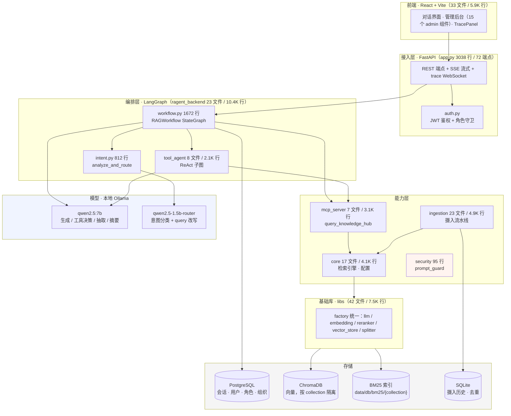
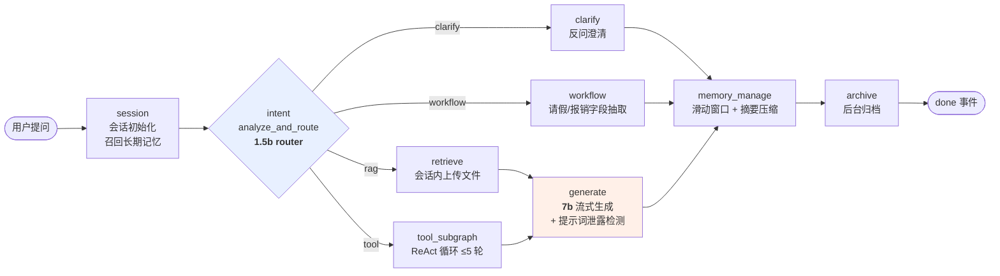
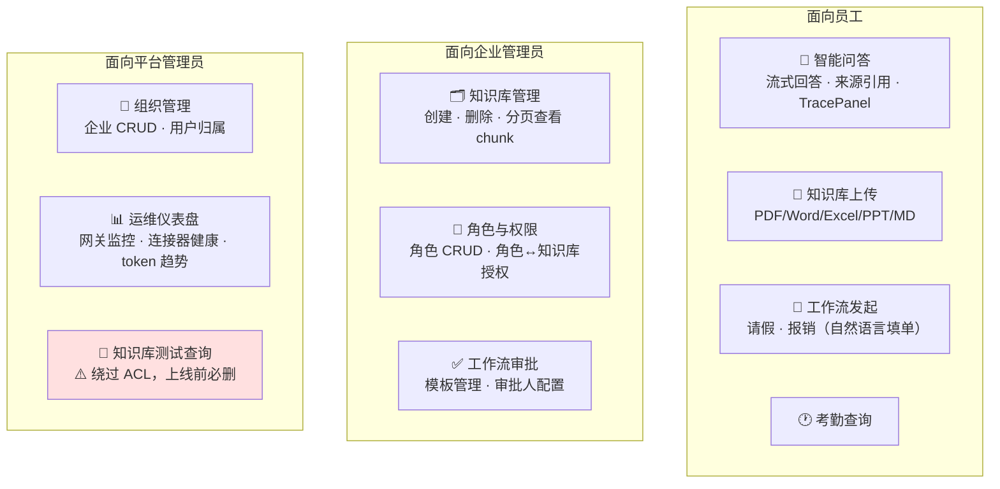
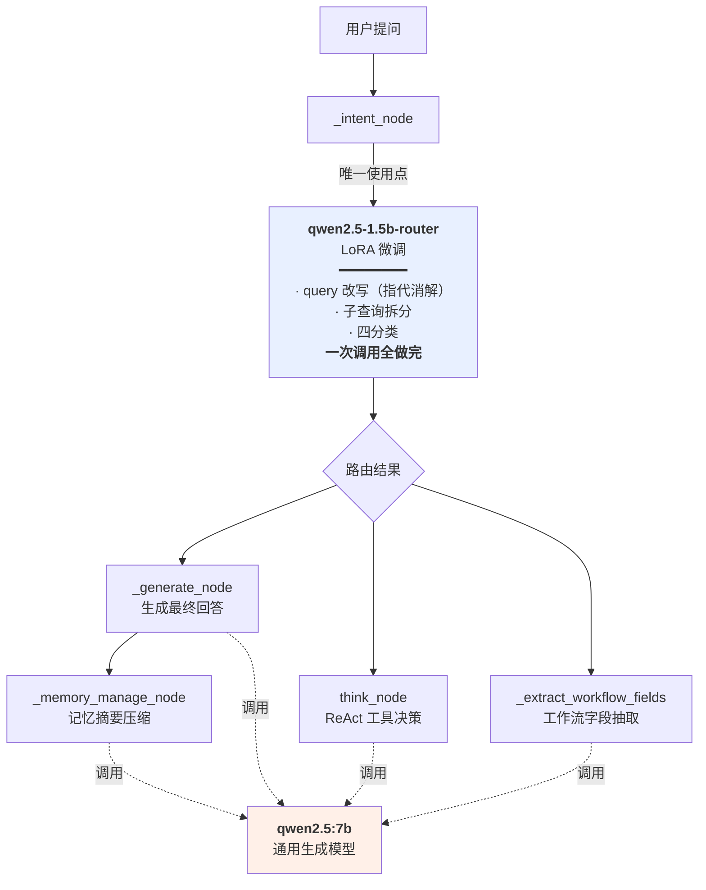
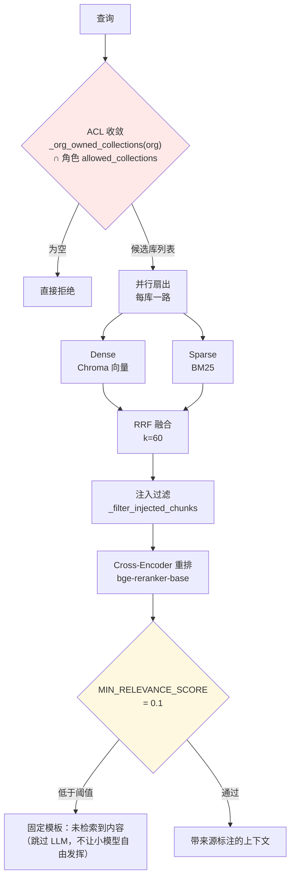

# 架构参考手册

> **状态：当前实现，随架构变更同步更新（2026-08-25 建立）。**
> 本文与 `CLAUDE.md` 同属"当前状态"的正本，两者**不重复内容**：
> - `CLAUDE.md` —— 每个会话都要读的部分（定位 · 未闭环 · 硬性规则）
> - **本文** —— 需要时才查的部分（架构图 · 核心链路 · 性能数据）
>
> 拆分原因：CLAUDE.md 每会话必读，而架构细节绝大多数会话用不到。
> 实测这三章占 CLAUDE.md 约 48% 的 token，拆出后每会话固定成本减半。
>
> **改架构时这两份都要更新。** 除这两份外，任何文档都不得描述"当前系统长什么样"。

## 目录

| # | 章节 |
|---|---|
| 1 | [系统架构](#1-系统架构)：分层图 · 问答全流程 · 功能模块 · 代码模块 · 内置工具 |
| 2 | [核心链路](#2-核心链路)：**双模型系统** · 检索链路 · 工具调用 · 摄入流水线 |
| 3 | [性能现状与目标](#3-性能现状与目标)：SLO · **性能测试** · 容量测算 |

---

## 1. 系统架构

### 1.1 分层架构



### 1.2 一次问答的完整流程



> **关键点**：`done` 事件必须等整张图跑完才发出，而 `memory_manage` 触发压缩时要用 7b
> 做一次摘要——**用户已看完全部回答，还要干等约 8 秒**。
> 异步化方案见 `docs/orchestration_design.md` B 部分（**未实施**）。

### 1.3 功能模块



| 模块 | 状态 | 关键位置 |
|---|---|---|
| 智能问答（RAG + 工具 + 工作流四分支） | ✅ 可用 | `workflow.py` |
| 知识库上传与摄入 | ⚠️ 可用但**更新即残留旧版本**（[§6](#6-已知未闭环)） | `ingestion/pipeline.py` |
| 工作流（请假/报销） | ✅ 可用 | `workflow_store.py` 784 行 |
| 考勤查询（含租户联邦路由） | ✅ 可用 | `builtin_tools.py:108` |
| 角色与知识库权限 | ✅ 可用 | `role_store.py` |
| 组织/企业管理 | ✅ 可用 | `org_store.py` |
| 运维仪表盘 | ⚠️ **仅监控展示**，自动运维内核未实现 | `OperationsDashboard.jsx` |
| 长期记忆（LTM） | ✅ 可用 | `ltm_store.py` |
| 提示注入防护 | ⚠️ **骨架**（95 行），未接入主链路 | `security/prompt_guard.py` |

### 1.4 代码模块清单

| 模块 | 规模 | 职责 | 最大文件 |
|---|---|---|---|
| `src/ragent_backend/` | 23 文件 / **10,396 行** | FastAPI 应用 · LangGraph 编排 · 各类 Store | `app.py` 3038 · `workflow.py` 1672 |
| `src/libs/` | 42 文件 / 7,461 行 | 基础能力（factory 模式 + 多 provider） | — |
| `src/ingestion/` | 23 文件 / 4,881 行 | 摄入流水线（8 阶段） | `pipeline.py` |
| `src/core/` | 17 文件 / 4,089 行 | 检索引擎 · 配置层 | `hybrid_search.py` 813 |
| `src/observability/` | 20 文件 / 3,946 行 | 评估 · 追踪 | — |
| `src/mcp_server/` | 7 文件 / 3,121 行 | 知识库检索工具 | `query_knowledge_hub.py` 1528 |
| `src/tool_agent/` | 8 文件 / 2,138 行 | ReAct 子图 · 工具注册表 | `subgraph.py` |
| `src/security/` | 2 文件 / 95 行 | 提示注入规则检测（骨架） | `prompt_guard.py` |
| `frontend/src/` | 33 文件 / 5,875 行 | React 前端 | `App.jsx` 1334 |
| `tests/` | 79 文件 / 27,179 行 | ⚠️ **几乎全在老 RAG 库层**，见 §6 | — |

### 1.5 内置工具（6 个）

`query_knowledge_hub` · `list_collections` · `get_document_summary` ·
`query_attendance` · `check_workflow_status` · `resubmit_workflow`

---

## 2. 核心链路

### 2.1 双模型系统

系统同时跑两个本地模型，**按"任务是否需要综合推理/自由生成"分工**，不是按大小分。



| | `qwen2.5-1.5b-router` | `qwen2.5:7b` |
|---|---|---|
| **来源** | LoRA 微调（窄任务蒸馏） | 通用开源模型 |
| **使用点** | **只有 `_intent_node` 一处** | 生成 / ReAct 决策 / 字段抽取 / 记忆摘要 |
| **任务性质** | 输出结构固定（严格 JSON schema），四选一 | 开放任务，需综合判断与自由生成 |
| **实测耗时** | **约 3.2s** | 同一合并任务约 8.7s |
| **准确率** | **不输 7b**，部分边界案例反而更准 | — |
| **回退** | `RAGENT_INTENT_MODEL` 可覆盖；模型不存在时**自动回退 7b** | — |

**为什么这个任务适合小模型**：输出是严格 JSON schema（`intent_type` / `confidence` /
`target_tool`…），不需要自由发挥，属于"窄任务 + 固定输出结构"，正是微调小模型的适用区间。

> ⚠️ **该结论只对这一个合并任务成立。** ReAct 决策（`think_node`）和工作流字段抽取
> **没有验证过**，继续用 7b，不受 `RAGENT_INTENT_MODEL` 影响。
>
> ⚠️ **业界视角的提醒**：业界基准把"微调专用小模型（如果 embedding 分类器够用）"
> 列在**"大厂特有、小团队不必跟"**——理由是"训练是最便宜的一步，维护是最贵的一步"
> （registry、回归集、漂移监控、基座升级兼容性都是长期负债）。
> 本项目是 4 分类、边界清晰，落在"embedding 分类器可能够用"的区间。
> **已做完的不必推翻，但不要再往上加维护负担。**

### 2.2 检索链路



**阈值说明**：`MIN_RELEVANCE_SCORE = 0.1` 打在 **cross-encoder 重排分**上，**不是 RRF 融合分**。
依据是实测（`query_knowledge_hub.py:56-65`）：不相关问题的噪音稳定在 0.03 以下、
真相关的稳定在 0.13 以上，两簇间有明显断层。**reranker 降级 fallback 时不适用这个阈值。**

### 2.3 工具调用（ReAct 子图）

`think_node → tool_node → summarize_node`，`max_iterations=5`。
每步起止都推送 trace。工具执行有审计回调（`_audit_log`）。

### 2.4 摄入流水线（8 阶段）


> ⚠️ **①和⑤都是"跳过"语义，没有"替换"语义** —— `doc_id` 就是文件 SHA256，
> 内容一变即被当作全新文档，**旧版本片段永远不会被删除**。见 [§6](#6-已知未闭环) 第 1 条。

---

## 3. 性能现状与目标

### 3.1 最小 SLO（2026-08-25 确认接受）

| 类别 | 指标 | 目标 | 当前 |
|---|---|---|---|
| **正确性** | 跨组织/越权泄露 | **0（无错误预算）** | 隔离已验证 |
| | 身份不可伪造 | 0 已知路径 | ✅ 已修 |
| | 并发请求内容不串 | 0 | ✅ 已修 |
| **质量** | 忠实度 / 拒答率 / 不编造跨主题关联 | ≥95% | ⚠️ **全部无法度量** |
| **性能** | **首字延迟 TTFT** | **≤ 3s** | **5.1 – 20.1s（4–7x）** |
| | 完整回答 P95 | ≤ 15s | **46.8s（3.1x）** |
| | 完整回答 P50 | ≤ 8s | **24.2s（3.0x）** |
| | 峰值承载 | ≥ 1.5 QPS | **约 0.067（22x）** |

> **TTFT 是最重要的一条**：流式场景下用户感知的是"多久开始出字"。
> 实测中 TTFT 经常占总耗时的大头（闲聊场景 20.1s / 22.1s）——
> **用户在看到任何文字之前要等 12–20 秒**，而前端此期间只有一个笼统的"思考中"。
>
> **质量类全部无法度量**：golden set 仅 12 条，且关键词断言结构上抓不到"编造"。
> 这是后续所有优化的前置。

### 3.2 性能测试：方法与结果

**测试方法**（`docs/latency_report.md`，2026-08-23）
- **样本统计**：真实对话消息的端到端耗时分布
- **受控探测**：用聊天接口自带的 trace 时间戳（`session`→`intent`→`generate`→`archive`），
  按场景各测一次，拆出分阶段耗时

> ⚠️ 探测脚本 `latency_probe.py` **已丢失**，这批数字目前**不可复现**。
> 重测前需先按 §9.5 把脚本重建进仓库。

**分场景实测**

| 场景 | 总耗时 | **TTFT** | 意图分类 | 检索+生成 | 输出长度 |
|---|---|---|---|---|---|
| 闲聊（"你好，你是谁"） | 22.1s | **20.1s** | **13.8s** | 8.3s | 73 字 |
| 检索命中 | 20.4s | 16.0s | 6.6s | 13.7s | 158 字 |
| 检索未命中 | 12.9s | 12.9s | 6.4s | 6.6s | 56 字 |
| 发起工作流 | **5.1s** | 5.1s | 1.7s | 3.4s | 10 字 |
| 长回答 | 39.0s | 17.8s | 6.1s | **32.9s** | 682 字 |
| 6 库并行检索 | 17.9s | 13.5s | 5.7s | 12.2s | 183 字 |

**四个结论**

1. **存在与输出长度无关的固定开销**——最快一档也要 8.4s 起步（意图分类 + 检索）
2. **生成阶段耗时几乎完全由输出长度决定**：56字→6.6s，158字→13.7s，682字→32.9s
3. **当前数据量下检索不是瓶颈**——6 库并行（17.9s）与单库（20.4s）基本持平。
   ⚠️ **但这是在测试数据量（每库约 20 块）下测的**；[§6](#6-已知未闭环) 第 2 条推算，
   真实数据量下 BM25 索引全量加载会变成主要瓶颈。**两者不矛盾，是不同数据量下的两个结论。**
4. **工作流路径明显更快**（5.1s）——不走生成式回答，佐证 LLM 生成是耗时主因

**已做的优化**：意图节点换 1.5b router（约省 5s，见 [§3.1](#31-双模型系统)）·
生成上限 `GENERATE_MAX_TOKENS=1200` · Ollama 保活。
**未做**：`docs/optimization_tracking.md` 的"优化后"一栏**仍留空**，
即上述优化的实际收益从未被量化验证。

### 3.3 容量测算（单客户口径）

假设：日活 30% · 每人每日 4 次 · 峰值小时占 20% · 突发系数 2.0

```
日提问量 12,000  →  峰值小时 2,400  →  峰值 1.33 QPS
```

**并发在飞请求数 = 峰值 QPS × 停留时间**（Little's Law）：

| 延迟 | 并发在飞 |
|---|---|
| 当前 P50 24.2s | **32.3** |
| 若达成 10s | 13.3 |
| 若达成 5s | 6.7 |

> **推论：并发压力是延迟的函数。压延迟本身就是在降容量需求——两件事是一件事。**

**多租户按客户数倍乘**：1–3 家客户 = 1.3–4.0 QPS，所需模型并发度约 20–60。
这个量级**单台 GPU 服务器 + vLLM 即可满足**，不需要多机集群。

### 3.4 硬件解决不了的那部分

| 类别 | 换硬件能解决吗 |
|---|---|
| 模型服务吞吐 | ✅ **能** —— GPU + vLLM |
| 每查询重建检索组件 / 全链路无缓存 | ❌ **不能** —— 浪费按负载等比放大 |
| 管理端 N+1 | ❌ 不能 —— 上万次串行往返 |
| 连接池分散（累计上限约 68） | ❌ 不能 |
| 无结构化日志 / request id | ❌ 不能 |

---
