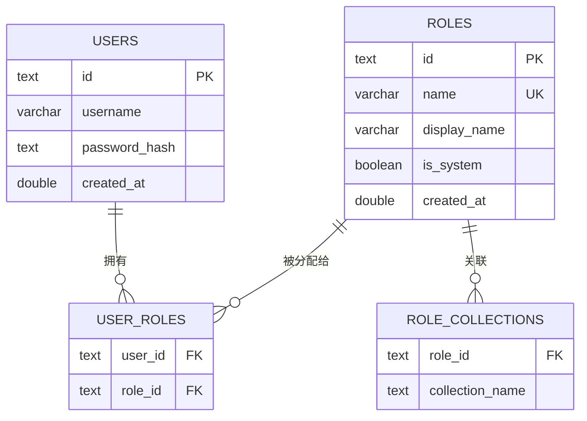
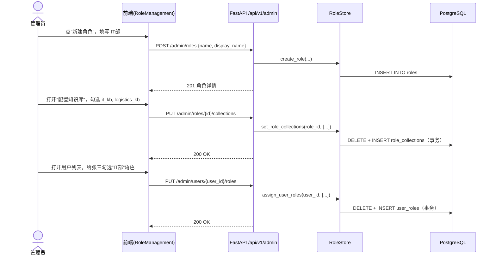
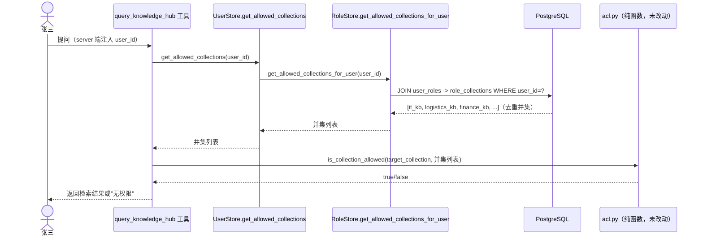
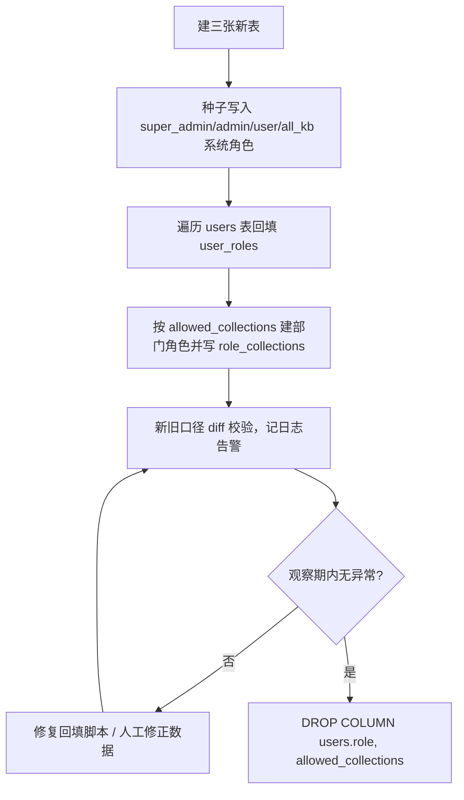

# 角色管理 与 角色-知识库关联 技术方案

> **状态：已实施，但模型已演进两轮，本文描述的不再是当前设计（2026-08-25 核实）**
> 当前权限模型以 `CLAUDE.md`「当前架构」为准。本文仅作历史参考——记录当初为什么
> 让角色携带知识库权限（为避免逐用户勾选 allowed_collections 的 O(用户数) 操作）。
> **不要按本文描述改代码。**
> 关联现状代码：`src/ragent_backend/user_store.py`、`auth.py`、`acl.py`、`app.py`、`schemas.py`

## 1. 背景与目标

### 1.1 现状问题

系统目前的权限模型是**用户级**的，由 `users` 表的两个独立字段承担：

| 字段 | 语义 | 控制的东西 |
|---|---|---|
| `role`（`VARCHAR(32)`，`super_admin`/`admin`/`user`） | 系统权限档位 | 能不能进管理后台（`require_role`） |
| `allowed_collections`（`TEXT[]`） | 知识库授权列表 | 能看哪些共享知识库（`acl.py`） |

问题：**知识库授权是逐用户勾选的**。要给"IT部"20 个人开一个新知识库，需要管理员在后台对着这 20 个用户逐一编辑 `allowed_collections`；员工调岗、新知识库上线、权限收紧，都是 O(用户数) 的操作，没有"批量按部门/业务线授权"的能力。

### 1.2 目标

引入**角色（Role）**作为知识库授权的分组单元：

- 管理员可以创建/编辑/删除角色（如"IT部""财务部"）。
- 管理员可以给角色关联一批知识库（collection）。
- 管理员可以给用户分配一个或多个角色。
- 用户最终能访问的知识库 = 他所拥有的**所有角色**关联知识库的**并集**。
- 调整一个部门的知识库权限，只需要改一次角色配置，全员生效。

### 1.3 设计决策（已与用户确认）

1. **复用/改造现有 `role` 字段**，而不是新增一个跟系统权限档位平行的"业务角色"概念——现在系统权限档位（`super_admin`/`admin`/`user`）和知识库分组授权统一由同一套"角色"表承担，管理员心智模型是一致的："这个人有什么角色"同时决定了"能不能进后台"和"能看哪些知识库"。
2. **用户-角色多对多**：一个用户可以同时拥有多个角色（例如同时是 `admin` + "IT部" + "财务部"）。
3. **完全迁移到角色**：废弃 `users.allowed_collections` 字段，不保留用户级例外覆盖；如果确实需要给某个人开个例外知识库，做法是给他建一个只有他一个人的角色（复用同一套机制，不引入第二套授权路径）。
4. **方案范围**：后端数据模型/API/ACL 解析逻辑 + 前端角色管理与用户-角色分配界面。

---

## 2. 技术选型

**结论：不引入任何新依赖，完全复用现有技术栈和代码风格。**

| 层 | 选型 | 理由 |
|---|---|---|
| 持久化 | 沿用 PostgreSQL + `asyncpg` 原生 SQL，`CREATE TABLE IF NOT EXISTS` 自迁移 | 项目里 `user_store.py`/`conversation_store.py` 等已统一用这个模式，无 ORM；引入 SQLAlchemy 等 ORM 只为这一个功能会造成风格割裂，收益不成正比。 |
| 知识库实体 | **不新建"知识库"注册表**，角色关联知识库时直接存 ChromaDB collection 名字符串 | 现状里 collection 全系统都是裸字符串（`client.list_collections()` 现查，无中心注册表），新建注册表意味着要维护"注册表 vs ChromaDB 实际存在"的一致性，是额外的维护负担；沿用现状即可。 |
| 后端框架/鉴权 | 沿用 FastAPI + JWT（`pyjwt`）+ `bcrypt`，`require_role` 依赖工厂模式 | 已有基础设施，管理后台 API 直接照抄 `app.py:410-482` 现有的用户管理 API 风格。 |
| ACL 判定逻辑 | **不改** `acl.py` | 它是纯函数，只认 `allowed_collections: List[str]`，不关心数据怎么来的；只需要改上游"怎么算出这个 List"。 |
| 前端框架 | 沿用 React 18 + antd 5 + axios，**不引入路由库** | `App.jsx` 现在是无路由、靠 state 切视图的单文件应用，管理界面用同样的模式接入，改动面最小。 |
| 前端组件 | antd `Table` / `Modal` / `Transfer` / `Select mode="multiple"` | antd 已是项目依赖，这些是现成组件，不需要自己写多选穿梭框之类的交互控件。 |

---

## 3. 数据模型

新增 3 张表，`users` 表分两阶段废弃 `role`/`allowed_collections` 两列（见第 6 节迁移计划）。

```sql
-- 角色主表
CREATE TABLE IF NOT EXISTS roles (
    id            TEXT PRIMARY KEY,
    name          VARCHAR(64) UNIQUE NOT NULL,   -- 内部标识，如 "super_admin" / "it_dept"
    display_name  VARCHAR(128) NOT NULL,          -- 展示名，如 "IT部"
    is_system     BOOLEAN NOT NULL DEFAULT FALSE, -- true = 内置角色，不可删除/改名
    created_at    DOUBLE PRECISION NOT NULL
);

-- 角色 <-> 知识库（collection）关联
CREATE TABLE IF NOT EXISTS role_collections (
    role_id         TEXT NOT NULL REFERENCES roles(id) ON DELETE CASCADE,
    collection_name TEXT NOT NULL,   -- 普通 collection 名，或通配符 "*"（复用 acl.py 现有语义）
    PRIMARY KEY (role_id, collection_name)
);

-- 用户 <-> 角色关联（多对多）
CREATE TABLE IF NOT EXISTS user_roles (
    user_id  TEXT NOT NULL REFERENCES users(id) ON DELETE CASCADE,
    role_id  TEXT NOT NULL REFERENCES roles(id) ON DELETE CASCADE,
    PRIMARY KEY (user_id, role_id)
);
```

- `roles.is_system = TRUE` 的三行是种子数据：`super_admin` / `admin` / `user`，语义与现有完全一致，只是从字符串枚举升级成了表里的一行；`require_role` 判断的仍然是这三个 `name`。
- `role_collections` 的复合主键天然是索引，`role_id`/`user_id` 上的查询（"这个角色关联了哪些库""这个用户有哪些角色"）都走得到索引，量级（角色数、用户数通常是百级到千级）不需要额外优化。
- 通配符 `"*"` 沿用 `acl.py` 里已经支持的语义：某个角色关联 `"*"` 即代表"全部知识库"，天然覆盖了原来 `allowed_collections=["*"]` 的用法。

### 3.1 ER 图



---

## 4. 核心逻辑

### 4.1 新增 `role_store.py`

新增 `src/ragent_backend/role_store.py`，仿 `user_store.py` 的 `asyncpg` + `_ensure_schema` 模式：

```python
class RoleStore:
    async def create_role(self, name: str, display_name: str) -> Role: ...
    async def list_roles(self) -> List[RoleWithCollections]: ...
    async def get_role_by_id(self, role_id: str) -> Optional[Role]: ...
    async def update_role(self, role_id: str, display_name: str) -> Optional[Role]:
        # is_system 角色：display_name 可改，name 不可改
        ...
    async def delete_role(self, role_id: str) -> bool:
        # is_system=True 直接拒绝（抛 ValueError，路由层转 403）
        ...
    async def set_role_collections(self, role_id: str, collection_names: List[str]) -> None:
        # 整体替换：事务内先 DELETE 该 role_id 的所有关联，再批量 INSERT
        ...
    async def assign_user_roles(self, user_id: str, role_ids: List[str]) -> None:
        # 整体替换：事务内先 DELETE 该 user_id 的所有关联，再批量 INSERT
        ...
    async def get_user_roles(self, user_id: str) -> List[Role]: ...
    async def get_allowed_collections_for_user(self, user_id: str) -> List[str]:
        # JOIN user_roles -> role_collections，按角色去重并集；
        # 任一角色关联了 "*"，直接返回 ["*"]
        ...
```

`set_role_collections` / `assign_user_roles` 用"整体替换"而不是增量增删接口，原因是前端交互是"打开一个多选框，勾选完点保存"，天然对应全量替换，接口更简单、也不用担心增删调用顺序导致状态不一致。

### 4.2 对现有代码的最小改动原则

- **`acl.py` 零改动**：它只认 `allowed_collections: List[str]`，跟数据来源无关。
- **3 个 MCP 工具（`list_collections.py`、`query_knowledge_hub.py`、`get_document_summary.py`）零改动**：它们都是调 `UserStore.get_allowed_collections(user_id)` 拿列表。这个方法**签名保持不变**，内部实现改为委托 `RoleStore.get_allowed_collections_for_user(user_id)`：

```python
# user_store.py（改造后）
async def get_allowed_collections(self, user_id: str) -> List[str]:
    """签名不变，内部改为委托 RoleStore——调用方（3 个 MCP 工具）不用动。"""
    from src.ragent_backend.role_store import RoleStore
    return await RoleStore().get_allowed_collections_for_user(user_id)
```

- **`auth.require_role(*allowed_roles)` 改造**：原来判断 `user.role not in allowed_roles`（单值），改成"用户当前角色名集合与 `allowed_roles` 是否有交集"：

```python
async def _dependency(current_user: AuthenticatedUser = Depends(get_current_user)) -> AuthenticatedUser:
    from src.ragent_backend.role_store import RoleStore
    role_names = {r.name for r in await RoleStore().get_user_roles(current_user.user_id)}
    if not role_names & set(allowed_roles):
        raise HTTPException(status_code=403, detail="权限不足")
    return current_user
```

行为完全兼容现状：一个用户只有 `admin` 一个角色时，跟原来"role 字段等于 admin"效果一样；新增的多角色能力是纯增量。

### 4.3 新增管理后台 API

沿用 `app.py:410-482` 现有用户管理 API 的写法（都挂 `require_role(ROLE_SUPER_ADMIN)`）：

| Method | Path | 说明 |
|---|---|---|
| `GET` | `/api/v1/admin/roles` | 列出所有角色，含每个角色关联的知识库列表 |
| `POST` | `/api/v1/admin/roles` | 创建角色 `{name, display_name}` |
| `PATCH` | `/api/v1/admin/roles/{role_id}` | 改 `display_name`；`name`/`is_system` 不可改 |
| `DELETE` | `/api/v1/admin/roles/{role_id}` | 删除角色；`is_system=True` 返回 403 |
| `PUT` | `/api/v1/admin/roles/{role_id}/collections` | 整体替换该角色关联的知识库 `{collection_names: [...]}` |
| `PUT` | `/api/v1/admin/users/{user_id}/roles` | 整体替换该用户的角色分配 `{role_ids: [...]}` |
| `GET` | `/api/v1/admin/collections` | 列出 ChromaDB 现有 collection 名，供前端"关联知识库"多选框做数据源 |

`schemas.py` 里 `MeResponse`/`AdminUserResponse` 的字段调整：

```python
class RoleSummary(BaseModel):
    role_id: str
    name: str
    display_name: str

class MeResponse(BaseModel):
    user_id: str
    username: str
    roles: List[RoleSummary]          # 原来是 role: str
    allowed_collections: List[str]    # 保留：后端算好的并集，前端不用二次拼接
    created_at: float
```

### 4.4 时序图

**① 管理员创建角色 → 关联知识库 → 分配给用户**



**② 运行时：用户提问，工具层解析角色并集得到可访问知识库**



---

## 5. 前端设计

现状：`frontend/src/App.jsx` 是无路由的单文件应用，靠 state 切换视图，且**目前连用户管理的前端界面都还没接**（后端 `/api/v1/admin/users` 系列接口已就绪但前端零消费）。本次一并把角色管理和用户-角色分配的界面补齐。

- **管理入口**：`meProfile.roles` 中包含 `admin`/`super_admin` 时，在现有 header 工具栏区显示"管理后台"入口；点击后用现有的 state 切换模式（如 `view: 'chat' | 'admin'`）切到管理视图，不引入路由库。
- **`frontend/src/components/admin/RoleManagement.jsx`**：
  - antd `Table` 列出角色：名称、关联知识库数、系统角色徽标（`is_system` 行标"内置"，操作列的删除按钮禁用）。
  - "新建角色"按钮 → `Modal` 表单（`display_name` 必填，`name` 提交前做唯一性校验提示）。
  - 行内"配置知识库" → 第二个 `Modal`，用 antd `Transfer`（或 `Checkbox.Group`，取决于知识库数量）展示 `GET /admin/collections` 返回的全部 collection，勾选项对应当前角色的 `role_collections`，保存调 `PUT /admin/roles/{id}/collections`。
- **`frontend/src/components/admin/UserRoleAssignment.jsx`**：
  - 用户列表（消费已有的 `GET/POST/PATCH/DELETE /api/v1/admin/users`），每行加一列 `Select mode="multiple"`，选项来自 `GET /admin/roles`，变更时调 `PUT /admin/users/{id}/roles`。
- 两个组件共用一个轻量的 `frontend/src/api/admin.js`，封装上述接口的 axios 调用，延续 `App.jsx` 里现成的 token 拦截器（无需重复处理鉴权）。

---

## 6. 迁移计划（两阶段上线）

**阶段一：新表 + 数据回填（不动老列，可回滚）**

1. 建三张新表 `roles` / `role_collections` / `user_roles`。
2. 种子写入三个内置系统角色 `super_admin` / `admin` / `user`（`is_system=TRUE`）。
3. 遍历现有 `users` 表：
   - 按每个用户的 `role` 值，写入对应的 `user_roles`（关联到第 2 步种子的系统角色）。
   - 按每个用户的 `allowed_collections`：
     - 含 `"*"` 的用户 → 关联到一个新建的 `all_kb`（`is_system=TRUE`，`role_collections` 存 `"*"`）系统角色。
     - 其余每个 collection 名，若匹配 `seed_department_kbs.py` 里的命名（`it_kb`/`attendance_kb`/`logistics_kb`/`legal_kb`）则建对应部门角色（如"IT部"），否则以 collection 名本身建角色；写入 `role_collections`，并把用户关联到对应角色。
4. 校验：对每个用户，用新表 JOIN 算出的并集 与 老的 `allowed_collections` 做 diff，不一致的记日志告警（不阻断上线），供人工复核。
5. 此阶段 `users.role`/`allowed_collections` 两列**保留但不再是唯一真相源**——读路径（`get_allowed_collections`）已切到新表，老列只作为回滚保险和校验基准。

**阶段二：下线老列**

6. 阶段一运行一段观察期、确认无异常后，`ALTER TABLE users DROP COLUMN role, DROP COLUMN allowed_collections`。



---

## 7. 风险与开放问题

- **外键删除策略**：`role_collections`/`user_roles` 都用 `ON DELETE CASCADE`——删除角色时相关的知识库关联和用户绑定一起清掉，符合"角色不存在了，关联关系也不该存在"的直觉；但意味着删除角色是不可逆操作，前端需要二次确认弹窗，并提示"当前有 N 个用户绑定了此角色，删除后这些用户会立刻失去对应知识库的访问权限"。
- **`is_system` 角色的保护边界**：目前设计只保护"删除"和"改名（`name`）"，`display_name` 允许改（比如把内置的 `admin` 展示名从"管理员"改成别的）；如果业务上也不希望改 `display_name`，需要在 `update_role` 里加一条判断，成本很低，留待确认后调整。
- **迁移脚本的幂等性**：阶段一的回填脚本要设计成可重复执行不出错（比如用 `INSERT ... ON CONFLICT DO NOTHING`），因为观察期内可能需要多次跑校验/修正。
- **权限收紧的实时性**：现有 `require_role` 已经是"每次请求现查库"（不信 token 里的旧角色），本方案沿用同样的实时性保证；`get_allowed_collections_for_user` 同理每次现查，管理员改完角色的知识库关联后，用户下一次提问立刻生效，不需要重新登录。
