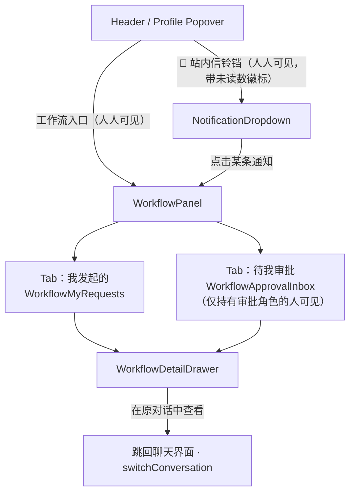
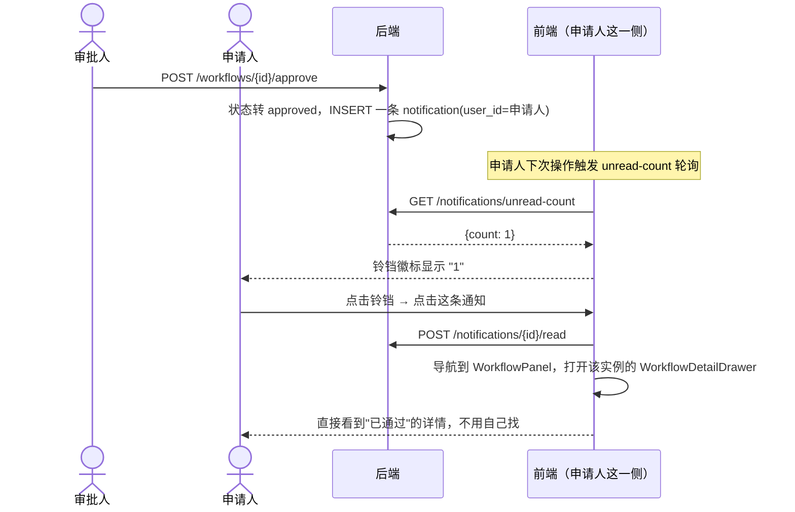

# 工作流 前端展示方案

> **状态：已实施（2026-08-25 核实：前端工作流相关组件已存在）**
> 与 `work-flow.md`、`work-flow-v2.md` 讲同一件事，**待合并**。
> 前置文档：`work-flow.md`（后端数据模型/意图状态机/审批 API，本方案在此基础上补前端）
> 关联现状代码：`frontend/src/App.jsx`（view 切换、登录态、profile popover 的既有模式）；
> `frontend/src/components/admin/{AdminPanel,RoleManagement,UserRoleAssignment}.jsx`（整页管理界面的现成范式）；
> `frontend/src/api/admin.js`（axios 封装范式）

## 1. 背景与目标

`work-flow.md` 设计了工作流怎么在聊天里被创建、怎么走审批状态机，但员工/审批人怎么"看"这些工作流，不在那份文档范围内。这次要把前端这块补上，明确要求覆盖 4 点：

1. 员工提交申请后，能通过**站内信**收到最新的审批提示和结果。
2. 站内信可以**一键导航**到对应的工作流详情界面。
3. 一个员工可以同时有多个**不同类型**的在途申请，但**同一类型只能有一个在途申请**。
4. 同一个人可能既是申请人也是审批人，UI 要清楚区分"我发起的"和"需要我审批的"，不能混在一起。
5. 输入框旁边要有一个**显式的"发起工作流"入口**——用户点开界面上的入口时，他自己肯定知道这次就是要用工作流、用哪一种，这个信息前端本来就确定，不需要再靠后端对纯文本做意图分类去"猜"（`work-flow.md` 5.1 节已经加了对应的后端短路逻辑，本文档第 5 节设计这个入口长什么样）。

第 1-3 点里，"站内信"和"同类型只能一个在途"这两点，`work-flow.md` 目前都没有对应的后端能力——第 6、7 节会给出对后端的最小追加设计，但**本方案不修改 `work-flow.md` 本身**，追加内容只作为本文档的一部分记录，是否同步回 `work-flow.md` 留给用户决定。第 5 点（显式入口）不在此列——它需要的后端能力（`ChatRequest.workflow_type`、`ChatResponse.active_workflow`、`GET /api/v1/workflow-templates`）已经在这一轮同步写进了 `work-flow.md`（5.1、7 节），本文档第 5 节直接引用，不重复记录。

---

## 2. 现状与复用基础

本项目这次不是从零设计前端模式——上一轮角色管理功能已经把"整页管理界面怎么接入这个单文件 SPA"这套模式跑通了一遍，工作流前端直接照抄，不再重新发明：

- **视图切换**：`App.jsx` 用一个 `view` state（`'chat' | 'admin'`）切换整页视图，不引入路由库（`frontend/vite.config.js` 也没配置任何路由）。入口挂在 profile popover 里，按条件显示（`isAdmin` 检查 `meProfile.roles`）。工作流入口直接照这个模式加第三个 view。
- **整页管理组件的结构**：`AdminPanel.jsx` 是一个"返回按钮 + 标题 + antd Tabs"的容器，`RoleManagement.jsx`/`UserRoleAssignment.jsx` 是 Tabs 下的两个 antd `Table` 页面，行内操作走 `Modal`/`Popconfirm`，数据操作全部走一个独立的 `api/admin.js` axios 封装（复用 `App.jsx` 挂的全局 token 拦截器，自己不用处理鉴权）。工作流前端结构上完全对齐：`WorkflowPanel.jsx`（容器）+ 两个 Tab 页面 + `api/workflow.js`。
- **REST 数据源**：`work-flow.md` 第 7 节已经设计好的 `/api/v1/workflows*` 系列端点直接消费，不用等前端单独设计接口形状。

---

## 3. 信息架构与导航



- **工作流入口对所有登录用户可见**（不像"管理后台"入口那样只对 admin/super_admin 可见）——因为任何人都可能发起申请，即使不是审批人。
- **"待我审批" Tab 有条件显示**：只有当前用户的角色集合里，存在至少一个是某个模板的 `approver_role_id` 时才显示这个 Tab；普通员工看不到这个 Tab（不是"看到但空空如也"，是压根不显示，避免误导"是不是我什么都没有要审的"）。判断逻辑：前端用 `meProfile.roles` 跟 `GET /api/v1/admin/workflow-templates` 里出现过的 `approver_role_id` 集合取交集（这个模板列表接口目前是 super_admin 专属，工作流前端需要的是"能审批的模板类型有哪些"这种轻量信息，不需要模板全部字段——建议追加一个非管理员也能调的轻量端点，见第 7 节）。

**两个 Tab 分开、而不是一个列表里加一列区分身份**，是刻意的设计选择：申请人视角能做的操作（取消、补充材料重提）和审批人视角能做的操作（通过、打回、驳回）完全不同，混在一个表格里会导致同一行的操作按钮要按"这条记录是我发的还是要我审的"动态切换，容易点错，尤其当申请人和审批人是同一个人、状态又是"我打回了别人一条、我自己另一条也被打回"这种交叉场景时更容易看花眼。两个独立数据源（不同的 API、不同的状态过滤）从根上避免这个问题。

---

## 4. 页面细节

### 4.1「我发起的」—— `WorkflowMyRequests.jsx`

数据源：`GET /api/v1/workflows?status=`（`work-flow.md` 第 7 节已有），前端自己不额外过滤，用 antd `Table` 的内建筛选器提供按状态筛选。

列设计：

| 列 | 内容 |
|---|---|
| 流程类型 | 图标 + `display_name`，视觉上参考 `App.jsx` 里 `KbTag`/`kbMeta` 给知识库配图标颜色的思路，给每个 `workflow_type` 配一个图标（如报修用 `Wrench`、请假用 `CalendarOff`、出差用 `Plane`、报销用 `Receipt`，均是 `lucide-react` 现成图标） |
| 状态 | antd `Tag`，按状态上色：`pending_approval`=蓝，`returned_for_revision`=橙（重点色，提示"要处理"），`approved`=绿，`completed`=灰底绿字，`rejected`=红，`cancelled`=灰 |
| 提交时间 / 更新时间 | 常规时间列 |
| 操作 | 按状态动态出现：见下 |

行内操作按状态分支：
- `pending_approval`/`returned_for_revision` → "去补充材料"按钮：**不是**打开一个新表单，而是跳回发起该申请时的那个 `conversation_id`（`work-flow.md` 6.2 节：材料本来就传在那条对话里），复用 `App.jsx` 现成的 `switchConversation(convId)`。跳转后员工在聊天里传文件；两个状态下都可以传——`pending_approval` 是"还没审，先补充点材料"，直接留在原对话里就行，不需要任何状态转换；`returned_for_revision` 传完后再说一句"材料补好了"，走 `work-flow.md` 6.2 设计的 `resubmit_workflow` 工具闭环转回 `pending_approval`。审批一旦通过（`approved`）材料就不再影响这条申请，之后不再提供这个入口。前端这个按钮只负责导航，不重新实现一遍提交逻辑。
- `pending_approval`/`returned_for_revision`/`approved` → "取消申请"按钮，`Popconfirm` 二次确认，调 `POST /workflows/{id}/cancel`——申请人只要还没到终态，随时可以反悔取消，不局限于"还没审"这一个状态：材料被打回之后想放弃、甚至已经审批通过但还没真正去办理，都能取消。
- `approved` → "标记完成"按钮，调 `POST /workflows/{id}/complete`。
- 终态（`rejected`/`completed`/`cancelled`）→ 无操作，只能查看详情。

**没有"新建"按钮**：按 `work-flow.md` 的设计，创建工作流只能通过聊天里的多轮信息收集完成，这里如果加一个表单式的"新建"入口，等于绕开了"AI 帮你把话说清楚、缺什么问什么"这个核心价值，还会导致两套创建路径（聊天 vs 表单）对不齐结构化字段规则。列表页顶部只放一句引导文案 + 按钮："发起新的申请，直接在聊天里说就行 →"，点击后新开一个对话（复用 `startNewChat()`）并自动带一句提示语填进输入框（不代发，只是预填，员工自己确认发送）。

空态：无任何记录时展示同样的引导文案，不单独设计一套空状态插画。

### 4.2「待我审批」—— `WorkflowApprovalInbox.jsx`

数据源：`GET /api/v1/workflows/pending-approval`（`work-flow.md` 第 7 节已有）。

列设计：申请人（头像+用户名，复用 `App.jsx` 的 `avatarColor`/`avatarInitial` 工具函数）、流程类型、提交时间、状态（这个列表主要是 `pending_approval`，但审批人自己打回过的 `returned_for_revision` 记录也保留可见，方便追踪后续有没有重新提交）、操作。

行内操作：
- **通过**：直接 `Popconfirm`（轻量，无需强确认），调 `POST /workflows/{id}/approve`。
- **打回**：弹出一个必填 `comment` 的小 `Modal`（`work-flow.md` 6.2 节强调打回原因是自由文本、必须写清楚缺什么），调 `POST /workflows/{id}/return`。
- **驳回**：同样必填 `comment` 的 `Modal`，但按钮是 `danger` 样式 + 更强的二次确认文案（"驳回后申请人需要重新发起，不可恢复"），调 `POST /workflows/{id}/reject`——跟"打回"在视觉上要明显区分开（打回用中性/警示色，驳回用危险色），避免审批人手滑点错，把能补救的"打回"点成不可逆的"驳回"。

### 4.3 详情 —— `WorkflowDetailDrawer.jsx`（两个 Tab 共用同一个组件）

antd `Drawer`，内容：

1. 顶部：状态 `Tag` + `display_name` + 编号（实例 id 短码）。
2. 结构化字段：按模板 `required_fields` 的 `label` 顺序，一行一个"标签: 值"，日期/枚举直接展示原值即可，不需要特殊渲染。
3. 材料提醒：如果模板 `attachments_note` 非空，原文展示一遍（方便审批人核对"员工到底该传什么"，不用去翻模板配置）。
4. 关联材料：列出发起该工作流的 `conversation_id` 下所有已上传文件（复用 `App.jsx` 现有"知识库文件"抽屉里 `file-item` 的渲染样式），可点击下载/预览——**这依赖 `work-flow.md` 第 8 节已经标注的一个后端缺口**（现有文件端点没有下载接口），本方案不重复设计，直接引用那个待办。
5. 审批轨迹：`history` JSONB 数组渲染成 antd `Timeline`，每个事件一行（提交/打回/重新提交/通过/驳回/完成），天然适合这种"时间序列事件"的展示，不需要额外设计新组件。
6. 底部："在原对话中查看"链接，跳回 `conversation_id` 对应的聊天记录（同 4.1 的 `switchConversation` 复用）。

两个 Tab 打开这个 Drawer 时传入的 `mode`（`"owner"` / `"approver"`）决定要不要显示审批操作按钮（通过/打回/驳回只在 `mode="approver"` 且状态为 `pending_approval` 时出现），跟 REST 层 `_require_workflow_access(mode=...)`（`work-flow.md` 第 7 节）的鉴权模式对应，前端和后端对"这次是以哪个身份在看"的判断保持一致。

---

## 5. 工作流启动器（显式发起入口）

对应第 1 节要求 5：用户点开这个入口时，"这次是要用工作流、用哪一种"这个信息本来就确定，不需要后端再对纯文本做意图分类去猜。所需的后端能力（`ChatRequest.workflow_type`、`ChatResponse.active_workflow`、`GET /api/v1/workflow-templates`）已经在 `work-flow.md` 5.1、7 节写好，本节只设计前端交互本身。

### 5.1 位置与交互

聊天输入区（`App.jsx` 现有 `.input-wrapper`，紧挨着 `message-input` 和发送按钮）左侧新增一个"🗂 工作流"按钮：

```
┌─────────────────────────────────┐
│ 🗂 正在发起：请假申请 ✕            │   ← 选中类型后才出现，可关闭
├─────────────────────────────────┤
│ [🗂 工作流 ▾]  描述一下你的请假需求...   [发送] │
└─────────────────────────────────┘
```

交互步骤：

1. 点击"🗂 工作流"按钮 → 下拉列表（antd `Dropdown`/`Select`），数据源 `GET /api/v1/workflow-templates`（`work-flow.md` 7 节新增的轻量端点，登录后拉一次、本地缓存），每一项显示图标 + `display_name`（图标映射复用 4.1 节已经提到的"每个 `workflow_type` 配一个 lucide 图标"思路，如报修 `Wrench`、请假 `CalendarOff`、出差 `Plane`、报销 `Receipt`）。
2. 选中某个类型 → 下拉关闭，`message-input` 上方出现一个可关闭的 antd `Tag`："🗂 正在发起：{display_name} ✕"；输入框 `placeholder` 同步换成更具体的提示（如"描述一下你的请假需求…"）。
3. 用户**还是在同一个输入框里打字，点同一个发送按钮**（`sendMessage()`/`sendStreamMessage()`，`App.jsx` 现有函数不用拆成两套）——只是这一次请求体（`ChatRequest`/流式请求体）附带 `workflow_type: "leave_request"`。
4. 发送后，标签立即清除（不管后端最终怎么处理都清；用户选了类型但没发送就清空/切走对话，这个本地状态本来就没提交给后端，天然安全，不需要额外的清理逻辑）。

**设计取舍说明（已跟用户确认）**：这里用"类型选择器 + 复用同一个输入框"，而不是做成完全独立的第二个输入框/发送按钮。理由：用户选完类型之后，接下来要做的事仍然是"打字描述需求"，跟正常聊天是同一个动作，只是这次多了一个已知的类型标签；拆成两个独立的输入区反而需要前端维护两套输入状态、两套发送逻辑，且用户要在两个框之间切换焦点，体验上不比"选完接着打字"更好。

### 5.2 续填期间的持续状态提示

跟 5.1 节这个"一次性启动标签"分开，是另一个常驻控件：聊天头部（`chat-header`，现有"LangGraph 追踪"`header-btn` 那一行）新增一个状态胶囊，只在最近一次 `POST /api/v1/chat`（或流式 `done` 事件）响应里的 `active_workflow` 字段非 `None` 时显示：

```
💬 当前对话          [填写中：请假申请 · 2/4 项 ✕]   [🔍 追踪] [⚙️ 设置]
```

- 文案由响应字段直接拼："填写中：{display_name} · {total_count - missing_count}/{total_count} 项"——前端不自己在多轮之间累加进度，每轮都以后端这一轮返回的数字为准（`work-flow.md` 7 节已经把这个字段设计成"每轮如实上报"，不是前端自己猜）。
- 胶囊上的"✕ 取消"按钮：点击后直接把字符串"取消"作为一条消息发送出去，复用 `work-flow.md` 6.1 节步骤 1 已有的关键词取消机制——不需要新端点，前端只是把"点按钮"翻译成"发一句话"。
- 上一轮响应的 `active_workflow` 为 `None` 时（工作流已提交/已取消/这轮根本不是工作流轮次），胶囊自动消失，不需要前端额外判断"是不是应该隐藏"。

---

## 6. 站内信（Notification Center）

### 6.1 定位

站内信本质是一个通用的"事件 → 提醒"投递机制，不是工作流专属的，只是目前唯一的触发源是工作流状态变化。设计成通用表/通用 API，但只在这次实现工作流相关的触发点——不为将来可能出现的其它通知场景过度设计。

### 6.2 对后端的最小追加（不改 `work-flow.md`，只在此记录，供后续同步）

```sql
CREATE TABLE IF NOT EXISTS notifications (
    id            TEXT PRIMARY KEY,
    user_id       TEXT NOT NULL REFERENCES users(id) ON DELETE CASCADE,
    type          VARCHAR(32) NOT NULL,      -- 如 "workflow_status_changed"，为将来其它通知类型留口子
    title         VARCHAR(200) NOT NULL,
    body          TEXT NOT NULL DEFAULT '',
    link          TEXT,                       -- 前端一键跳转用，如 "workflow:{instance_id}"
    is_read       BOOLEAN NOT NULL DEFAULT FALSE,
    created_at    DOUBLE PRECISION NOT NULL
);
CREATE INDEX IF NOT EXISTS idx_notifications_user_unread ON notifications(user_id, is_read);
```

触发点：`work-flow.md` 里 `WorkflowStore` 的每一次状态转换（approve/return/reject/complete/resubmit）成功后，顺带写一条通知：
- 审批相关的变化（approve/return/reject/complete）→ 通知 `requester_user_id`。
- 一条新的 `pending_approval` 实例出现（首次提交或 resubmit 后）→ 通知该模板 `approver_role_id` 下的**所有**持有者（查 `RoleStore` 反查角色下的用户列表——`role_store.py` 目前没有"某角色下有哪些用户"这个反向查询方法，需要新增，跟现有 `get_user_roles` 反过来）。

REST API（新增，非 `work-flow.md` 范围但工作流前端需要）：

| Method | Path | 说明 |
|---|---|---|
| `GET` | `/api/v1/notifications?unread_only=&limit=&offset=` | 列表，登录用户查自己的 |
| `GET` | `/api/v1/notifications/unread-count` | 未读数，供铃铛徽标轮询 |
| `POST` | `/api/v1/notifications/{id}/read` | 标记已读（点击某条时触发） |
| `POST` | `/api/v1/notifications/mark-all-read` | 全部已读 |

另外第 3 节提到"待我审批" Tab 的显示条件需要一个轻量端点：`GET /api/v1/workflow-templates/approvable-types`（登录用户可调，不要求 super_admin，只返回当前用户角色能审批的 `workflow_type` 列表，不含模板全部字段）——这是对 `work-flow.md` 第 7 节 `/admin/workflow-templates` 系列（仅 super_admin）的一个小补充，因为那组端点权限太高，工作流前端每个普通用户登录都要用它判断"我是不是审批人"，不该要求 super_admin 权限。

### 6.3 前端展示

- Header / profile popover 旁新增一个铃铛图标按钮（`lucide-react` 的 `Bell`，跟现有图标引入方式一致），未读数用一个小红点数字徽标叠加（`Bell` 图标 + 右上角 `<span className="notif-badge">`，纯 CSS，不需要额外组件库）。
- 点击铃铛：antd `Dropdown`/`Popover` 下拉一个轻量通知列表（不做成整页），每条显示 `title`/`body`/相对时间（如"3 分钟前"），最近若干条，底部一个"查看全部"链接（可选，v1 可以先不做"全部"页面，下拉列表已经够用）。
- 点击某条通知：
  1. 调 `POST /notifications/{id}/read`（前端乐观更新未读数，不等接口返回再减数字，减少感知延迟）。
  2. 解析 `link` 字段（形如 `"workflow:{instance_id}"`），导航到 `view="workflow"` 并直接打开对应的 `WorkflowDetailDrawer`——这就是"一键导航到工作流界面"的落地方式：`link` 里带的信息足够前端知道该打开哪个视图、哪条详情，不需要用户自己在列表里翻找。



- **v1 用轮询，不新开 WebSocket 通道**：未读数在几个自然时机重新拉一次（页面切到前台、用户在应用内产生任意一次 API 调用后顺带 refetch、或简单的 30 秒定时器），不追求真正的实时推送。理由：现有 `/ws/trace/{conversation_id}`（`app.py`）这条 WebSocket 通道语义绑定的是"单个对话的 LangGraph 执行 trace 推送"，跟"全局的、跨会话的站内信推送"是完全不同的职责，硬塞进去会破坏它现有的单一职责——这跟 `work-flow.md` 第 3 节反复强调的"不要把不相关的职责塞进一个已有机制"是同一个原则。真要做到实时推送，应该是另开一条独立的通知专用 WebSocket/SSE 通道，这次先用成本最低的轮询满足"能收到"这个硬需求，实时性作为后续优化项。

---

## 7. "同类型只能一个在途申请" 的约束

### 7.1 对后端的最小追加（同样不改 `work-flow.md`，记录于此）

`WorkflowStore.create_instance(...)` 前先检查：该 `requester_user_id` + `workflow_type` 组合，是否已存在 `status IN ('pending_approval', 'returned_for_revision')` 的实例（这两个是"在途"状态；`approved`/`completed`/`rejected`/`cancelled` 都是终态或已流转到"办理中"，不占用名额）。已存在则拒绝创建。

对应 `work-flow.md` 6.1 节 `_workflow_node` 的行为要调整：**在意图识别出 `workflow_type` 之后、开始多轮信息收集之前**，就先做这个检查——如果已经有一条在途，直接短路回复"你有一条「{display_name}」申请正在处理中（编号 #xxx，当前状态：{status}），处理完再发起新的"，不进入 `active_workflow` 填表状态，避免员工白填一堆字段最后才发现不让提交。

### 7.2 前端体现

- 「我发起的」列表本身就是这个约束最直接的可视化——同一个 `workflow_type` 最多只会看到一条处于在途状态（`pending_approval`/`returned_for_revision`）的记录，不需要前端额外画什么"禁止"提示。
- 如果本页面未来要支持"看到自己有几种类型可以发起"这种引导（比如在空态或引导文案里提示"你已有一条请假申请在途，出差/报销可以正常发起"），可以用 `GET /api/v1/workflows?status=pending_approval,returned_for_revision` 拿到当前在途类型集合，前端本地跟模板列表做差集展示——这个是锦上添花，v1 不强制要求实现，先满足"后端会拒绝、前端如实展示列表"这个最低要求即可。

---

## 8. 组件与文件清单（本文档不写代码，仅记录未来实现落点）

| 文件 | 职责 |
|---|---|
| `frontend/src/components/workflow/WorkflowPanel.jsx` | 容器：返回按钮 + 标题 + antd Tabs（对齐 `AdminPanel.jsx`） |
| `frontend/src/components/workflow/WorkflowMyRequests.jsx` | "我发起的" Tab |
| `frontend/src/components/workflow/WorkflowApprovalInbox.jsx` | "待我审批" Tab（条件渲染） |
| `frontend/src/components/workflow/WorkflowDetailDrawer.jsx` | 详情 Drawer，两个 Tab 共用 |
| `frontend/src/components/workflow/WorkflowLauncher.jsx` | 输入区旁的"发起工作流"下拉入口 + 一次性启动标签（第 5.1 节） |
| `frontend/src/components/workflow/WorkflowStatusPill.jsx` | chat-header 里的"填写中"常驻胶囊（第 5.2 节），可以按实现时的颗粒度并进 `WorkflowLauncher.jsx`，这里先分开列出职责 |
| `frontend/src/components/workflow/NotificationBell.jsx` | 铃铛入口 + 下拉列表 |
| `frontend/src/api/workflow.js` | `/api/v1/workflows*` 系列 axios 封装（对齐 `api/admin.js`），含 `listWorkflowTemplates()`（消费 `work-flow.md` 7 节新增的 `GET /api/v1/workflow-templates`） |
| `frontend/src/api/notifications.js` | 站内信 axios 封装 |
| `App.jsx` 改动点 | 加 `view === 'workflow'` 分支渲染 `<WorkflowPanel>`；profile popover 加入口；header 区加 `<NotificationBell>`；`input-wrapper` 区加 `<WorkflowLauncher>`；`chat-header` 区加 `<WorkflowStatusPill>`；`sendMessage()`/`sendStreamMessage()` 请求体按启动标签状态附带 `workflow_type` |

---

## 9. 风险与开放问题

- **站内信、"同类型只能一条在途" 都是对 `work-flow.md` 的追加，尚未同步进那份文档**：本方案第 6.2、7.1 节给出的是最小可行设计，实现前建议先把这两块回填进 `work-flow.md`（`notifications` 表、`role_store.py` 需要新增"角色下有哪些用户"的反查方法、`_workflow_node` 需要加"创建前先查在途实例"的短路分支），保持两份文档一致，本方案暂不代为修改。第 5 节的"显式发起入口"不属于这条风险——它需要的后端能力这一轮已经同步写进了 `work-flow.md`（5.1、7 节）。
- **轮询的实时性上限**：站内信用轮询而不是推送，意味着"审批人点了通过"到"申请人看到红点"之间有最长一个轮询周期的延迟（等待成本已经在 6.3 节权衡过），如果后续用户反馈这个延迟不可接受，需要单独立项做一条独立的通知 WebSocket/SSE 通道，不建议直接复用/魔改现有的 `/ws/trace/{conversation_id}`。
- **"待我审批" Tab 的可见性判断依赖一个新端点**：`GET /api/v1/workflow-templates/approvable-types`（6.2 节）是本方案新提出的、`work-flow.md` 里没有的端点，需要跟那份文档的权限模型对齐（尤其是要确保它不会意外泄露非 super_admin 不该看到的模板细节，只返回类型名和 display_name）。
- **详情 Drawer 里的材料下载**，如前所述，依赖 `work-flow.md` 第 8 节已经标注、尚未落地的文件下载端点，本方案不重复设计，只是再次确认前端确实需要它，不是可选项。
- **"同类型只能一个在途"的粒度是否要做成模板级可配置**：这次直接写死为"不允许同类型并发"，如果未来某个流程类型确实需要允许并发（比如报销可能想同时报多笔互不相关的费用），需要把这个约束提升成 `workflow_templates.allow_concurrent: bool` 之类的字段——按当前明确需求先不做成可配置项，避免预先设计一个还没有真实场景验证的开关（YAGNI）。
- **选中的类型可能没配置审批人**：`work-flow.md` 6.1 步骤 2 里，后端如果发现该 `workflow_type` 的 `approver_role_id` 为空，会直接拒绝进入填表、返回一条"该流程暂未配置审批人，请联系管理员"的提示。前端要把这条提示原样展示给用户（跟普通的助手回复一样渲染在聊天记录里即可，不需要特殊 UI），不能让用户以为是自己点错了或者哪里操作失败——这是后端的确定性拒绝，不是前端异常。
- **工作流类型下拉列表的缓存滞后**：`WorkflowLauncher.jsx` 的类型列表是登录后拉一次、本地缓存，中途管理员新增/改名/下线模板不会实时反映在这个下拉框里。跟 6.3 节"轮询而非推送"是同一类可接受的取舍——`work-flow.md` 5.1 节后端已经对失效的 `workflow_type` 做了兜底校验（忽略非法 hint、退回正常分类），不会导致错误，只是用户选到的类型名可能是旧的，不需要为此引入实时刷新机制。
