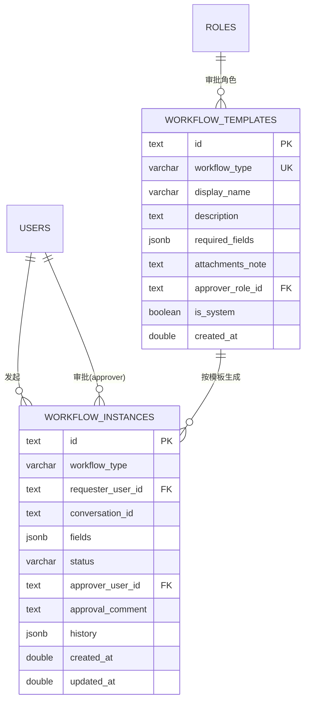
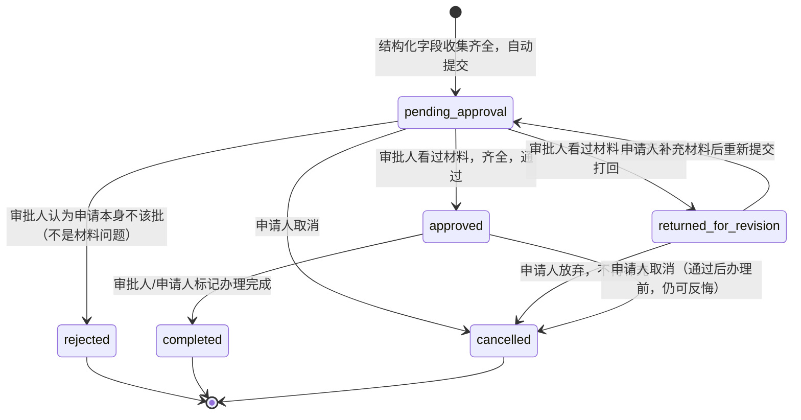
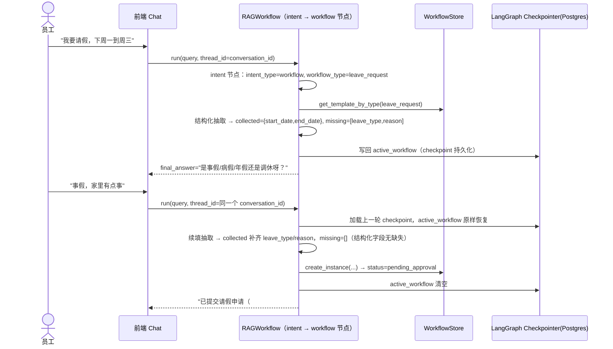
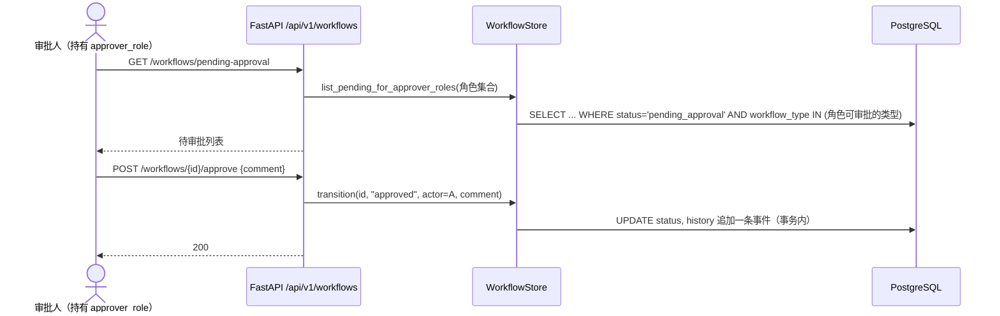
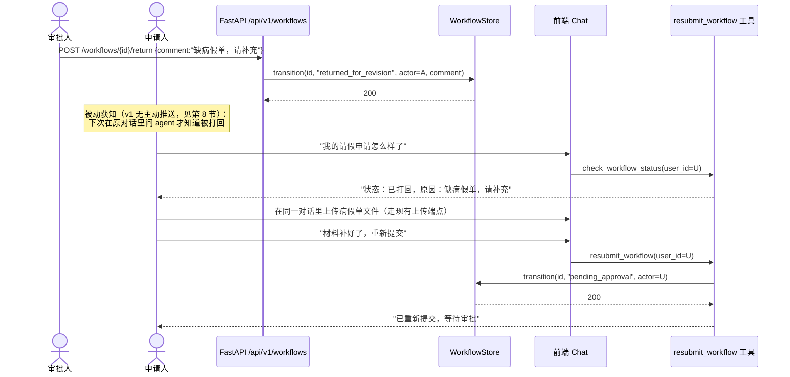

# 工作流（Workflow）接入系统 技术方案

> **状态：已实施（2026-08-25 核实：`src/ragent_backend/workflow_store.py` 784 行、
> 前端 `WorkflowTemplateManagement.jsx` 均已存在）**
> 当前状态以 `CLAUDE.md` 为准。本文与 `work-flow-web.md`、`work-flow-v2.md`
> 讲的是同一件事（合计 856 行），**待合并**。
> 关联现状代码：`src/ragent_backend/workflow.py`、`intent.py`、`schemas.py`、`app.py`；
> `src/tool_agent/{tool_registry,subgraph,builtin_tools,adapters,state}.py`；
> `src/ragent_backend/{role_store,user_store,conversation_store,file_store}.py`

## 1. 背景与目标

### 1.1 场景

员工不走表单、不走 OA 系统，直接在对话里跟 AI Agent 说人话：

- "我电脑坏了，键盘按不出字了" → 报修工作流
- "我下周一到周三要请假，家里有事" → 请假工作流
- "我要出差去上海，谈客户，大概去 3 天" → 出差工作流

Agent 需要：
1. 识别出这是一个"业务流程"意图，而不是知识库问答或通用工具调用。
2. 判断具体是哪种流程（报修/请假/出差/……，可扩展）。
3. 对照该流程的必填信息模板，看当前这句话里已经说清楚了哪些字段、还缺哪些。
4. 缺信息就用自然语言追问，可能不止一轮；如果某个字段需要提交材料（如病假证明、出差审批附件），引导用户上传文件，并等文件到位后才算这个字段补齐。
5. 信息补齐后，自动生成一条工作流实例（相当于一个工单/申请单），推进到"待审批"状态。
6. 审批人（按角色）可以查看、通过/驳回；通过后申请人或经办人可以标记"已完成"。

### 1.2 现状与差距

现有系统是**单轮问答**架构（详见"3. 核心技术判断"），三分支意图路由 `clarify / rag / tool`（`schemas.py:107-116` 的 `IntentResult`）里没有"多轮收集结构化字段，直到齐全再触发一个持久化的业务对象"这类能力。这既不是知识库检索的事，也不适合套进现有的通用工具调用循环（`src/tool_agent/subgraph.py` 的 ReAct 循环没有参数校验/缺参反问机制，见第 3 节）。

### 1.3 设计决策（本轮待与用户确认）

1. **新增第 4 个意图分支 `workflow`**，与现有 `clarify / rag / tool` 并列，而不是复用/魔改 `clarify`——语义不同：`clarify` 是"这句话本身太模糊看不懂"，`workflow` 是"看懂了，这是要走个流程，按模板补字段"。
2. **不改造 ReAct 工具子图去支持缺参反问**，而是在 `RAGWorkflow` 主图里新增一个专属 `workflow` 节点，直接调用存储层，不经过 LLM 自主选参的 ReAct 循环。理由见第 3 节。
3. **流程模板（workflow_templates）可由管理员配置**，不写死在代码里——复用 `role_store.py` 的"系统种子数据 + 后台可增删改"模式：内置 3 个示例模板（报修/请假/出差）作为 `is_system=True` 的种子行，管理员可以再加新模板（比如"报销申请"），不用改代码、不用重新部署。
4. **审批人 = 持有某个角色的人**，复用现有角色系统（`role_store.py`），不新建"审批人/管理者"体系。每个模板配置一个 `approver_role_id`，审批权限判断是"当前用户的角色集合是否包含这个角色"，与 `require_role()`（`auth.py:75-100`）判断逻辑同源。系统里目前没有"谁是谁的上级"这种层级关系，v1 不引入，用角色扁平化替代（比如报修模板配 `it_dept` 角色，持有该角色的人都能审批报修单）。
5. **材料是否齐全，交给审批人判断，系统不做结构化建模**：员工要传什么材料（病假传病假单、报销传发票……）是组织内部的约定，不在 `required_fields` 里逐条定义、逐条校验——系统只知道"这类流程通常需要交材料"，具体齐不齐、真不真由人工审批时判断。附件照样复用现有的 `POST /api/v1/conversations/{conversation_id}/files` 上传通道，但 `workflow` 节点不再去核对"这个字段对应的文件传了没"；提交后进入 `pending_approval`，审批人看了材料，齐全就通过，不齐全就"打回"（新状态 `returned_for_revision`），申请人补充材料后可以重新提交，回到 `pending_approval`。理由：AI 能可靠核对的是"字段填没填"，但核对不了"这份病假单是不是真的、是不是对应这次请假"这类需要专业判断的事，把这个判断权交给人是更诚实的设计，也让系统简单很多（不用维护"附件字段-业务规则"的映射）。
6. **前端可以显式告诉后端"这次就是要发起工作流、发起哪一种"，绕开意图分类**：1.1 节描述的"员工直接说人话，AI 自己判断这是不是工作流"是兜底路径，不是唯一路径——用户点开界面上专门的"发起工作流"入口、自己选好了类型（前端设计见 `work-flow-web.md`）时，这个信息本来就是确定的，没必要再让后端跑一遍意图分类模型去"猜"用户是不是想发起工作流、猜的是哪一种。所以 `ChatRequest` 新增一个可选字段 `workflow_type`，前端带了这个字段，`_intent_node` 直接采信、跳过 `detect_intent()` 的分类调用（省一次 LLM 往返，且结果是确定的，不会分类错）；没带这个字段的普通聊天消息，还是走原来的规则/LLM 兜底分类，两条路并存，互不影响。细节见第 5.1 节。
7. **本次方案范围**：数据模型 + 意图/状态机设计 + 图节点设计 + REST API 设计。前端设计见配套文档 `work-flow-web.md`（含站内信、"发起工作流"入口等），本文档只在第 5.1/7 节记录前端需要的后端接口形状，不重复前端本身的设计。

---

## 2. 技术选型

**结论：不引入任何新依赖，完全复用现有技术栈和代码风格。**

| 层 | 选型 | 理由 |
|---|---|---|
| 持久化 | 沿用 PostgreSQL + `asyncpg` 原生 SQL，`CREATE TABLE IF NOT EXISTS` 自迁移 | 与 `role_store.py`/`user_store.py`/`conversation_store.py` 完全一致的写法，新增 `workflow_store.py`，无需引入 ORM。 |
| 跨轮状态 | **不新建外部状态表**，用 LangGraph Postgres checkpointer 天然持久化 `RAGState.active_workflow` 字段 | 见第 3 节——`summary`/`memories` 已经是"非 messages 字段靠 checkpointer 跨轮存活"的先例，复用同一机制成本最低、心智模型一致。 |
| 结构化字段抽取 | 沿用 `llm.with_structured_output(..., method="json_mode")` | `intent.py` 的 `analyze_query`/`_detect_intent_with_llm` 已经是这个模式；用 `pydantic.create_model(...)` 按模板的 `required_fields` 动态建一个 Pydantic 模型做这一轮的抽取输出约束，不需要新的 LLM 调用范式。 |
| 图节点 | 主图新增一个 `workflow` 节点（`StateGraph` 普通节点），**不**接入 `src/tool_agent/subgraph.py` 的 ReAct 子图 | 见第 3 节的取舍说明。 |
| 审批权限 | 复用 `role_store.py` 的角色系统 + `auth.require_role` 的判断范式 | 不新增权限体系，模板配置 `approver_role_id` 即可。 |
| 文件补齐 | 复用 `file_store.py`（`ConversationFileStore`）+ 现有上传端点 | 见决策 5。 |
| 后端框架 | 沿用 FastAPI + JWT，端点风格照抄 `app.py` 里 `/admin/roles*` 和 `/conversations*` 两组端点的写法 | 已有基础设施，新增 `/api/v1/workflows*` 和 `/api/v1/admin/workflow-templates*`。 |

---

## 3. 核心技术判断：为什么是"主图新节点 + checkpointer 持久化状态"，而不是"工具"

这是本方案里最容易走偏的地方，单独说清楚。

### 3.1 为什么不能简单复用现有 `clarify` 分支

`_intent_node`（`workflow.py:313-401`）判断 `need_clarify=True` 时，直接在这一轮把 `clarify_prompt` 写进 `final_answer`（`workflow.py:392-394`），图经 `clarify` 节点（`workflow.py:403-421`，纯透传）跑到 `memory_manage → archive → END`，**这个 HTTP 请求就结束了**。下一轮用户回复来的时候，是完全独立的一次 `workflow.run()` 调用，`_intent_node` 重新跑一遍 `analyze_query` + `detect_intent`，**没有任何字段记住"上一轮问的是请假的开始日期"**——它能看到的只有 `messages[-4:]` 的原始对话文本，得指望 LLM 自己从聊天记录里二次推断上下文，没有结构化的"进度"概念。这对"随便聊聊、消歧一个代词"够用，但对"按模板收集 4-5 个结构化字段，其中有的是日期、有的是附件"这种强约束场景不够可靠——多问几轮容易在 LLM 的自由推断里丢字段或反复重问已经答过的问题。

### 3.2 为什么不能简单接入现有工具调用（`tool` 分支 / ReAct 子图）

`src/tool_agent/subgraph.py` 的 `think_node`（`subgraph.py:55-101`）让 LLM 自主决定调什么工具、填什么参数（`ToolDecision.tool_calls: List[Dict]`，自由字典），`tool_node`（`subgraph.py:106-173`）直接拿这个字典去执行，**全程没有对照 `input_schema["required"]` 做校验**——参数缺了，底层 handler 直接抛 `TypeError`，被 `except Exception` 兜底成一条失败的 `ToolResult`，而不是"生成一个反问"。而且这个子图有自己独立的 `ToolSubgraphState`（`state.py:17-46`），执行完只把 `tool_summary`/`tool_execution_trace` 写回主图，**内部的 ReAct 过程（`internal_messages`）不跨主图轮次保留**——子图本身就是"一轮内部小循环，最多 `max_iterations=5` 步，然后必须给出结果"的设计，不是给"这一轮问一个字段、等用户下一句话回答"这种跨 HTTP 请求的交互设计的。硬塞进去要么破坏子图现有语义，要么得给所有工具都加一层参数校验/反问机制——影响面远大于工作流这一个场景需要的范围。

### 3.3 采用的方案：主图新节点 + `active_workflow` 状态字段

`RAGState`（`schemas.py:143` 起）是 `TypedDict, total=False`，每个键在 LangGraph 里是一个独立 channel。`_session_node` 的注释明确写了"LangGraph 会自动从 checkpointer 加载 messages 和 summary"（`workflow.py:266`）——这不是 messages 独有的特权，`summary`（滚动摘要）、`memories`（长期记忆召回结果）同样是普通 TypedDict 字段，靠 checkpointer 原样持久化并在下一轮恢复。`app.py` 传给 `workflow.run()` 的 `initial_state` 只是 `{query, user_id, conversation_id, task_id, top_k}` 这几个键（新一轮请求不会传的字段，checkpoint 里的旧值原样保留）。

**结论：给 `RAGState` 加一个 `active_workflow: Optional[Dict[str, Any]]` 字段，专属 `workflow` 节点读写它，就能免费获得"填表进度跨对话轮次持久化"的能力，不需要任何新的外部状态存储、不需要客户端在请求里回传进度。** 这是最小改动、最贴合现有架构习惯的做法。

---

## 4. 数据模型

新增两张表（+ 一张轻量的审批时间线可以先塞进 `history` JSONB 列，不单独建表，YAGNI）：

```sql
-- 流程模板（管理员配置，定义某类工作流需要哪些结构化字段）
CREATE TABLE IF NOT EXISTS workflow_templates (
    id                TEXT PRIMARY KEY,
    workflow_type     VARCHAR(64) UNIQUE NOT NULL,   -- 内部标识，如 "laptop_repair"
    display_name      VARCHAR(128) NOT NULL,          -- 展示名，如 "电脑报修"
    description       TEXT NOT NULL DEFAULT '',       -- 给意图分类 LLM 看的说明，帮助判断"这句话该不该匹配这个模板"
    required_fields   JSONB NOT NULL,                 -- 见 4.1 字段 schema（只含结构化字段，不含附件）
    attachments_note   TEXT NOT NULL DEFAULT '',       -- 自由文本，如"请附上病假单/发票等材料"；只用于提交前提醒，系统不解析、不校验
    approver_role_id  TEXT REFERENCES roles(id) ON DELETE SET NULL,  -- 谁能审批；NULL=暂无人可审批，需管理员配置
    is_system         BOOLEAN NOT NULL DEFAULT FALSE, -- true = 内置示例模板，不可删除（可编辑字段/审批角色）
    created_at        DOUBLE PRECISION NOT NULL
);

-- 工作流实例（一条申请/工单）
CREATE TABLE IF NOT EXISTS workflow_instances (
    id                  TEXT PRIMARY KEY,
    workflow_type       VARCHAR(64) NOT NULL,
    requester_user_id   TEXT NOT NULL REFERENCES users(id) ON DELETE CASCADE,
    conversation_id     TEXT,                          -- 发起该工作流的对话，便于溯源；不设外键（对话可能被清理）
    fields              JSONB NOT NULL,                 -- 收集完成的结构化字段值，如 {"leave_type":"事假","start_date":"2026-08-24",...}
    status              VARCHAR(20) NOT NULL DEFAULT 'pending_approval',
                        -- pending_approval / returned_for_revision / approved / rejected / completed / cancelled
    approver_user_id    TEXT REFERENCES users(id) ON DELETE SET NULL,
    approval_comment    TEXT,
    history             JSONB NOT NULL DEFAULT '[]',    -- 轻量审计轨迹：[{event,ts,actor_user_id,comment?}, ...]
    created_at          DOUBLE PRECISION NOT NULL,
    updated_at          DOUBLE PRECISION NOT NULL
);
CREATE INDEX IF NOT EXISTS idx_workflow_instances_requester ON workflow_instances(requester_user_id);
CREATE INDEX IF NOT EXISTS idx_workflow_instances_status ON workflow_instances(status);
CREATE INDEX IF NOT EXISTS idx_workflow_instances_type ON workflow_instances(workflow_type);
```

`is_system=TRUE` 的种子行是 4 个示例模板（见 4.2），迁移/首次启动时按 `role_store.py:_ensure_schema` 同款的 `INSERT ... ON CONFLICT (workflow_type) DO NOTHING` 写入，`approver_role_id` 留空（`NULL`），因为哪个角色该审批"报修"因公司组织架构而异，不能替管理员做决定——上线后需要管理员在后台把 `it_dept` 之类的角色配上去，这是一个**必须的部署后步骤**，会在第 8 节风险里显式标注，不是可以被代码自动兜底的事。

### 4.1 `required_fields` 的 JSON Schema（存在 `workflow_templates.required_fields` 里）

**只覆盖结构化字段（文本/枚举/日期/数字），不含附件。** 员工要交什么材料是组织内部的约定（病假交病假单、报销交发票……），不适合让系统把这份约定拆成一条条结构化规则去校验——AI 能可靠核对"这个枚举字段有没有填"，但核对不了"这份病假单是不是真的、对不对得上这次请假"，这种判断本来就该留给人工审批做，勉强让系统去建模只会既复杂又不可靠。所以附件不进 `required_fields`，改成模板级的一句自由文本提醒（`workflow_templates.attachments_note`），只用来在提交前提醒员工，不参与任何校验、不阻塞提交——齐不齐全，审批人说了算（见 6.1、6.2）。

```json
[
  {
    "key": "leave_type",
    "label": "假期类型",
    "type": "enum",
    "required": true,
    "options": ["事假", "病假", "年假", "调休"]
  },
  {
    "key": "start_date",
    "label": "开始日期",
    "type": "date",
    "required": true
  },
  {
    "key": "end_date",
    "label": "结束日期",
    "type": "date",
    "required": true
  },
  {
    "key": "reason",
    "label": "事由",
    "type": "text",
    "required": true
  }
]
```

`type` 支持 `text` / `date` / `enum`（配 `options`）/ `number`，每个字段就是一个静态的 `required: true/false`，没有条件依赖——这次不引入类似"字段 A 等于某值时字段 B 才必填"的机制，等真的出现结构化字段之间有条件依赖的需求时再评估，不预先设计。

### 4.2 四个内置示例模板

| workflow_type | display_name | 结构化必填字段 | 结构化可选字段 | `attachments_note`（提交前提醒文案，不校验） |
|---|---|---|---|---|
| `laptop_repair` | 电脑报修 | `issue_description`(text), `urgency`(enum: 低/中/高) | `location`(text，工位/楼层) | （无，报修一般不需要材料） |
| `leave_request` | 请假申请 | `leave_type`(enum: 事假/病假/年假/调休), `start_date`(date), `end_date`(date), `reason`(text) | — | "如果是病假，请把病假单发我；其它假期类型一般不需要额外材料。" |
| `business_trip` | 出差申请 | `destination`(text), `start_date`(date), `end_date`(date), `purpose`(text) | — | "请把出差审批单/邀请函之类的材料发我，审批人会看。" |
| `expense_reimbursement` | 报销申请 | `expense_category`(enum: 差旅/餐饮/办公用品/其他), `amount`(number) | `note`(text，备注说明) | "请把发票/报销单据发我，缺票据审批人会打回。" |

四个模板的 `attachments_note` 措辞各不相同（报修不提材料、请假只在特定情况提、出差和报销都明确要求）——这就是"约定不进系统"的直接体现：文案本身是给人看的自然语言，模板与模板之间要传什么完全靠这句话各自表达清楚，系统不解析这句话、不知道"病假"和"病假单"之间有什么逻辑关系，纯粹是人读的提醒。

### 4.3 ER 图



### 4.4 实例状态机



"填表中"（结构化字段还没收集齐）**不落库**，只存在于当前对话的 `RAGState.active_workflow`（checkpointer 持久化）里；真正写入 `workflow_instances` 表的那一刻，状态直接就是 `pending_approval`——此时结构化字段是齐的，但材料（附件）齐不齐还不知道，这是刻意的：材料这件事本来就不打算在提交前用系统校验卡住员工，让审批人在审批时判断，判断不齐就走 `returned_for_revision` 而不是在提交前反复追问。这样避免了大量"填了一半又不填了"的结构化半成品数据落到业务表里，符合现有 `ltm_store.py` 之类"只持久化确定要保留的东西"的克制风格；同时把"材料是否合规"这个系统判断不了的问题，干脆地交还给流程本身的下一环（人工审批）去解决，而不是让 AI 硬撑。

`returned_for_revision` 和 `rejected`是两种不同的审批人操作，业务含义不同：`returned_for_revision`（打回补充材料）意味着申请本身是合理的，只是材料还不齐，员工补完还能继续走完这次申请；`rejected`（驳回）意味着这次申请本身就不该批（比如请假理由不合理），是终态，员工要办同一件事得重新发起一次新的申请。两者都通过 `POST /workflows/{id}/return` 和 `POST /workflows/{id}/reject` 两个不同的端点触发（见第 7 节），不合并成一个"reject with reason"，因为对申请人来说"能不能直接补材料重来"和"这事儿黄了"是完全不同的心理预期，UI/话术上也应该分开处理。

---

## 5. 意图与状态设计

### 5.1 前端显式提示：`ChatRequest.workflow_type` → `_intent_node` 短路

1.3 节决策 6 提到的能力，具体落地在这里。`schemas.py` 的 `ChatRequest` 新增一个可选字段：

```python
class ChatRequest(BaseModel):
    query: str
    conversation_id: Optional[str] = None
    top_k: int = 5
    workflow_type: Optional[str] = None   # 新增：前端"发起工作流"入口显式带出的类型（work-flow-web.md）
```

`app.py` 的 `chat`/`chat_stream` 两个端点把这个字段透传进 `initial_state`（跟现有 `query`/`top_k` 同一批传入，不单独处理）。`RAGState`（5.3 节）对应加一个瞬态字段 `workflow_type_hint: Optional[str]`——只在当轮被 `_intent_node` 消费，不需要跨轮持久化的语义（跟 `active_workflow` 不是一回事：`workflow_type_hint` 是"这一轮请求带来的新信号"，`active_workflow` 才是"跨轮持久化的进行中状态"）。

`_intent_node` 在原有的 `analyze_query`/`detect_intent` 调用之前插入一段短路判断：

```python
hint = state.get("workflow_type_hint")
if hint and not state.get("active_workflow"):
    # 续填中忽略 hint——active_workflow 存在本身已经是路由优先级最高的信号
    # （见 5.4 节），两个信号打架时以续填为准，避免"填到一半又点了一次
    # 发起入口"把进行中的状态搞乱。
    template = await self._workflow_store.get_template_by_type(hint)
    if template is not None:
        intent = IntentResult(
            intent_type="workflow",
            workflow_type=hint,
            rewritten_query=state["query"],
            confidence=1.0,
            reasoning="前端显式指定，跳过分类",
        )
        # 直接用这个 intent 构造 update（同原有流程），
        # 完全跳过 analyze_query + detect_intent 两次 LLM 调用
    # template 为空 = 前端缓存的类型列表过期了（模板被下线/改名），
    # 不能假设前端传来的值一定合法——忽略 hint，退回下面的正常分类兜底
```

**这是两条路并存，不是替换**：用户不用这个入口、直接打字说"我电脑坏了"，仍然走 5.2 节（原三分支基础上新增的）`IntentDetectionResult`/`_WORKFLOW_KEYWORDS` 分类兜底去识别；只有当前端明确带了合法的 `workflow_type` 时，才跳过这次分类，直接给出确定结果——省一次 LLM 往返，且不会被分类器猜错。

### 5.2 `IntentResult` 扩展（`schemas.py:107-116`）

```python
class IntentResult(BaseModel):
    intent_type: Literal["clarify", "rag", "tool", "workflow"] = "rag"  # 新增 "workflow"
    confidence: float
    rewritten_query: str
    target_tool: Optional[str] = None
    tool_args: Optional[Dict[str, Any]] = None
    need_clarify: bool = False
    clarify_prompt: Optional[str] = None
    reasoning: Optional[str] = None
    workflow_type: Optional[str] = None    # 新增：intent_type=="workflow" 时，匹配到的模板 workflow_type
```

`intent.py` 的 `IntentDetectionResult`（结构化 LLM 输出模型）同步加 `Literal[...,"workflow"]` 和 `workflow_type` 字段；分类 prompt 里追加一段"可用流程模板列表"（`workflow_type: display_name — description`，从 `WorkflowStore.list_templates()` 读，与现有 `available_tools` 拼进 prompt 的方式（`intent.py:271-283`）完全对称）。规则兜底（`_detect_intent_rule_based`，`intent.py:330-376`）同步加一张 `_WORKFLOW_KEYWORDS: Dict[str, List[str]]`（如 `laptop_repair: ["电脑坏了","报修","键盘","屏幕"]`），与现有 `_TOOL_KEYWORDS` 平级、无 LLM 时的 fallback。这套分类逻辑是 5.1 节短路失败（无 hint，或 hint 非法）时的兜底，两者共用同一个 `IntentResult` 输出形状。

### 5.3 `RAGState` 扩展（`schemas.py:143` 起）

```python
class RAGState(TypedDict, total=False):
    ...
    # === 前端显式提示（瞬态，只在当轮消费，不跨轮持久化） ===
    workflow_type_hint: Optional[str]

    # === 工作流（跨轮持久化，靠 checkpointer） ===
    active_workflow: Optional[Dict[str, Any]]
    # 形状：{
    #   "workflow_type": str,
    #   "instance_draft_id": str,       # 仅用于日志/trace 关联，非落库 id
    #   "collected_fields": Dict[str, Any],
    #   "missing_field_keys": List[str],
    #   "awaiting_field_key": Optional[str],  # 当前这一轮追问的是哪个字段
    # }
```

### 5.4 路由优先级（`_route_after_intent`，`workflow.py:119-132`）

```python
def _route_after_intent(self, state: RAGState) -> str:
    # 有未完成的工作流时，优先继续填表，不管这一轮意图分类器猜成什么——
    # 分类器面对"事假"这种孤立词很容易误判成 clarify/rag，续填的确定性
    # 应该压过通用分类结果。
    if state.get("active_workflow"):
        return "workflow"
    intent_type = state.get("intent_type", "rag")
    if state.get("need_clarify"):
        return "clarify"
    if intent_type == "workflow":
        return "workflow"
    if intent_type == "tool":
        return "tool_subgraph" if self._llm is not None else "retrieve"
    return "retrieve"
```

新增 `graph.add_node("workflow", self._workflow_node)`，`graph.add_edge("workflow", "memory_manage")`（跟 `clarify` 一样跳过 `generate`——追问话术和"已提交"确认语要精确到字段名/工单号，不能让通用生成节点二次改写，参照 `_generate_node` 对 `"## 无权访问"` 前缀的"禁止 LLM 改写"先例，`workflow.py` 里 `_generate_node` 段落）。

**优化项（非必须，可后续加）**：`_intent_node` 一开始可以先判断 `state.get("active_workflow")`，若有则跳过 `analyze_query`/`detect_intent` 这两次 LLM 调用，直接把 state 原样传给路由——续填阶段不需要重新做指代消解和三分类，省两次 LLM 往返。这跟 5.1 节的短路是同一类优化，覆盖两种不同的场景：5.1 节短路的是"首次发起、但前端已经明确告诉后端是哪种类型"，这里短路的是"续填阶段，压根不需要再分类"——两处都不调用分类模型，一起看的话，`_intent_node` 只有在"首次发起 + 没有 hint"这一种情况下才会真的跑一遍完整的 `analyze_query`/`detect_intent`。

---

## 6. 核心逻辑

### 6.1 `workflow` 节点行为（新增 `_workflow_node`，风格对齐 `_clarify_node`/`_retrieve_node`）

```
输入：state（含 query、user_id、conversation_id，可能含 active_workflow）

1. 取消检测（规则，不过 LLM，对齐 intent.py 里"模糊代词"这类硬规则检查的风格）：
   若 active_workflow 存在且 query 命中 ["取消","算了","不填了"] 之类关键词
   → 清空 active_workflow，final_answer="已取消本次「{display_name}」申请。"，结束。

2. 若 active_workflow 不存在（本轮是新发起）：
   - template = WorkflowStore.get_template_by_type(intent.workflow_type)
   - 若 template 为空或 approver_role_id 为空 → final_answer 提示"该流程暂未配置审批人，请联系管理员"，不进入填表（避免生成一个永远没人能批的工单）
   - 否则：用 pydantic.create_model 按 template.required_fields 动态建模型，
     llm.with_structured_output(..., method="json_mode") 对 query 做一次抽取
     （抽取 prompt 附带"今天日期"，帮 LLM 把"下周一"这类相对表达换算成 ISO 日期）
   - 初始化 active_workflow = {workflow_type, collected_fields=抽取结果,
     missing_field_keys=[required_fields 里 required==true 且 collected_fields 里还没有值的 key]}

3. 若 active_workflow 已存在（本轮是续填答复）：
   - 对 missing_field_keys 里的字段（尤其是 awaiting_field_key）再做一次同样的结构化抽取，
     把新抽到的值合并进 collected_fields，重新计算 missing_field_keys（只看结构化字段，附件不参与这个循环，见 6.2）

4. 校验：date 类型字段抽取结果做 ISO 格式校验，不合法则该字段重新计入
   missing_field_keys（视为"没答上"），避免脏数据落库

5. 若 missing_field_keys（结构化字段）非空：
   - awaiting_field_key = missing_field_keys[0]（一次只追问一个字段，体验上更像聊天而不是表单）
   - final_answer = 用字段的 label 生成一句追问
   - state 更新：写回 active_workflow（status 隐含为"填表中"，因为还没落库）

6. 若 missing_field_keys 为空（结构化字段齐了）：
   - WorkflowStore.create_instance(workflow_type, requester_user_id=user_id,
     conversation_id, fields=collected_fields) → status 直接是 pending_approval
   - active_workflow 清空（None）
   - final_answer = "已为你提交「{display_name}」申请（编号 #{instance_id 短码}）。
     {template.attachments_note}
     已抄送 {approver 角色 display_name} 审批，材料不齐会被打回，结果会在对话里通知你。"
     （`attachments_note` 只在这一步整段附加进确认语里提醒一次，不逐字段追问、不做任何校验；
     v1 的"通知"先做成"下次用户主动问`我的xx申请怎么样了`时能查到"，见 6.3；
     主动推送通知是后续可以叠加的能力，不在本方案范围内，见第 8 节）
```

### 6.2 材料交给审批人判断，系统只负责提醒和承接"打回重提"

结构化字段收集齐全就直接提交（见 6.1 步骤 6），**不等、不查、不校验有没有传附件**——`workflow` 节点在确认提交时把模板的 `attachments_note` 整段附加进回复里提醒一次（"如果是病假，请把病假单发我"），仅此而已。员工上传材料仍然走现有的 `POST /api/v1/conversations/{conversation_id}/files`（前端"知识库文件"抽屉），不新增通道，但系统不会去检查"传的是不是审批人要的那份材料""传没传"，这件事完全交给审批人在 `GET /workflows/{id}` 详情页里人工判断。

审批人的判断结果只有两种走向（对应 4.4 状态机的分叉）：
- **材料齐全、内容也没问题** → `POST /workflows/{id}/approve`，进 `approved`。
- **材料不齐或有问题** → `POST /workflows/{id}/return`，body 必须带 `comment` 写清楚缺什么（如"缺病假单，请补充医院开的证明"），进 `returned_for_revision`。这个 `comment` 是自由文本，系统不解析、不跟踪"到底缺哪个字段"（本来就没有字段级建模），完全靠审批人写清楚——这是人工流程的固有摩擦，见第 8 节风险。

`returned_for_revision` 状态下，申请人在**原来那个对话**里继续把材料传上去，然后跟 agent 说类似"材料补好了，重新提交"——这会命中一个新的轻量内置工具 `resubmit_workflow`（风格同 6.3 的 `check_workflow_status`）：

```python
async def handler(workflow_id: Optional[str] = None, user_id: str = None) -> Any:
    # workflow_id 为空 = 该用户最近一条 status=="returned_for_revision" 的实例；
    # user_id 服务端强制注入，校验该实例确实是这个用户发起的
    # 找到后：WorkflowStore.transition(id, "pending_approval", actor=user_id)，
    # history 追加一条 "resubmitted" 事件，不改 fields（结构化字段没变，只是材料补了）
    ...
```

这条路径没有走专属 `workflow` 节点的多轮收集逻辑（因为没有结构化字段要问，只是状态跳转），跟 6.3 的查询工具一样走通用工具调用循环即可，符合"结构化收集用专属节点、单轮明确操作用通用工具"的既有职责划分（第 3 节）。

这里有一个现实约束：现有 `conv_{conversation_id}` collection 的文件上传是"进知识库"语义（会被 ingest pipeline 处理、切块、向量化），工作流材料其实只是"存个文件给审批人看"，语义不完全一样。v1 先直接复用（成本最低），但审批人查看工作流详情时应该能直接下载/预览申请人传的材料，而不是指望它被检索到——这需要在 API 设计里加一个"根据 file_id 直接取文件"的读接口，见第 8 节风险中的确认结论。

### 6.3 "查询我的工作流状态"走现有工具调用路径，不是新节点

单纯的状态查询（"我上次提的报修单处理了吗"）是标准的"单轮、参数清晰"的工具调用场景，不需要多轮追问，适合直接注册成一个新的内置工具 `check_workflow_status`，走现有 `src/tool_agent/builtin_tools.py` 的注册范式（照抄 `_register_get_document_summary`，`builtin_tools.py:106-120`）：

```python
async def handler(workflow_id: Optional[str] = None, user_id: str = None) -> Any:
    # workflow_id 为空 = 查该用户最近一条；user_id 由 tool_node 强制服务端注入（
    # subgraph.py:121-125 的既有模式），不信任 LLM 填的值
    ...
```

这样"创建"（多轮结构化收集，专属节点）和"查询/重提"（单轮，通用工具调用，含上一节的 `resubmit_workflow`）职责分开，各自用最适合的现有机制，不互相搭车。`check_workflow_status` 返回内容里，若实例状态是 `returned_for_revision`，要把 `approval_comment`（审批人打回时写的原因）带出来，不然员工只知道"被打回了"却不知道该补什么。

### 6.4 时序图

**① 首次发起 + 多轮补齐结构化字段**



**② 审批**



**③ 材料不齐，打回 → 补充材料 → 重新提交**



---

## 7. API 设计

风格照抄 `app.py` 里 `/api/v1/admin/roles*`（管理资源）和 `/api/v1/conversations*`（带 owner 校验的用户资源）两组端点的既有写法。

| Method | Path | 权限 | 说明 |
|---|---|---|---|
| `GET` | `/api/v1/workflow-templates` | 登录用户 | 轻量列表，只返回 `[{workflow_type, display_name, description}]`，不含 `required_fields`/`approver_role_id` 等管理细节；供前端"发起工作流"入口的下拉框用（5.1 节、`work-flow-web.md`），跟下面 super_admin 专属的 `/admin/workflow-templates`（返回全量配置）区分开，避免为了一个下拉框给普通用户开管理接口的权限 |
| `GET` | `/api/v1/admin/workflow-templates` | super_admin | 列出所有模板（全量配置） |
| `POST` | `/api/v1/admin/workflow-templates` | super_admin | 新建模板（自定义流程类型） |
| `PATCH` | `/api/v1/admin/workflow-templates/{id}` | super_admin | 改 `display_name`/`description`/`required_fields`/`attachments_note`/`approver_role_id`；`workflow_type`/`is_system` 不可改 |
| `DELETE` | `/api/v1/admin/workflow-templates/{id}` | super_admin | 删除；`is_system=True` 拒绝（同 `role_store.delete_role` 的保护模式） |
| `GET` | `/api/v1/workflows` | 登录用户 | 我发起的工作流列表，`?status=` 过滤 |
| `GET` | `/api/v1/workflows/pending-approval` | 登录用户 | 我（按角色）能审批的待处理列表 |
| `GET` | `/api/v1/workflows/{id}` | 发起人 或 有权审批的角色持有者 | 详情（含 `history`） |
| `POST` | `/api/v1/workflows/{id}/approve` | 对应 `approver_role` 持有者 | body: `{comment?}`；材料齐全时用 |
| `POST` | `/api/v1/workflows/{id}/return` | 同上 | body: `{comment}`（必填，写清楚缺什么材料）；材料不齐时用，`pending_approval → returned_for_revision`，申请人补完可重新提交 |
| `POST` | `/api/v1/workflows/{id}/reject` | 同上 | body: `{comment}`（必填）；申请本身不该批时用，终态，不可恢复 |
| `POST` | `/api/v1/workflows/{id}/resubmit` | 发起人 | 仅 `returned_for_revision` 状态可用，`→ pending_approval`；对话里由 `resubmit_workflow` 工具调用，见 6.2 |
| `POST` | `/api/v1/workflows/{id}/complete` | 审批人 或 发起人 | 标记办理完成（`approved → completed`） |
| `POST` | `/api/v1/workflows/{id}/cancel` | 发起人 | 只要还没到终态（`pending_approval`/`returned_for_revision`/`approved` 均可）就能取消，`rejected`/`completed`/`cancelled` 之后不可再取消 |

**刻意不设计**"直接 POST 创建工作流实例"的端点——按用户需求，创建这件事应该只发生在对话里由 `workflow` 节点触发（信息补齐是核心价值），REST 层只负责查看/审批/管理生命周期。如果后续要支持"管理员代提交"之类的场景，再单独评估。

**已有的 `POST /api/v1/chat`/`/api/v1/chat/stream` 也要跟着改**（不是新增端点，是给现有请求/响应体加字段）：
- 请求体 `ChatRequest` 新增可选的 `workflow_type`（5.1 节），前端"发起工作流"入口带上这个字段。
- 响应体 `ChatResponse`（以及流式接口 SSE 的 `done` 事件）新增一个字段，暴露"这一轮结束时是否还处于工作流填写中"：
  ```python
  class ChatResponse(BaseModel):
      ...
      active_workflow: Optional[dict] = None
      # 非 None 时形如 {"workflow_type": "leave_request", "display_name": "请假申请",
      #                  "missing_count": 2, "total_count": 4}
      # 直接从 RAGState.active_workflow 加模板的 required_fields 总数算出来，
      # None 表示这一轮结束后没有进行中的工作流（刚提交完/刚取消/本来就不是工作流轮次）
  ```
  这个字段是 `work-flow-web.md` 里"填写中：请假申请（2/4 项）"状态胶囊的唯一数据来源——前端不自己猜、不自己在多轮之间拼凑进度，全靠后端每轮如实上报。

鉴权 helper 参照 `app.py` 的 `_require_conversation_owner`（`app.py:256-265`）写一个 `_require_workflow_access(instance_id, current_user, mode="owner"|"approver")`：`owner` 模式检查 `requester_user_id == current_user.user_id`；`approver` 模式查模板的 `approver_role_id`，再查当前用户角色集合是否包含它（复用 `RoleStore.get_user_roles`，与 `auth.require_role` 同源判断逻辑，但因为审批角色是"per-模板动态"的，不能用静态的 `require_role(*names)` 工厂，得是运行期查模板后再判断）。

---

## 8. 风险与开放问题

- **材料是否齐全完全靠人工判断，系统不做任何校验**：这是 §1.3 决策 5 的核心取舍，好处是简单、诚实（不假装 AI 能替审批人判断材料真伪），代价是可能出现"员工完全没传材料就提交、审批人打回、员工再传、再提交"这种来回，比结构化强校验多花一到两轮沟通成本。`attachments_note` 提醒（6.1 步骤 6）能降低但不能杜绝这种情况——这是本方案有意识接受的权衡，不是缺陷，但实现时如果发现打回率过高，可以考虑给这句提醒加更强的措辞，而不是走回头路重新引入结构化校验。
- **"打回"原因是自由文本，系统不做结构化跟踪**：审批人打回时的 `comment`（`POST /workflows/{id}/return`）全靠手写清楚缺什么，系统不会提示审批人"你漏说了要什么"，也不会替员工把"缺病假单"这句话转成结构化的"还差 sick_leave_note 字段"。如果审批人打回时写得含糊（比如只写"材料不全"），员工可能需要私下再问审批人，这是人工流程的固有摩擦，本方案不追加"结构化打回原因"机制去解决它，保持简单。
- **模板审批角色需要人工配置**：4 个内置示例模板的 `approver_role_id` 上线时是 `NULL`，工作流能收集信息但提交后没人能审批（`workflow` 节点在这种情况下会提前拦截，见 6.1 步骤 2），必须靠管理员在后台（未来的前端管理界面，或直接改 API）配好审批角色才算真正可用，不是"部署即用"。
- **材料上传与知识库上传语义混用**：6.2 节提到，工作流材料借用的是"对话文件"通道，但那条通道的设计初衷是"进知识库被检索"，语义不完全贴合"存个文件给审批人看"。已确认 `ConversationFileStore.get_file(conversation_id, file_id)`（`file_store.py:159`）能按 id 取到文件元数据（含磁盘 `file_path`），但 `app.py` 目前只有上传/列表/删除三个文件端点，**没有"下载/取原始文件内容"的 REST 端点**。审批人查看工作流详情时如果要预览/下载申请人传的材料，需要新增一个类似 `GET /api/v1/conversations/{conversation_id}/files/{file_id}/download` 的端点（用 FastAPI 的 `FileResponse` 读 `file_path`），且鉴权不能沿用现有的"仅对话所有者可访问"（`_require_conversation_owner`），得放宽成"对话所有者 或 该文件关联的工作流实例的审批人"——这是实现阶段需要补的一个小缺口，不是本方案能自动兜住的。这个缺口在"材料齐不齐靠人工判断"的设计下比之前更关键：审批人必须能实际打开文件才能做判断，不是可选项。
- **没有主动推送通知，"打回"场景下影响更明显**：v1 里"审批结果/打回通知申请人"是被动的（用户主动问 `check_workflow_status` 工具才能看到最新状态和打回原因，见 6.3），没有做主动推送（站内信/WebSocket/邮件）。现有系统有 `/ws/trace/{conversation_id}` 这条 WebSocket 通道，但那是给"当前正在跑的这次对话"推送 LangGraph 执行 trace 用的，跟"审批人在另一个会话里点了打回、要推给申请人"这种跨会话通知不是一回事，需要新的推送机制，这次方案不含，留作后续迭代。因为材料齐全与否完全靠审批人事后判断，"打回"会比纯粹的"通过/驳回"更频繁地发生，被动通知的时延问题在这个设计里比之前更值得优先补上。
- **续填阶段的意图误判兜底**：`_route_after_intent` 里"只要 `active_workflow` 存在就无条件进 `workflow` 节点"，意味着用户如果中途聊别的（比如临时插一句"顺便帮我查个文档"），也会被当成是在回答缺失字段，可能导致抽取出一堆无关或为空的字段值。6.1 步骤 1 的"取消"关键词能兜底"我不填了"，但兜不住"我想临时问点别的，回头再填"这种插话场景。v1 先接受这个限制（多轮填表期间视为"专注模式"），是否需要"识别插话意图并允许挂起工作流、之后再继续"，作为开放问题留给用户反馈后再决定是否要做。
- **字段抽取的可靠性依赖 LLM 结构化输出**：日期类字段尤其容易出错（相对表达"下周一"的换算依赖 prompt 里塞的"今天日期"是否准确、时区处理等），6.1 步骤 4 有基础的 ISO 格式校验兜底（不合法就当没填、继续追问），但无法保证语义正确（比如"下周一"到底是哪一天，模型理解错但格式仍合法）。需要在提交前的确认语里把收集到的字段值完整复述一遍给用户看，本设计的 6.1 步骤 6 目前只回了工单号，**建议后续细化为"提交前必须有一步'请确认以下信息：...'的复核环节，用户确认了才真正落库"**，这是当前方案的一个明显改进点，值得在下一轮设计里加进去。
- **前端设计已拆到配套文档**：具体的页面、组件、站内信、"发起工作流"入口交互，见 `work-flow-web.md`，本文档不重复。
- **前端缓存的类型列表可能滞后于后端**：5.1 节里 `_intent_node` 已经对 `workflow_type_hint` 做了"模板不存在就忽略、退回正常分类"的兜底，所以这不是一个会导致错误的风险，只是实现时容易漏掉的一个校验点——前端 `GET /api/v1/workflow-templates`（第 7 节）的结果是登录后拉一次、本地缓存的，如果管理员这期间下线/改名了某个模板，用户点到的还是旧列表里的类型，后端必须靠这层校验兜住，不能假设前端传来的 `workflow_type` 一定合法。
