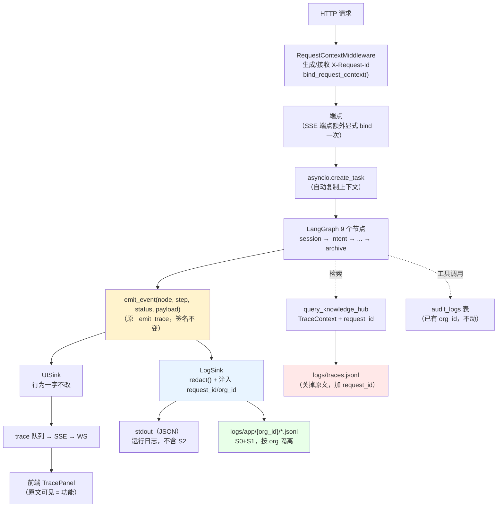

# 结构化日志 + request id 贯穿链路 —— 设计方案

> **状态：阶段一已实施（2026-08-25）。阶段二/三/四未实施。**
>
> | 阶段 | 状态 |
> |---|---|
> | 阶段 0（清 `traces.jsonl`） | ✅ 已移出活跃路径（见文末「阶段一实施记录」） |
> | **阶段一**（`context.py` / `redact.py` / `configure_logging` / 8 处 print / 轮转） | ✅ **已实施，117 条单测保护** |
> | 阶段二（`app.py`：中间件 + 29 处 print） | ⬜ 未实施 |
> | 阶段三（`workflow.py`：`_emit_trace` 双 sink + 13 处 print） | ⬜ 未实施 |
> | 阶段四（前端短码 + 按 org 分文件 + 保留期运维） | ⬜ 未实施 |
>
> ⚠️ 本文 §1 / §2 的「现状」描述写于实施前，**阶段一涉及的部分已经过时**
> （`logger.py` 已扩展、`write_trace` 已删、`traces.jsonl` 已移走）。
> 当前实际状态以文末「阶段一实施记录」为准。
>
> **日期**：2026-08-25
> **死期**：**2026-11-30**。到期仍未实施则本文作废（按 `CLAUDE.md` §7.4「还没实现的重要方案必须有死期」）；
> 实施完成后必须改状态标记或删除，不得留着假装描述当前状态。
>
> **代码状态**：基线 commit `b787bce`。行号按**当前工作区**逐条核对（核对方法见文末附录 A）。
> ⚠️ 本文写作期间 HEAD 从 `6eaedf8` 变为 `b787bce`（另一会话提交了在途工作），
> `app.py` / `workflow.py` / `query_knowledge_hub.py` 的工作区已变干净，
> 但**写权限归属不因提交而改变**（`CLAUDE.md` §7.6）。第 §8 节的分期仍按「这几个文件不能碰」排。
> 写作时工作区脏路径：`scripts/verify_security_posture.py`、`scripts/security_results/`（均与本文无关）。
>
> **结论分档**（严格区分，全文不混用）：
> - **已验证通过** —— 有可复现的测试/命令，我实际跑过并看到输出
> - **已跑通** —— 手工执行过一次，无自动化保护
> - **已实现但未验证** —— 代码在那里，本次没有执行确认
> - **设计推断** —— 尚未落地，本文提出的方案，不是现状描述
>
> **前置约定（用户已确认，本文不再论证）**：不使用 Langfuse / LangSmith / Phoenix 等外部平台，自建。
> 理由：① 多租户 SaaS，日志含客户知识库原文，第三方云留存有数据治理问题；
> ② 自托管又多一个要部署/备份/升级的服务，而本项目连 Dockerfile 和 CI 都还没有；
> ③ Langfuse 最有价值的在线评估依赖 golden set，而当前 golden set 只有 12 条且缺负样本类别。

---

## 0. 结论速览

| 问题 | 结论 |
|---|---|
| 现有 `logger.py` 够不够 | **扩展，不重写**。`JSONFormatter` 直接可用；缺的是「上下文注入」和「配置入口」两件事 |
| request id 怎么贯穿 | 复用 `contextvars`（与 P0-1 同一套机制），FastAPI 中间件生成，后台任务自动继承 |
| 和 `_emit_trace` 什么关系 | **单一埋点 + 双 sink**，在 sink 层分叉字段策略。不是合并，也不是并存 |
| 敏感数据 | **三级分级 + 默认最严**；最终 prompt **无论什么级别都不记原文** |
| 输出到哪 | stdout（运行日志，容器友好）+ 文件（按 org 分的事件流）双写，环境变量切换 |
| 54 处 print | 实为 **53 处**（1 处是字符串字面量里的假阳性）；分四类，79% 集中在写权限被占的两个文件 |
| 第一阶段能否独立产生价值 | **能** —— 它把「知识库原文落盘」这个最大风险点关掉，即使后续阶段永不实施也不是半成品 |

**最重要的一条发现**（已验证，非推断）：
`logs/traces.jsonl` **现在就在活跃写入**，3.2 MB / 706 行，其中 **177 行含知识库原文片段**
（实测单块最长 971 字符），每行含用户提问明文，**无 `org_id` 字段、无轮转、无保留期**。
这不是"将来上日志会有的风险"，是**已经存在的数据治理问题**。详见 §2.4。

---

## 1. 现状盘点

### 1.1 不是三套割裂，是**四套**

用户任务书里说的是"两套体系割裂"。实际盘点下来是**四套**，而且第四套（审计）恰恰是唯一
已经把多租户过滤做对的那套：

| # | 体系 | 入口 | 写到哪 | 谁消费 | 有 request id 吗 | 有 org 隔离吗 |
|---|---|---|---|---|---|---|
| ① | `TraceContext` / `TraceCollector` | `src/core/trace/trace_context.py` | `logs/traces.jsonl` | Streamlit dashboard | 有 `trace_id`，但**每次检索自己 new 一个 uuid4**，与聊天请求无关联 | ❌ |
| ② | `_emit_trace` | `workflow.py:358` | 内存队列 → SSE → WebSocket | 前端 `TracePanel` | ❌ | ❌（且 WS 无鉴权） |
| ③ | `observability/logger.py` | `get_logger` / `JSONFormatter` / `get_trace_logger` / `write_trace` | stderr / 文件 | 无 | ❌ | ❌ |
| ④ | `AuditStore` | `audit_store.py:97` | Postgres `audit_logs` 表 | `/admin/audit-logs` 端点 | ❌ | ✅ **有 `org_id` 列 + 索引** |

**逐条核实**（已验证通过）：

- **① 仍在活跃写入**，不是死代码。`query_knowledge_hub.py` 有 **14 处** `TraceCollector().collect(trace)`
  （`:621, :625, :688, :692, :959, :964, :1395, :1434, :1445, :1451, :1458, :1466` 等），
  而 `QueryKnowledgeHubTool` 正是聊天链路的检索实现 —— 也就是说**每次聊天检索都会往
  `logs/traces.jsonl` 写一行**，只是这行和聊天请求之间没有任何 id 能 join 上。
  文件最后修改时间 2026-08-25 18:01，706 行，3,227,359 字节。
- **③ 只有 `get_logger` 有生产调用方**（7 处：`ingestion` 5 + `mcp_server` 2）。
  `JSONFormatter` / `get_trace_logger` / `write_trace` 的**唯一引用方是 `tests/unit/test_jsonl_logger.py`** ——
  全仓 grep 零生产调用点。**结构化日志的地基已经浇好了，但从来没有人站上去过。**
- **④ 已经在记工具调用**：`subgraph.py` 的 `tool_node` 每次工具执行后 await 一次 `audit_log` 回调
  （`app.py:336-362` 的 `_audit_log` 会补上 `org_id`/`username` 再落库）。
  也就是说 OWASP LLM08 要求的「记录谁在何时查询了哪个知识库」**已经有了**，
  只是它和 ①②③ 之间同样没有 id 能 join。

### 1.2 后端日志现状（三个数字都要修正）

| 说法 | 实测 | 差异说明 |
|---|---|---|
| `CLAUDE.md` §4 P1：「后端 **48** 处 `print()`」 | **54 处 grep 命中** | 已过期，需修正 |
| 任务书：「54 处 `print()`」 | **53 处真实调用** | `auth.py:79` 是**字符串字面量里的 `print(`**（一句给用户看的命令行提示），不是调用点 |
| 任务书：「老 RAG 库层 5 个 `logging.getLogger`」 | **27 个模块级 `logger = logging.getLogger(__name__)`** | 分布：`observability` 9 · `core` 7 · `libs` 5 · `mcp_server` 3 · `tool_agent` 2 · `ingestion` 1 |

53 处真实 `print` 的分布（已验证）：

| 文件 | 数量 | 写权限 |
|---|---|---|
| `src/ragent_backend/app.py` | 29 | ⚠️ 被占 |
| `src/ragent_backend/workflow.py` | 13 | ⚠️ 被占 |
| `src/ragent_backend/intent.py` | 3 | 可动 |
| `src/ragent_backend/file_store.py` | 2 | 可动 |
| `src/ragent_backend/auth.py` | 1（+1 假阳性） | 可动 |
| `store.py` / `memory_manager.py` / `ltm_store.py` / `audit_store.py` | 各 1 | 可动 |
| `src/tool_agent/subgraph.py` | 1 | 可动 |

**`app.py` + `workflow.py` = 42/53 ≈ 79%**。

### 1.3 已经存在的"半个 request id"：`task_id`

这是本方案是"接线"而非"从零建"的关键证据：

- `schemas.py:15` —— `ChatRequest.task_id: Optional[str]`，**前端可以传**
- `app.py:2656` / `app.py:2707` —— `"task_id": request.task_id or os.urandom(8).hex()`（16 位十六进制）
- `workflow.py:512-513` —— 兜底 `str(uuid.uuid4())`
- `store.py:32` —— **已经落进 messages 归档表**
- `app.py:2797` —— `done` 事件里回传给前端
- **前端零引用** —— `grep -rn "task_id\|taskId" frontend/src` **0 命中**（已验证）

也就是说：id 已经生成了、已经落库了、已经传到前端了，但**没进任何日志、前端没显示、也没有跨节点**。
接线的起点比想象中靠前。

### 1.4 敏感数据现状（已验证，不是推测）

对 `logs/traces.jsonl` 的实测统计：

| 指标 | 实测值 |
|---|---|
| 行数 / 体积 | 706 行 / 3,227,359 字节（约 4.5 KB/行） |
| 单行最大 | **55,802 字节** |
| 含 `metadata.final_results[].text`（**知识库原文**）的行 | **177 / 706** |
| 单个 chunk 原文最长 | **971 字符** |
| `metadata.query`（**用户提问明文**） | **每行都有**，截断 200 字符（`query_knowledge_hub.py:520`） |
| `org_id` 字段 | ❌ 本地检索路径**完全没有**；只有委托检索的 `remote_search` 阶段带（`:1394`） |
| 轮转 / 保留期 | ❌ 无 |
| 按 org 分离 | ❌ 单一全局文件 |
| `trace_type` 分布 | `query` 678 / `ingestion` 28 |

写入点：`query_knowledge_hub.py:943-952` ——
```
trace.metadata["final_results"] = [
    {"chunk_id": ..., "score": ..., "text": r.text or "", "source": ..., "title": ...}
    ...
]
```
`"text": r.text or ""` 就是**未经任何处理的知识库原文**。

配套事实：
- `.gitignore:96-97` 忽略 `logs/` 和 `*.log` → 不会误提交进 git，**但也意味着没有任何机制在管它的生命周期**
- `/ws/trace/{conversation_id}`（`app.py:2823-2827`）**`accept()` 之前无任何鉴权**，
  `conversation_id` 是 uuid4，猜中即可订阅他人的实时 trace。
  这条 `CLAUDE.md` §4 P0-4 已列（「trace WebSocket 无鉴权」），本文只是补上它对日志方案的约束意义：
  **凡是推给 `_emit_trace` 的字段，等于推给了一个无鉴权通道。**
- `workflow.py:1386` —— 提示词泄露拦截时把 `buffer[:200]` 写进审计表 `detail`。
  那 200 字符**就是泄露出来的系统提示词本身**。见 §5 对"错误路径全量"的讨论。

### 1.5 测试基础设施现状

- `tests/conftest.py` —— **只有 3 个路径 fixture**（`project_root` / `sample_documents_dir` / `config_dir`），
  **无 DB fixture、无 LLM fixture、无 app fixture**
- `ragent_backend` + `tool_agent` 共 **12,200 行零测试覆盖**（`CLAUDE.md` §4 P1）
- **唯一的后端单测样板**：`tests/unit/test_workflow_stream_isolation.py`
  —— 9 条真并发，用 `_FakeStore` / `_FakeLLM`（`:33-45`）直接构造 `RAGWorkflow`，不连 DB、不调 LLM。
  **本方案的测试设计整个建立在这个样板上**（§7）。
- 现有 `tests/unit/test_jsonl_logger.py` 已覆盖 `JSONFormatter` 7 条 + `write_trace` / `get_trace_logger`
  —— 扩展 `logger.py` 时**这些必须还过**，是现成的回归护栏。

---

## 2. 设计问题逐条

### 2.0 先决问题：现有 `logger.py` 够不够用

#### 方案对比

| 方案 | 内容 | 优点 | 缺点 |
|---|---|---|---|
| A 沿用不改 | 直接 `get_logger(__name__)` 到处用 | 零改动 | 见下面三条硬伤，request_id 根本进不去 |
| B **扩展**（推荐） | 保留 `JSONFormatter`，新增 context / filter / configure 三件套 | 保住现有 7 处调用方 + 7 条现成单测；改动面小 | 需要动 `get_logger` 的一处行为（见下） |
| C 重写 | 换 `structlog` / 自己重来 | 上下文注入是 `structlog` 的一等公民 | 多一个依赖；27 个模块级 logger 和 7 处 `get_logger` 全要改；现有单测全废 |

#### 推荐：**B（扩展，不重写）**

**够用的部分**（不要动它）：

- `JSONFormatter.format`（`logger.py:80-101`）已经把 `extra=` 传进来的字段**平铺进 JSON 顶层**（`:90-96`），
  这正是结构化日志需要的形状。
- `:93-96` 对不可 JSON 序列化的值降级为 `str(val)`，**不会因为一个字段丢整条日志** ——
  这个防御性写法是对的，符合项目一贯的"优雅降级"风格。
- `_INTERNAL_ATTRS`（`:72-78`）已经把 Python 内部字段挡掉了。

**不够的三点**（这就是"扩展"要补的）：

1. **`get_logger` 有全局副作用。** `logger.py:45-49` 调 `logging.basicConfig(level=..., format=..., stream=sys.stderr)`。
   `basicConfig` 只在 root 无 handler 时生效 → **第一个调用者决定全进程的 level 和格式，后来者的
   `log_level` 参数静默失效**。而且格式写死为人类可读、输出写死 stderr ——
   **走这条路拿不到 JSON**。要么全进程 JSON，要么全进程都不是，没有中间态。
2. **没有任何上下文注入机制。** 靠 `extra={"request_id": ...}` 手填的话，53 个调用点全都要写，
   加上未来新增的调用点，**必然漏**。而"漏了一处"在日志里表现为"这条查不到"，不产生异常，
   属于 `CLAUDE.md` §7.2 说的那类"不产生异常输出的缺陷"。
3. **`get_trace_logger` 用的是 `logging.FileHandler`（`:134`），不轮转、无 stdout。**
   容器化之后文件写进容器可写层，重启即丢。

#### 扩展形态（接口形态，不写代码）

新增 `src/observability/context.py`：

| 名称 | 形态 | 职责 |
|---|---|---|
| `_REQUEST_CTX` | `ContextVar[Optional[RequestContext]]`，`default=None` | 当前请求的上下文 |
| `RequestContext` | frozen dataclass：`request_id` / `org_id` / `user_id` / `conversation_id` / `turn_id` / `route` | 不可变，避免"某个节点悄悄改了别人的上下文" |
| `bind_request_context(**kw)` | `set()` 一个新对象（**不是就地改**） | 绑定 |
| `get_request_context()` | 读，可能返回 `None` | 读取 |
| `clear_request_context()` | `set(None)`，**不提供 `reset(token)`** | 清理（见 §2.1 的坑） |

扩展 `src/observability/logger.py`：

| 名称 | 形态 | 职责 |
|---|---|---|
| `ContextInjectingFilter(logging.Filter)` | 在 `filter()` 里把 `get_request_context()` 的字段贴到 record 上 | **让 53 个调用点不用手填 request_id** |
| `configure_logging(level, fmt, dest, ...)` | 显式、幂等的一次性 root 配置，参数可注入 | 取代 `basicConfig` 的隐式全局副作用 |
| `get_logger(name, log_level)` | **签名一字不改**，内部改为委托 `configure_logging` | 保住 7 处现有调用方 |
| `JSONFormatter` | 原样保留，加一个可替换的 redactor hook | 见 §2.4 |
| `write_trace` / `get_trace_logger` | **标记为待删**（零生产调用方） | 见待拍板 D-10 |

> ⚠️ `get_logger` 内部从 `basicConfig` 改为 `configure_logging` 是**本方案里唯一的既有行为变更点**。
> 它会影响 `ingestion` / `mcp_server` 那 7 处调用方的输出格式。必须单独测（T-10），
> 且这一条要在阶段一就做完、跑过，不能留到后面。

---

### 2.1 request id 怎么贯穿

#### 能否复用 P0-1 那套 contextvars 模式

**能，而且应该 —— 但要注意本场景与队列场景的三点不同。**

相同的部分（直接沿用，`workflow.py:108-131` 的注释已经把道理讲透了）：
- `asyncio.create_task` **复制创建时刻的上下文**，所以子任务自动继承
- 不同 asyncio Task 的上下文彼此独立，FastAPI 的 `StreamingResponse` 每个请求一个 Task

必须沿用的两条纪律（`CLAUDE.md` §5 已钉死）：
- **`set()` 必须在 `asyncio.create_task(...)` 之前**（参考 `workflow.py:424-428`：先 `set` 两个队列，
  再 `create_task(self._compiled.ainvoke(...))`，注释明确写了"必须在 set 之后创建"）
- **清理必须用 `set(None)` 而非 `reset(token)`**（`workflow.py:483-488`：
  异步生成器清理时所处上下文未必是当初 set 的那个，`reset` 跨上下文会抛 `ValueError`，
  反而把真正的退出原因盖掉）

#### 不同的三点（这是新风险，队列那次没遇到）

**（a）生成点在中间件，而中间件和 SSE 生成器体不在同一个上下文里。**

FastAPI 的 `@app.middleware("http")` 在 `await call_next(request)` 前后执行。
但 `StreamingResponse` 的**生成器体是在 middleware 返回之后**，由 Starlette 的响应发送逻辑迭代的。
迭代它的那个上下文是否还带着 middleware 里 `set` 的值 —— **这一条我没有实测，属于设计推断，
必须在实施前先验证**（测试用例 T-3）。

**兜底方案（这条一定成立，因为它就是已验证过的那条路径）**：
不依赖中间件透传，在 `chat_stream` 端点函数体第一行显式 `bind_request_context(...)`，
再往下走到 `workflow.run_stream` → `create_task`。这与 `workflow.py:424-428` 是同一个模式，
已经被 `test_workflow_stream_isolation.py` 的 9 条并发测试保护着。

推荐做法：**两条都做**。中间件负责非流式的 71 个端点（覆盖面广、改动为零），
SSE 端点额外显式绑一次（覆盖最重要的那条链路、且不依赖未验证的假设）。

**（b）中间件顺序。** `app.py:628-634` 已经注册了 `CORSMiddleware`。Starlette 的中间件是洋葱模型，
**后注册的在更外层**。`RequestContextMiddleware` 应该注册在 CORS 之后（即更外层），
这样连 CORS 预检失败的请求也能有 request_id。这是个实施细节，但会影响 T-3 的断言写法。

**（c）`_emit_trace` 每次埋点都 `create_task`。** `workflow.py:366-376` 里
`asyncio.create_task(self._trace_queue.put({...}))` —— 每次埋点创建一个一次性 task，
每个都会复制一份上下文。一次请求约 50 次埋点 ≈ 50 次上下文复制。
**这是内存开销，不是正确性问题**（`copy_context` 是浅拷贝），但规模上来后值得知道。
本方案不改它。

#### id 生成规则

| 项 | 方案 |
|---|---|
| 来源优先级 | ① 入站 `X-Request-Id` 头（企业网关/反代常会带，接进来才能和客户的链路对上）→ ② 自己生成 |
| 格式 | `uuid4().hex[:16]`（16 位十六进制，**对齐现有 `os.urandom(8).hex()` 的风格**，`app.py:2707`） |
| 入站校验 | 必须做：限长（≤128）、字符白名单（`[A-Za-z0-9_-]`）。**外部可控字符串会进日志，不校验就是日志注入面** |
| 出站 | 所有响应回写 `X-Request-Id` 头 |

#### 与既有 `task_id` 的关系（**待拍板 D-1**）

| 选项 | 做法 | 优点 | 缺点 |
|---|---|---|---|
| 合一 | `app.py:2707` 的 `request.task_id or os.urandom(8).hex()` 改为 `... or get_request_id()` | 只有一个 id 要查、要显示、要报 | **改变 `task_id` 语义**（原本前端可指定），且它已落进 messages 归档表，历史数据含义会分裂 |
| **并存**（我倾向） | 日志里同时记 `request_id` 和 `task_id`，`request_id` 做主键 | 零语义变更；`task_id` 继续做业务侧的"这轮对话"标识 | 用户报 id 时要说清报的是哪个（靠前端只显示一个来解决） |

**我倾向并存，但这条必须你拍板** —— 因为"合一"更省事，而省事的代价（DB 里历史 `task_id`
的含义分裂）是否可接受，取决于你打算怎么用 messages 表里那一列。

#### 后台任务怎么继承

| 后台任务 | 位置 | 继承方式 | 需要改吗 |
|---|---|---|---|
| 归档 `append_to_history` | `workflow.py:1624` | `create_task` 自动复制 | ❌ 零改动 |
| LTM 事实抽取 | `workflow.py:1655` | 同上 | ❌ |
| KB 摄入 | `app.py:1828`、`app.py:2410` | 同上 | ❌ |
| SSE pump / heartbeat | `app.py:2757-2758` | 同上 | ❌ |
| 检索里的 `asyncio.to_thread` | `query_knowledge_hub.py:913, 921, 929` | Python 3.9+ 的 `to_thread` 内部用 `contextvars.copy_context()` | ❌，**但必须写测试钉死**（T-4） |
| 模型保活 `keep_warm_task` | `app.py:580` | lifespan 起的常驻任务，**没有请求上下文** | 需要容忍 `request_id=None`（T-9） |

> `to_thread` 那条是典型的「注释/文档里声称的不变量」。`CLAUDE.md` §7.2 明确：
> **要么验证、要么标为未证实假设，不得当作依据**（参考 `workflow.py` 那条"并发互不串"的错误注释
> 导致 P0 长期未被发现）。所以 T-4 不是可选的。

**一个容易犯的错**：`run_stream` 的 `finally` 里 `set(None)`（`workflow.py:487-488`）
**不会**影响已经 `create_task` 出去的后台任务 —— 它们持有的是创建时刻的上下文副本。
这是正确行为，但反直觉，所以 T-5 专门拦它。

#### 怎么让用户能报给你

链路：`响应头 X-Request-Id` → `axios 响应拦截器` → 挂在最后一条 assistant 消息上 → UI 显示。

前端已有全局 axios token 拦截器（`api/workflow.js:3` 的注释提到"复用 App.jsx 挂的全局 token 拦截器"），
加一个响应拦截器是同一个位置、同一套写法。

**显示形态**（待拍板 D-5）：

| 选项 | 说明 |
|---|---|
| 回答气泡右下角淡色短码 + 点击复制 | 用户随手就能报，但所有终端用户都看得见内部 id |
| 收进已有的 `TracePanel` 顶部 | `TracePanel` 已经是可开关的调试面板（`App.jsx:1013-1015`, `:1155-1157`），**天然就是"给想看的人看"的位置** |
| 仅 `RAGENT_DEBUG=true` 或管理员角色可见 | 最保守；但用户报障时正好是非 debug 环境 |

**我倾向：默认收进 `TracePanel`（它已经存在、已经可开关），同时在错误提示里始终带上短码。**
理由：答错了的场景里，用户看到的往往是一段"看起来正常但内容不对"的回答，
这时候他要能找到 id；而系统真报错的时候更要有。但企业客户是否希望终端用户看到内部 id，
是产品判断，我不替你定。

---

### 2.2 和 `_emit_trace` 是什么关系（本文最重要的一节）

#### 先把两者的真实差异摆出来

| 维度 | `_emit_trace`（现状） | 运维日志（要建的） |
|---|---|---|
| 消费者 | **终端用户**（`TracePanel`） | 运维 / 开发 |
| 通道 | 内存队列 → SSE 循环 → `broadcast_trace` → WebSocket | 落盘 / stdout |
| 生命期 | **请求结束即消失** | 需要保留期 |
| 传输鉴权 | **无**（`app.py:2823-2827`，`accept()` 前无校验） | 文件系统权限 / 日志平台权限 |
| 丢失的后果 | 面板少一行 | **查不了案** |
| 敏感字段 | 用户看自己的东西，原文可见是**功能** | 原文落盘是**风险** |
| 字段粒度 | 给人看的摘要（`{"目的": "决定是否调用工具"}`，`subgraph.py:219`） | 给机器聚合的结构化数值 |
| 失败语义 | `create_task` 推队列，失败静默 | 失败也必须静默（不能拖垮业务），但要有降级计数 |

#### 三个方案

| 方案 | 做法 | 判断 |
|---|---|---|
| **A 完全合并** | `_emit_trace` 里同时推队列 + 写日志，同一份 payload | ❌ **不可行**。上表最后三行说明两者对字段的要求是**冲突**的，不是相似的。合并等于让无鉴权 WebSocket 和运维日志共用一套字段策略 —— 要么 UI 失去信息，要么日志多一个泄露面 |
| **B 完全并存** | 各埋各的，两套调用点 | ❌ **成本不可接受**。`_emit_trace` 已有 **58 处调用**（`workflow.py:505` 到 `:1664`，`grep -c "self\._emit_trace("`）+ `subgraph.py` **7 处**（`:189, :219, :230, :274, :281, :430, :432`）。**再埋一套 65 处**，且两套必然随时间漂移 |
| **C 单一埋点 + 双 sink**（**推荐**） | `_emit_trace` **签名一字不改**，内部改为 `emit_event(...)` → 分发给多个 sink，**字段策略在 sink 层分叉** | ✅ |

#### 推荐 C，理由

**1. 埋点位置已经在正确的地方了。**
`_emit_trace` 已经覆盖 `session / intent / retrieve / tool_subgraph / workflow / clarify / generate /
memory_manage / archive` **全部 9 个节点**，而且颗粒度已经细到子步骤
（`query_rewrite` / `intent_detect` / `knowledge_retrieval` / `prompt_build` / `llm_stream` /
`compact_check` / `memory_compact`）。**58 + 7 = 65 处埋点已经付出过成本**，重埋一遍是纯浪费。

**2. "合并的坏处"的解法不是不合并，是在 sink 层分叉。**
用户在任务书里指出的顾虑完全成立：两种消费者对敏感字段的要求完全不同。
但这个冲突发生在**字段策略**层，不在**埋点位置**层。C 方案就是把这两层拆开：

```
                          ┌─→ UISink   ── 队列 → SSE → WS → TracePanel   （行为一字不改）
emit_event(node, step,    │
   status, payload) ──────┤
                          └─→ LogSink  ── redact() → logger → stdout/文件（注入 request_id/org_id）
```

**3. 一个已经存在的反例证明必须分叉。**
`workflow.py:626` —— `self._emit_trace("intent", "query_rewrite", "running", {"original_query": query})`。
这条推给用户看自己的提问，没有任何问题；进运维日志就是**用户提问明文落盘**。
同类的还有 `subgraph.py:274` 的 `{"args": {...}}`（对 `query_knowledge_hub` 而言就是用户的问题）。
**同一个事件，两个消费者，两套字段策略 —— 这正是 sink 分叉存在的理由。**

**4. 「一处埋点」不等于「一条数据」。**
sink 拿到的是同一个事件对象，各自决定记多少、记什么形态。UI sink 可以拿原文，
Log sink 拿到的是 `redact()` 之后的版本。

#### C 方案的代价（诚实说）

- 要改 `workflow.py:358-376` 这个函数 —— 它在 **P0-1 修复路径上**（`_trace_queue` 属性解析）。
  改它有回归风险。缓解：`test_workflow_stream_isolation.py` 的 `TestTraceQueueIsolation`（`:220-243`）
  已经在保护这条路径，改完必须跑过；且新的 sink 分发**必须保持"UI sink 永远第一个执行"**，
  这样即使 LogSink 抛异常也不影响用户看到的东西（T-11）。
- 这条列成**待拍板 D-8**。

#### 顺带的好处

`scripts/benchmark_latency.py` 现在靠**伪造一个 WebSocket 客户端**（`:309-338` 的 `TraceCollector` 类，
duck-typing 冒充 ws 塞进 `app.active_trace_ws`）来抓阶段耗时。有了 LogSink 之后，
脚本可以直接读日志，不再需要这个 hack。
**但本轮不改它** —— 它现在是活脚本、能跑，`CLAUDE.md` §8 标着"可复现，活脚本"。

#### 第三套（`TraceContext` / `traces.jsonl`）怎么办

**推荐：不合并，但打通 id。这是本方案里收益最高、改动最小的一条。**

现在的割裂是：聊天请求有 `task_id`，检索细节在 `traces.jsonl` 里有自己的 `trace_id`，
**两者无法 join**。所以"用户说答错了"→ 你能查到聊天记录，但查不到那次检索到底召回了什么、
分数多少、重排前后差多少。

改法（接口形态）：`QueryKnowledgeHubTool.execute` 接受一个可选的 `request_id`，
写进 `trace.metadata["request_id"]`。涉及 5 处 `TraceContext(trace_type="query")` 构造点
（`query_knowledge_hub.py:519, 578, 613, 668, 680`）。

**为什么不合并**：`traces.jsonl` 的消费者是 Streamlit dashboard（`observability/dashboard/`），
它有自己的 schema 假设（`trace_service.py`）。合并要改 dashboard，收益不抵成本。
打通 id 之后，两边用 `request_id` join 即可。

---

### 2.3 记什么字段

#### 公共字段（每条事件都有）

| 字段 | 来源 | 敏感级 |
|---|---|---|
| `ts` | 事件时间（ISO-8601 UTC，`JSONFormatter` 已有，`logger.py:83`） | S0 |
| `level` / `logger` / `message` | `JSONFormatter` 已有 | S0 |
| `event` | 事件名，形如 `node.step.status`（如 `retrieve.knowledge_retrieval.success`） | S0 |
| `request_id` | contextvar 注入 | S0 |
| `task_id` | contextvar / state | S0 |
| `conversation_id` | `RAGState` 已有 | S1 |
| `turn_id` | `state["current_turn_id"]`（`workflow.py:1620` 已有） | S1 |
| `user_id` | `RAGState` 已有 | S1 |
| `org_id` | **`RAGState` 里没有**（`schemas.py:477-529` 无此字段）→ 见待拍板 D-6 | S1 |
| `node` / `step` / `status` | `_emit_trace` 现有三个参数 | S0 |
| `duration_ms` | 新增（现在只有 `ts`，前端自己算差值，`TracePanel.jsx:73-75`） | S0 |

> ⚠️ **`org_id` 是硬约束但当前拿不到**。`RAGState` 里没有，`_audit_log`（`app.py:349`）是
> 每次现查 `org_store.get_org_for_user(user_id)`。选项见 D-6。

#### 逐节点字段清单

以下按本项目实际链路
`session → intent → (retrieve | tool_subgraph | workflow | clarify) → generate → memory_manage → archive`
逐节点列。「现状」列标明该字段是否已经在采。

**request（中间件层，新增）**

| 字段 | 现状 | 级 |
|---|---|---|
| `method` / `path` / `route_template` / `status_code` / `duration_ms` | 新增 | S0 |
| `client_ip` / `user_agent` | 新增，**待拍板 D-9**（个人信息） | S1 |

**session**

| 字段 | 现状 | 级 |
|---|---|---|
| `conversation_id` / `is_new_conversation` | 已有（`workflow.py:508-509`） | S1 |
| `ltm_recalled_count` | **现在只有 `print`**（`workflow.py:559`） | S0 |
| `message_count` / `has_summary` | 状态里有，未埋 | S0 |
| `_turn_start_ts` | 已有（`workflow.py:1595` 用它算 `turn_latency_ms`） | S0 |

**intent**（双模型分工是本项目核心特征，必须能区分是哪个模型判的）

| 字段 | 现状 | 级 |
|---|---|---|
| `intent_model`（`_intent_llm` 的模型名，如 `qwen2.5-1.5b-router`） | **未埋** —— 但 `CLAUDE.md` §2 的双模型分工全靠它才能事后归因 | S0 |
| `intent_type` / `intent_confidence` / `need_clarify` | 已埋（`workflow.py:669`） | S0 |
| `target_tool` / `target_workflow_type` | 已埋（`:682, :688`） | S0 |
| `rewrite_applied` (bool) / `sub_query_count` | 部分已埋（`:651`） | S0 |
| `chitchat_whitelist_hit` (bool) | **未埋** —— 这正是 `CLAUDE.md` §4 P1 那条闲聊路由问题的关键归因字段 | S0 |
| `fallback_path`（合并调用失败退化成两次调用，`intent.py:867`） | **现在只有 `print`** | S0 |
| `latency_ms` | 已可从 ts 差算，应显式记 | S0 |
| ~~`query` / `rewritten_query` / `original_query`~~ | **默认不记原文**，只记 `query_len` + `query_sha256[:12]` | **S2** |

**retrieve**

| 字段 | 现状 | 级 |
|---|---|---|
| `collection` / `candidate_collections` | 已埋（`workflow.py:1089`） | S1 |
| `top_k` / `result_count` / `sub_query_count` | 已埋（`:1090, :1106, :1177`） | S0 |
| **`chunk_ids[]` + `scores[]`** | `traces.jsonl` 里有（`query_knowledge_hub.py:945-946`），**`_emit_trace` 侧没有** | S1 |
| `rerank_applied` / `rerank_score_min` / `max` | `record_stage("rerank_merge")` 有（`:1330`） | S0 |
| `filtered_by_relevance_count`（被 `MIN_RELEVANCE_SCORE=0.1` 砍掉几条） | 未显式记 | S0 |
| `injection_filtered_count` | `record_stage("injection_filter")` 有（`:1056`） | S0 |
| 分段耗时：`embed` / `dense` / `sparse` / `fusion` / `rerank` | **`query_knowledge_hub.py` 已经在采**：`narrow_detail`（`:1171, :1181, :1199`）、`build_hybrid_searches`（`:1266`）、`search_one_collection`（`:1287`）、`parallel_recall`（`:1306`）、`rerank_merge`（`:1330`） | S0 |
| ~~`chunk text`~~ | **不记** —— 这正是 `traces.jsonl` 现在在记的东西 | **S2** |

> 检索这一节的结论很特别：**业界基准要求的字段几乎全都已经在采了**
> （`review_industry_baseline.md:796` 的「各段延迟、token 数、检索到的块 ID/分数」），
> 只是采在一个和聊天请求 join 不上的文件里，而且**顺手把原文也采了**。
> 所以 retrieve 这一节的工作不是"补埋点"，是"打通 id + 关掉原文"。

**tool_subgraph**

| 字段 | 现状 | 级 |
|---|---|---|
| `agent`（supervisor 选的专家 agent） | 已埋（`subgraph.py:189`） | S0 |
| `iteration` / `iterations_used` / `hit_max_iterations` | 部分已埋（`:219, :230`） | S0 |
| `tool_name` / `success` / `latency_ms` | 已埋（`:281-283`） | S0 |
| `tool_arg_keys[]`（**只记键名，不记值**） | 现在记的是 `{"args": {...}}` 全值（`:274`） | **改** |
| `thought` | 现在记 `decision.thought[:100]`（`:230`）—— 模型推理文本 | **S2** |
| ~~`tool args 值` / `tool output`~~ | 不记（工具输出可能是知识库原文/考勤数据） | **S2** |

**workflow**

| 字段 | 现状 | 级 |
|---|---|---|
| `workflow_type` / `template_id` / `instance_id` | 部分已埋（`workflow.py:896, :939`） | S1 |
| `event`（`blocked_no_approver` / `blocked_in_flight` / `cancelled` / `template_missing`） | 已埋（`:808, :835, :845, :864`） | S0 |
| `approver_role_id` / `requester_org_id` | 状态里有（`:794, :831`），未埋 | S1 |
| `field_extract_ok` / `missing_field_count` | `intent.py` 侧有，未埋 | S0 |
| ~~抽取出的表单字段值~~（请假事由等） | **不记** —— 这是业务数据 | **S2** |

**clarify**

| 字段 | 现状 | 级 |
|---|---|---|
| `clarify_reason` / `clarify_prompt_len` | 部分已埋（`workflow.py:765`） | S0 |
| ~~`clarify_prompt` 原文~~ | 不记 | S2 |

**generate**（业界基准点名的字段最集中的一节）

| 字段 | 现状 | 级 |
|---|---|---|
| `model`（`used_model`） | 已埋（`workflow.py:1397`） | S0 |
| `prompt_len` | 已埋（`:1319` 的 `prompt_length`） | S0 |
| **`prompt_sha256[:12]`** | 未埋 —— 见 §2.4，这是"不记原文但能追溯"的关键 | S0 |
| **`prompt_template_version`** | **当前不存在这个概念**。prompt 硬编码在 `_build_prompt` 里 | S0 |
| `prompt_tokens` / `completion_tokens` / `total_tokens` / `estimated` | **`_extract_token_usage` 已经算好了**（`workflow.py:146-175`），落进 `last_turn_tokens` | S0 |
| **`ttft_ms`** | **当前完全没测**。`_PROMPT_LEAK_CHECK_WINDOW=200`（`workflow.py:105`）让 TTFT 成为已知的 P1 问题（`CLAUDE.md` §4），**没有这个字段就无法在线观察它** | S0 |
| `stream_chunk_count` | 已埋（`:1398` 的 `token_count`，名字有歧义——它是 chunk 数不是 token 数） | S0 |
| `short_circuit`（`privilege_claim` / `access_denied` / `empty_kb_hit`） | 已埋（`:1237, :1271, :1304`） | S0 |
| `prompt_leak_blocked` | 已埋（`:1399`） | S0 |
| `kb_sources[]` | 状态里有（`:1414`） | S1 |
| ~~最终 prompt 原文 / 回答原文~~ | **绝不记，任何级别都不记**。见 §2.4 | **S2+** |

> `review_industry_baseline.md:202` 提了一条尖锐的核对项：
> 「**改写后的 query 是否被记录进 trace**？如果没记，检索出问题时无法归因是改写坏了还是检索坏了。」
> 本方案的答案是：**记 `rewritten_query_sha256` + `rewritten_query_len` + `rewrite_applied`，不记原文**。
> 这能回答"改写有没有发生""两次是不是同一个改写结果"，但**不能直接看到改写成了什么**。
> 这是 S2 策略的真实代价，列进待拍板 D-2。

**memory_manage**

| 字段 | 现状 | 级 |
|---|---|---|
| `message_count_before` / `after` / `need_compact` | 已埋（`workflow.py:1520, :1524, :1528`） | S0 |
| `compact_ok` / `fallback_used`（LLM 不可用时降级拼接，`memory_manager.py:139`） | 部分只有 `print` | S0 |
| `summary_len` | 已埋（`:1550` 附近） | S0 |
| ~~`summary` 原文~~ | 不记 | S2 |

**archive**

| 字段 | 现状 | 级 |
|---|---|---|
| `archived_count` | 已埋（`workflow.py:1661`） | S0 |
| `ltm_facts_count` | **现在只有 `print`**（`:1651`） | S0 |
| `turn_latency_ms` | **已经算好了**（`:1595`），只落进 messages 表，没进 trace | S0 |
| `bg_task_failed` (bool) | 现在只有 `print`（`:1636, :1653`） | S0 |
| ~~LTM 事实原文~~ | 不记 | S2 |

**配置快照**（每请求一条，或启动时一条 + 变更时一条）

`review_industry_baseline.md:649` 明确要求：「所有影响检索/生成行为的参数都应该被记录进 trace，
这样才能回答『上周那个坏答案是在哪套参数下产生的』」。

| 字段 | 现状 |
|---|---|
| `llm_model` / `intent_llm_model` / `embedding_model` / `reranker_model` | 配置里有，未进日志 |
| `top_k` / `chunk_size` / `rrf_k`(=60) / `min_relevance_score`(=0.1) | 同上 |
| `generate_max_tokens`（`GENERATE_MAX_TOKENS`） | 同上 |
| `prompt_leak_check_window`（=200，`workflow.py:105`） | 同上 |
| `config_sha256[:12]` | 新增 —— 整份生效配置的哈希，一个字段就能判断"这两次是不是同一套参数" |

**推荐：每请求只记 `config_sha256`，完整快照在启动时记一条。** 每请求全量记配置是纯浪费。

---

### 2.4 敏感数据怎么处理

#### 风险面（已验证，见 §1.4）

日志里会出现四类内容：**客户知识库原文片段、用户提问、模型回答、用户长期记忆**。
其中前两类**现在就已经在落盘**（`logs/traces.jsonl`，177/706 行含原文，每行含提问明文）。

#### 四种策略对比

| 策略 | 说明 | 优点 | 缺点 | 判断 |
|---|---|---|---|---|
| 全量记 | 原文全落 | 排障能力最强 | 多租户 SaaS 下不可接受：日志文件即客户数据副本，且访问控制远弱于 API | ❌ |
| 全脱敏 | 所有内容字段一律去掉 | 最安全 | 连"这两次是不是同一个问题"都判断不了 | ❌ 过度 |
| 采样 | 按比例保留原文 | 折中 | **多租户下最坏**：被采到的那 1% 仍是客户 A 的原文，隔离要求不因采样率降低 | ❌ |
| **分级**（推荐） | 按字段敏感度定策略 | 排障能力与风险可分别调 | 需要维护一张字段分级表 | ✅ |

#### 推荐：三级分级 + 默认最严

| 级 | 内容 | 策略 |
|---|---|---|
| **S0 公开** | id、计数、耗时、模型名、分数、状态、布尔标志 | **永远记原值** |
| **S1 准标识** | `chunk_id`、`collection`、文档 `source` 路径、`user_id`、`org_id`、`conversation_id` | **记**，但受 org 隔离约束（§下文） |
| **S2 内容** | 用户提问、改写 query、chunk 原文、模型回答、LTM 事实、工作流表单值、`thought` | **默认只记 `_len` + `_sha256[:12]`，不记原文**；受开关控制 |
| **S2+ 绝不记** | **最终 prompt 原文** | **无论什么开关、什么级别，都不记** |

**S1 为什么值得单列**：`chunk_id` + `collection` 是"能查案但不泄露内容"的甜点 ——
你能知道召回了哪几块、来自哪个库、分数多少，出问题时能顺着 id 去库里查原文（需要权限）；
而日志本身不构成内容泄露面。这正是 OWASP LLM08 要求的
「记录谁、在什么租户上下文下、检索到了哪些文档 ID」（`review_industry_baseline.md:481, :803`）。

**S2 的 hash 有什么用**（不是形式主义）：
- 判断"这两次是不是同一个问题/同一份 prompt"→ 能做 A/B 归因
- 用户报障时给你原文，你自己 hash 一遍去 grep → 能定位到具体请求
- 日志本身不含内容

#### 「错误路径全量」—— 我建议**不要**默认打开

用户在任务书里提了这个常见做法（正常路径只记 id，错误路径全量）。
在多数系统里这是对的，但**本项目有个特殊性使它反转**：

**最危险的"错误"恰恰是提示词泄露和注入。**
`workflow.py:1379-1388` 已经在做这件事：泄露拦截命中时把 `buffer[:200]` 写进审计表的 `detail`。
那 200 字符**就是泄露出来的系统提示词本身**。
"错误路径全量" = 每次防住一次泄露，就往日志里抄一份泄露内容。
而 `docs/security_prompt_injection_test_report.md` 已经确认过系统提示词泄露问题真实存在。

**改为：错误路径提级到"可开关"。**

| 开关 | 默认 | 效果 |
|---|---|---|
| `RAGENT_LOG_CONTENT` | `false` | S2 字段一律 hash+len |
| `RAGENT_LOG_CONTENT=true` | 排障期临时开 | S2 记原文（**S2+ 仍然不记**），且开关状态本身要打一条 `warning` 级日志，便于事后知道"这段时间的日志是全量的" |

**诚实说明这条的代价**：只记 hash 的话，用户说"答错了"时你能查到的是：
是哪次请求、走了哪条路由（`intent_type`）、检索了哪些库、召回了哪些 `chunk_id`、
重排分数多少、被阈值砍掉几条、用了哪个模型、各段耗时多少、prompt 有多长、
**但看不到模型到底说了什么**。

**但这其实不是缺口** —— 模型说了什么**已经在 messages 归档表里了**（`store.py`，业务数据，明文）。
日志不必再存一份。这是 S2 策略能成立的根本原因：**内容的权威副本在业务库，日志只负责链路归因。**
这也是 `request_id` 必须能和 `conversation_id` / `turn_id` join 上的原因。

#### 最终 prompt 的特殊处理（S2+）

**绝不记原文，无论什么开关。** 三条理由：

1. `docs/security_prompt_injection_test_report.md` 已确认系统提示词泄露是真实问题。
   **日志里记最终 prompt = 多开一个泄露面**，而日志的访问控制天然弱于 API
   （文件可能被采集进日志平台、可能被运维截图、可能进备份）。
2. 最终 prompt 里**同时含**系统提示词 + 检索到的 chunk 原文 + 历史对话 + LTM 事实
   —— 它是本系统里敏感度最高的单个字符串，没有之一。
3. **不记原文不等于不能重建**。记这四个字段就够：
   `prompt_sha256[:12]` + `prompt_template_version` + `prompt_len` + `context_chunk_ids[]`
   —— 模板在 git 里、chunk 在库里、历史在 messages 表里。
   **重建需要有权限的人主动做，而不是躺在日志里等人读。** 这正是想要的性质。

> ⚠️ 但 `prompt_template_version` **当前不存在** —— prompt 硬编码在 `_build_prompt` 里。
> 没有它，"重建"就只能靠 commit hash 反推。
> `review_industry_baseline.md:641` 建议的轻量中间态（prompt 放版本库独立文件，不引入运行时外部依赖）
> 是配套的必要条件，但**那是另一个设计，不在本文范围**。本文只要求日志里预留这个字段。

#### 按 org 过滤（多租户硬约束）

要求：**客户 A 的运维不能看到客户 B 的内容**。

| 形态 | 做法 | 隔离强度 | 判断 |
|---|---|---|---|
| ① 单文件 + 查询时过滤 | 每条带 `org_id`，查的时候 `grep org_id=X` | ❌ **运维拿到文件就等于拿到全量**，不满足要求 | 不行 |
| ② **按 org 分文件** | `logs/app/{org_id}/YYYY-MM-DD.jsonl` | ✅ **文件系统权限即隔离边界** | **推荐** |
| ③ 进 Postgres 表 | 复用 `audit_logs` 那套 org 过滤口径 | ✅ 强，但写入路径变重（每条日志一次 DB 写） | 治理事件用 |

**推荐：分工。**
- **应用/链路日志（S0/S1）→ ② 按 org 分文件**
- **治理审计事件（谁查了哪个库、谁触发了哪个工具）→ 继续用已有的 `audit_logs` 表**
  它已经有 `org_id` 列和 `idx_audit_org_time` 索引（`audit_store.py:88`），
  已经在记工具调用，已经有 org 过滤的读端点。**不要为治理事件再造一套。**

**② 的两个坑**（必须在设计里处理，不能等实施时发现）：
- **没有 org 的请求**：未登录、登录失败、`/health`、lifespan 里的常驻任务 → 需要一个
  `logs/app/_unassigned/` 目录，且这个目录默认按**最严**策略处理（S1 也降级为 hash）。
  因为"不知道属于谁"的日志最危险。
- **每请求都要知道 org_id 才能选文件** → 这把 D-6（org_id 怎么进上下文）从"nice to have"
  变成了②方案的**前置依赖**。

#### 保留期（**必须你拍板，我不替你定**）

合规要求因客户而异，这不是技术判断。给三个参考锚点：

**锚点 1 —— 现状是"无限"。**
`traces.jsonl` 从未轮转。实测 706 行 / 3.2 MB ≈ **4.5 KB/请求**（S2 全记的口径）。
按项目定位（`CLAUDE.md` §1：10000 员工以上的大企业）外推：
10000 人 × 每人每天 3 次 = 3 万请求/天 × 4.5 KB ≈ **135 MB/天 ≈ 48 GB/年/客户**。
只记 S0/S1 大约能压到 1/10，即 **约 5 GB/年/客户**。
> ⚠️ 这个外推基于**当前测试数据下的单请求体积**，真实知识库规模下 chunk 更多、更长，
> S2 口径的数字会更大。**未验证，是推算。**

**锚点 2 —— 常见分层。**

| 层 | 常见做法 |
|---|---|
| 热（可直接查询） | 7–30 天 |
| 冷（压缩归档） | 90 天 – 1 年 |
| 治理审计 | 按合同，通常 1–3 年 |

**锚点 3 —— 两类日志必须分开定期限。**
应用日志（排障用，短）vs 审计日志（合规用，长）。
⚠️ **`audit_logs` 表现在也没有任何保留期策略**（`audit_store.py` 无清理逻辑）—— 这是同一个待拍板项。

**另外**：现存 `logs/traces.jsonl` 那 3.2 MB **已经含有真实知识库原文**。
方案落地时要决定删掉还是归档。**这个动作现在就该做，不用等设计确认**（列进阶段 0，§8）。

---

### 2.5 输出到哪

#### 三选一对比

| 方案 | 优点 | 缺点 |
|---|---|---|
| 只写文件 | 能 tail、能按 org 分 | 容器里写容器可写层，重启即丢；多副本时散在各处 |
| 只写 stdout | 12-factor、容器/k8s 原生采集 | **无法按 org 分流**（stdout 只有一条流） |
| **两者都要**（推荐） | 各司其职 | 要写两份，磁盘 IO 翻倍 |

#### 推荐：stdout 为主 + 文件 sink 可选，职责分开

| sink | 内容 | 分 org | 目的 |
|---|---|---|---|
| **stdout** | 运行日志：启动、错误、慢请求、降级告警。**不含 S2，不含 chunk 级明细** | ❌ | 容器采集、`docker logs`、人眼盯 |
| **文件** | 结构化事件流：全部 S0/S1 字段 | ✅ `logs/app/{org_id}/` | 归因查询、按 org 隔离 |

**一个关键观察**：`logs/backend.out.log`（153 KB）**已经存在** ——
说明当前的启动方式本来就是把 stdout 重定向到文件的。
所以选 stdout **不会丢掉"能 tail 一个文件"这个便利**，反而是把现在 53 处 `print` 的实际去向
（stdout → 重定向文件）正规化了。

**轮转**：现有 `get_trace_logger` 用 `logging.FileHandler`（`logger.py:134`），**不轮转**。
需要改 `RotatingFileHandler` 或 `TimedRotatingFileHandler`。
⚠️ **多 worker 约束**：`uvicorn --workers>1` 下 `RotatingFileHandler` 会互相截断
（多进程各自持有文件句柄各自 rollover）。当前是单进程，但方案要标注这个约束 ——
将来加 worker 时要么换 `WatchedFileHandler` + 外部 logrotate，要么换 QueueHandler + 单写入进程。

#### 要不要为容器化预留 —— **要**

理由具体：项目目标是交付给企业（`CLAUDE.md` §1），当前**无 Dockerfile / CI / 依赖锁定**（§4 P1）。
为容器预留的**成本几乎为零**（就是"默认往 stdout 写 JSON"这一个选择），
但事后改的成本高（所有部署脚本、日志采集配置、运维手册都要改）。

三条具体预留：

1. **配置全部走环境变量**，不写死路径：
   `RAGENT_LOG_LEVEL` / `RAGENT_LOG_FORMAT`（`json`|`text`）/ `RAGENT_LOG_DEST`（`stdout`|`file`|`both`）/
   `RAGENT_LOG_DIR` / `RAGENT_LOG_CONTENT`
2. **不假设进程有写文件权限** —— 文件 sink 初始化失败要**降级到 stdout 并打一条 warning**，不能崩。
   对齐项目一贯的"优雅降级 + 明确标注"风格（`workflow.py:146-151`、`audit_store.py:109-111`
   的注释都是这个思路）。
3. **路径一律走 `resolve_path`**（`core/settings.py:31-34`，已经是 CWD 无关的）。

#### 需不需要按 org 分文件 —— **需要，但不是第一阶段**

见 §2.4：按 org 分文件是满足"客户 A 运维看不到客户 B"的**唯一低成本形态**，
但它的前置依赖是 `org_id` 进请求上下文（D-6），而那需要 `app.py` 的写权限。
所以排在阶段四。

---

### 2.6 53 处 `print()` 怎么迁

#### 分四类

| 类 | 数量 | 特征 | 迁移方式 |
|---|---|---|---|
| **A 异常吞掉后的告警** | **38** | `except Exception as e: print(f"[X] Failed: {e}")` | **可机械化**（见下） |
| **B 正常路径进度** | ~10 | `[Init] Registered N tools`、`[Archive] Saved N messages` | 部分转 `info`，部分**并进结构化事件** |
| **C 该删而不是转** | ~5 | 调试残留 / 启动刷屏 | 删或聚合 |
| **D 含敏感数据，迁移时要顺手改** | 2 | 见下 | 单独处理 |

（A+B+C 有重叠计数，总数 53；38 这个数字是"消息里带 `{e}` / `{e!r}` / `{error_msg}`"的精确 grep 结果，**已验证**。）

#### A 类：级别判定其实不需要逐个想

38 处几乎全是同一个形状。判定规则只有两条，可以机械套：

| 条件 | 级别 |
|---|---|
| `print` 之后紧跟 `return` 一个降级值 / 继续执行 → 功能降级但可用 | `logger.warning(..., exc_info=True)` |
| `print` 之后功能**静默失效**（写入丢了、审计没落库） | `logger.error(..., exc_info=True)` |

典型例子：
- `store.py:107` `[ArchiveStore] Failed to append history` → **`error`**（对话历史丢了，静默）
- `audit_store.py:123` `[AuditStore] Failed to record audit log` → **`error`**（合规记录丢了）
- `memory_manager.py:139` `[MemoryManager] Summary rewrite failed: {e}, using fallback` → **`warning`**（明确说了 fallback）
- `intent.py:867` `Merged analyze_and_route failed: {e}, falling back to two-call path` → **`warning`**

**机械化程度**：可以脚本生成 diff（正则匹配 `print(f"[X] ... {e}")` → `logger.warning/error`），
但**必须人工过一遍**决定 warning/error，以及补上结构化字段。
脚本落 `scripts/`，不落临时目录（`CLAUDE.md` §7.5）。

#### C 类：这几处应该删，不是转（点名）

| 位置 | 内容 | 处置 |
|---|---|---|
| `app.py:133` | `print(f"[Checkpointer] Using PostgreSQL (Async)")` | **f-string 里没有任何占位符** —— 写的时候留的。属启动横幅，应并进一条统一的 `startup` 摘要日志 |
| `app.py:571` | `[Preload] {name}: reranker/embedding client warmed up` | **每个 collection 一行，启动刷屏**。应聚合成一条 `preload_done {collection_count, elapsed_ms}` |
| `app.py:603` | `[MCP] Connected and registered server: {name}` | 同上，聚合成 `mcp_connected {count, names[]}` |
| `workflow.py:1634` | `[Archive] Saved N messages for {conversation_id}` | **每轮对话都打** —— 正常路径噪音。并进 archive 节点的结构化事件（`archived_count` 字段），本身降为 `debug` |
| `workflow.py:559` | `[Session] Recalled N LTM facts for user ...` | 同上，并进 `ltm_recalled_count` |
| `workflow.py:1651` | `[Archive] Extracted N LTM facts` | 同上，并进 `ltm_facts_count` |

**一处不能降级的**：`auth.py:68` —— "正在使用源码内置的开发用 JWT 密钥"的安全警告。
必须 `logger.warning` 且必须显眼。**改 logger 时别把它埋进 DEBUG** ——
当前 `print` 到 stdout 反而是对的行为，改造后不能变弱。

**一处假阳性**：`auth.py:79` 是 `RuntimeError` 消息字符串里的
`python -c "import secrets; print(secrets.token_urlsafe(48))"` —— **不是调用点**。
grep 计数 54 里有这一个，真实调用 **53** 处。

#### D 类：含敏感数据，迁移时必须改，不能原样转

| 位置 | 问题 | 处置 |
|---|---|---|
| `ltm_store.py:228` | `print(f"[LTM] extract_facts failed: {e!r}; raw content={content!r}")` —— **`content` 是模型对用户对话的原始输出，含 LTM 事实**，直接进 stdout | 转 log 时只记 `content_len` + `content_sha256[:12]`（S2） |
| `workflow.py:1386` | 不是 `print`，是审计 `detail={"buffer_preview": buffer[:200]}` —— **泄露出来的系统提示词进审计表** | 改为 `buffer_len` + `buffer_sha256[:12]` + 命中的特征标记（S2+）。⚠️ 这会**降低泄露事件的可调查性**，是个真实取舍，列进 D-2 |

#### 工作量估计（诚实版）

| 项 | 估计 | 说明 |
|---|---|---|
| A 类 38 处机械替换 | **0.5 天** | 脚本生成 + 人工过 warning/error |
| B/C 类 ~15 处 | **1–1.5 天** | 要同时决定"删/转/并进结构化事件"；并进事件的那些要加 context 或改签名 |
| D 类 2 处 | **单独处理**，不计入机械化 | 涉及安全取舍，要先拍板 |
| 配套：`configure_logging` + `context.py` + `redact` + 测试 | **1.5–2 天** | 这是"地基"，不是 print 迁移 |
| **合计** | **3–4 天** | 其中 `app.py` + `workflow.py` 占 42/53 ≈ **79%** |

---

## 3. 推荐方案总述

**一句话**：不新建体系，把已有的四套**用 `request_id` 串起来**，
把 `_emit_trace` 从"直接推队列"改成"分发给可替换的 sink 列表"，
在 sink 层用一张字段分级表把"给用户看"和"给运维查"分叉，
`logger.py` 只补三样东西（上下文注入、显式配置入口、脱敏 hook）。



**四条 join 键**：`request_id`（主）· `conversation_id` + `turn_id`（业务侧）·
`task_id`（历史，兼容）· `org_id`（隔离）。

---

## 4. 关于测试的前置结论（设计要为可测性调整的三处）

按 `CLAUDE.md` §7.1：**「如果答案是『现有结构测不了』，那设计本身就要改」**。
下面三处是我在写测试设计时发现的、**必须反向修改设计**的地方。它们不是测试技巧，是设计变更：

| # | 问题 | 现状 | 设计调整 |
|---|---|---|---|
| 1 | `_emit_trace` 直接闭包到队列（`workflow.py:366`），**无法注入假 sink** | 测事件内容就得起 SSE、起 WebSocket | **`emit_event` 必须从"直接推队列"改成"分发给可替换的 sink 列表"** —— 这条不只是为了 §2.2 的字段分叉，也是唯一能让事件内容被单测的形态 |
| 2 | 中间件测试需要 `create_app()`，而它**会连 Postgres**（各 `*_store` 的 `_get_pool`） | 测一个中间件要一套 DB | **中间件必须抽成独立的 ASGI 中间件类**，能用 3 行的假 app 测它，不测真 `create_app()`。（这也正是 `CLAUDE.md` §7.1 点名的 `create_app()` 反面教材的具体一例） |
| 3 | 脱敏如果写成"在 formatter 里顺手做"，就只能通过渲染后的字符串间接测 | —— | **`redact(event: dict, level: str) -> dict` 必须是纯函数**，输入输出都是 dict、零 IO。对齐 `resolve_jwt_secret` 那个正面例子（参数可注入的纯函数，11 条单测 2 秒跑完、零 fixture） |

---

## 5. 测试设计（`CLAUDE.md` §7.1 要求的设计阶段必交产出）

### 5.1 日志这类"副作用型功能"具体怎么测

三条改造（即 §4 那三处）落地后，测试就退化成普通的纯函数/纯内存测试：

| 被测对象 | 测法 | 需要外部依赖吗 |
|---|---|---|
| `redact()` | 纯函数进出 | ❌ |
| contextvar 读写 / 继承 / 并发隔离 | `asyncio.gather` + 假 sink，**照抄 `test_workflow_stream_isolation.py` 的结构** | ❌ |
| 事件字段完整性 | `ListSink` 收内存事件 | ❌ |
| JSON 渲染结果 | 自己挂一个 `logging.Handler` 收 record，再过 `JSONFormatter` | ❌ |
| 中间件 | ASGI 层面 + 3 行假 app | ❌ |
| 按 org 分文件 | `tmp_path` fixture | ❌（只要文件系统） |

**只有一类测不掉外部依赖**：真实 SSE 端到端的上下文透传（T-3 的完整版）。
缓解见 §4 第 2 条 —— 拆成"中间件单测（无依赖）"+"SSE 显式 bind 路径单测（无依赖）"，
真端到端留给人工验收（§5.4）。

### 5.2 需要的 fixture（现有 `conftest.py` 缺什么）

现状：只有 3 个路径 fixture，无 DB/LLM/app fixture。需要新增的**全部不需要 DB 或 LLM**：

| fixture | 作用 | 备注 |
|---|---|---|
| `list_sink` | 内存 sink，收集 `emit_event` 的事件 | 新增 |
| `capture_json_logs` | 挂 `logging.Handler` + `JSONFormatter`，yield 渲染后的字符串列表，teardown 摘掉 handler | **不能只用 pytest 内建 `caplog`** —— `caplog` 拿到的是 record，测不到 `JSONFormatter` **序列化之后**的结果，而"原文有没有漏进 JSON"恰恰要在序列化后断言 |
| `request_ctx` | 上下文管理器，设置/清理 `RequestContext` | **teardown 必须 `set(None)`，不许 `reset(token)`**（`workflow.py:483-488` 的坑） |
| `fake_workflow` | `RAGWorkflow(store=_FakeStore(), llm=_FakeLLM())` | **已经存在**于 `test_workflow_stream_isolation.py:33-45`，直接搬进 `conftest.py` 复用 |
| `tmp_log_dir` | 按 org 分文件的落盘测试 | 用 pytest 内建 `tmp_path` |

**不需要**：DB fixture、LLM fixture、`TestClient`（除 T-3 的中间件部分，用假 app）。

> 这一节本身就是对 `CLAUDE.md` §4 P1「`conftest.py` 无 DB/LLM fixture」那条的部分回应：
> **本方案刻意设计成不需要它们**，这样 12,200 行零覆盖的那堵墙至少能从可观测性这一侧凿开一个口子。

### 5.3 测试用例清单

判别力一栏回答 `CLAUDE.md` §7.2 的那个问题：**它在旧实现下会失败吗？**

| ID | 名称 | 类型 | 关键断言 | 判别力 |
|---|---|---|---|---|
| **T-1** | `redact()` 脱敏（约 15 条） | 单元 | 每个 S2 字段进去 → `_len` + `_sha256` 出来；**`assert secret not in json.dumps(out)`**（整串查，不逐字段查，防漏字段）；S2+ 的 prompt 即使 `LOG_CONTENT=true` 也不出现 | 新功能，无旧实现；但**漏字段**是最可能的 bug，整串断言专门拦它 |
| **T-2** | request_id **贯穿全链路** | 集成（内存） | 一次完整 `run_stream` 的所有事件：`len({e.request_id for e in events}) == 1` **且** 事件覆盖到全部 9 个节点 | 旧实现零 request_id → 必然失败。**"覆盖 9 个节点"这半条是关键** —— 否则"只有前两个节点带 id"也能通过 |
| **T-3** | 中间件生成/透传/回写 | 单元（ASGI 假 app） | 无入站头 → 生成 16 位十六进制；有入站头 → 沿用；**入站头含非法字符 → 拒绝并重新生成**；响应必带 `X-Request-Id` | 新功能。第三条断言拦的是日志注入 |
| **T-4** | `asyncio.to_thread` 继承上下文 | 单元 | 线程里 `get_request_context()` 与主协程一致 | **这条钉死一个"注释里声称的不变量"**（`CLAUDE.md` §7.2 硬性要求）。若 Python 版本/实现变化导致不继承，检索链路的 request_id 会静默丢失 |
| **T-5** | 后台任务继承 + **请求结束后仍正确** | 单元 | `create_task` 出来的任务在主协程 `set(None)` **之后**读到的仍是创建时刻的 id | 专门拦"清理把子任务也清了"这个错误。这是 `workflow.py:1624/1655` 的归档/LTM 任务的真实形态 |
| **T-6** | **并发下 id 不串（必须真并发）** | 单元 | `asyncio.gather` 10 个"请求"各绑不同 id，交错推事件；每条事件的 id 与来源一致。**用 `both_started` Event 强制交错 + `sleep(0)` 强制让出** | ✅ **强**。若 request_id 被写成 `RAGWorkflow` 实例属性（最容易犯的错，P0-1 就是这么来的），必然失败。**串行跑 10 遍抓不到**（`CLAUDE.md` §7.2：并发缺陷必须用并发方式验证） |
| **T-7** | 并发下**渲染出的 JSON 行**不串 | 单元 | 同 T-6，但断言的是 `capture_json_logs` 收到的**字符串**里的 request_id | ✅ T-6 抓不到这一条 —— filter 注入发生在 handler 阶段，与 contextvar 读取**可能差一拍**。这是两个不同的失败模式 |
| **T-8** | **org 隔离** | 集成（`tmp_path`） | 两个不同 org 的并发请求 → A 的文件里**不含 B 的任何 request_id**，反之亦然；无 org 的请求落 `_unassigned/` | 新功能。这是多租户硬约束的自动化保护 |
| **T-9** | 无上下文不崩 | 单元 | 常驻任务 / `/health` → `request_id=None`，日志正常输出、字段为 `null` 而非缺失 | 拦"忘了处理 None"这个必然会犯的错 |
| **T-10** | `JSONFormatter` / `get_logger` 回归 | 单元 | 现有 `test_jsonl_logger.py` 的 7 条**必须还过**；新增：`get_logger` 改用 `configure_logging` 后，两次不同 `log_level` 的调用**都生效**（现在第二次静默失效） | ✅ 后半条在**当前实现下就会失败** —— `basicConfig` 只在 root 无 handler 时生效。这条同时是 bug 的回归保护 |
| **T-11** | sink 失败隔离 | 单元 | LogSink 抛异常 → UISink **仍然**收到事件，且业务不受影响 | 对齐 `audit_store.py:109-111` 的既有原则（"审计失败不能拖垮被审计的业务操作"）。旧实现无此结构 |
| **T-12** | 敏感字段**不出现在 UI 之外的任何 sink** | 集成 | 跑一次完整链路，`assert 用户提问原文 not in "".join(所有日志行)` | 这是 §2.4 全部策略的**兜底断言**。比逐字段测更能抗未来新增字段 |

### 5.4 判别力自检（`CLAUDE.md` §7.2 要求）

T-6 是本组测试里判别力最关键的一条，必须像 P0-1 那次一样**用假实现验证它确实会失败**：
写 `scripts/verify_request_id_propagation.py`，把 request_id 换成实例属性的旧式实现，
确认 T-6 红、修回来确认绿。
**参考 `scripts/verify_stream_isolation_regression.py` 的做法；脚本落 `scripts/`，禁止写临时目录后丢弃**（§7.5）。

### 5.5 人工验收（`CLAUDE.md` §7.3 的三句话）

| 问题 | 答案 |
|---|---|
| **验收怎么做** | ① 用普通企业用户账号登录 → 问一个知识库问题 → 打开 `TracePanel` 看到短码 → 用该短码 `grep logs/app/{org}/` 能查到覆盖 9 个节点的完整事件链；② `grep` 该次提问的原文，在 `logs/` 下**零命中**；③ 换另一个 org 的账号重复，两个 org 的文件互不含对方 request_id |
| **回归怎么保** | `tests/unit/test_observability_context.py`（T-2/4/5/6/7/9）· `test_log_redaction.py`（T-1/T-12）· `test_request_middleware.py`（T-3）· `test_log_org_isolation.py`（T-8）· 现有 `test_jsonl_logger.py` 扩展（T-10） |
| **什么没做** | 见 §9 |

---

## 6. 与既有 P0/P1 的交叉影响

| 既有条目 | 本方案的影响 |
|---|---|
| §4 P0-4「trace WebSocket 无鉴权」 | 本方案**不修它**，但明确了它的约束：凡推给 `_emit_trace` 的字段等于推给无鉴权通道。**这条不修，UI sink 的字段就不能放宽** |
| §4 P1「TTFT 卡在提示词泄露检测窗口」 | 本方案新增 `ttft_ms` 字段 → **这个问题第一次变得可在线观测**（现在只能靠 `benchmark_latency.py` 离线测） |
| §4 P1「闲聊路由误判」 | 新增 `chitchat_whitelist_hit` / `intent_model` / `fallback_path` → 能在线量化白名单命中率与 1.5b 误判率，不必每次跑 `verify_smalltalk_routing.py` |
| §4 P0-1「文档更新后旧版本片段永久残留」 | 日志记 `chunk_ids[]` + `source` → **能观测到"同一份文档的两个版本同时被召回"**，这正是该 P0 的现场证据 |
| §5「P0-1 并发串流已修复」 | 本方案**复用同一套 contextvars 机制**，且 T-6/T-7 是同一类真并发测试。**风险**：改 `_emit_trace`（`workflow.py:358`）动到了那条修复路径 → D-8 |
| §4 P1「无 Dockerfile / CI」 | 本方案为容器化预留（§2.5），成本近零 |

---

## 7. 分阶段实施顺序

> ⚠️ **写权限**：`app.py` / `workflow.py` 会话开始时由另一会话持有。
> 写作期间对方已提交（HEAD `6eaedf8` → `b787bce`），但**归属不因提交而改变**（`CLAUDE.md` §7.6）。
> 下面按"这两个文件不能碰"排期。

### 阶段 0 —— 不需要任何代码写权限，现在就能做

| 动作 | 说明 |
|---|---|
| 处置 `logs/traces.jsonl` | 3.2 MB，177 行含知识库原文。**删除或加密归档**。这不是代码改动，是数据处置 |
| 修正 `CLAUDE.md` §4 P1 | 「48 处 `print()`」→ 「54 处 grep 命中 / 53 处真实调用」 |

### 阶段一 —— 只碰不冲突的文件，**独立产生价值**

**碰**：`src/observability/logger.py`（扩展）· 新增 `src/observability/context.py` ·
新增 `src/observability/redact.py` · `auth.py` · `intent.py` · `store.py` · `ltm_store.py` ·
`memory_manager.py` · `audit_store.py` · `file_store.py` · `tool_agent/subgraph.py` ·
`tests/conftest.py` · 新增 4 个测试文件

**产出**：

1. `context.py` + `configure_logging` + `ContextInjectingFilter`
   —— **零依赖、可独立验证**（T-4/5/6/7/9/10）
2. `redact()` 纯函数 —— **整个方案里风险最高、也最好测的一块**（T-1/T-12）
3. 11 处非冲突文件的 `print` → logger（intent 3 · file_store 2 · auth 1 · store 1 ·
   ltm_store 1 · memory_manager 1 · audit_store 1 · subgraph 1 = **11**）
4. `ltm_store.py:228` 的敏感数据泄漏（D 类）**当场修掉**
5. **`query_knowledge_hub.py`：`TraceContext` 加 `request_id` 透传 + `final_results[].text` 改为受开关控制**
   —— ⚠️ 该文件会话开始时也是脏的，**写权限归属待确认**（D-11）。
   若归属不清，这一条挪到阶段二，但**阶段一的价值不依赖它**

**为什么"独立产生价值"、不是半成品**：
做完这一阶段，脱敏器已被单测钉死、contextvar 机制已被真并发测试钉死、
11 处 print 已经结构化。**就算阶段二三永远不做，阶段一也已经把地基和最容易漏的两处敏感数据关掉了。**
（若含第 5 条，则最大的风险点 —— 知识库原文落盘 —— 也一并关掉。）

### 阶段二 —— 需要 `app.py` 写权限

- `RequestContextMiddleware` + `X-Request-Id` 回写
- SSE 端点显式 `bind_request_context`（兜底路径）
- `app.py` 的 29 处 `print`
- 启动摘要日志（合并 C 类那几处刷屏）

### 阶段三 —— 需要 `workflow.py` 写权限

- `_emit_trace` → `emit_event` + 双 sink 改造（**风险最高的一步，见 D-8**）
- `workflow.py` 的 13 处 `print`
- §2.3 逐节点字段补齐
- `workflow.py:1386` 的审计 `buffer_preview` 改造（D 类第 2 处）

### 阶段四 —— 前端 + 运维形态

- axios 响应拦截器取 `X-Request-Id` → `TracePanel` 显示短码
- 按 org 分文件 + `_unassigned/` 兜底
- 轮转 + 保留期策略
- （可选）`benchmark_latency.py` 从"伪造 WebSocket"改为读日志

**依赖关系**：阶段二 / 阶段三**互不阻塞**，可并行（只要不是同一个会话）。
阶段四依赖阶段二（需要响应头）。阶段一是二三四的共同前置。

---

## 已拍板（2026-08-25）

**四个最要紧的已定：**

| # | 问题 | 决定 |
|---|---|---|
| D-2 | S2 内容（回答/检索原文）默认记不记 | ✅ **默认不记，只存长度 + sha256 前 12 位**。日志本身不再是泄露面；代价是看不到模型具体说了什么，但内容的权威副本在 messages 表 |
| D-3 | 保留期 | ✅ **应用日志 7 天 / 审计日志 180 天** |
| D-8 | 是否改 `_emit_trace` | ✅ **接受，但必须先跑并发回归**（`tests/unit/test_workflow_stream_isolation.py` 9 条真并发），确认未破坏 P0-1 契约后才继续 |
| — | 现存 3.2MB `traces.jsonl` | ✅ **清掉**（经核查全是合成测试数据，非真实客户数据） |

**其余按下列建议执行（如有异议再提）：**

| # | 决定 |
|---|---|
| D-1 | `request_id` 与 `task_id` **并存**——`task_id` 已生成、已落库、已回传前端，合并需改多处 |
| D-5 | id **显示给用户**——前端已收到 `task_id` 但零引用，显示出来才能让用户报障时带上 |
| D-6 | `org_id` 走 **contextvars**，复用 P0-1 已验证的模式 |
| D-7 | 应用日志**按 org 分文件**，文件系统权限即隔离边界 |
| D-9 | **不记** IP/UA——内网系统，收益低于隐私成本 |
| D-10 | **删掉**零调用方的 `write_trace` |
| D-11 | `query_knowledge_hub.py` 写权限：**当前无人占用**，要改直接改 |
| D-12 | `prompt_template_version` **连带做**——它是"这条坏答案是哪版 prompt 产生的"的唯一线索，且很便宜 |

## 原始待拍板问题（已全部有结论，保留备查）

**我不替你默认任何一条。** 尤其是 D-2 / D-3。

| ID | 问题 | 选项 | 我的倾向 | 为什么不替你定 |
|---|---|---|---|---|
| **D-1** | `request_id` 与既有 `task_id` 的关系 | ① 合一（改 `app.py:2707`）② 并存 | ②并存 | ①更省事，但会让 messages 表里历史 `task_id` 的含义分裂 —— 取决于你打算怎么用那一列 |
| **D-2** ⚠️ | **S2 内容字段默认记不记原文** | ① 一律 hash+len（默认）② 错误路径全量 ③ 全量 + 开关关闭 | ①，配 `RAGENT_LOG_CONTENT` 临时开关 | **这直接决定"用户说答错了，你能看到多少"**。选①的代价是看不到模型说了什么（但那在 messages 表里）；选②的代价是每次防住泄露就抄一份泄露内容进日志 |
| **D-3** ⚠️ | **保留期**：应用日志 / 审计日志分别多久 | 见 §2.4 三个锚点 | **无倾向** | 合规要求因客户而异，这不是技术判断 |
| **D-4** | 现存 `logs/traces.jsonl`（3.2 MB，含 KB 原文）怎么处置 | ① 删 ② 加密归档 ③ 保留 | ① 或 ② | 里面可能有你还想用的排障数据 |
| **D-5** | request id 显示给谁 | ① 所有用户 ② 仅 `TracePanel` ③ 仅管理员/DEBUG | ② | 企业客户是否希望终端用户看到内部 id，是产品判断 |
| **D-6** | `org_id` 怎么进日志上下文（`RAGState` 里没有） | ① 中间件查库 + 进程内 LRU 缓存 ② 只记 `user_id`，查询时再 join | ① | ①每请求多一次（缓存后近零）DB 访问；②让"按 org 分文件"变得不可能 |
| **D-7** | 按 org 隔离的落地形态 | ① 分文件 ② 进 Postgres ③ 单文件+查询过滤 | ①（应用日志）+ 复用 `audit_logs`（治理事件） | ③不满足"运维不能看到别家"；②写入路径变重 |
| **D-8** ⚠️ | 是否接受改 `_emit_trace`（`workflow.py:358`） | ① 接受（C 方案）② 不动它，另埋一套（B 方案） | ① | 它在 **P0-1 修复路径上**。②安全但要多埋 57 处且必然漂移 |
| **D-9** | `client_ip` / `user_agent` 记不记 | ① 记 ② 不记 ③ IP 记网段 | ③ | 属个人信息，取决于客户的合规口径 |
| **D-10** | 零调用方的 `write_trace` / `get_trace_logger` 是否顺手删 | ① 删 ② 留 | ① | `CLAUDE.md` §7.4「一份设计被取代时尽快删除，只标注不删除仍有成本」；但它有 7 条现成单测 |
| **D-11** | 阶段一是否包含 `query_knowledge_hub.py` | ① 包含 ② 挪到阶段二 | 看写权限归属 | 该文件会话开始时是脏的，归属未确认 |
| **D-12** | `prompt_template_version` 需要 prompt 外置才有意义 —— 现在只留字段还是一并推进 | ① 只留空字段 ② 一并做 prompt 外置 | ① | ②是另一个设计（`review_industry_baseline.md:641` 的中间态），不在本文范围，且当前阶段"停止新增功能" |

---

## 9. 风险与本次未覆盖的范围

### 9.1 风险

| # | 风险 | 等级 | 缓解 |
|---|---|---|---|
| R1 | **SSE 生成器体能否读到中间件设的 contextvar，我没有实测** | 高 | 不依赖它 —— SSE 端点显式 `bind`（已验证过的模式）。T-3 只测中间件本身 |
| R2 | 改 `_emit_trace` 动到 P0-1 修复路径 | 高 | UI sink 永远第一个执行；改完必须跑 `test_workflow_stream_isolation.py` 全部 9 条 + T-11 |
| R3 | 脱敏漏字段（新增字段忘了分级） | 高 | T-12 的整串断言（`assert 原文 not in 全部日志`）比逐字段测更抗新增字段；分级表要求"新字段默认 S2" |
| R4 | `get_logger` 改造影响 `ingestion` / `mcp_server` 那 7 处调用方的输出格式 | 中 | T-10；阶段一就做完并跑过 |
| R5 | 日志量：S2 全记口径下约 48 GB/年/客户（**推算，未验证**） | 中 | 默认 S0/S1 + 轮转 + 保留期（D-3） |
| R6 | 多 worker 下 `RotatingFileHandler` 互相截断 | 中 | 当前单进程；加 worker 前必须换方案（§2.5 已标注） |
| R7 | 入站 `X-Request-Id` 是外部可控字符串 → 日志注入 | 中 | T-3 第三条断言（限长 + 字符白名单） |
| R8 | 每请求 ~50 次 `create_task` 各复制一次上下文 | 低 | 仅内存开销，非正确性问题；规模上来再看 |
| R9 | 按 org 分文件时 org 缺失 → `_unassigned/` 目录成为盲区 | 中 | 该目录默认按最严策略（S1 也降级为 hash）；T-8 覆盖 |

### 9.2 本次未覆盖的范围（`CLAUDE.md` §7.2 硬性要求）

- **未实测 SSE 生成器体的 contextvar 可见性**（R1）—— 全文关于它的表述均标为设计推断
- **未实测 `asyncio.to_thread` 的上下文继承** —— 依据是 Python 文档，本次没跑验证；T-4 就是为此设的
- **未设计告警 / 指标（metrics）** —— 本文只覆盖日志与 trace。P95 延迟告警、错误率告警、
  慢请求阈值这些属于另一个层面（Prometheus/OTel metrics），**刻意不在本文范围**
- **未设计日志查询/检索工具** —— 本文只解决"记下来 + 能 grep"。
  真正的查询体验（按 request_id 拉全链路的 CLI 或页面）是后续的事
- **未覆盖 OTel GenAI semconv 对齐** —— `review_industry_baseline.md:281-292` 提到该规范
  「尚未稳定但采用度已高」。自建方案是否要对齐它的字段命名，本文未评估
- **未覆盖 `src/ingestion` / `src/core` / `src/libs` 那 27 个模块级 logger 的统一** ——
  本文的迁移范围只到 `ragent_backend` + `tool_agent`。老库层已经有 logger，
  但它们的输出格式受 `get_logger` 的 `basicConfig` 影响，改造后行为会变（R4），
  **只保证不崩、格式统一，没有逐个核对它们的日志内容是否合适**
- **未覆盖摄入链路（ingestion）的 request id** —— 摄入是异步后台任务，
  有自己的 `TraceContext(trace_type="ingestion")`。本文只说了它能通过 `create_task` 继承上下文，
  **没有设计摄入侧的字段清单**
- **未评估日志对延迟的影响** —— 每请求约 50 次埋点，同步写文件会不会拖累已经吃紧的 TTFT
  （`CLAUDE.md` §4 P1），**没有测过**。若实测有影响，LogSink 需要改成 `QueueHandler` 异步落盘，
  那是设计变更
- **`org_id` 的取数成本未实测** —— D-6 选①的话每请求多一次 `get_org_for_user`；
  管理端已知普遍 N+1（§4 P1），这里再加一次查询是否可接受，没量过
- **本文所有行号对应 commit `b787bce` 的工作区状态**。若 `app.py` / `workflow.py` /
  `query_knowledge_hub.py` 的持有会话继续修改，行号会偏移 —— 引用前请按附录 A 复核

---

## 附录 A：行号核对方法

本文所有 `文件:行号` 引用均在 `b787bce` 上逐条 `sed -n 'Np'` 核对过。
复核命令（不改任何文件）：

```
# 例：核对 workflow.py 的 5 个关键锚点
sed -n '105p;126p;358p;424p;487p' src/ragent_backend/workflow.py
# 例：核对敏感数据写入点
sed -n '520p;943,952p' src/mcp_server/tools/query_knowledge_hub.py
# 例：核对 WebSocket 无鉴权
sed -n '2823,2827p' src/ragent_backend/app.py
```

关键锚点速查：

| 引用 | 应看到 |
|---|---|
| `workflow.py:105` | `_PROMPT_LEAK_CHECK_WINDOW = 200` |
| `workflow.py:126` | `_CURRENT_TOKEN_QUEUE: contextvars.ContextVar[...]` |
| `workflow.py:358` | `def _emit_trace(` |
| `workflow.py:424` | `_CURRENT_TOKEN_QUEUE.set(token_queue)` |
| `workflow.py:487` | `_CURRENT_TOKEN_QUEUE.set(None)` |
| `workflow.py:1319` | `..."prompt_build", "success", {"prompt_length": len(prompt)}` |
| `workflow.py:1624` | `task = asyncio.create_task(` |
| `app.py:620` | `app = FastAPI(` |
| `app.py:628-634` | `app.add_middleware(CORSMiddleware, ...)` |
| `app.py:2707` | `"task_id": request.task_id or os.urandom(8).hex(),` |
| `app.py:2823-2827` | `@app.websocket("/ws/trace/{conversation_id}")` … `await websocket.accept()` |
| `query_knowledge_hub.py:520` | `trace.metadata["query"] = query[:200]` |
| `query_knowledge_hub.py:943-952` | `trace.metadata["final_results"] = [ ... "text": r.text or "" ... ]` |
| `subgraph.py:274` | `_trace(..., {"args": {k: v for k, v in args.items() if k != "user_id"}})` |
| `logger.py:45-49` | `logging.basicConfig(...)` |
| `logger.py:134` | `handler = logging.FileHandler(path, encoding="utf-8")` |
| `audit_store.py:88` | `CREATE INDEX ... idx_audit_org_time ON audit_logs(org_id, created_at DESC)` |

## 附录 B：现状实测数据的复现方法

`logs/traces.jsonl` 的统计（§1.4）可用下面这段复现（只读，不改任何文件）：

```
python3 - <<'PY'
import json, collections
p = 'logs/traces.jsonl'
lines = open(p, encoding='utf-8').read().strip().split('\n')
sizes = [len(l) for l in lines]
n_fr = maxtext = 0
for l in lines:
    m = json.loads(l)['metadata']
    for r in (m.get('final_results') or []):
        maxtext = max(maxtext, len(r.get('text','')))
    if m.get('final_results'): n_fr += 1
print('lines', len(lines), 'max line bytes', max(sizes), 'avg', sum(sizes)//len(sizes))
print('lines with final_results', n_fr, 'max chunk text len', maxtext)
print(collections.Counter(json.loads(l)['trace_type'] for l in lines))
PY
```

`print` 计数（§1.2）：

```
grep -rn "print(" --include="*.py" src/ragent_backend src/tool_agent | wc -l          # 54（含 1 假阳性）
grep -rn "print(" --include="*.py" src/ragent_backend src/tool_agent | grep -c "{e}"  # 35（不含 {e!r} / {error_msg}）
grep -rn "^logger = logging.getLogger(__name__)" --include="*.py" src/ | wc -l        # 27
grep -rn "task_id\|taskId" frontend/src | wc -l                                        # 0
```

---

## 阶段一实施记录（2026-08-25）

> 结论分档严格区分：**已验证通过** / **已跑通** / **已实现但未验证**。

### 交付物

| 文件 | 内容 | 状态 |
|---|---|---|
| `src/observability/context.py`（新增） | `RequestContext`（frozen）· `bind/get/clear_request_context` · `request_context` 上下文管理器 · `new_request_id` · `sanitize_request_id` | **已验证通过** |
| `src/observability/redact.py`（新增） | S0/S1/S2/S2+ 分级表 + 纯函数 `redact()` / `classify_field()` / `hash_value()` / `sensitive_digest()` | **已验证通过** |
| `src/observability/logger.py`（扩展） | `configure_logging` · `ContextInjectingFilter` · `RedactingFilter` · `reset_logging` · `get_trace_logger` 改按天轮转 · **删除 `write_trace`**（D-10） | **已验证通过** |
| `src/mcp_server/server.py` | `_redirect_all_loggers_to_stderr` 钉死 `RAGENT_LOG_DEST=stderr` | **已实现但未验证**（无 stdio 端到端测试） |
| 8 处 `print` → logger | `ltm_store` 1 · `audit_store` 1 · `auth` 1 · `store` 1 · `file_store` 2 · `memory_manager` 1 · `subgraph` 1 | **已验证通过** |
| `tests/conftest.py` | `capture_json_logs` fixture · `_clear_request_context` autouse fixture | **已验证通过** |
| `tests/unit/test_observability_context.py`（新增，24 条） | T-2/T-4/T-5/T-6/T-7/T-9 + 入站 id 校验 | **已验证通过** |
| `tests/unit/test_log_redaction.py`（新增，28 条） | T-1/T-12 + `ltm_store` 泄漏定点回归 | **已验证通过** |
| `tests/unit/test_jsonl_logger.py`（扩展） | T-10（`get_logger` 两次不同 level 都生效）+ 轮转 + 降级 | **已验证通过** |
| `scripts/verify_request_id_propagation.py`（新增） | §5.4 的判别力自检 | **已验证通过** |

### 与设计的差异（实施中发现，已在代码里落实）

1. **新增 `dest="stderr"`**（设计里只有 stdout/file/both）。
   原因：`configure_logging` 默认往 **stdout** 写，而 MCP stdio 服务把 stdout
   当 JSON-RPC 通信信道——按设计原样实现会**破坏 MCP 协议报文边界**。
   `src/mcp_server/server.py` 的 `_redirect_all_loggers_to_stderr()` 现在先
   `os.environ["RAGENT_LOG_DEST"] = "stderr"`，让后续任何一次配置都落 stderr，
   不依赖调用顺序（原来靠"basicConfig 恰好是 no-op"，是巧合不是设计）。
2. **容器字段改为递归而非整体摘要**。`chunks=[{"chunk_id":…, "text":…}]`
   若整体哈希，就丢掉了 S1 甜点（能顺着 id 查库、日志本身不含内容）。
   现在递归到叶子逐个判级。配套加了一条防线：**列表里直接躺着字符串**
   （`notes: ["用户说他要离职"]`）按 S2 处理，因为递归对标量是无操作的。
3. **`_S1_SUFFIXES` 刻意不含 `_name`**。`file_name` 是用户上传的文件名，是内容不是标识符。
4. **`auth.py` 的开发密钥告警测试从 capsys 改为 caplog**，并新增「级别必须仍是 WARNING」
   的断言——专门防"迁移日志时顺手把安全告警降成 debug"。

### 阶段一**没有**做的（明确留给后续阶段）

- `app.py` / `workflow.py` / `intent.py` 的 45 处 `print`（写权限归属他人）
- `RequestContextMiddleware` + `X-Request-Id` 出入站（阶段二，需 `app.py`）
- `_emit_trace` → `emit_event` 双 sink（阶段三，D-8 要求先跑并发回归）
- `query_knowledge_hub.py` 的 `TraceContext` 加 `request_id` + `final_results[].text` 关原文
  —— **`logs/traces.jsonl` 的写入方仍未改**，重新跑聊天会重新长出含原文的文件
- 按 org 分文件 + `_unassigned/`（阶段四，依赖阶段二的 `org_id` 进上下文）
- `subgraph.py` 审计 `detail={"args": {...}}` 的字段收窄（属阶段三的逐节点字段工作）
- **日志对延迟的影响未测**（§9.2 原有条目仍然成立）
