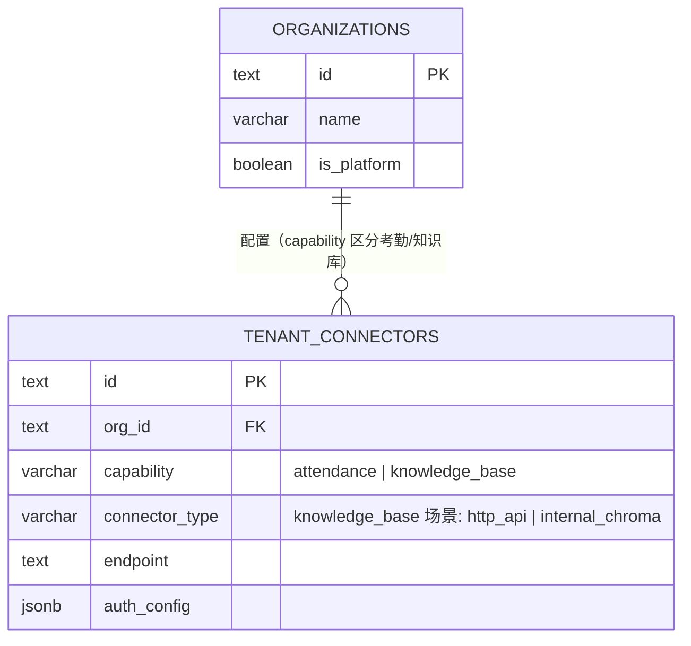
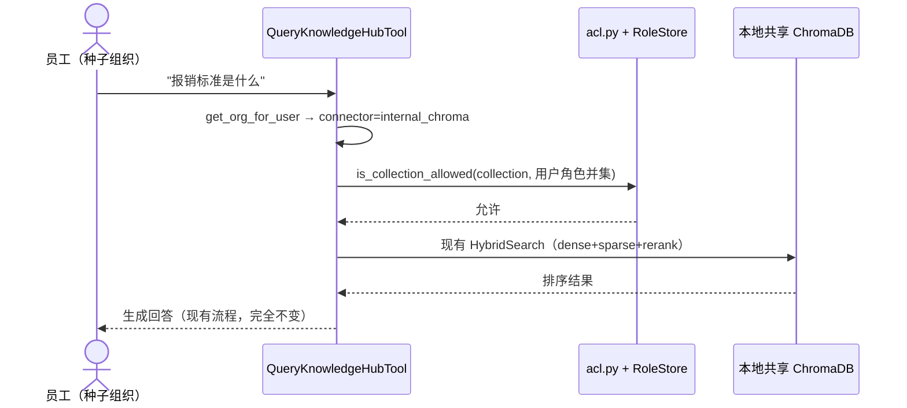
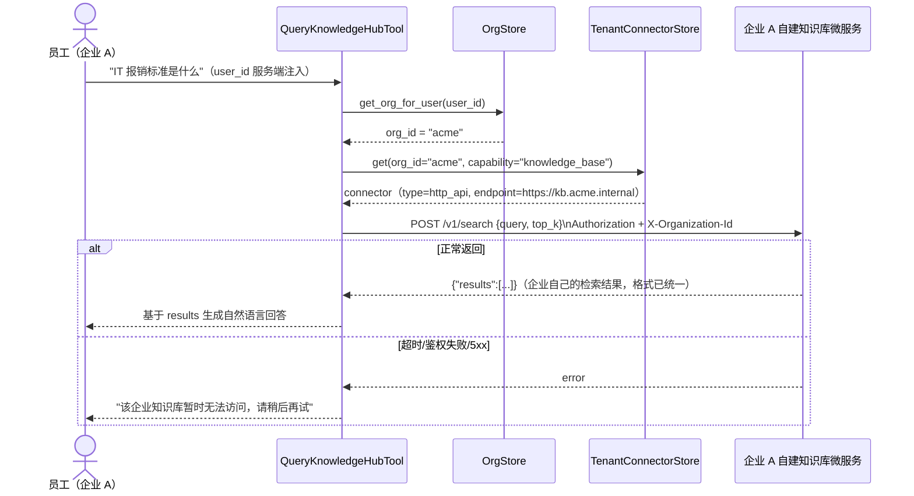

# 知识库多租户联邦查询（非结构化数据）技术方案

> 状态：已实现（`src/ragent_backend/tenant_connector_store.py`、
> `src/mcp_server/tools/query_knowledge_hub.py::_execute_remote`、
> `services/tenant_kb_demo/`、`scripts/seed_tenant_kb_demo.py`）
> 关联现状代码：`src/mcp_server/tools/query_knowledge_hub.py`、`src/libs/vector_store/{chroma_store,vector_store_factory}.py`、
> `src/core/query_engine/{hybrid_search,dense_retriever,sparse_retriever,fusion,reranker}.py`、
> `src/ragent_backend/acl.py`、`src/ingestion/`；
> 关联设计文档：`attendance-tenant-federation.md`（结构化数据的联邦方案，本文档复用其
> `organizations`/`tenant_connectors` 表，是同一套"外部工具化"哲学在**非结构化数据**上的落地，
> 两份文档刻意分开写，互相引用而不合并，见 1.4 节的对比说明）
> 需求来源：`plan.md` 第 2/4 点（用户原始笔记，"外部知识库工具化 / API-based RAG"）

## 1. 背景与目标

### 1.1 场景

跟 `attendance-tenant-federation.md` 面对的是同一个大背景：这个 Agent 要一套部署卖给多家企业共用。
但知识库和考勤是完全不同性质的数据——考勤是"活数据，随时查随时准，我们查完就忘"；知识库是"需要
预处理（切片、embedding、建索引）才能被检索的静态语料"，员工手册、报销制度、IT 知识库这类内容，
每家企业都不一样，而且这类文档往往比考勤数据更敏感（可能包含薪酬结构、组织架构等），企业更不愿意
把原始文档上传到第三方 SaaS 里做向量化。

### 1.2 现状与差距

现状（已由前置 Explore 调查确认）：

- `QueryKnowledgeHubTool.execute(query, top_k, collection, user_id)` 直接在**本地**做检索：
  `UserStore.get_allowed_collections(user_id)` + `acl.is_collection_allowed()` 做角色级 ACL，
  通过后在本地 `HybridSearch`（dense ChromaDB + sparse BM25 + RRF 融合 + cross-encoder rerank）
  里查一个共享的、持久化在 `data/db/chroma` 的本地 ChromaDB 实例。
- 整条检索链路（`ChromaStore`/`HybridSearch`/`DenseRetriever`/`SparseRetriever`/`RRFFusion`/
  reranker）全部是进程内 Python 调用，中间没有任何网络边界。`VectorStoreFactory` 已经是一个
  provider-registry 抽象（`register_provider`/`create`），为换底层向量库留了口子，但目前只注册了
  Chroma 一种，且这个抽象点在"向量库"这一层，不在"整个检索服务"这一层。
- **`QueryKnowledgeHubTool.execute()` 本身已经是一个干净、狭窄的接口**
  （`(query, top_k, collection, user_id) -> MCPToolResponse`），调用方（`builtin_tools.py` 的
  工具注册、MCP protocol handler）只认这个签名——这是本方案要利用的天然改造缝，不用碰调用方一行代码。
- 文档入库（`app.py::ingest_file_task` → `IngestionPipeline.run()`）和检索用的是**同一个**本地
  Chroma 实例，紧耦合在同一个进程/磁盘里，目前完全没有拆分。
- 全仓库 grep `org_id`/`tenant` 命中的都是 `attendance-tenant-federation.md` 那次改动留下的代码
  （`organizations`/`users.org_id`/`tenant_connectors`），知识库这条链路**零触碰**——现在还是纯
  角色 ACL、单一共享向量库，没有任何按企业隔离的概念。

### 1.3 目标

1. 每家企业的知识库物理上真正分开——不是"一个数据库里用 `org_id` 列过滤"，而是知识库检索本身
   委托给企业自己运维的服务，我们这边不持有、不存储对方的文档或向量。
2. 对外暴露的是**一份统一的 HTTP API 契约**，任何企业只要照着契约实现一个 HTTP 端点就能接入，
   不要求企业理解 MCP 协议、不要求企业用我们的技术栈。
3. 我们主系统这边，`query_knowledge_hub` 工具对调用方（LLM/ReAct 子图）保持完全一致的使用体验，
   底下是查本地 demo 库还是委托到企业自己的微服务，调用方无感。
4. 用两个模拟企业（demo 数据 + demo 服务）验证整条链路真的按组织路由到了各自独立的知识库，不会
   串号。

### 1.4 为什么知识库不能照搬考勤那套"实时委托、零存储"方案

这是本文档存在的核心原因，值得单独说清楚，也是用户明确要求"记得区分结构化数据和非结构化数据"
的落点：

| | 考勤（结构化） | 知识库（非结构化） |
|---|---|---|
| 数据本质 | 活数据，字段固定，随时变化 | 静态语料，需要预处理（切片/embedding/索引）才能检索 |
| "存储"这件事 | 完全不需要——查完就忘，`attendance-tenant-federation.md` §7 明确写了"进程内极短 TTL 缓存可以，持久化不可以" | **必须存在**某种索引/向量存储，检索能力才成立——问题只是"存在哪" |
| 对接协议 | MCP（优先）+ HTTP webhook 兜底，因为语义是"调用企业系统的一个既有函数/接口" | 统一的 HTTP 检索 API，因为语义是"给一个 query，要一份排好序的文档列表"，是一个足够窄、足够标准化的契约，不需要 MCP 的通用工具调用能力 |
| 委托后我们还管什么 | 员工工号映射（`tenant_external_identities`），因为要查"这个人"的考勤 | 不需要员工级身份映射——委托模式下知识库内部的部门级权限由企业自己的微服务判断，我们只需要知道"该把这次查询路由去哪家企业"，见 5.2 节 |

结论：**知识库的"存储"责任转移给企业自己（企业自建知识库微服务，自己管理向量库/索引/更新节奏），
我们的角色永远是无状态的检索客户端**——这跟考勤"我们完全不碰数据"是同一个"不把对方的数据搬到
我们这边"的初衷，只是因为数据性质不同，具体落地方式不同，这也是本方案跟 `plan.md` 里"绝对的安全
与权限隔离""零数据同步成本""架构解耦""支持混合检索"四条理由的对应关系：

- **安全与权限隔离**：企业的原始文档、向量、embedding 模型全部留在企业自己的服务里，我们这边
  一次都不落盘，物理隔离（不同部署/不同网络）比任何一层应用层 ACL 都更彻底。
- **零数据同步成本**：企业更新了员工手册，不需要通知我们重新切片/embedding，下一次查询直接查到
  企业自己服务里的最新索引。
- **架构解耦**：企业自己的知识库微服务内部用 Chroma、Milvus、还是图数据库，对我们完全透明，
  统一 HTTP 契约不变。
- **支持混合检索**：把"向量检索 + 关键词检索 + 结果融合"这整套逻辑的实现责任也转移给企业自己
  的微服务（企业可以做得比我们简单，也可以做得比我们更复杂，比如接入他们自己的 ERP/Wiki 做
  SQL 精确查询），我们不再关心对方内部怎么检索，只消费排好序的结果。

### 1.5 设计决策

1. **复用 `attendance-tenant-federation.md` 已设计的 `organizations`/`tenant_connectors` 表**，
   不重新建模——`tenant_connectors.capability` 新增取值 `'knowledge_base'`，`connector_type`
   新增取值 `'http_api'`（内置示例场景对应 `'internal_chroma'`，见第 3 节）。这两张表本来就是
   按"能力"（`capability`）维度设计的可扩展模型，知识库是继考勤之后第二个接入的能力，不是新
   模式。
2. **协议选统一 HTTP API，不是 MCP**——检索场景的契约足够窄且标准（"给 query 要排序结果"），
   比通用工具调用协议更容易让企业实现，也更贴近企业已有的"内部搜索 API"心智模型（见 1.4 节
   对比表）。
3. **组织级隔离靠物理路由，不是应用层过滤**——`connector` 决定了这次查询发去哪个企业的服务，
   企业 A 的请求物理上不可能碰到企业 B 的数据；角色级、部门级的更细粒度知识库权限（现有
   `role_collections` 那一套），委托模式下**转移给企业自己的微服务判断**，不再是我们这边的
   责任（详见 5.2 节的职责边界说明，这是本方案一个需要显式记录、不是疏漏的取舍）。
4. **内置示例知识库不废弃，降级为 `connector_type='internal_chroma'` 的默认连接器**——跟
   `attendance-tenant-federation.md` §1.3 决策 5 处理 `attendance_store.py` 的方式完全一致：
   现有本地 Chroma + 混合检索代码不是白写的，从"唯一实现"变成"众多连接器类型之一"，种子组织
   继续用它，零回归。
5. **两个模拟企业复用现有检索技术栈（简化版），不刻意造技术异构**——已经验证过的
   `HybridSearch`/`ChromaStore` 代码直接拿来复用，只是各自独立进程 + 独立持久化目录，重点验证
   的是"路由/隔离/HTTP 契约"本身对不对，不是重新实现一遍混合检索去证明"企业可以用不同技术栈"
   这件事（那件事从架构上已经被 1.4 节的解耦设计保证了，不需要用两种不同实现去证明）。
6. **设计与代码同一轮交付**——第 5-6 节描述的路由改造、两个模拟企业微服务、种子脚本均已实现，
   并已用两个模拟企业（Acme/Globex）端到端验证：同一个 `QueryKnowledgeHubTool.execute()`，
   仅 `user_id` 不同就分别路由到各自的知识库微服务，互不串号；服务下线时命中第 4.3 节的
   降级提示；未配置连接器的种子/平台组织走 `internal_chroma` 分支零回归。

---

## 2. 技术选型

**结论：新增 0 个新依赖（模拟服务复用现有 FastAPI + ChromaDB + 混合检索栈），只新增数据行/枚举值和一层路由改造。**

| 层 | 选型 | 理由 |
|---|---|---|
| 租户对接协议 | 统一 HTTP API（自定义契约，见第 4 节），不用 MCP | 1.4 节已论证；契约足够窄，企业实现成本低于起一个 MCP server |
| 连接器/元数据存储 | 复用 `attendance-tenant-federation.md` 已设计的 `organizations`/`tenant_connectors` 表，扩展 `capability`/`connector_type` 取值 | 同一套"按能力路由"的模型，不重新发明 |
| 鉴权 | `Authorization: Bearer {token}` + `X-Organization-Id: {org_id}` 双重校验（跟 `plan.md` 原始设想一致） | Token 泄露到别的租户时，微服务自己校验 header 里的组织跟 token 绑定的组织是否一致，多一层防护 |
| 查询委托改造点 | 只改 `QueryKnowledgeHubTool.execute()` 内部，签名不变 | 调用方（`builtin_tools.py`/MCP handler）零改动，验证过的天然改造缝（1.2 节） |
| 模拟企业服务技术栈 | 复用现有 `FastAPI` + `ChromaStore` + `HybridSearch`，独立进程 + 独立持久化目录 | 决策 5；重点验证路由和契约，不重复造检索轮子 |
| ACL（组织内部） | 只在 `connector_type='internal_chroma'` 分支生效，沿用现有 `RoleStore`/`acl.py` 不变 | 委托模式下这层权限判断转移给企业自己的服务，见 5.2 节 |

**明确不引入的依赖**：MCP SDK 的 SSE/HTTP transport（那是给考勤方案准备的，知识库这条线走的是普通
REST，不复用 MCP client 基础设施）、任何新的向量数据库客户端（模拟服务复用现有 `ChromaStore`）。

---

## 3. 数据模型

不新建表，在 `attendance-tenant-federation.md` §3 已定义的 `tenant_connectors` 基础上扩展取值范围
（`capability`/`connector_type` 都是 `VARCHAR`，扩展取值不是 schema 变更，不需要 `ALTER TABLE`）：

```sql
-- 复用 attendance-tenant-federation.md §3 的表结构，原样引用，不重复定义：
-- organizations(id, name, created_at, is_platform)
-- tenant_connectors(id, org_id, capability, connector_type, endpoint,
--                    auth_config, remote_tool_name, field_mapping, is_active, created_at)

-- 知识库能力新增的取值约定：
--   capability = 'knowledge_base'
--   connector_type = 'http_api'        -- 委托到企业自己的知识库微服务
--                   | 'internal_chroma' -- 内置示例/演示租户，走现有本地 Chroma（决策 4）
--
-- endpoint：企业知识库微服务的 base URL，如 https://kb.acme-corp.com
-- auth_config：{"token": "..."}（加密存储，同 attendance 方案的凭证安全要求）
-- remote_tool_name：知识库场景不使用（保留字段兼容 attendance 的 schema，此处恒为 NULL）
-- field_mapping：知识库场景不使用（响应字段已经在第 4 节统一定义死，企业没有自定义字段名的空间，
--                跟考勤"每家企业字段名都不一样"的情况不同——这是刻意的简化，见第 7 节风险）
```

不需要 `tenant_external_identities`——知识库检索按组织路由即可，不需要把我们的 `user_id` 映射成
企业系统里的员工工号（1.4 节对比表已说明）。

### 3.1 ER 图（增量，完整关系见 `attendance-tenant-federation.md` §3.1）



---

## 4. 统一 HTTP API 契约

这是用户明确要求的"对外暴露一个统一的 HTTP API"——任何企业只要实现下面这一个端点就能接入。

### 4.1 请求

```
POST {endpoint}/v1/search
Headers:
  Authorization: Bearer {token}       # tenant_connectors.auth_config.token
  X-Organization-Id: {org_id}         # 企业服务应校验此值与 token 绑定的组织一致
  Content-Type: application/json

Body:
{
  "query": "报销标准是什么",
  "top_k": 5,
  "collection": null,                 // 可选：企业自己的知识库如果内部也分子库，可传；
                                       // 不传时由企业服务自行决定默认库
  "filters": {}                       // 预留：企业自定义的元数据过滤条件，不强制支持
}
```

### 4.2 响应

字段形状对齐现有 `MCPToolResponse`/`RetrievalResult`（`src/mcp_server/tools/query_knowledge_hub.py`
消费时零转换直接可用）：

```json
{
  "results": [
    {
      "content": "报销标准：差旅费按实报销，餐饮补贴每日不超过 150 元……",
      "score": 0.87,
      "source": "员工手册2026.pdf",
      "page": 12,
      "metadata": {
        "kb_name": "人力资源"    // 可选：这条结果在企业内部属于哪个子库/分类，
                                 // 人话标签（不是内部 collection 名/ID）。企业
                                 // 服务如果自己也分子库，建议提供，UI 来源角标
                                 // 会展示成"本企业知识库 · 人力资源"；不提供时
                                 // 退化为笼统的"本企业知识库"，不影响接入，也
                                 // 不会报错——纯展示用，不参与检索/权限判断。
      }
    }
  ]
}
```

### 4.3 错误处理（跟 `attendance-tenant-federation.md` 保持一致的降级策略）

| 情况 | 处理 |
|---|---|
| `401`/`403` | 鉴权失败，工具侧提示"知识库鉴权失败，请联系管理员检查连接器配置" |
| 超时（8s，跟考勤方案同一个超时阈值） | "该企业知识库暂时无法访问，请稍后再试" |
| `5xx` / 连接失败 | 同上，统一降级提示，不让异常冒泡成用户看到的堆栈 |
| 连接器未配置（`connector is None`） | 落到 `internal_chroma` 默认分支（3 节），不是报错——保证没配置真实连接器的组织仍然能用内置 demo 知识库 |

### 4.4 委托写入契约（方案 2："平台代算，企业只存储"）

员工上传文档时，切片 + embedding 的逻辑对所有企业都是一样的（同一套 `DocumentChunker`/
`DenseEncoder`/`SparseEncoder`），没有理由让每家委托企业各自重新实现一遍——所以写入方向选的
不是"企业自己接一个能理解原始文档格式、自己会切片/embedding 的接口"，而是**平台用自己已有的
组件把文档算成 chunk + 向量 + 稀疏统计，企业那边只需要实现一个"存进去"的接口**，不需要跑任何
AI 模型。跟 4.1-4.3 的查询契约是同一个连接器（`capability=knowledge_base`），只是反方向。

#### 请求

```
POST {endpoint}/v1/vectors
Headers:
  Authorization: Bearer {token}
  X-Organization-Id: {org_id}
  Content-Type: application/json

Body:
{
  "doc_id": "doc_a1b2c3",
  "category": "hr_admin",                    // 可选：这份文档归属企业内部哪个子库/分类，员工上传时选的
                                              // （见 4.2 节 metadata.kb_name——读写两侧用的是同一份分类
                                              // 约定，参考实现 CATEGORY_LABELS/query_knowledge_hub.py
                                              // DEPARTMENT_ROLE_TO_REMOTE_CATEGORIES 目前用的 6 个固定
                                              // 类目：hr_admin/finance/it_support/sales_marketing/
                                              // rd_product/customer_success，是我们自己给 demo 企业定的
                                              // 默认分类法，不是协议强制要求；不传时企业服务可以有自己的
                                              // 默认归类逻辑，或者干脆不分类）
  "chunks": [
    {
      "chunk_id": "doc_a1b2c3_0000_9f8e7d",   // 平台生成，仅供参考；企业存储时可以用自己的 ID 规则
      "text": "报销标准：差旅费按实报销……",
      "vector": [0.0123, -0.0456, ...],        // 维度跟随平台当前配置的 embedding 模型（settings.yaml embedding.dimensions）
      "sparse_stats": {                          // SparseEncoder 的输出，企业若不打算支持关键词检索可以忽略这个字段
        "term_frequencies": {"报销": 2, "差旅": 1},
        "doc_length": 12,
        "unique_terms": 9
      },
      "metadata": {"source_path": "员工手册2026.pdf", "title": "报销制度", "chunk_index": 0}
    }
  ]
}
```

#### 响应

```json
{ "chunk_count": 1 }
```

#### 错误处理

跟 4.3 同一套降级策略（401/403 鉴权失败、超时、5xx 统一处理）；写入比查询耗时更长，平台侧用一个
更宽松的超时阈值（参考实现：60s，而不是查询用的 8s）。

#### 参考实现

`services/tenant_kb_demo/app.py` 的 `POST /v1/vectors`：不做任何 embedding 计算，直接把收到的
`{text, vector, metadata}` 交给自己的 `VectorUpserter`，`sparse_stats` 交给自己的 `BM25Indexer`——
这一步复用的正是平台自己的存储组件（跟 4.1 查询契约"复用 ChromaStore + HybridSearch"是同一个
决策），企业接入时不要求照抄这两个类，只要接口形状对上、能把 `{text, vector}` 存进自己选择的
任意向量库即可。

平台侧的计算在 `src/ingestion/delegated_compute.py`：复用 `IngestionPipeline`（本地检索模式的
完整摄入流水线）里真正无状态、可独立调用的那几个组件（`UniversalLoader`/`DocumentChunker`/
`BatchProcessor`），只算不存——不识别图片、不做 chunk 精炼/元数据增强/文档级摘要，这几个本地
模式独有的增强步骤不在这条委托写入通道的范围内。

---

## 5. 核心逻辑

### 5.1 `QueryKnowledgeHubTool.execute()` 改造

```python
async def execute(self, query: str, top_k: int, collection: str, user_id: str) -> MCPToolResponse:
    org = await org_store.get_org_for_user(user_id)
    connector = await tenant_connector_store.get(org.org_id, capability="knowledge_base") if org else None

    if connector is None or connector.connector_type == "internal_chroma":
        # 现有路径：本地共享 Chroma + 角色级 ACL，逻辑完全不变
        allowed = await user_store.get_allowed_collections(user_id)
        if not acl.is_collection_allowed(collection, allowed):
            return self._denied_response()
        results = await self._local_hybrid_search(query, top_k, collection)
    else:
        # 新路径：委托到企业自己的知识库微服务
        client = await tenant_http_client_pool.get_or_create(connector)
        try:
            raw = await client.post(
                "/v1/search",
                json={"query": query, "top_k": top_k, "collection": collection},
                headers={
                    "Authorization": f"Bearer {connector.auth_config['token']}",
                    "X-Organization-Id": org.org_id,
                },
                timeout=8.0,
            )
            results = self._parse_remote_results(raw.json())
        except (httpx.TimeoutException, httpx.HTTPStatusError) as e:
            return self._degraded_response(str(e))

    return ResponseBuilder.build(results)  # 现有构建逻辑不变，两条路径殊途同归
```

**关键点**：`ResponseBuilder.build()`、调用方（`builtin_tools.py`/MCP handler）、`TraceContext`
埋点全部不用改——分支只发生在"去哪查"，"查完怎么组装成 `MCPToolResponse`"这一段代码两条路径共用。

### 5.2 委托模式下的权限职责转移（显式记录，不是遗漏）

现有 `role_collections`（"IT部角色能看 it_kb"这套机制）只在 `connector_type='internal_chroma'`
的组织（种子/演示租户）下生效。一旦某个组织配置了真实的 `http_api` 连接器，这个组织内部"谁能看
哪份知识库文档"的判断**完全转移给企业自己的微服务**——我们这边只知道"这个用户属于这家企业"，
不再知道、也不负责判断"这个用户在企业内部能看哪些子库/哪些文档"。这是委托模式的自然结果：企业
文档本身就存在企业自己的系统里，细粒度权限也应该由企业自己的系统判断，我们不该、也没有能力去
管理一家客户企业内部的部门权限体系。

### 5.3 时序图

**① 种子/演示组织（`connector_type=internal_chroma`）—— 现状路径，零回归**



**② 真实委托到企业知识库微服务**



---

## 6. "模拟两个企业"的具体落地设计

- 新增 `services/tenant_kb_demo/` 目录，一个可独立启动的轻量 FastAPI 应用，复用现有
  `ChromaStore`/`HybridSearch` 代码（决策 5），通过环境变量 `TENANT_NAME`/`TENANT_DATA_DIR`/
  `TENANT_PORT` 区分"我是哪家公司"，同一份代码启动两个进程即可模拟两家公司：
  - `acme`：`data/tenant_demo/acme/chroma`，监听 `:9101`
  - `globex`：`data/tenant_demo/globex/chroma`，监听 `:9102`
  - 应用启动时即实现第 4 节的 `POST /v1/search` 契约（包含 `Authorization`/`X-Organization-Id`
    校验），作为"企业应该怎么接入"的参考实现。
- Demo 文档内容刻意不同、且刻意有主题重叠（都涉及"报销"，但标准不同），方便验证"确实查到的是
  各自企业自己的数据，不是跨企业串号"：
  - Acme：IT 报销政策（"电脑外设报销上限 3000 元/年"）
  - Globex：差旅报销政策（"机票需提前 7 天预订，经济舱为限"）
- 新增 `scripts/seed_tenant_kb_demo.py`（幂等，风格同现有 `scripts/seed_*.py`）：
  1. 创建 2 条 `organizations`（`is_platform=FALSE`）：Acme、Globex。
  2. 各写入 1 条 `tenant_connectors`（`capability=knowledge_base`, `connector_type=http_api`,
     `endpoint` 指向本地跑的两个模拟服务端口）。
  3. 各创建至少 1 个测试用户，`org_id` 指向对应企业（复用现有 `create_user.py`/`migrate_to_roles.py`
     的用户创建范式）。

---

## 7. 风险与开放问题

- **检索质量完全依赖企业自己的实现**：如果企业的微服务只做简单关键词匹配，检索质量会明显低于
  我们自己的 hybrid search + rerank——这是"外部工具化"必然的代价（决策把检索质量的控制权交给了
  企业），需要在产品预期沟通上管理好，不是我们这边能兜底的事。
- **无缓存/无 fallback，且比考勤场景更值得未来放宽**：知识库微服务不可用时，这次问不到任何该
  企业的知识库内容，没有"退回上次问过的缓存答案"机制——跟 `attendance-tenant-federation.md` §7
  "不落地"原则一致，但知识库内容变化频率通常远低于考勤数据，缓存在这个场景下的收益/风险比更高，
  这次先不做，留作后续评估项，不是本方案认为"缓存在知识库场景下也没意义"。
- **鉴权的真正强制力在企业一侧**：我们这边发送请求时带 `Authorization`/`X-Organization-Id`，但
  是否真的校验"header 里的组织跟 token 绑定的组织一致"，取决于企业自己的实现是否严格——本方案的
  模拟服务会实现一个参考版本（严格校验），但生产环境的第三方企业实现质量我们无法强制，只能在
  接入文档里明确要求。
- **embedding 模型不一致是设计本身要达成的解耦效果，不是需要解决的问题**：企业自己的微服务大概率
  用了跟我们不同的 embedding 模型/维度，这跟我们主系统的向量空间完全不通用——但正因为我们从不
  触碰对方的向量、只消费排好序的文本结果，这层差异对我们完全透明，不需要做任何模型对齐工作。
- **`field_mapping` 字段在知识库场景下暂不使用**：跟考勤不同（考勤每家企业的字段命名天差地别，
  必须支持归一化映射），知识库的响应格式已经在第 4 节统一死了，企业没有自定义字段名的空间——
  这是刻意的简化决策：如果未来出现"企业坚持要用自己的响应字段名"这类真实需求，`field_mapping`
  字段已经存在于表结构里（复用自 attendance 方案），到时候直接启用即可，不需要改表。
- **部门级知识库权限完全转移给企业**：5.2 节已经明确这是委托模式的自然结果，但产品沟通上需要
  让客户企业理解——一旦启用真实连接器，"IT部只能看 IT 知识库"这类细粒度权限规则需要企业自己在
  他们的知识库微服务里实现，我们的角色管理后台对这类组织不再生效于知识库这一项能力（工作流/
  其它能力不受影响）。
- **和 `attendance-tenant-federation.md` §8（组织归属/多租户管理后台隔离）的依赖关系**：本方案
  的路由逻辑依赖 `OrgStore.get_org_for_user()`，这个方法在 attendance 文档 §8.4.2 已经设计
  （`org_store.py`）——两份方案不是各自独立的，知识库这条线是在 attendance 文档打好的组织模型
  地基上继续建的第二层，实现顺序上有依赖关系，需要 attendance 方案的组织模型先落地。
